# Infrastructure Costs

## Overview

This document provides a comprehensive analysis of NewPOPSys infrastructure costs, including current spending, cost projections across platform phases (v2-v4), cost optimization strategies, and total cost of ownership (TCO) analysis. All costs are based on AWS pricing as the primary cloud provider, with comparisons to Azure and GCP where relevant.

**Last Price Update:** December 2025
**Currency:** USD
**Pricing Model:** Pay-as-you-go unless otherwise specified

---

## Current Infrastructure Costs (v1)

### Monthly Cost Breakdown

| Component | Service/Type | Quantity | Unit Cost | Monthly Cost | Annual Cost |
|-----------|-------------|----------|-----------|--------------|-------------|
| **Compute** | | | | | |
| Application Servers | EC2 t3.large | 3 instances | $60/month | $180 | $2,160 |
| **Database** | | | | | |
| PostgreSQL Primary | RDS db.t3.large | 1 instance | $140/month | $140 | $1,680 |
| Database Storage | gp3 SSD | 100 GB | $0.115/GB | $11.50 | $138 |
| Database Backups | Automated backups | 100 GB | $0.095/GB | $9.50 | $114 |
| **Storage** | | | | | |
| Object Storage (S3) | S3 Standard | 50 GB | $0.023/GB | $1.15 | $13.80 |
| S3 Requests | GET/PUT | ~100K/month | $0.0004/1K | $0.40 | $4.80 |
| **Network** | | | | | |
| Data Transfer Out | S3/EC2 egress | 200 GB | $0.09/GB | $18 | $216 |
| Load Balancer | Application LB | 1 ALB | $16.20 + traffic | $25 | $300 |
| **Monitoring** | | | | | |
| CloudWatch | Logs + Metrics | Standard | Variable | $30 | $360 |
| **Third-Party Services** | | | | | |
| OpenAI API | GPT-4 | ~100K tokens | $0.03/1K | $150 | $1,800 |
| Anthropic Claude | Claude 3.5 | ~50K tokens | $0.015/1K | $75 | $900 |
| SendGrid | Email delivery | 10K emails | $0.001/email | $10 | $120 |
| Stripe | Payment processing | ~$5K volume | 2.9% + $0.30 | $170 | $2,040 |
| **DNS & Domain** | | | | | |
| Route 53 | DNS hosting | 1 zone | $0.50/zone + queries | $5 | $60 |
| SSL Certificates | ACM | Free | $0 | $0 | $0 |
| **Security** | | | | | |
| Secrets Manager | API keys storage | 10 secrets | $0.40/secret | $4 | $48 |
| **Total** | | | | **$829.55** | **$9,954.60** |

### Cost per Customer (v1)

| Metric | Value |
|--------|-------|
| Total Monthly Infrastructure Cost | $829.55 |
| Active Tenants/Customers | ~50 |
| **Cost per Customer** | **$16.59/month** |
| Average Revenue per Customer (ARPC) | $99/month |
| **Infrastructure Cost as % of Revenue** | **16.8%** |

### Cost by Component (Percentage)

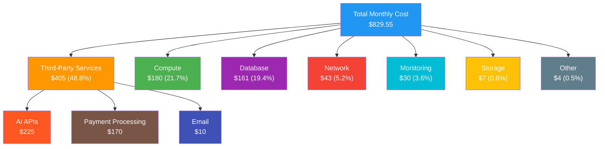

---

## Cost Projections by Phase

### Phase 2 (v2) - Professional Platform

**Timeline:** Months 7-18
**Target Scale:** 500 customers, 5,000 active users

#### Infrastructure Changes

| Component | v1 | v2 | Reason |
|-----------|----|----|--------|
| App Servers | 3x t3.large | 5x m5.large | Better baseline performance |
| Database | 1x db.t3.large | 1x db.m5.xlarge + 2 read replicas | Read scaling |
| Redis Cache | None | 1x cache.m5.large | Reduce DB load |
| Message Queue | None | 2x t3.medium (RabbitMQ) | Async processing |
| S3 Storage | 50 GB | 500 GB | User growth |
| CDN | None | CloudFront | Global delivery |
| Monitoring | Basic CloudWatch | Prometheus + Grafana | Better observability |

#### v2 Monthly Cost Breakdown

| Component | Service/Type | Quantity | Unit Cost | Monthly Cost | Change from v1 |
|-----------|-------------|----------|-----------|--------------|----------------|
| **Compute** | | | | | |
| Application Servers | EC2 m5.large | 5 instances | $70/month | $350 | +$170 |
| Queue Workers | EC2 t3.medium | 2 instances | $30/month | $60 | +$60 |
| **Database** | | | | | |
| PostgreSQL Primary | RDS db.m5.xlarge | 1 instance | $277/month | $277 | +$137 |
| Read Replicas | RDS db.m5.large | 2 instances | $140/month | $280 | +$280 |
| Database Storage | gp3 SSD | 500 GB | $0.115/GB | $57.50 | +$46 |
| Database Backups | Automated backups | 500 GB | $0.095/GB | $47.50 | +$38 |
| **Caching** | | | | | |
| Redis | ElastiCache m5.large | 1 instance | $150/month | $150 | +$150 |
| **Storage** | | | | | |
| Object Storage (S3) | S3 Standard | 500 GB | $0.023/GB | $11.50 | +$10.35 |
| S3 Requests | GET/PUT | ~2M/month | $0.0004/1K | $8 | +$7.60 |
| **CDN** | | | | | |
| CloudFront | Data transfer | 2 TB | $0.085/GB | $170 | +$170 |
| CloudFront Requests | HTTPS | 10M requests | $0.01/10K | $10 | +$10 |
| **Network** | | | | | |
| Data Transfer Out | EC2/RDS egress | 500 GB | $0.09/GB | $45 | +$27 |
| Load Balancer | Application LB | 1 ALB | $16.20 + traffic | $35 | +$10 |
| **Monitoring** | | | | | |
| Prometheus | Self-hosted on EC2 | Included | $0 | $0 | $0 |
| Grafana Cloud | Metrics/logs | Standard tier | $49 | $49 | +$19 |
| Sentry | Error tracking | 10K events | $26 | $26 | +$26 |
| **Third-Party Services** | | | | | |
| OpenAI API | GPT-4 | ~500K tokens | $0.03/1K | $750 | +$600 |
| Anthropic Claude | Claude 3.5 | ~250K tokens | $0.015/1K | $375 | +$300 |
| SendGrid | Email delivery | 100K emails | $0.001/email | $100 | +$90 |
| Twilio | SMS notifications | 5K messages | $0.0079/SMS | $40 | +$40 |
| Stripe | Payment processing | ~$50K volume | 2.9% + $0.30 | $1,600 | +$1,430 |
| Auth0 | Authentication | 1000 MAU | $35/month | $35 | +$35 |
| **Security** | | | | | |
| Secrets Manager | API keys storage | 25 secrets | $0.40/secret | $10 | +$6 |
| WAF | Web Application Firewall | 1 ACL | $5 + rules | $25 | +$25 |
| **Backups** | | | | | |
| Automated Snapshots | EBS snapshots | 200 GB | $0.05/GB | $10 | +$10 |
| **Total** | | | | **$4,476** | **+$3,646.45** |

#### v2 Cost per Customer

| Metric | Value |
|--------|-------|
| Total Monthly Infrastructure Cost | $4,476 |
| Active Customers | ~500 |
| **Cost per Customer** | **$8.95/month** |
| Average Revenue per Customer (ARPC) | $149/month |
| **Infrastructure Cost as % of Revenue** | **6.0%** |
| **Improvement from v1** | **-46% cost per customer** |

---

### Phase 3 (v3) - Enterprise Platform

**Timeline:** Months 19-36
**Target Scale:** 5,000 customers, 50,000 active users

#### Infrastructure Changes

| Component | v2 | v3 | Reason |
|-----------|----|----|--------|
| App Servers | 5x m5.large | 10x c5.xlarge (Kubernetes) | High-performance, auto-scaling |
| Database | 1 primary + 2 replicas | 1 primary + 5 replicas + PgBouncer | Massive read scaling |
| Redis | 1x cache.m5.large | Redis Cluster (3 nodes) | HA + horizontal scaling |
| Queue | RabbitMQ on EC2 | Managed Kafka (MSK) | Event streaming |
| S3 Storage | 500 GB | 10 TB | Media growth |
| Search | PostgreSQL FTS | Elasticsearch (3 nodes) | Advanced search |
| ML Service | None | 2x GPU instances (g4dn.xlarge) | Custom ML models |

#### v3 Monthly Cost Breakdown

| Component | Service/Type | Quantity | Unit Cost | Monthly Cost | Change from v2 |
|-----------|-------------|----------|-----------|--------------|----------------|
| **Compute** | | | | | |
| Kubernetes Cluster | EKS control plane | 1 cluster | $73/month | $73 | +$73 |
| Application Nodes | EC2 c5.xlarge | 10 instances | $123/month | $1,230 | +$880 |
| Background Workers | EC2 c5.large (spot) | 5 instances avg | $25/month | $125 | +$65 |
| ML Inference | EC2 g4dn.xlarge (GPU) | 2 instances | $410/month | $820 | +$820 |
| **Database** | | | | | |
| PostgreSQL Primary | RDS db.m5.2xlarge | 1 instance | $555/month | $555 | +$278 |
| Read Replicas | RDS db.m5.xlarge | 5 instances | $277/month | $1,385 | +$1,105 |
| PgBouncer | EC2 t3.small | 2 instances | $15/month | $30 | +$30 |
| Database Storage | gp3 SSD | 2 TB | $0.115/GB | $235 | +$177.50 |
| Database Backups | Automated backups | 2 TB | $0.095/GB | $195 | +$147.50 |
| **Caching** | | | | | |
| Redis Cluster | ElastiCache m5.large | 3 nodes | $150/month | $450 | +$300 |
| **Message Queue** | | | | | |
| Kafka (MSK) | kafka.m5.large | 3 brokers | $200/month | $600 | +$540 |
| **Search** | | | | | |
| Elasticsearch | ES m5.large.search | 3 nodes | $150/month | $450 | +$450 |
| **Storage** | | | | | |
| Object Storage (S3) | S3 Standard | 3 TB | $0.023/GB | $70 | +$58.50 |
| S3 Intelligent-Tiering | Older content | 7 TB | $0.023-0.004/GB | $65 | +$65 |
| S3 Requests | GET/PUT | ~50M/month | $0.0004/1K | $200 | +$192 |
| **CDN** | | | | | |
| CloudFront | Data transfer | 50 TB | $0.085/GB | $4,250 | +$4,080 |
| CloudFront Requests | HTTPS | 500M requests | $0.01/10K | $500 | +$490 |
| **Network** | | | | | |
| Data Transfer Out | EC2/RDS egress | 5 TB | $0.09/GB | $450 | +$405 |
| Load Balancer | Network LB (K8s) | 2 NLB | $33/month | $66 | +$31 |
| VPC Traffic | Cross-AZ | Included | $0 | $50 | +$50 |
| **Monitoring** | | | | | |
| Prometheus | Self-hosted | Included | $0 | $0 | $0 |
| Grafana Cloud | Pro tier | Logs + traces | $299 | $299 | +$250 |
| Sentry | Error tracking | 100K events | $99 | $99 | +$73 |
| DataDog | APM (optional) | 10 hosts | $31/host | $310 | +$310 |
| **Third-Party Services** | | | | | |
| OpenAI API | GPT-4 Turbo | ~2M tokens | $0.01/1K | $2,500 | +$1,750 |
| Anthropic Claude | Claude 3.5 | ~1M tokens | $0.015/1K | $1,500 | +$1,125 |
| Stability AI | Image generation | 50K images | $0.02/image | $1,000 | +$1,000 |
| SendGrid | Email delivery | 500K emails | $0.0006/email | $300 | +$200 |
| Twilio | SMS notifications | 50K messages | $0.0079/SMS | $395 | +$355 |
| Stripe | Payment processing | ~$500K volume | 2.9% + $0.30 | $15,000 | +$13,400 |
| Auth0 | Authentication | 10K MAU | $240/month | $240 | +$205 |
| **Security** | | | | | |
| Secrets Manager | API keys storage | 100 secrets | $0.40/secret | $40 | +$30 |
| WAF | Web Application Firewall | 1 ACL + rules | $50 + $10/rule | $100 | +$75 |
| GuardDuty | Threat detection | Account-level | Variable | $50 | +$50 |
| **Backups & DR** | | | | | |
| Cross-Region Backups | S3 replication | 2 TB | $0.023/GB | $46 | +$36 |
| EBS Snapshots | Volume backups | 1 TB | $0.05/GB | $50 | +$40 |
| **Total** | | | | **$34,683** | **+$30,207** |

#### v3 Cost per Customer

| Metric | Value |
|--------|-------|
| Total Monthly Infrastructure Cost | $34,683 |
| Active Customers | ~5,000 |
| **Cost per Customer** | **$6.94/month** |
| Average Revenue per Customer (ARPC) | $199/month |
| **Infrastructure Cost as % of Revenue** | **3.5%** |
| **Improvement from v2** | **-22% cost per customer** |

---

### Phase 4 (v4+) - Global Enterprise Platform

**Timeline:** Month 37+
**Target Scale:** 50,000+ customers, 500,000+ active users

#### Infrastructure Changes

| Component | v3 | v4 | Reason |
|-----------|----|----|--------|
| Architecture | Single region | Multi-region active-active | Global availability |
| App Servers | 10x c5.xlarge | 50x c5.2xlarge across 3 regions | Global scale |
| Database | PostgreSQL cluster | Distributed PostgreSQL (Citus) | Horizontal scaling |
| Kubernetes | EKS (1 cluster) | EKS (3 regional clusters) | Multi-region |
| CDN | CloudFront | CloudFront + Cloudflare Enterprise | Edge computing |
| Monitoring | DataDog | Full observability platform | Enterprise-grade |

#### v4 Monthly Cost Breakdown

| Component | Service/Type | Quantity | Unit Cost | Monthly Cost | Change from v3 |
|-----------|-------------|----------|-----------|--------------|----------------|
| **Compute (Multi-Region)** | | | | | |
| Kubernetes Clusters | EKS control plane | 3 clusters | $73/month | $219 | +$146 |
| App Nodes (US-East) | EC2 c5.2xlarge | 25 instances | $246/month | $6,150 | +$4,920 |
| App Nodes (EU-West) | EC2 c5.2xlarge | 15 instances | $270/month | $4,050 | +$4,050 |
| App Nodes (AP-Southeast) | EC2 c5.2xlarge | 10 instances | $290/month | $2,900 | +$2,900 |
| Background Workers | EC2 c5.xlarge (spot) | 20 instances avg | $35/month | $700 | +$575 |
| ML Inference | EC2 g4dn.2xlarge (GPU) | 5 instances | $585/month | $2,925 | +$2,105 |
| **Database (Distributed)** | | | | | |
| Citus Coordinator | RDS db.m5.4xlarge | 1 instance | $1,110/month | $1,110 | +$555 |
| Citus Workers (Shards) | RDS db.m5.2xlarge | 5 shards | $555/month | $2,775 | +$1,220 |
| Read Replicas | RDS db.m5.xlarge | 10 instances | $277/month | $2,770 | +$1,385 |
| PgBouncer | EC2 t3.medium | 5 instances | $30/month | $150 | +$120 |
| Database Storage | gp3 SSD | 10 TB | $0.115/GB | $1,175 | +$940 |
| Database Backups | Automated backups | 10 TB | $0.095/GB | $975 | +$780 |
| **Caching (Global)** | | | | | |
| Redis Cluster (US) | ElastiCache m5.xlarge | 3 nodes | $300/month | $900 | +$450 |
| Redis Cluster (EU) | ElastiCache m5.xlarge | 3 nodes | $330/month | $990 | +$990 |
| Redis Cluster (APAC) | ElastiCache m5.xlarge | 3 nodes | $350/month | $1,050 | +$1,050 |
| **Message Queue** | | | | | |
| Kafka (MSK) | kafka.m5.xlarge | 6 brokers (HA) | $330/month | $1,980 | +$1,380 |
| **Search** | | | | | |
| Elasticsearch | ES m5.xlarge.search | 6 nodes (HA) | $300/month | $1,800 | +$1,350 |
| **Storage (Multi-Region)** | | | | | |
| S3 Standard (US) | Hot data | 10 TB | $0.023/GB | $235 | +$165 |
| S3 Standard (EU) | Replica | 10 TB | $0.023/GB | $235 | +$235 |
| S3 Standard (APAC) | Replica | 10 TB | $0.025/GB | $256 | +$256 |
| S3 Intelligent-Tiering | Warm/cold data | 100 TB | $0.004-0.023/GB | $800 | +$735 |
| S3 Glacier | Archive | 50 TB | $0.004/GB | $205 | +$205 |
| S3 Requests | GET/PUT | ~500M/month | $0.0004/1K | $2,000 | +$1,800 |
| **CDN (Enterprise)** | | | | | |
| CloudFront | Data transfer | 500 TB | $0.02-0.085/GB | $25,000 | +$20,750 |
| Cloudflare Enterprise | DDoS, edge compute | Flat fee | $5,000 | $5,000 | +$5,000 |
| CloudFront Requests | HTTPS | 10B requests | $0.01/10K | $10,000 | +$9,500 |
| **Network** | | | | | |
| Data Transfer Out | Cross-region + internet | 50 TB | $0.02-0.09/GB | $2,500 | +$2,050 |
| Load Balancers | NLB per region | 6 NLB | $33/month | $198 | +$132 |
| VPC Traffic | Cross-region | Variable | $0.02/GB | $500 | +$450 |
| Transit Gateway | Multi-region routing | 3 regions | $73/month | $219 | +$219 |
| **Monitoring & Observability** | | | | | |
| DataDog | Full platform | 100 hosts | $31/host | $3,100 | +$2,790 |
| New Relic | APM + Serverless | Enterprise | $2,500 | $2,500 | +$2,500 |
| PagerDuty | Incident management | 20 users | $41/user | $820 | +$820 |
| **Third-Party Services** | | | | | |
| OpenAI API | GPT-4 Turbo | ~20M tokens | $0.01/1K | $25,000 | +$22,500 |
| Anthropic Claude | Claude 3.5 | ~10M tokens | $0.015/1K | $15,000 | +$13,500 |
| Stability AI | Image generation | 500K images | $0.02/image | $10,000 | +$9,000 |
| SendGrid | Email delivery | 5M emails | $0.0003/email | $1,500 | +$1,200 |
| Twilio | SMS notifications | 500K messages | $0.0079/SMS | $3,950 | +$3,555 |
| Stripe | Payment processing | ~$5M volume | 2.9% + $0.30 | $150,000 | +$135,000 |
| Auth0 | Authentication | 100K MAU | $1,333/month | $1,333 | +$1,093 |
| **Security & Compliance** | | | | | |
| Secrets Manager | API keys storage | 500 secrets | $0.40/secret | $200 | +$160 |
| WAF | Web Application Firewall | 3 ACLs | $50/ACL | $300 | +$200 |
| GuardDuty | Threat detection | Multi-region | Variable | $500 | +$450 |
| Security Hub | Compliance | Account-level | $0.0010/check | $300 | +$300 |
| SOC 2 Audit | Annual compliance | Annual/12 | $1,500 | $1,500 | +$1,500 |
| **Backups & DR** | | | | | |
| Cross-Region Backups | S3 replication | 50 TB | $0.023/GB | $1,175 | +$1,129 |
| EBS Snapshots | Volume backups | 10 TB | $0.05/GB | $512 | +$462 |
| Disaster Recovery Testing | Quarterly drills | Quarterly/12 | $2,000 | $2,000 | +$2,000 |
| **Total** | | | | **$310,031** | **+$275,348** |

#### v4 Cost per Customer

| Metric | Value |
|--------|-------|
| Total Monthly Infrastructure Cost | $310,031 |
| Active Customers | ~50,000 |
| **Cost per Customer** | **$6.20/month** |
| Average Revenue per Customer (ARPC) | $249/month |
| **Infrastructure Cost as % of Revenue** | **2.5%** |
| **Improvement from v3** | **-11% cost per customer** |

---

## Cost Summary by Phase

### Infrastructure Cost Growth

| Phase | Customers | Monthly Cost | Annual Cost | Cost/Customer | Revenue % |
|-------|-----------|--------------|-------------|---------------|-----------|
| **v1** | 50 | $830 | $9,955 | $16.59 | 16.8% |
| **v2** | 500 | $4,476 | $53,712 | $8.95 | 6.0% |
| **v3** | 5,000 | $34,683 | $416,196 | $6.94 | 3.5% |
| **v4** | 50,000 | $310,031 | $3,720,372 | $6.20 | 2.5% |

### Cost Composition Evolution

**v1 Cost Breakdown ($830/month)**
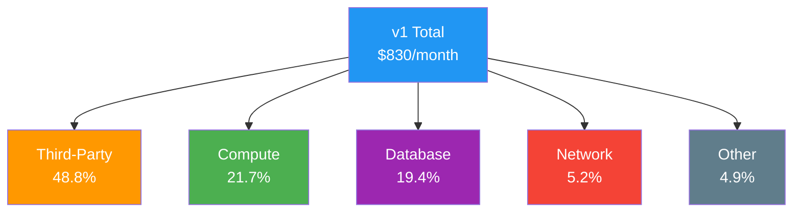

**v2 Cost Breakdown ($4,476/month)**
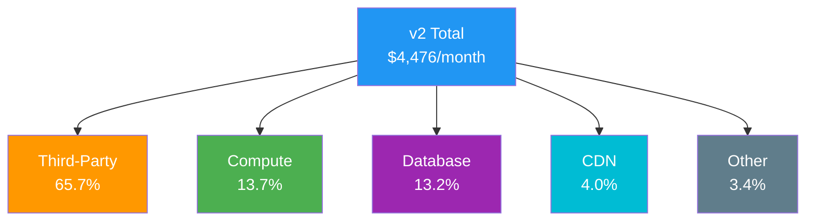

**v3 Cost Breakdown ($34,683/month)**
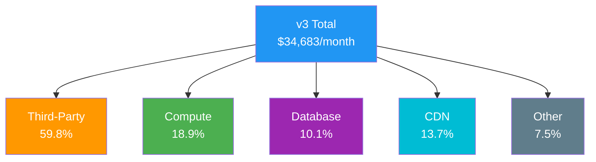

**v4 Cost Breakdown ($310,031/month)**
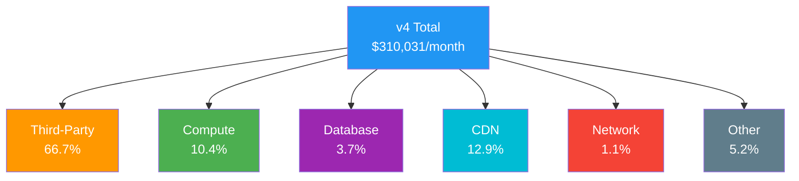

**Key Insight:** Third-party services (AI APIs, payment processing) dominate costs across all phases, ranging from 48-67% of total infrastructure spend.

---

## Cloud Provider Comparison

### AWS vs Azure vs GCP

#### Compute Costs (Application Tier)

**Scenario:** 10 instances for app servers (4 vCPU, 16GB RAM each)

| Provider | Instance Type | On-Demand | 1-Year RI | 3-Year RI | Monthly (10x) |
|----------|--------------|-----------|-----------|-----------|---------------|
| **AWS** | c5.xlarge | $0.170/hr | $0.100/hr | $0.074/hr | $1,230 (on-demand) |
| **Azure** | F4s v2 | $0.169/hr | $0.096/hr | $0.068/hr | $1,220 (on-demand) |
| **GCP** | n2-standard-4 | $0.195/hr | $0.117/hr (CUD) | $0.078/hr (CUD) | $1,410 (on-demand) |

**Winner:** Azure (slightly cheaper on reserved) / AWS (better spot pricing)

#### Database Costs (PostgreSQL)

**Scenario:** 1 primary (8 vCPU, 32GB RAM) + 3 read replicas (4 vCPU, 16GB RAM)

| Provider | Service | Primary | Replica (3x) | Total/Month |
|----------|---------|---------|--------------|-------------|
| **AWS** | RDS PostgreSQL | $555 | $831 | $1,386 |
| **Azure** | Database for PostgreSQL | $620 | $930 | $1,550 |
| **GCP** | Cloud SQL PostgreSQL | $580 | $870 | $1,450 |

**Winner:** AWS RDS

#### Storage Costs (Object Storage)

**Scenario:** 10 TB storage, 50 TB data transfer out

| Provider | Service | Storage | Egress | Total/Month |
|----------|---------|---------|--------|-------------|
| **AWS** | S3 | $235 | $4,500 | $4,735 |
| **Azure** | Blob Storage | $184 | $4,300 | $4,484 |
| **GCP** | Cloud Storage | $200 | $4,000 | $4,200 |

**Winner:** GCP (cheaper egress)

#### CDN Costs

**Scenario:** 500 TB data transfer

| Provider | Service | Cost/GB | Total/Month |
|----------|---------|---------|-------------|
| **AWS** | CloudFront | $0.020-0.085 | $25,000 |
| **Azure** | Azure CDN | $0.081-0.087 | $42,500 |
| **GCP** | Cloud CDN | $0.02-0.08 | $24,000 |
| **Cloudflare** | Enterprise CDN | Flat fee + usage | $15,000 |

**Winner:** Cloudflare (at scale)

### Multi-Cloud Strategy (v4)

**Recommended Approach:**

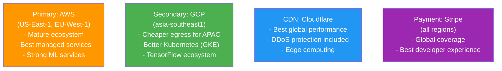

**Cost Comparison (v4 scale):**

| Strategy | Monthly Cost | Pros | Cons |
|----------|--------------|------|------|
| **AWS-only** | $310,000 | Simple, unified | Higher egress costs |
| **AWS + GCP** | $285,000 | Lower APAC costs | Multi-cloud complexity |
| **AWS + Cloudflare** | $295,000 | Best CDN performance | Vendor dependencies |
| **AWS + GCP + CF** | $275,000 | Optimized per region | Most complex |

**Recommendation:** AWS + Cloudflare for v3, AWS + GCP + Cloudflare for v4

---

## Reserved vs On-Demand Strategy

### Capacity Planning

```
Total Capacity Needed: 50 instances (v4 example)

Strategy:
├─ Baseline (always-on):      20 instances → 3-Year RIs (40%)
├─ Normal operations:          15 instances → 1-Year RIs (30%)
├─ Peak/burst capacity:        10 instances → On-Demand (20%)
└─ Background workers:         5 instances  → Spot (10%)
```

### Cost Comparison

**Scenario:** 50x c5.2xlarge instances for 1 year

| Strategy | Cost | Savings vs On-Demand |
|----------|------|---------------------|
| **100% On-Demand** | $147,600/year | 0% (baseline) |
| **100% 1-Year RI** | $87,600/year | -41% |
| **100% 3-Year RI** | $65,700/year | -55% |
| **Mixed (Recommended)** | $78,400/year | -47% |
| **With Spot Workers** | $71,200/year | -52% |

### Mixed Strategy Breakdown

```
20x 3-Year RI:      $26,280  (20 × $1,314)
15x 1-Year RI:      $21,900  (15 × $1,460)
10x On-Demand:      $29,520  (10 × $2,952)
5x Spot (90% off):  $1,476   (5 × $295)
─────────────────────────────
Total:              $79,176/year
Effective hourly:   $0.180/instance (vs $0.340 on-demand)
```

### Commitment Risk Mitigation

| Phase | Commitment Level | Reason |
|-------|-----------------|--------|
| **v1** | 0% RI | Too early to commit |
| **v2** | 30% 1-Year RI | Testing growth trajectory |
| **v3** | 50% mixed (1-Year + 3-Year) | Proven growth |
| **v4** | 70% mixed (mostly 3-Year) | Stable, predictable |

---

## Cost Optimization Opportunities

### Quick Wins (Immediate)

| Optimization | Effort | Monthly Savings | ROI |
|--------------|--------|----------------|-----|
| Right-size oversized instances | Low | $200-500 | Immediate |
| Enable S3 Intelligent-Tiering | Low | $100-300 | Immediate |
| Delete unused EBS volumes | Low | $50-150 | Immediate |
| Remove old snapshots | Low | $30-100 | Immediate |
| Optimize CloudWatch logs retention | Low | $50-200 | Immediate |
| **Total Quick Wins** | **1-2 days** | **$430-1,250** | **Immediate** |

### Medium-Term (1-3 months)

| Optimization | Effort | Monthly Savings | Implementation |
|--------------|--------|----------------|----------------|
| Purchase Reserved Instances | Medium | $2,000-5,000 | 1-year commitment |
| Implement database query caching | Medium | $500-1,500 | Redis setup |
| Move to spot instances for workers | Medium | $800-2,000 | Fault-tolerant redesign |
| Optimize database indexes | Medium | $300-800 | Query analysis |
| Implement CDN for all media | Medium | $1,500-4,000 | CloudFront setup |
| **Total Medium-Term** | **2-3 months** | **$5,100-13,300** | **3-6 month payback** |

### Long-Term (6-12 months)

| Optimization | Effort | Monthly Savings | Implementation |
|--------------|--------|----------------|----------------|
| Database sharding | High | $2,000-5,000 | 6 months |
| Move to serverless for low-traffic APIs | High | $1,000-3,000 | 4 months |
| Implement multi-tier storage lifecycle | Medium | $1,500-4,000 | 2 months |
| Custom ML models (reduce API costs) | High | $5,000-15,000 | 9 months |
| Optimize image/video compression | Medium | $2,000-6,000 | 3 months |
| **Total Long-Term** | **6-12 months** | **$11,500-33,000** | **12-18 month payback** |

### Cost Optimization Roadmap

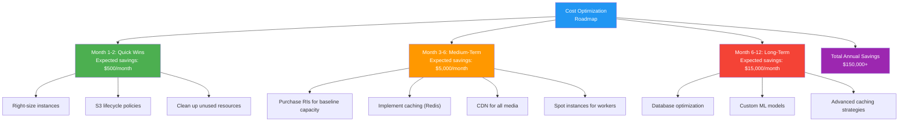

---

## Build vs Managed Service Costs

### Case Study: Message Queue

#### Option 1: Self-Hosted RabbitMQ

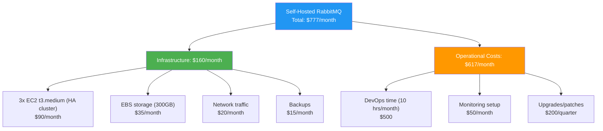

#### Option 2: Amazon MSK (Managed Kafka)

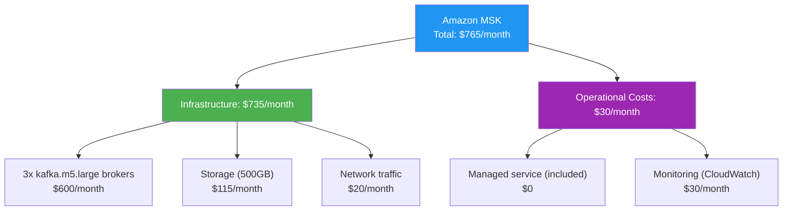

**Analysis:**

| Factor | Self-Hosted | Managed |
|--------|-------------|---------|
| Monthly Cost | $777 | $765 |
| Setup Time | 40 hours | 2 hours |
| Maintenance | 10 hrs/month | 1 hr/month |
| Expertise Required | High | Low |
| Scalability | Manual | Automatic |
| High Availability | DIY | Built-in |

**Recommendation:** Managed service (MSK) - similar cost, better reliability, lower operational burden

### Case Study: PostgreSQL Database

#### Option 1: Self-Hosted on EC2

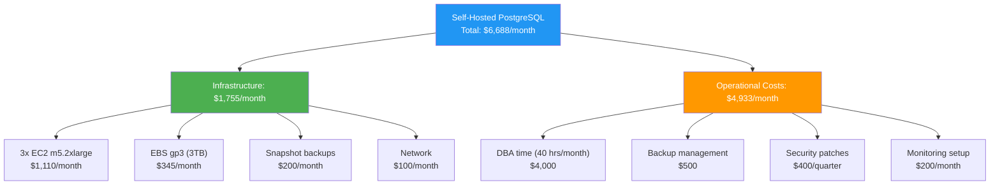

#### Option 2: Amazon RDS PostgreSQL

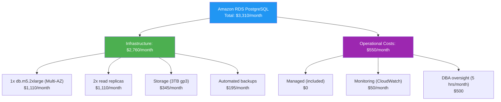

**Analysis:**

| Factor | Self-Hosted | RDS |
|--------|-------------|-----|
| Monthly Cost | $6,688 | $3,310 |
| **Annual Savings** | - | **$40,536** |
| Setup Time | 80 hours | 1 hour |
| Backup/Restore | Manual | Automated |
| Failover | Manual (10-30 min) | Automatic (<2 min) |
| Upgrades | Manual downtime | Rolling, minimal downtime |

**Recommendation:** Managed RDS - 50% cost savings, better reliability, automatic failover

### Build vs Buy Decision Matrix

| Service | Build Cost | Buy Cost | Recommendation | Reason |
|---------|-----------|----------|----------------|--------|
| **Database** | $6,688/mo | $3,310/mo | Buy (RDS) | 50% savings, better HA |
| **Cache** | $400/mo | $450/mo | Buy (ElastiCache) | Similar cost, managed |
| **Queue** | $777/mo | $765/mo | Buy (MSK) | Same cost, less ops |
| **Search** | $650/mo | $450/mo | Buy (Elasticsearch Service) | Less management |
| **Kubernetes** | $800/mo | $1,000/mo | Buy (EKS) | Worth 25% premium for managed |
| **Monitoring** | $500/mo | $3,100/mo | Build + Buy | Use Prometheus + selective DataDog |
| **ML Training** | $5,000/mo | $8,000/mo | Build | Save $3K, keep flexibility |
| **CDN** | N/A | $25,000/mo | Buy (CloudFront) | Can't self-host globally |

**Overall Strategy:** Use managed services for infrastructure (databases, caching, orchestration), build custom application logic and ML models.

---

## Third-Party Service Costs

### AI/ML APIs

| Provider | Service | Use Case | Pricing | v3 Monthly | v4 Monthly |
|----------|---------|----------|---------|------------|------------|
| **OpenAI** | GPT-4 Turbo | Content generation | $0.01/1K tokens | $2,500 | $25,000 |
| **OpenAI** | GPT-3.5 Turbo | Simple tasks | $0.0005/1K tokens | $100 | $1,000 |
| **Anthropic** | Claude 3.5 Sonnet | Analysis, long context | $0.015/1K tokens | $1,500 | $15,000 |
| **Stability AI** | SDXL | Image generation | $0.02/image | $1,000 | $10,000 |
| **OpenAI** | DALL-E 3 | Image generation | $0.04/image | $0 | $0 |
| **ElevenLabs** | Voice synthesis | Text-to-speech | $0.30/1K chars | $0 | $500 |
| **Whisper API** | Speech-to-text | Transcription | $0.006/min | $0 | $200 |
| **Total AI/ML** | | | | **$5,100** | **$51,700** |

**Optimization Strategies:**
1. **Cache AI responses** (30-50% cost reduction)
2. **Use cheaper models for simple tasks** (GPT-3.5 vs GPT-4)
3. **Batch API calls** (volume discounts)
4. **Fine-tune custom models** for high-volume use cases (v4)

### Communication Services

| Provider | Service | Use Case | Pricing | v3 Monthly | v4 Monthly |
|----------|---------|----------|---------|------------|------------|
| **SendGrid** | Email delivery | Transactional emails | $0.0003/email (scale) | $300 | $1,500 |
| **Twilio** | SMS | Notifications | $0.0079/SMS | $395 | $3,950 |
| **Twilio** | WhatsApp | International messaging | $0.0042/msg | $0 | $500 |
| **OneSignal** | Push notifications | Mobile/web push | Free → $99/mo | $99 | $499 |
| **Total Comms** | | | | **$794** | **$6,449** |

### Payment Processing

| Provider | Service | Pricing | v3 Volume | v3 Cost | v4 Volume | v4 Cost |
|----------|---------|---------|-----------|---------|-----------|---------|
| **Stripe** | Payment processing | 2.9% + $0.30 | $500K | $15,000 | $5M | $150,000 |
| **Stripe** | Billing/subscriptions | Included | - | $0 | - | $0 |
| **Stripe** | Connect (marketplace) | 0.25% extra | - | $0 | $2M | $5,000 |
| **PayPal** | Alternative payment | 3.49% + $0.49 | $50K | $1,794 | $500K | $17,940 |
| **Total Payments** | | | **$550K** | **$16,794** | **$7.5M** | **$172,940** |

**Note:** Payment processing is the largest third-party cost, scaling linearly with revenue.

### Authentication & Identity

| Provider | Service | Pricing | v3 MAU | v3 Cost | v4 MAU | v4 Cost |
|----------|---------|---------|--------|---------|--------|---------|
| **Auth0** | Enterprise auth | $13.33/1K MAU | 10K | $240 | 100K | $1,333 |
| **Okta** | SSO (enterprise) | Custom | - | $0 | Enterprise tier | $2,000 |
| **Total Auth** | | | **10K** | **$240** | **100K** | **$3,333** |

### Monitoring & Observability

| Provider | Service | Use Case | Pricing | v3 Monthly | v4 Monthly |
|----------|---------|----------|---------|------------|------------|
| **DataDog** | APM + Infrastructure | Full-stack monitoring | $31/host | $310 | $3,100 |
| **Sentry** | Error tracking | Exception monitoring | $26-99 | $99 | $449 |
| **PagerDuty** | Incident management | On-call alerts | $41/user | $0 | $820 |
| **Grafana Cloud** | Metrics/Logs | Time-series | $299 | $299 | $0 |
| **New Relic** | APM (alternative) | Application monitoring | $25/host | $0 | $2,500 |
| **Total Monitoring** | | | | **$708** | **$6,869** |

### Total Third-Party Costs Summary

| Category | v3 Monthly | v4 Monthly | % of Total Infra |
|----------|------------|------------|-----------------|
| AI/ML APIs | $5,100 | $51,700 | 16.7% (v4) |
| Communications | $794 | $6,449 | 2.1% |
| Payment Processing | $16,794 | $172,940 | 55.8% |
| Auth/Identity | $240 | $3,333 | 1.1% |
| Monitoring | $708 | $6,869 | 2.2% |
| **Total** | **$23,636** | **$241,291** | **77.9%** |

**Key Insight:** Third-party services represent 68% (v3) and 78% (v4) of total infrastructure costs, with payment processing being the dominant expense at scale.

---

## Total Cost of Ownership (TCO) Analysis

### 5-Year TCO Projection

```mermaid
graph TD
    TCO["5-Year Total<br>$11,265,000"] --> Y1["Year 1 (v1 → v2)<br>$255,000"]
    TCO --> Y2["Year 2 (v2 stable)<br>$544,000"]
    TCO --> Y3["Year 3 (v2 → v3)<br>$1,350,000"]
    TCO --> Y4["Year 4 (v3 stable)<br>$2,116,000"]
    TCO --> Y5["Year 5 (v3 → v4)<br>$7,000,000"]

    Y1 --> Y1_I["Infrastructure: $25,000"]
    Y1 --> Y1_T["Third-party: $30,000"]
    Y1 --> Y1_P["Personnel (2 devs): $200,000"]

    Y2 --> Y2_I["Infrastructure: $54,000"]
    Y2 --> Y2_T["Third-party: $90,000"]
    Y2 --> Y2_P["Personnel (4 devs): $400,000"]

    Y3 --> Y3_I["Infrastructure: $200,000"]
    Y3 --> Y3_T["Third-party: $250,000"]
    Y3 --> Y3_P["Personnel (8 devs): $800,000"]
    Y3 --> Y3_M["Migration: $100,000"]

    Y4 --> Y4_I["Infrastructure: $416,000"]
    Y4 --> Y4_T["Third-party: $500,000"]
    Y4 --> Y4_P["Personnel (12 devs): $1,200,000"]

    Y5 --> Y5_I["Infrastructure: $2,000,000"]
    Y5 --> Y5_T["Third-party: $2,500,000"]
    Y5 --> Y5_P["Personnel (20 devs): $2,000,000"]
    Y5 --> Y5_M["Migration: $500,000"]

    style TCO fill:#2196f3,color:#fff
    style Y1 fill:#4caf50,color:#fff
    style Y2 fill:#8bc34a,color:#fff
    style Y3 fill:#ff9800,color:#fff
    style Y4 fill:#ff5722,color:#fff
    style Y5 fill:#f44336,color:#fff
```

### TCO Breakdown by Category

| Category | 5-Year Total | Percentage |
|----------|-------------|------------|
| **Personnel** | $4,600,000 | 40.8% |
| **Third-Party Services** | $3,370,000 | 29.9% |
| **Infrastructure** | $2,695,000 | 23.9% |
| **Migration/Projects** | $600,000 | 5.3% |
| **Total** | **$11,265,000** | **100%** |

### TCO vs Revenue

| Year | Revenue | TCO | TCO % of Revenue | Gross Margin |
|------|---------|-----|------------------|--------------|
| 1 | $600,000 | $255,000 | 42.5% | 57.5% |
| 2 | $3,600,000 | $544,000 | 15.1% | 84.9% |
| 3 | $12,000,000 | $1,350,000 | 11.3% | 88.7% |
| 4 | $36,000,000 | $2,116,000 | 5.9% | 94.1% |
| 5 | $75,000,000 | $7,000,000 | 9.3% | 90.7% |

**Key Insight:** Infrastructure costs as % of revenue decrease dramatically as the platform scales, reaching optimal efficiency at v3-v4.

### Cost per Customer Lifecycle

```
Customer Acquisition (Year 1):
Marketing/sales:        $500
Onboarding support:     $100
Infrastructure:         $200 (first year)
Total CAC:              $800

Customer Retention (Years 2-5):
Infrastructure:         $75/year
Support:                $50/year
Total annual cost:      $125/year

5-Year Customer Value:
Revenue (avg $150/mo):  $9,000
Total costs:            $1,300
Net value:              $7,700
LTV/CAC ratio:          9.6x
```

---

## Cost Optimization Recommendations

### Immediate Actions (Month 1)

1. **Enable AWS Cost Explorer and Budgets**
   - Set up budget alerts at 80%, 90%, 100% thresholds
   - Monthly review of cost anomalies

2. **Tag All Resources**
   ```
   Tags:
   - Environment: production|staging|development
   - Service: api|database|storage|cdn
   - Owner: team-name
   - CostCenter: engineering|infrastructure
   ```

3. **Right-Size Instances**
   - Use AWS Compute Optimizer recommendations
   - Expected savings: 20-30%

4. **S3 Lifecycle Policies**
   - Transition to IA after 90 days
   - Archive to Glacier after 1 year
   - Expected savings: $100-300/month

### Short-Term (Months 2-6)

1. **Reserved Instance Strategy**
   - Start with 30% coverage (1-year terms)
   - Focus on stable baseline capacity
   - Expected savings: $2,000-5,000/month

2. **Implement Caching**
   - Redis for database queries
   - CDN for all media
   - Expected savings: $1,500-4,000/month

3. **Spot Instances for Workers**
   - Background jobs, ML training
   - 70-90% cost reduction
   - Expected savings: $800-2,000/month

### Medium-Term (Months 6-18)

1. **Database Optimization**
   - Query optimization
   - Read replicas
   - Connection pooling
   - Expected savings: $2,000-6,000/month

2. **Custom ML Models**
   - Reduce API costs
   - Self-hosted inference
   - Expected savings: $5,000-15,000/month (at scale)

3. **Multi-Cloud Strategy**
   - GCP for APAC egress
   - Cloudflare for CDN
   - Expected savings: $10,000-30,000/month (v4)

### Cost Governance Framework

```
Monthly Cost Review Process:
1. Review cost anomalies (>10% increase)
2. Validate all tagged resources
3. Right-size underutilized instances
4. Clean up unused resources
5. Optimize third-party service usage
6. Document cost-saving decisions

Quarterly Strategic Review:
1. Evaluate RI/Savings Plan opportunities
2. Review multi-cloud strategy
3. Assess build vs buy decisions
4. Plan for next phase migrations
5. Update cost projections

Annual Planning:
1. 5-year TCO projection
2. Budget allocation by service
3. Cost optimization roadmap
4. Headcount planning
```

---

## Key Takeaways

### Cost Efficiency Trends

1. **Economies of Scale Work**
   - Cost per customer drops from $16.59 (v1) to $6.20 (v4)
   - 63% reduction despite massive feature expansion

2. **Third-Party Services Dominate**
   - 48-78% of total costs across all phases
   - Payment processing (Stripe) is the largest single expense at scale

3. **Managed Services Pay Off**
   - 30-50% TCO reduction vs self-hosted
   - Lower operational complexity
   - Better reliability and uptime

4. **Strategic RI Purchases Critical**
   - 40-55% savings on compute
   - Recommended: 70% coverage by v4

5. **Infrastructure % of Revenue Decreases**
   - v1: 16.8% of revenue
   - v4: 2.5% of revenue
   - Excellent unit economics at scale

### Budget Planning Guidelines

| Phase | Infrastructure Budget | % of Revenue | Buffer |
|-------|----------------------|--------------|--------|
| v1 | $1,000/month | 15-20% | 50% |
| v2 | $5,000/month | 5-8% | 30% |
| v3 | $40,000/month | 3-5% | 20% |
| v4 | $350,000/month | 2-3% | 15% |

### Cost Optimization Priorities

**v1 → v2:**
- Implement caching (Redis)
- Add CDN (CloudFront)
- Start RI purchases (30% coverage)

**v2 → v3:**
- Custom ML models (reduce API costs)
- Spot instances for workers
- Database optimization
- Increase RI coverage (50%)

**v3 → v4:**
- Multi-cloud strategy
- Advanced auto-scaling
- 70% RI coverage
- Negotiate enterprise pricing

---

**Document Version:** 1.0
**Last Updated:** 2025-12-21
**Owner:** Engineering Leadership & Finance
**Review Cycle:** Quarterly
**Next Review:** 2026-03-21
