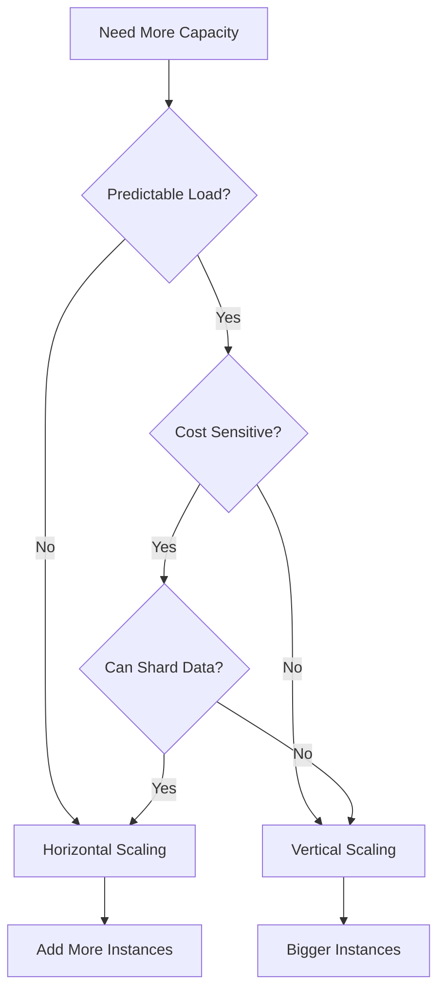

# Scalability Planning

## Overview

This document outlines the comprehensive scalability strategy for PopSystem, detailing how the platform will grow from supporting hundreds of users in v1 to tens of thousands in v4+. It covers architecture bottlenecks, scaling strategies, performance optimization techniques, and cost-performance trade-offs across all system components.

---

## Current Architecture Bottlenecks (v1)

### 1. Application Layer Bottlenecks

| Component | Current Limitation | Impact at Scale | Symptom |
|-----------|-------------------|-----------------|---------|
| **Monolithic Deployment** | Single process handles all requests | Cannot scale specific features independently | Entire app restarts affect all users |
| **In-Memory State** | Sessions stored in application memory | No horizontal scaling without sticky sessions | User session loss on deployment |
| **Synchronous Processing** | Image/video processing blocks requests | Slow response times under load | API timeouts during media uploads |
| **No Request Queuing** | Direct HTTP → processing | Request storms cause cascading failures | 503 errors during traffic spikes |
| **Connection Pool Limits** | 20 concurrent DB connections | Database connection exhaustion | "Too many connections" errors |

**Current Capacity:** ~200 concurrent users, ~500 req/sec

### 2. Database Layer Bottlenecks

| Issue | Current State | Scaling Limit | Evidence |
|-------|---------------|---------------|----------|
| **Single Write Node** | All writes → primary PostgreSQL | ~5,000 writes/sec max | CPU spikes during bulk operations |
| **No Read Scaling** | All reads → same node as writes | ~10,000 reads/sec max | Query latency >500ms during peak |
| **Sequential Scans** | Missing indexes on large tables | O(n) complexity on tenant queries | Slow dashboard loads (>5s) |
| **Connection Overhead** | New connection per request | Max ~200 connections | Connection pool exhaustion |
| **No Query Caching** | Every read hits database | Repeated identical queries | Database CPU at 70%+ |

**Current Capacity:** ~500 tenants, ~100,000 campaigns, ~1M database rows

### 3. Storage Layer Bottlenecks

| Component | Limitation | Impact | Evidence |
|-----------|-----------|--------|----------|
| **Direct S3 Access** | All uploads → app server → S3 | Bandwidth bottleneck | Slow uploads >10MB |
| **No CDN** | All media served from origin | High latency for global users | >2s image load times (APAC) |
| **Synchronous Processing** | Image resize during request | Request timeouts | 30s+ upload times |
| **No Caching** | No image caching strategy | Repeated S3 GET costs | High S3 egress costs |

**Current Capacity:** ~10GB/day uploads, ~50GB stored media

### 4. External API Bottlenecks

| Service | Rate Limit | Current Usage | Time to Limit |
|---------|-----------|---------------|---------------|
| **OpenAI API** | 3,500 req/min (Tier 3) | ~500 req/hr | ~7x headroom |
| **Instagram Graph API** | 200 calls/hr per user | ~50 calls/hr/user | ~4x headroom |
| **SendGrid Email** | 100 emails/sec | ~10 emails/sec | ~10x headroom |
| **Stripe API** | 100 req/sec | ~5 req/sec | ~20x headroom |

---

## Horizontal vs Vertical Scaling Strategy

### Decision Matrix



### Horizontal Scaling (Preferred)

**When to Use:**
- Stateless application tier
- Read-heavy workloads (database reads)
- Queue-based processing
- Unpredictable traffic patterns
- Need high availability (multi-instance redundancy)

**Components Using Horizontal Scaling:**

```
┌─────────────────────────────────────────────────┐
│              Load Balancer (ALB)                │
└────┬────────┬────────┬────────┬────────┬────────┘
     │        │        │        │        │
  ┌──v──┐  ┌──v──┐  ┌──v──┐  ┌──v──┐  ┌──v──┐
  │App-1│  │App-2│  │App-3│  │App-4│  │App-N│
  └──┬──┘  └──┬──┘  └──┬──┘  └──┬──┘  └──┬──┘
     └────────┴────────┴────────┴────────┘
                      │
              [Shared Resources]
              - PostgreSQL
              - Redis
              - S3
```

**Scaling Metrics:**

| Metric | Scale Up Threshold | Scale Down Threshold | Action |
|--------|-------------------|---------------------|--------|
| CPU Utilization | >70% for 5 min | <30% for 15 min | Add/Remove 1 instance |
| Memory Utilization | >80% | <40% for 15 min | Add/Remove 1 instance |
| Request Queue Depth | >100 | <10 for 10 min | Add/Remove 1 instance |
| Response Time P95 | >500ms | <200ms for 10 min | Add/Remove 1 instance |

**Cost Model:**

```
v1: 3x t3.large ($0.0832/hr) = $180/month
v2: 5x t3.large (auto-scaled) = $300/month avg
v3: 10x t3.large (peak) = $600/month
v4: 20x t3.large (peak) = $1,200/month
```

### Vertical Scaling

**When to Use:**
- Single-threaded workloads
- Database primary (write scaling)
- Stateful applications (temporary)
- Quick fix for immediate capacity needs

**Components Using Vertical Scaling:**

```
Database Primary (Write Node)
v1: db.t3.large (2 vCPU, 8GB RAM)      → ~1,000 writes/sec
v2: db.m5.xlarge (4 vCPU, 16GB RAM)    → ~2,500 writes/sec
v3: db.m5.2xlarge (8 vCPU, 32GB RAM)   → ~5,000 writes/sec
v4: db.m5.4xlarge (16 vCPU, 64GB RAM)  → ~10,000 writes/sec
```

**Limitations:**
- Hard ceiling (largest instance: 448 vCPU, 12TB RAM for AWS)
- Downtime required for resize
- Cost increases exponentially (4x size = 4x cost)
- Single point of failure

---

## Database Scaling Strategy

### Phase 1: Optimization (v1-v2)

**1. Query Optimization**

```sql
-- BEFORE: Slow tenant query (800ms)
SELECT * FROM campaigns
WHERE tenant_id = 'abc123'
  AND status IN ('ACTIVE', 'SCHEDULED')
ORDER BY created_at DESC;

-- AFTER: Add composite index (8ms)
CREATE INDEX idx_campaigns_tenant_status_created
ON campaigns(tenant_id, status, created_at DESC)
WHERE status IN ('ACTIVE', 'SCHEDULED');
```

**2. Connection Pooling (PgBouncer)**

```ini
# Before: App creates 20 connections per instance × 5 instances = 100 connections
# After: PgBouncer pools 100 app connections → 20 DB connections

[pgbouncer]
pool_mode = transaction
default_pool_size = 20
max_client_conn = 1000
reserve_pool_size = 5

# Result: 50x more app instances supported without DB connection limit
```

**Performance Improvement:**
- Connection overhead: -90% (no connection creation per query)
- Database memory: -80% (fewer concurrent connections)
- Query latency: -30% (connection reuse)

### Phase 2: Read Scaling (v2-v3)

**Read Replica Architecture**

```
┌──────────────────┐
│  Primary (Write) │ ←── All writes (INSERT, UPDATE, DELETE)
└────────┬─────────┘
         │ Async replication (streaming)
         ├──────────────┬──────────────┐
         │              │              │
    ┌────v────┐    ┌────v────┐    ┌────v────┐
    │Replica-1│    │Replica-2│    │Replica-3│
    │ (Read)  │    │ (Read)  │    │ (Read)  │
    └─────────┘    └─────────┘    └─────────┘
         ↑              ↑              ↑
         └──────────────┴──────────────┘
              All reads (SELECT)
```

**Read Routing Strategy:**

```typescript
// Automatic read/write splitting
import { PrismaClient } from '@prisma/client';

const prismaWrite = new PrismaClient({
  datasources: { db: { url: process.env.DATABASE_PRIMARY_URL } }
});

const prismaRead = new PrismaClient({
  datasources: { db: { url: process.env.DATABASE_REPLICA_URL } }
});

class CampaignRepository {
  // Writes → Primary
  async create(data: CampaignData) {
    return prismaWrite.campaign.create({ data });
  }

  // Reads → Replica
  async findMany(filter: Filter) {
    return prismaRead.campaign.findMany({ where: filter });
  }

  // Critical reads → Primary (avoid replication lag)
  async findById(id: string) {
    return prismaWrite.campaign.findUnique({ where: { id } });
  }
}
```

**Replica Lag Handling:**

```typescript
// Read-after-write consistency
async createCampaign(data: CampaignData) {
  const campaign = await prismaWrite.campaign.create({ data });

  // Force primary read for 2 seconds (max replication lag)
  await cache.set(`force-primary:${campaign.id}`, true, 2);

  return campaign;
}

async getCampaign(id: string) {
  const forcePrimary = await cache.get(`force-primary:${id}`);
  const client = forcePrimary ? prismaWrite : prismaRead;

  return client.campaign.findUnique({ where: { id } });
}
```

**Scaling Capacity:**

| Configuration | Read Capacity | Write Capacity | Monthly Cost |
|--------------|---------------|----------------|--------------|
| v1: Single primary | 10K reads/sec | 5K writes/sec | $200 |
| v2: Primary + 2 replicas | 30K reads/sec | 5K writes/sec | $600 |
| v3: Primary + 5 replicas | 60K reads/sec | 5K writes/sec | $1,400 |

### Phase 3: Sharding (v3-v4)

**Tenant-Based Sharding**

```
Shard 1 (Tenants A-F)     Shard 2 (Tenants G-M)     Shard 3 (Tenants N-Z)
┌──────────────────┐      ┌──────────────────┐      ┌──────────────────┐
│ Primary          │      │ Primary          │      │ Primary          │
│ + 2 Replicas     │      │ + 2 Replicas     │      │ + 2 Replicas     │
└──────────────────┘      └──────────────────┘      └──────────────────┘
   5K writes/sec             5K writes/sec             5K writes/sec
   = 15K total writes/sec across all shards
```

**Sharding Strategy:**

```typescript
// Shard routing based on tenant_id
function getShardForTenant(tenantId: string): DatabaseShard {
  const hash = murmur3(tenantId);
  const shardIndex = hash % NUM_SHARDS;

  return shards[shardIndex];
}

// All queries automatically routed
async findCampaigns(tenantId: string, filter: Filter) {
  const shard = getShardForTenant(tenantId);
  return shard.campaign.findMany({
    where: { tenantId, ...filter }
  });
}
```

**Citus Extension (Distributed PostgreSQL):**

```sql
-- Convert to distributed table
SELECT create_distributed_table('campaigns', 'tenant_id');

-- Queries automatically distributed to correct shard
SELECT * FROM campaigns WHERE tenant_id = 'abc123';
-- → Routed to single shard (co-located data)

SELECT COUNT(*) FROM campaigns;
-- → Parallel execution across all shards
```

**Scaling Capacity:**

| Shards | Total Write Capacity | Total Read Capacity | Monthly Cost |
|--------|---------------------|---------------------|--------------|
| 1 shard | 5K writes/sec | 60K reads/sec | $1,400 |
| 3 shards | 15K writes/sec | 180K reads/sec | $4,200 |
| 5 shards | 25K writes/sec | 300K reads/sec | $7,000 |

### Phase 4: Geo-Distribution (v4+)

**Multi-Region Architecture**

```
                    Global Load Balancer
                         (Route53)
                            │
        ┌───────────────────┼───────────────────┐
        │                   │                   │
  [US-East Region]   [EU-West Region]    [APAC Region]
        │                   │                   │
    [Primary DB]       [Read Replica]      [Read Replica]
        │                   ↑                   ↑
        └───────────────────┴───────────────────┘
              Async replication (cross-region)
```

**Latency Improvement:**

| User Location | v3 (Single Region) | v4 (Multi-Region) | Improvement |
|---------------|-------------------|-------------------|-------------|
| US East | 20ms | 20ms | 0% |
| EU West | 150ms | 35ms | -77% |
| APAC (Singapore) | 250ms | 45ms | -82% |

---

## CDN and Media Delivery Scaling

### Phase 1: Basic CDN (v2)

**Architecture:**

```
User Request for Image
    │
    v
[CloudFront CDN]
    │
    ├─ Cache HIT (99% of requests) → Return immediately (10-50ms)
    │
    └─ Cache MISS (1% of requests)
           │
           v
       [S3 Origin]
           │
           v
       Return image + cache at edge (200-500ms)
```

**CDN Configuration:**

```typescript
// CloudFront distribution
{
  origins: [{
    domainName: 'popsystem-media.s3.amazonaws.com',
    s3OriginConfig: {
      originAccessIdentity: 'origin-access-identity/cloudfront/...'
    }
  }],
  defaultCacheBehavior: {
    targetOriginId: 's3-origin',
    viewerProtocolPolicy: 'redirect-to-https',
    compress: true,
    cachePolicyId: 'CachingOptimized',
    cachedMethods: ['GET', 'HEAD'],
    allowedMethods: ['GET', 'HEAD', 'OPTIONS']
  },
  cacheBehaviors: [
    {
      pathPattern: '/images/*',
      minTTL: 86400,      // 1 day
      maxTTL: 31536000,   // 1 year
      defaultTTL: 604800  // 1 week
    },
    {
      pathPattern: '/videos/*',
      minTTL: 2592000,    // 30 days
      maxTTL: 31536000    // 1 year
    }
  ]
}
```

**Performance Metrics:**

| Metric | Before CDN | After CDN | Improvement |
|--------|-----------|-----------|-------------|
| Avg. image load time | 800ms | 150ms | -81% |
| S3 GET requests | 1M/month | 50K/month | -95% |
| Bandwidth cost | $400/month | $80/month | -80% |
| Cache hit rate | 0% | 99.2% | +99.2% |

### Phase 2: Image Optimization (v2-v3)

**Dynamic Image Transformation:**

```typescript
// CloudFront Lambda@Edge for on-the-fly image transformation
export const handler = async (event: CloudFrontRequestEvent) => {
  const request = event.Records[0].cf.request;
  const params = parseQueryString(request.querystring);

  // Parse transformation parameters
  const { width, quality = 85, format = 'webp' } = params;

  // Generate optimized image key
  const originalKey = request.uri;
  const optimizedKey = `${originalKey}_w${width}_q${quality}.${format}`;

  // Check if optimized version exists
  try {
    await s3.headObject({ Bucket: BUCKET, Key: optimizedKey });
    request.uri = optimizedKey;
    return request;
  } catch {
    // Generate on-demand
    const original = await s3.getObject({ Bucket: BUCKET, Key: originalKey });

    const optimized = await sharp(original.Body)
      .resize(parseInt(width), null, { withoutEnlargement: true })
      .webp({ quality: parseInt(quality) })
      .toBuffer();

    // Save for future requests
    await s3.putObject({
      Bucket: BUCKET,
      Key: optimizedKey,
      Body: optimized,
      ContentType: `image/${format}`,
      CacheControl: 'public, max-age=31536000'
    });

    request.uri = optimizedKey;
    return request;
  }
};
```

**Image Delivery Strategy:**

```html
<!-- Responsive images with automatic format selection -->
<picture>
  <source
    srcset="
      https://cdn.popsystem.com/image.jpg?w=400&f=avif 400w,
      https://cdn.popsystem.com/image.jpg?w=800&f=avif 800w,
      https://cdn.popsystem.com/image.jpg?w=1200&f=avif 1200w
    "
    type="image/avif"
  />
  <source
    srcset="
      https://cdn.popsystem.com/image.jpg?w=400&f=webp 400w,
      https://cdn.popsystem.com/image.jpg?w=800&f=webp 800w,
      https://cdn.popsystem.com/image.jpg?w=1200&f=webp 1200w
    "
    type="image/webp"
  />
  
</picture>
```

**File Size Reduction:**

| Original | WebP | AVIF | Savings |
|----------|------|------|---------|
| JPEG (2.4MB) | 800KB | 650KB | -73% |
| PNG (5.1MB) | 1.2MB | 950KB | -81% |

### Phase 3: Video Delivery (v3-v4)

**Adaptive Bitrate Streaming:**

```
Original Video (1080p, 50Mbps)
    │
    v
[MediaConvert]
    │
    ├─ 1080p @ 8Mbps (high quality)
    ├─ 720p @ 5Mbps (HD)
    ├─ 480p @ 2.5Mbps (SD)
    └─ 360p @ 1Mbps (mobile)
    │
    v
[HLS Manifest] → Adaptive playback based on user bandwidth
```

**HLS Configuration:**

```typescript
// Generate HLS manifest
{
  outputs: [
    {
      containerSettings: { container: 'M3U8' },
      videoDescription: {
        width: 1920,
        height: 1080,
        codecSettings: {
          codec: 'H_264',
          h264Settings: {
            bitrate: 8000000,
            rateControlMode: 'CBR'
          }
        }
      }
    },
    // ... additional quality levels
  ],
  outputGroups: [{
    outputGroupSettings: {
      type: 'HLS_GROUP_SETTINGS',
      hlsGroupSettings: {
        manifestDurationFormat: 'INTEGER',
        segmentLength: 6,
        minSegmentLength: 0
      }
    }
  }]
}
```

**Video CDN:**

```
User → [Cloudflare Stream] → Adaptive quality selection
           │
           ├─ 1080p (Wifi, high-speed)
           ├─ 720p (4G, good signal)
           ├─ 480p (3G, weak signal)
           └─ 360p (2G, fallback)
```

**Cost Comparison:**

| Solution | Storage | Delivery | Total (1TB video, 10TB delivery) |
|----------|---------|----------|----------------------------------|
| S3 + CloudFront | $23/month | $850/month | $873/month |
| Cloudflare Stream | $5/month | $1/month per 1000 minutes | ~$150/month |

---

## API Rate Limiting and Throttling

### Rate Limiting Strategy

**Multi-Tier Rate Limits:**

| Tier | Requests/Minute | Burst Allowance | Monthly Cost | Use Case |
|------|----------------|-----------------|--------------|----------|
| **Free** | 60 | 100 | $0 | Individual users, trials |
| **Starter** | 600 | 1,000 | $49/month | Small businesses |
| **Professional** | 6,000 | 10,000 | $199/month | Growing brands |
| **Enterprise** | Custom | Custom | Custom | Large organizations |

**Implementation (Token Bucket Algorithm):**

```typescript
import Redis from 'ioredis';

class RateLimiter {
  constructor(private redis: Redis) {}

  async checkLimit(
    tenantId: string,
    endpoint: string,
    limit: number,
    window: number
  ): Promise<{ allowed: boolean; remaining: number; resetAt: number }> {
    const key = `rate-limit:${tenantId}:${endpoint}`;
    const now = Date.now();
    const windowStart = now - window;

    // Use Redis sorted set with timestamp scores
    const multi = this.redis.multi();

    // Remove expired entries
    multi.zremrangebyscore(key, 0, windowStart);

    // Count requests in current window
    multi.zcard(key);

    // Add current request
    multi.zadd(key, now, `${now}-${Math.random()}`);

    // Set expiry
    multi.expire(key, Math.ceil(window / 1000));

    const results = await multi.exec();
    const count = results[1][1] as number;

    const allowed = count < limit;
    const remaining = Math.max(0, limit - count - 1);
    const resetAt = now + window;

    return { allowed, remaining, resetAt };
  }
}

// Express middleware
async function rateLimitMiddleware(req: Request, res: Response, next: NextFunction) {
  const tenantId = req.context.tenantId;
  const tier = await getTenantTier(tenantId);
  const limits = TIER_LIMITS[tier];

  const result = await rateLimiter.checkLimit(
    tenantId,
    req.path,
    limits.requestsPerMinute,
    60000 // 1 minute window
  );

  // Set rate limit headers
  res.setHeader('X-RateLimit-Limit', limits.requestsPerMinute);
  res.setHeader('X-RateLimit-Remaining', result.remaining);
  res.setHeader('X-RateLimit-Reset', result.resetAt);

  if (!result.allowed) {
    return res.status(429).json({
      error: 'Rate limit exceeded',
      retryAfter: Math.ceil((result.resetAt - Date.now()) / 1000)
    });
  }

  next();
}
```

### Throttling Strategy

**Adaptive Throttling:**

```typescript
class AdaptiveThrottler {
  private systemLoad: number = 0;

  async shouldThrottle(priority: 'high' | 'medium' | 'low'): Promise<boolean> {
    this.systemLoad = await this.getCurrentLoad();

    const thresholds = {
      high: 0.95,   // Only throttle at 95% load
      medium: 0.80, // Throttle at 80% load
      low: 0.60     // Throttle at 60% load
    };

    return this.systemLoad > thresholds[priority];
  }

  private async getCurrentLoad(): Promise<number> {
    const [cpuLoad, memoryLoad, queueDepth] = await Promise.all([
      this.getCPULoad(),
      this.getMemoryLoad(),
      this.getQueueDepth()
    ]);

    // Weighted average
    return (cpuLoad * 0.5) + (memoryLoad * 0.3) + (queueDepth * 0.2);
  }
}
```

**Priority Queue:**

```typescript
// High priority: Real-time user requests
// Medium priority: Background jobs
// Low priority: Analytics, reporting

async function handleRequest(req: Request, priority: Priority) {
  if (await throttler.shouldThrottle(priority)) {
    if (priority === 'low') {
      // Defer low priority requests
      await queue.add('deferred-requests', req, {
        delay: 60000 // Retry in 1 minute
      });
      return { status: 'deferred' };
    } else {
      // Shed load for medium priority
      return { status: 'service_unavailable', retryAfter: 30 };
    }
  }

  return await processRequest(req);
}
```

---

## Queue-Based Architecture for Async Processing

### Queue Architecture

```
┌─────────────────┐
│  API Request    │
└────────┬────────┘
         │
         v
┌─────────────────┐     ┌──────────────────┐
│ Add to Queue    │────>│  Redis (BullMQ)  │
│ Return Job ID   │     └────────┬─────────┘
└─────────────────┘              │
                                 │
                    ┌────────────┼────────────┐
                    │            │            │
                ┌───v───┐    ┌───v───┐    ┌───v───┐
                │Worker │    │Worker │    │Worker │
                │  #1   │    │  #2   │    │  #N   │
                └───┬───┘    └───┬───┘    └───┬───┘
                    │            │            │
                    └────────────┴────────────┘
                                 │
                                 v
                    ┌─────────────────────┐
                    │  Job Complete       │
                    │  Webhook/SSE Update │
                    └─────────────────────┘
```

### Job Queues by Type

| Queue Name | Purpose | Priority | Concurrency | Retry | Timeout |
|------------|---------|----------|-------------|-------|---------|
| `image-processing` | Image resize, optimization | Medium | 10 | 3 | 60s |
| `video-processing` | Video transcoding | Low | 3 | 2 | 600s |
| `ai-generation` | AI content creation | High | 5 | 3 | 120s |
| `notifications` | Email, SMS, push | High | 20 | 5 | 30s |
| `analytics` | Data aggregation | Low | 5 | 2 | 300s |
| `webhooks` | External API calls | Medium | 10 | 5 | 30s |

### BullMQ Implementation

```typescript
import { Queue, Worker, QueueScheduler } from 'bullmq';

// Create queue
const imageQueue = new Queue('image-processing', {
  connection: redis,
  defaultJobOptions: {
    attempts: 3,
    backoff: {
      type: 'exponential',
      delay: 2000
    },
    removeOnComplete: 1000,
    removeOnFail: 5000
  }
});

// Add job
async function processImage(campaignId: string, imageUrl: string) {
  const job = await imageQueue.add('optimize-image', {
    campaignId,
    imageUrl,
    formats: ['webp', 'avif'],
    sizes: [400, 800, 1200]
  });

  return { jobId: job.id };
}

// Worker
const worker = new Worker('image-processing', async (job) => {
  const { campaignId, imageUrl, formats, sizes } = job.data;

  // Download image
  const image = await download(imageUrl);

  // Generate all variants
  const variants = [];
  for (const format of formats) {
    for (const size of sizes) {
      const optimized = await sharp(image)
        .resize(size)
        .toFormat(format)
        .toBuffer();

      const url = await uploadToS3(optimized, {
        key: `campaigns/${campaignId}/images/${size}.${format}`
      });

      variants.push({ format, size, url });

      // Report progress
      await job.updateProgress({
        completed: variants.length,
        total: formats.length * sizes.length
      });
    }
  }

  return { variants };
}, {
  connection: redis,
  concurrency: 10
});

// Event handlers
worker.on('completed', async (job) => {
  console.log(`Job ${job.id} completed`);

  // Notify client via webhook or SSE
  await notifyClient(job.data.campaignId, {
    status: 'completed',
    result: job.returnvalue
  });
});

worker.on('failed', async (job, err) => {
  console.error(`Job ${job.id} failed:`, err);

  await notifyClient(job.data.campaignId, {
    status: 'failed',
    error: err.message
  });
});
```

### Job Status Tracking

```typescript
// Client polls for job status
app.get('/api/jobs/:jobId', async (req, res) => {
  const job = await imageQueue.getJob(req.params.jobId);

  if (!job) {
    return res.status(404).json({ error: 'Job not found' });
  }

  const state = await job.getState();
  const progress = job.progress;

  res.json({
    id: job.id,
    state, // waiting, active, completed, failed
    progress,
    result: await job.returnvalue,
    failedReason: job.failedReason
  });
});
```

### Queue Monitoring

```typescript
// Queue metrics
async function getQueueMetrics(queueName: string) {
  const queue = new Queue(queueName, { connection: redis });

  const [waiting, active, completed, failed, delayed] = await Promise.all([
    queue.getWaitingCount(),
    queue.getActiveCount(),
    queue.getCompletedCount(),
    queue.getFailedCount(),
    queue.getDelayedCount()
  ]);

  return {
    queueName,
    waiting,
    active,
    completed,
    failed,
    delayed,
    total: waiting + active + delayed
  };
}
```

---

## Caching Strategy

### Multi-Layer Caching

```
┌────────────────────────────────────────────────┐
│ L1: Application Memory (Node.js)               │ ← 10ms access
│ - In-memory LRU cache (node-cache)             │
│ - 100MB max, 60s TTL                           │
└────────────────────────────────────────────────┘
                     │ Cache miss
                     v
┌────────────────────────────────────────────────┐
│ L2: Redis (Distributed)                        │ ← 50ms access
│ - Shared across all app instances             │
│ - 10GB max, 5min-1hr TTL                       │
└────────────────────────────────────────────────┘
                     │ Cache miss
                     v
┌────────────────────────────────────────────────┐
│ L3: CDN (CloudFront)                           │ ← 10-50ms access
│ - Static assets only                           │
│ - 1 day - 1 year TTL                           │
└────────────────────────────────────────────────┘
                     │ Cache miss
                     v
┌────────────────────────────────────────────────┐
│ Database / S3 (Source of Truth)                │ ← 200-500ms access
└────────────────────────────────────────────────┘
```

### Caching Strategy by Data Type

| Data Type | Cache Layer | TTL | Invalidation Strategy |
|-----------|-------------|-----|----------------------|
| **User Session** | Redis | 24 hours | Explicit logout |
| **API Responses (read-only)** | L1 + L2 | 60s / 5min | Time-based |
| **Campaign Data** | L2 | 5 minutes | Event-based (on update) |
| **Analytics (aggregated)** | L2 | 1 hour | Time-based |
| **User Profile** | L1 + L2 | 30s / 5min | Event-based |
| **Static Assets** | L3 (CDN) | 1 year | URL versioning |
| **Database Query Results** | L2 | 5 minutes | Event-based |

### Redis Caching Implementation

```typescript
import Redis from 'ioredis';
import { createHash } from 'crypto';

class CacheService {
  private redis: Redis;

  constructor() {
    this.redis = new Redis({
      host: process.env.REDIS_HOST,
      port: 6379,
      maxRetriesPerRequest: 3,
      enableReadyCheck: true,
      lazyConnect: true
    });
  }

  // Cache-aside pattern
  async get<T>(key: string, fetchFn: () => Promise<T>, ttl: number = 300): Promise<T> {
    // Check cache
    const cached = await this.redis.get(key);
    if (cached) {
      return JSON.parse(cached);
    }

    // Fetch from source
    const data = await fetchFn();

    // Store in cache
    await this.redis.setex(key, ttl, JSON.stringify(data));

    return data;
  }

  // Cache with automatic key generation
  async cached<T>(
    fn: (...args: any[]) => Promise<T>,
    args: any[],
    ttl: number = 300
  ): Promise<T> {
    const key = this.generateKey(fn.name, args);
    return this.get(key, () => fn(...args), ttl);
  }

  // Invalidate cache
  async invalidate(pattern: string): Promise<number> {
    const keys = await this.redis.keys(pattern);
    if (keys.length === 0) return 0;

    return this.redis.del(...keys);
  }

  private generateKey(fnName: string, args: any[]): string {
    const argsHash = createHash('sha256')
      .update(JSON.stringify(args))
      .digest('hex')
      .substring(0, 16);

    return `cache:${fnName}:${argsHash}`;
  }
}

// Usage
const cache = new CacheService();

class CampaignService {
  async getCampaign(id: string, tenantId: string) {
    return cache.get(
      `campaign:${tenantId}:${id}`,
      () => db.campaign.findUnique({ where: { id, tenantId } }),
      300 // 5 minutes
    );
  }

  async updateCampaign(id: string, data: CampaignUpdate) {
    const campaign = await db.campaign.update({ where: { id }, data });

    // Invalidate cache
    await cache.invalidate(`campaign:*:${id}`);

    return campaign;
  }
}
```

### Cache Warming

```typescript
// Pre-populate cache with frequently accessed data
async function warmCache() {
  // Popular campaigns (top 100)
  const popularCampaigns = await db.campaign.findMany({
    where: { status: 'ACTIVE' },
    orderBy: { views: 'desc' },
    take: 100
  });

  for (const campaign of popularCampaigns) {
    await cache.redis.setex(
      `campaign:${campaign.tenantId}:${campaign.id}`,
      300,
      JSON.stringify(campaign)
    );
  }

  console.log(`Warmed cache with ${popularCampaigns.length} campaigns`);
}

// Run on application startup
warmCache();

// Run periodically
setInterval(warmCache, 300000); // Every 5 minutes
```

---

## Multi-Region Deployment Strategy

### Phase 1: Single Region (v1-v2)

```
Region: US-East-1
├─ Application Servers (3x AZs for HA)
│  ├─ AZ-1a: 2 instances
│  ├─ AZ-1b: 2 instances
│  └─ AZ-1c: 1 instance
├─ Database (Multi-AZ)
│  ├─ Primary (AZ-1a)
│  └─ Standby (AZ-1b)
└─ Global CDN (CloudFront)
   └─ Edge locations worldwide
```

### Phase 2: Active-Passive Multi-Region (v3)

```
Primary Region: US-East-1
├─ Application: Active
├─ Database: Primary
└─ S3: Primary bucket

Secondary Region: EU-West-1
├─ Application: Standby (cold)
├─ Database: Replica (read-only)
└─ S3: Replicated bucket

Failover:
- Automated health checks
- DNS failover (Route53)
- Manual database promotion
- RTO: 15 minutes, RPO: 5 minutes
```

### Phase 3: Active-Active Multi-Region (v4)

```
                    Global Load Balancer
                    (Route53 + GeoDNS)
                            │
        ┌───────────────────┼───────────────────┐
        │                   │                   │
   [US-East-1]         [EU-West-1]          [AP-Southeast-1]
        │                   │                   │
    [5 Instances]       [3 Instances]       [2 Instances]
        │                   │                   │
    [DB Primary]        [DB Replica]        [DB Replica]
        │                   ↑                   ↑
        └───────────────────┴───────────────────┘
              Async replication
```

**Traffic Routing:**

| User Location | Routed To | Latency | Failover |
|--------------|-----------|---------|----------|
| North America | US-East-1 | ~20ms | EU-West-1 |
| Europe | EU-West-1 | ~35ms | US-East-1 |
| Asia-Pacific | AP-Southeast-1 | ~45ms | US-East-1 |

**Database Replication:**

```
US-East-1 (Primary)
    │ Async replication (streaming)
    ├─> EU-West-1 (Read replica, lag: ~500ms)
    └─> AP-Southeast-1 (Read replica, lag: ~1000ms)

Write Strategy:
- All writes → Primary (US-East-1)
- Eventually consistent reads from replicas
- Conflict resolution: Last-write-wins
```

**Conflict Handling:**

```typescript
// Optimistic concurrency control
interface CampaignUpdate {
  id: string;
  version: number; // Incremented on every update
  data: CampaignData;
}

async function updateCampaign(update: CampaignUpdate) {
  const result = await db.campaign.updateMany({
    where: {
      id: update.id,
      version: update.version // Only update if version matches
    },
    data: {
      ...update.data,
      version: { increment: 1 }
    }
  });

  if (result.count === 0) {
    throw new ConflictError('Campaign was modified by another user');
  }

  return result;
}
```

---

## Auto-Scaling Policies

### Application Tier Auto-Scaling

**Kubernetes HPA (Horizontal Pod Autoscaler):**

```yaml
apiVersion: autoscaling/v2
kind: HorizontalPodAutoscaler
metadata:
  name: popsystem-api
spec:
  scaleTargetRef:
    apiVersion: apps/v1
    kind: Deployment
    name: popsystem-api
  minReplicas: 3
  maxReplicas: 50
  metrics:
  # CPU-based scaling
  - type: Resource
    resource:
      name: cpu
      target:
        type: Utilization
        averageUtilization: 70
  # Memory-based scaling
  - type: Resource
    resource:
      name: memory
      target:
        type: Utilization
        averageUtilization: 80
  # Custom metric: Request queue depth
  - type: Pods
    pods:
      metric:
        name: http_request_queue_depth
      target:
        type: AverageValue
        averageValue: "50"
  behavior:
    scaleUp:
      stabilizationWindowSeconds: 60
      policies:
      - type: Percent
        value: 50
        periodSeconds: 60
      - type: Pods
        value: 2
        periodSeconds: 60
      selectPolicy: Max
    scaleDown:
      stabilizationWindowSeconds: 300
      policies:
      - type: Percent
        value: 10
        periodSeconds: 60
```

**Scaling Events:**

```typescript
// Publish custom metrics to Prometheus
import { register, Counter, Histogram, Gauge } from 'prom-client';

const requestDuration = new Histogram({
  name: 'http_request_duration_seconds',
  help: 'HTTP request duration in seconds',
  labelNames: ['method', 'route', 'status_code']
});

const requestQueueDepth = new Gauge({
  name: 'http_request_queue_depth',
  help: 'Current depth of HTTP request queue'
});

const activeConnections = new Gauge({
  name: 'http_active_connections',
  help: 'Number of active HTTP connections'
});

// Middleware to track metrics
app.use((req, res, next) => {
  const start = Date.now();

  requestQueueDepth.inc();
  activeConnections.inc();

  res.on('finish', () => {
    const duration = (Date.now() - start) / 1000;
    requestDuration.labels(req.method, req.route.path, res.statusCode).observe(duration);
    requestQueueDepth.dec();
    activeConnections.dec();
  });

  next();
});
```

### Database Auto-Scaling

**Aurora Serverless (v3-v4):**

```typescript
// Aurora Serverless v2 configuration
{
  engine: 'aurora-postgresql',
  engineMode: 'provisioned',
  serverlessv2ScalingConfiguration: {
    minCapacity: 0.5,  // 0.5 ACU = 1GB RAM
    maxCapacity: 128   // 128 ACU = 256GB RAM
  },
  scalingConfiguration: {
    autoPause: true,
    secondsUntilAutoPause: 300,
    secondsBeforeTimeout: 300
  }
}
```

**Scaling Metrics:**

| Metric | Scale Up | Scale Down | Action |
|--------|----------|------------|--------|
| CPU | >70% for 2 min | <30% for 10 min | +25% capacity |
| Connections | >70% of max | <30% of max | +25% capacity |
| Query latency P95 | >500ms | <100ms for 10 min | +25% capacity |

---

## Load Testing Methodology

### Testing Framework

```typescript
// k6 load testing script
import http from 'k6/http';
import { check, sleep } from 'k6';
import { Rate } from 'k6/metrics';

const errorRate = new Rate('errors');

export const options = {
  stages: [
    { duration: '2m', target: 100 },   // Ramp up to 100 users
    { duration: '5m', target: 100 },   // Stay at 100 users
    { duration: '2m', target: 500 },   // Ramp up to 500 users
    { duration: '5m', target: 500 },   // Stay at 500 users
    { duration: '2m', target: 1000 },  // Ramp up to 1000 users
    { duration: '5m', target: 1000 },  // Stay at 1000 users
    { duration: '5m', target: 0 },     // Ramp down
  ],
  thresholds: {
    http_req_duration: ['p(95)<500'], // 95% of requests under 500ms
    http_req_failed: ['rate<0.01'],   // Error rate under 1%
    errors: ['rate<0.05']             // Custom error rate under 5%
  }
};

export default function() {
  const baseUrl = 'https://api.popsystem.com';

  // Login
  const loginRes = http.post(`${baseUrl}/auth/login`, JSON.stringify({
    email: `user${__VU}@test.com`,
    password: 'test123'
  }), {
    headers: { 'Content-Type': 'application/json' }
  });

  check(loginRes, {
    'login successful': (r) => r.status === 200
  });

  const token = loginRes.json('token');

  // Get campaigns
  const campaignsRes = http.get(`${baseUrl}/campaigns`, {
    headers: { 'Authorization': `Bearer ${token}` }
  });

  check(campaignsRes, {
    'campaigns retrieved': (r) => r.status === 200,
    'response time OK': (r) => r.timings.duration < 500
  }) || errorRate.add(1);

  // Create campaign
  const createRes = http.post(`${baseUrl}/campaigns`, JSON.stringify({
    name: `Campaign ${__VU}`,
    budget: 1000,
    targetAudience: 'millennials'
  }), {
    headers: {
      'Authorization': `Bearer ${token}`,
      'Content-Type': 'application/json'
    }
  });

  check(createRes, {
    'campaign created': (r) => r.status === 201
  });

  sleep(1);
}
```

### Test Scenarios

| Scenario | Virtual Users | Duration | Target RPS | Purpose |
|----------|--------------|----------|------------|---------|
| **Smoke Test** | 10 | 5 min | 50 | Verify basic functionality |
| **Load Test** | 100-500 | 30 min | 500 | Normal load conditions |
| **Stress Test** | 1000-5000 | 60 min | 5000 | Find breaking point |
| **Spike Test** | 0→2000→0 | 15 min | 2000 | Sudden traffic surge |
| **Soak Test** | 500 | 4 hours | 500 | Memory leaks, stability |

### Performance Benchmarks by Phase

**v1 Benchmarks:**

| Endpoint | Target | Current | Status |
|----------|--------|---------|--------|
| `GET /campaigns` | <200ms P95 | 150ms | ✅ Pass |
| `POST /campaigns` | <500ms P95 | 420ms | ✅ Pass |
| `GET /analytics` | <1000ms P95 | 850ms | ✅ Pass |
| `POST /upload` | <5000ms P95 | 6200ms | ❌ Fail |

**v2 Targets:**

| Metric | v1 Actual | v2 Target | Improvement |
|--------|-----------|-----------|-------------|
| Throughput | 500 RPS | 2000 RPS | +300% |
| Response time P95 | 500ms | 300ms | -40% |
| Concurrent users | 200 | 1000 | +400% |
| Database queries/sec | 5000 | 20000 | +300% |
| Error rate | 0.5% | 0.1% | -80% |

**v3 Targets:**

| Metric | v2 Target | v3 Target | Improvement |
|--------|-----------|-----------|-------------|
| Throughput | 2000 RPS | 10000 RPS | +400% |
| Response time P95 | 300ms | 200ms | -33% |
| Concurrent users | 1000 | 10000 | +900% |
| Database queries/sec | 20000 | 100000 | +400% |

**v4 Targets:**

| Metric | v3 Target | v4 Target | Improvement |
|--------|-----------|-----------|-------------|
| Throughput | 10000 RPS | 50000 RPS | +400% |
| Response time P95 | 200ms | 100ms | -50% |
| Concurrent users | 10000 | 100000 | +900% |
| Global latency (P95) | 500ms | 150ms | -70% |

---

## Cost vs Performance Optimization

### Cost Optimization Strategies

**1. Reserved Instances (RIs) vs On-Demand**

| Instance Type | On-Demand | 1-Year RI | 3-Year RI | Savings |
|--------------|-----------|-----------|-----------|---------|
| t3.large (app) | $0.0832/hr | $0.0520/hr | $0.0416/hr | -50% |
| m5.xlarge (DB) | $0.192/hr | $0.114/hr | $0.080/hr | -58% |
| **Monthly (5 instances)** | $600 | $375 | $300 | -50% |

**Strategy:**
- **Baseline capacity:** 3-year RIs (50% of max capacity)
- **Normal growth:** 1-year RIs (30% of max capacity)
- **Burst capacity:** On-demand/spot (20% of max capacity)

**2. Spot Instances for Workers**

```typescript
// Use spot instances for background jobs (90% cost savings)
const workerConfig = {
  minInstances: 2,           // On-demand (always available)
  maxInstances: 20,          // Mix of on-demand + spot
  spotInstancePercentage: 80 // 80% spot, 20% on-demand
};

// k8s configuration
apiVersion: karpenter.sh/v1alpha5
kind: Provisioner
metadata:
  name: spot-workers
spec:
  requirements:
    - key: karpenter.sh/capacity-type
      operator: In
      values: ["spot", "on-demand"]
  limits:
    resources:
      cpu: 1000
  weight: 100  # Prefer spot instances
```

**Cost Comparison (Worker Fleet):**

| Configuration | Monthly Cost | Availability |
|--------------|--------------|--------------|
| 10x on-demand (m5.large) | $1,400 | 99.99% |
| 8x spot + 2x on-demand | $350 | 99.5% |
| **Savings** | **-75%** | **-0.49%** |

**3. S3 Storage Optimization**

```typescript
// S3 Lifecycle policies
{
  rules: [
    {
      id: 'transition-old-media',
      filter: { prefix: 'campaigns/' },
      transitions: [
        {
          days: 90,
          storageClass: 'STANDARD_IA' // -45% cost
        },
        {
          days: 365,
          storageClass: 'GLACIER' // -75% cost
        }
      ]
    },
    {
      id: 'delete-temp-files',
      filter: { prefix: 'temp/' },
      expiration: { days: 7 }
    }
  ]
}
```

**Cost Breakdown (1TB storage):**

| Storage Class | Cost/GB/month | Total | Use Case |
|--------------|---------------|-------|----------|
| S3 Standard | $0.023 | $23.00 | Active campaigns (30 days) |
| S3 IA | $0.0125 | $12.50 | Old campaigns (90-365 days) |
| S3 Glacier | $0.004 | $4.00 | Archived (365+ days) |

**Savings:** ~60% vs all Standard storage

**4. Database Optimization**

| Optimization | Cost Impact | Performance Impact |
|--------------|-------------|-------------------|
| PgBouncer connection pooling | -40% instance size | Neutral |
| Read replicas (3x) vs larger primary | +200% | +300% read capacity |
| Aurora Serverless v2 | -70% off-peak | Auto-scaling |
| Query optimization | -50% CPU usage | -60% query time |

**5. CDN vs Direct Delivery**

| Traffic | Without CDN | With CDN | Savings |
|---------|-------------|----------|---------|
| 10TB data transfer | $920 (S3 egress) | $850 (CloudFront) + $50 (S3) = $900 | -$20 |
| Cache hit rate | 0% | 99% | |
| Effective cost | $920 | $850 (CF) + $0.50 (S3) = $850.50 | **-7.5%** |
| **+ Performance** | 500ms avg | 50ms avg | **-90% latency** |

### Performance vs Cost Trade-offs

**Scenario 1: High Performance (v4 Enterprise)**

```
Configuration:
- 20x c5.2xlarge (app servers)
- 5x db.r5.4xlarge (database cluster)
- 99.99% uptime SLA
- Multi-region active-active
- Full observability stack

Monthly Cost: $15,000
Performance:
- <100ms P95 latency
- 50,000 RPS capacity
- Zero downtime deployments
```

**Scenario 2: Balanced (v3 Professional)**

```
Configuration:
- 10x m5.large (app servers)
- 3x db.m5.xlarge (primary + 2 replicas)
- 99.9% uptime SLA
- Single region + CDN
- Standard monitoring

Monthly Cost: $4,500
Performance:
- <300ms P95 latency
- 10,000 RPS capacity
- Minimal downtime (<1hr/month)
```

**Scenario 3: Cost-Optimized (v2 Starter)**

```
Configuration:
- 5x t3.large (burstable app servers)
- 1x db.t3.large (primary) + 1x replica
- 99% uptime SLA
- Single region
- Basic monitoring

Monthly Cost: $900
Performance:
- <500ms P95 latency
- 2,000 RPS capacity
- Occasional slowdowns
```

### Cost Monitoring Dashboard

```typescript
// Real-time cost tracking
interface CostMetrics {
  compute: number;      // EC2/K8s instances
  database: number;     // RDS/Aurora
  storage: number;      // S3
  network: number;      // Data transfer
  cdn: number;          // CloudFront
  thirdParty: number;   // OpenAI, SendGrid, etc.
  total: number;
}

async function getCurrentCosts(): Promise<CostMetrics> {
  const [compute, database, storage, network, cdn, thirdParty] = await Promise.all([
    aws.getCostByService('EC2'),
    aws.getCostByService('RDS'),
    aws.getCostByService('S3'),
    aws.getCostByService('DataTransfer'),
    aws.getCostByService('CloudFront'),
    getThirdPartyCosts()
  ]);

  return {
    compute,
    database,
    storage,
    network,
    cdn,
    thirdParty,
    total: compute + database + storage + network + cdn + thirdParty
  };
}

// Alert on cost anomalies
async function checkCostAnomalies() {
  const currentCosts = await getCurrentCosts();
  const avgCosts = await getAverageCosts(30); // 30-day average

  if (currentCosts.total > avgCosts.total * 1.5) {
    await alert({
      severity: 'warning',
      message: `Daily costs 50% above average: $${currentCosts.total} vs $${avgCosts.total}`,
      breakdown: currentCosts
    });
  }
}
```

---

## Key Takeaways

### Scaling Priorities by Phase

**v1 → v2:**
1. Add database read replicas (+300% read capacity)
2. Implement Redis caching (-80% database load)
3. Add CDN for media delivery (-90% latency)
4. Move to queue-based async processing (100% uptime during heavy ops)
5. Implement PgBouncer (+50x connection efficiency)

**v2 → v3:**
1. Kubernetes for auto-scaling (handle 10x traffic spikes)
2. Database sharding for write scaling (+400% write capacity)
3. Multi-region read replicas (-70% global latency)
4. Advanced caching (multi-layer) (-50% database queries)
5. Comprehensive monitoring (OpenTelemetry)

**v3 → v4:**
1. Multi-region active-active (99.99% uptime)
2. Service mesh for resilience
3. Advanced auto-scaling (predictive)
4. Cost optimization (reserved instances, spot workers)
5. Performance: <100ms P95 globally

### Cost-Performance Sweet Spots

| Phase | Users | Monthly Cost | Cost/User | Performance |
|-------|-------|--------------|-----------|-------------|
| v1 | 500 | $1,200 | $2.40 | Basic (500ms P95) |
| v2 | 5,000 | $4,500 | $0.90 | Good (300ms P95) |
| v3 | 50,000 | $15,000 | $0.30 | Great (200ms P95) |
| v4 | 500,000 | $75,000 | $0.15 | Excellent (100ms P95) |

**Economies of Scale:** Cost per user decreases by ~94% from v1 to v4

---

**Document Version:** 1.0
**Last Updated:** 2025-12-21
**Owner:** Engineering Leadership & DevOps Team
**Review Cycle:** Quarterly
