# Security Framework

## Overview

This document outlines PopSystem's comprehensive security architecture, encompassing all layers from perimeter defense to data protection, audit logging, and compliance certification paths.

---

## Security Architecture Layers

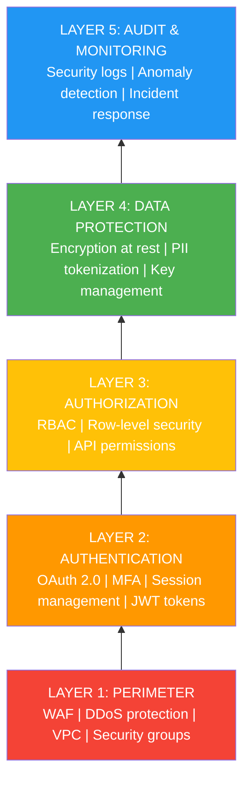

---

## Layer 1: Perimeter Security

### Web Application Firewall (WAF)

#### v1-v2: Cloud-Native WAF
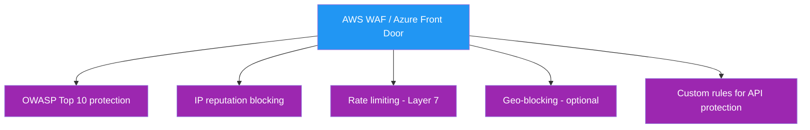

#### WAF Rule Sets

**Core Protection Rules:**
```yaml
rules:
  - name: SQLInjectionProtection
    priority: 1
    action: BLOCK
    conditions:
      - matchType: CONTAINS_SQL
        inspectFields: [QUERY_STRING, BODY, URI]

  - name: XSSProtection
    priority: 2
    action: BLOCK
    conditions:
      - matchType: XSS
        inspectFields: [QUERY_STRING, BODY, HEADER]

  - name: RateLimitAPI
    priority: 3
    action: RATE_LIMIT
    rateLimit:
      limit: 2000
      period: 300  # 5 minutes
      scope: IP

  - name: BlockBadBots
    priority: 4
    action: BLOCK
    conditions:
      - matchType: REGEX
        field: USER_AGENT
        pattern: "(bot|crawler|scraper)"

  - name: GeoRestriction
    priority: 5
    action: BLOCK
    conditions:
      - matchType: GEO
        countries: [CN, RU, KP]  # Example: high-risk countries
    enabled: false  # Optional, compliance-driven
```

**Custom API Protection:**
```yaml
  - name: AuthenticationRequired
    priority: 10
    action: BLOCK
    conditions:
      - path: /api/*
        header: Authorization
        exists: false

  - name: LargePayloadProtection
    priority: 11
    action: BLOCK
    conditions:
      - contentLength: "> 10MB"
        path: /api/*
```

### DDoS Protection

#### Multi-Layer Defense

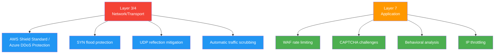

#### DDoS Response Plan

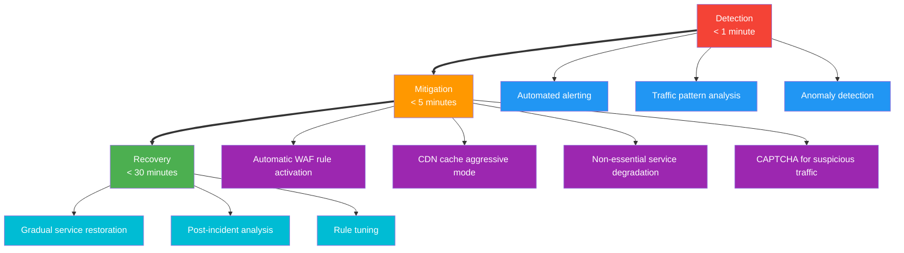

### Network Security

#### VPC Architecture (AWS Example)

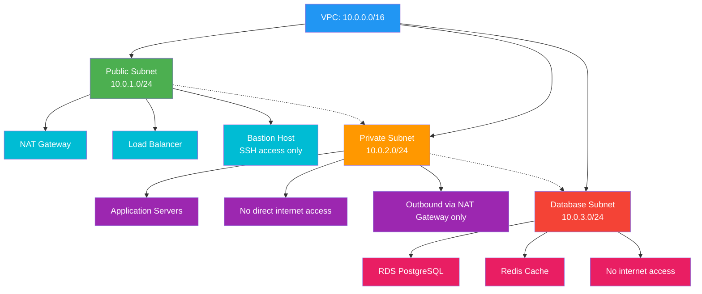

#### Security Groups

```yaml
# Load Balancer Security Group
LoadBalancerSG:
  inbound:
    - port: 443
      protocol: TCP
      source: 0.0.0.0/0
      description: HTTPS from internet
    - port: 80
      protocol: TCP
      source: 0.0.0.0/0
      description: HTTP (redirect to HTTPS)
  outbound:
    - port: 3000
      protocol: TCP
      destination: AppServerSG
      description: To application servers

# Application Server Security Group
AppServerSG:
  inbound:
    - port: 3000
      protocol: TCP
      source: LoadBalancerSG
      description: From load balancer only
    - port: 22
      protocol: TCP
      source: BastionSG
      description: SSH from bastion only
  outbound:
    - port: 5432
      protocol: TCP
      destination: DatabaseSG
      description: PostgreSQL
    - port: 6379
      protocol: TCP
      destination: RedisSG
      description: Redis
    - port: 443
      protocol: TCP
      destination: 0.0.0.0/0
      description: External API calls (HTTPS)

# Database Security Group
DatabaseSG:
  inbound:
    - port: 5432
      protocol: TCP
      source: AppServerSG
      description: From app servers only
  outbound:
    - None  # No outbound access needed
```

---

## Layer 2: Authentication

### OAuth 2.0 + OpenID Connect

#### Authentication Flow

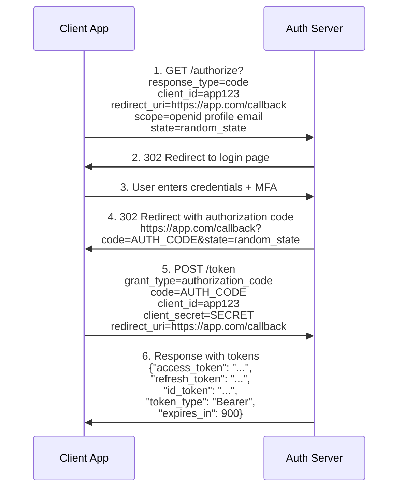

### Multi-Factor Authentication (MFA)

#### MFA Implementation Strategy

**v1:** Optional MFA (email-based)
**v2:** Mandatory MFA for admin accounts
**v3:** Mandatory MFA for all accounts
**v4:** Adaptive MFA based on risk

#### Supported MFA Methods

| Method | v1 | v2 | v3 | Security Level |
|--------|----|----|-----|----------------|
| Email OTP | ✅ | ✅ | ✅ | Low |
| SMS OTP | ❌ | ✅ | ✅ | Medium |
| TOTP (Google Authenticator) | ❌ | ✅ | ✅ | High |
| Push Notification | ❌ | ❌ | ✅ | High |
| Hardware Key (FIDO2/WebAuthn) | ❌ | ❌ | ✅ | Highest |
| Biometric | ❌ | ❌ | ✅ | High |

#### TOTP Implementation

```typescript
import * as speakeasy from 'speakeasy';
import * as qrcode from 'qrcode';

class MFAService {
  // Generate TOTP secret
  async generateTOTPSecret(userId: string): Promise<TOTPSetup> {
    const secret = speakeasy.generateSecret({
      name: 'PopSystem',
      issuer: 'PopSystem',
      length: 32
    });

    // Generate QR code
    const qrCodeUrl = await qrcode.toDataURL(secret.otpauth_url);

    // Store secret (encrypted)
    await this.storeTOTPSecret(userId, secret.base32);

    return {
      secret: secret.base32,
      qrCode: qrCodeUrl,
      backupCodes: await this.generateBackupCodes(userId)
    };
  }

  // Verify TOTP code
  async verifyTOTP(userId: string, token: string): Promise<boolean> {
    const secret = await this.getTOTPSecret(userId);

    const verified = speakeasy.totp.verify({
      secret: secret,
      encoding: 'base32',
      token: token,
      window: 2  // Allow 2 time steps before/after
    });

    if (verified) {
      // Log successful MFA
      await this.auditLog.log({
        userId,
        event: 'MFA_SUCCESS',
        method: 'TOTP'
      });
    } else {
      // Increment failed attempts
      await this.incrementFailedAttempts(userId);
    }

    return verified;
  }

  // Generate backup codes
  async generateBackupCodes(userId: string): Promise<string[]> {
    const codes = Array.from({ length: 10 }, () =>
      crypto.randomBytes(4).toString('hex').toUpperCase()
    );

    // Hash and store
    const hashed = codes.map(code =>
      crypto.createHash('sha256').update(code).digest('hex')
    );

    await this.storeBackupCodes(userId, hashed);

    return codes;  // Show to user once
  }
}
```

### Session Management

#### Session Security

```typescript
interface SessionConfig {
  accessToken: {
    expiresIn: '15m';           // Short-lived
    algorithm: 'RS256';         // Asymmetric
    issuer: 'auth.popsystem.com';
    audience: 'api.popsystem.com';
  };
  refreshToken: {
    expiresIn: '30d';           // Long-lived
    rotationEnabled: true;      // New token on refresh
    maxReuse: 0;                // Cannot reuse
    storage: 'database';        // Server-side storage
  };
  sessionTimeout: {
    inactivity: '30m';          // Auto-logout after inactivity
    absolute: '24h';            // Force re-auth after 24h
  };
}
```

#### Token Refresh Flow

```typescript
// Refresh token endpoint
app.post('/auth/refresh', async (req, res) => {
  const { refresh_token } = req.body;

  // Validate refresh token
  const session = await db.sessions.findOne({
    refreshToken: hash(refresh_token),
    expiresAt: { $gt: new Date() },
    revoked: false
  });

  if (!session) {
    return res.status(401).json({
      error: { code: 'INVALID_REFRESH_TOKEN' }
    });
  }

  // Check for token reuse (security breach indicator)
  if (session.used) {
    // Revoke all sessions for this user
    await this.revokeAllUserSessions(session.userId);

    await this.securityAlert.send({
      type: 'TOKEN_REUSE_DETECTED',
      userId: session.userId,
      ip: req.ip
    });

    return res.status(401).json({
      error: { code: 'TOKEN_REUSE_DETECTED' }
    });
  }

  // Mark old token as used
  await db.sessions.update(session.id, { used: true });

  // Generate new tokens
  const newAccessToken = await this.generateAccessToken(session.userId);
  const newRefreshToken = await this.generateRefreshToken(session.userId);

  res.json({
    access_token: newAccessToken,
    refresh_token: newRefreshToken,
    expires_in: 900
  });
});
```

---

## Layer 3: Authorization

### Role-Based Access Control (RBAC)

#### Role Hierarchy

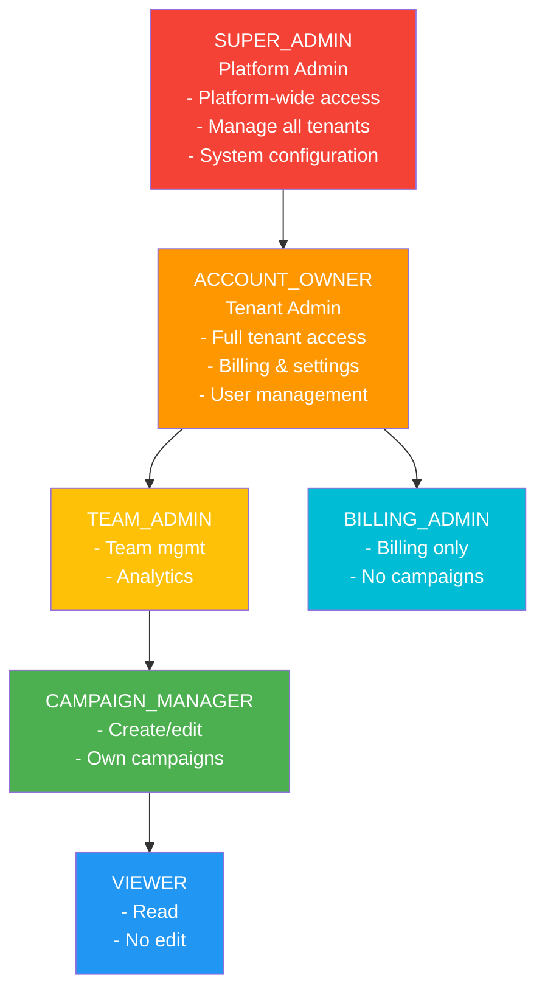

#### Permission Model

```typescript
// Permission format: resource:action:scope
type Permission = `${Resource}:${Action}:${Scope}`;

type Resource =
  | 'campaigns'
  | 'influencers'
  | 'analytics'
  | 'billing'
  | 'users'
  | 'settings';

type Action =
  | 'read'
  | 'write'
  | 'delete'
  | 'publish'
  | 'archive';

type Scope =
  | 'own'      // Own resources only
  | 'team'     // Team resources
  | 'all'      // All tenant resources
  | '*';       // Wildcard

// Role definitions
const ROLES = {
  VIEWER: {
    permissions: [
      'campaigns:read:own',
      'influencers:read:all',
      'analytics:read:own'
    ]
  },

  CAMPAIGN_MANAGER: {
    inherits: ['VIEWER'],
    permissions: [
      'campaigns:write:own',
      'campaigns:publish:own',
      'campaigns:archive:own',
      'influencers:write:all'
    ]
  },

  TEAM_ADMIN: {
    inherits: ['CAMPAIGN_MANAGER'],
    permissions: [
      'campaigns:*:team',
      'analytics:read:team',
      'users:read:team',
      'users:write:team'
    ]
  },

  ACCOUNT_OWNER: {
    inherits: ['TEAM_ADMIN'],
    permissions: [
      '*:*:all',  // All permissions
      'billing:*:own',
      'settings:*:own'
    ]
  }
};
```

#### Permission Checking

```typescript
class AuthorizationService {
  async checkPermission(
    userId: string,
    permission: Permission,
    context: RequestContext
  ): Promise<boolean> {
    // Get user roles
    const userRoles = await this.getUserRoles(userId, context.tenantId);

    // Expand inherited permissions
    const allPermissions = this.expandPermissions(userRoles);

    // Check permission
    if (this.hasPermission(allPermissions, permission)) {
      return true;
    }

    // Check scope-based permission
    if (permission.includes(':own')) {
      const resource = await this.getResource(context.resourceId);
      return resource.ownerId === userId;
    }

    if (permission.includes(':team')) {
      const userTeams = await this.getUserTeams(userId);
      const resource = await this.getResource(context.resourceId);
      return userTeams.includes(resource.teamId);
    }

    return false;
  }

  private hasPermission(
    userPermissions: Permission[],
    required: Permission
  ): boolean {
    return userPermissions.some(userPerm => {
      // Exact match
      if (userPerm === required) return true;

      // Wildcard match
      const [userRes, userAct, userScope] = userPerm.split(':');
      const [reqRes, reqAct, reqScope] = required.split(':');

      return (
        (userRes === '*' || userRes === reqRes) &&
        (userAct === '*' || userAct === reqAct) &&
        (userScope === '*' || userScope === reqScope)
      );
    });
  }
}
```

### Row-Level Security (RLS)

#### PostgreSQL RLS Implementation

```sql
-- Enable RLS on campaigns table
ALTER TABLE campaigns ENABLE ROW LEVEL SECURITY;

-- Policy: Users can only see campaigns from their tenant
CREATE POLICY tenant_isolation ON campaigns
  FOR ALL
  TO app_user
  USING (tenant_id = current_setting('app.current_tenant')::UUID);

-- Policy: Users can only modify their own campaigns
CREATE POLICY own_campaigns_modify ON campaigns
  FOR UPDATE
  TO app_user
  USING (
    tenant_id = current_setting('app.current_tenant')::UUID
    AND created_by = current_setting('app.current_user')::UUID
  );

-- Policy: Admins can see all tenant campaigns
CREATE POLICY admin_access ON campaigns
  FOR ALL
  TO app_user
  USING (
    tenant_id = current_setting('app.current_tenant')::UUID
    AND EXISTS (
      SELECT 1 FROM user_roles
      WHERE user_id = current_setting('app.current_user')::UUID
        AND role IN ('TEAM_ADMIN', 'ACCOUNT_OWNER')
    )
  );
```

#### Application-Level Context Setting

```typescript
// Set tenant context for database queries
async function setDatabaseContext(
  userId: string,
  tenantId: string
): Promise<void> {
  await db.raw(`
    SET LOCAL app.current_user = '${userId}';
    SET LOCAL app.current_tenant = '${tenantId}';
  `);
}

// Middleware to set context
app.use(async (req, res, next) => {
  if (req.user) {
    await setDatabaseContext(req.user.id, req.user.tenantId);
  }
  next();
});
```

---

## Layer 4: Data Protection

### Encryption at Rest

#### Database Encryption

```yaml
PostgreSQL (RDS):
  encryption: AES-256
  kms: AWS KMS / Azure Key Vault
  automated-backups: Encrypted
  snapshots: Encrypted
  performanceImpact: < 5%
```

#### Application-Level Encryption

```typescript
// Encrypt sensitive fields before storing
class EncryptionService {
  private algorithm = 'aes-256-gcm';

  async encrypt(plaintext: string, key: Buffer): Promise<EncryptedData> {
    const iv = crypto.randomBytes(16);
    const cipher = crypto.createCipheriv(this.algorithm, key, iv);

    let encrypted = cipher.update(plaintext, 'utf8', 'hex');
    encrypted += cipher.final('hex');

    const authTag = cipher.getAuthTag();

    return {
      ciphertext: encrypted,
      iv: iv.toString('hex'),
      authTag: authTag.toString('hex'),
      algorithm: this.algorithm
    };
  }

  async decrypt(data: EncryptedData, key: Buffer): Promise<string> {
    const decipher = crypto.createDecipheriv(
      this.algorithm,
      key,
      Buffer.from(data.iv, 'hex')
    );

    decipher.setAuthTag(Buffer.from(data.authTag, 'hex'));

    let decrypted = decipher.update(data.ciphertext, 'hex', 'utf8');
    decrypted += decipher.final('utf8');

    return decrypted;
  }
}

// Usage
const encrypted = await encryption.encrypt(
  user.ssn,
  await kms.getDataKey(tenantId)
);

await db.users.update(userId, {
  ssn_encrypted: encrypted.ciphertext,
  ssn_iv: encrypted.iv,
  ssn_auth_tag: encrypted.authTag
});
```

### Encryption in Transit

#### TLS Configuration

```nginx
# Nginx TLS configuration
server {
  listen 443 ssl http2;
  server_name api.popsystem.com;

  # TLS 1.3 only (with 1.2 fallback)
  ssl_protocols TLSv1.2 TLSv1.3;

  # Strong cipher suites
  ssl_ciphers 'ECDHE-ECDSA-AES128-GCM-SHA256:ECDHE-RSA-AES128-GCM-SHA256:ECDHE-ECDSA-AES256-GCM-SHA384:ECDHE-RSA-AES256-GCM-SHA384';
  ssl_prefer_server_ciphers on;

  # Certificates
  ssl_certificate /etc/nginx/certs/popsystem.crt;
  ssl_certificate_key /etc/nginx/certs/popsystem.key;

  # OCSP Stapling
  ssl_stapling on;
  ssl_stapling_verify on;

  # HSTS (force HTTPS)
  add_header Strict-Transport-Security "max-age=31536000; includeSubDomains; preload" always;

  # Security headers
  add_header X-Frame-Options "DENY" always;
  add_header X-Content-Type-Options "nosniff" always;
  add_header X-XSS-Protection "1; mode=block" always;
  add_header Referrer-Policy "strict-origin-when-cross-origin" always;
}
```

### PII Handling and Tokenization

#### PII Classification

| Data Type | Classification | Storage | Encryption | Tokenization |
|-----------|----------------|---------|------------|--------------|
| Name | PII | Encrypted | AES-256 | ❌ |
| Email | PII | Encrypted | AES-256 | ❌ |
| Phone | PII | Encrypted | AES-256 | ❌ |
| SSN/Tax ID | Sensitive PII | Encrypted | AES-256 | ✅ Required |
| Credit Card | PCI Data | Never stored | N/A | ✅ Required |
| IP Address | PII | Hashed | SHA-256 | ❌ |
| Biometric | Sensitive PII | Encrypted | AES-256 | ✅ Required |

#### Tokenization Service

```typescript
class TokenizationService {
  // Tokenize sensitive data (e.g., credit card)
  async tokenize(data: string, type: TokenType): Promise<string> {
    const token = `tok_${crypto.randomBytes(16).toString('hex')}`;

    // Store in vault (separate database)
    await this.vault.store({
      token,
      data: await this.encryption.encrypt(data),
      type,
      createdAt: new Date(),
      expiresAt: this.getExpiry(type)
    });

    return token;
  }

  // Detokenize to retrieve original data
  async detokenize(token: string): Promise<string> {
    const record = await this.vault.retrieve(token);

    if (!record || record.expiresAt < new Date()) {
      throw new Error('Invalid or expired token');
    }

    return await this.encryption.decrypt(record.data);
  }
}

// Usage
const cardToken = await tokenization.tokenize(
  creditCard,
  'CREDIT_CARD'
);

// Store only token in main database
await db.payments.create({
  userId,
  cardToken,  // Not the actual card number
  last4: creditCard.slice(-4)
});
```

### Key Management

#### Key Hierarchy

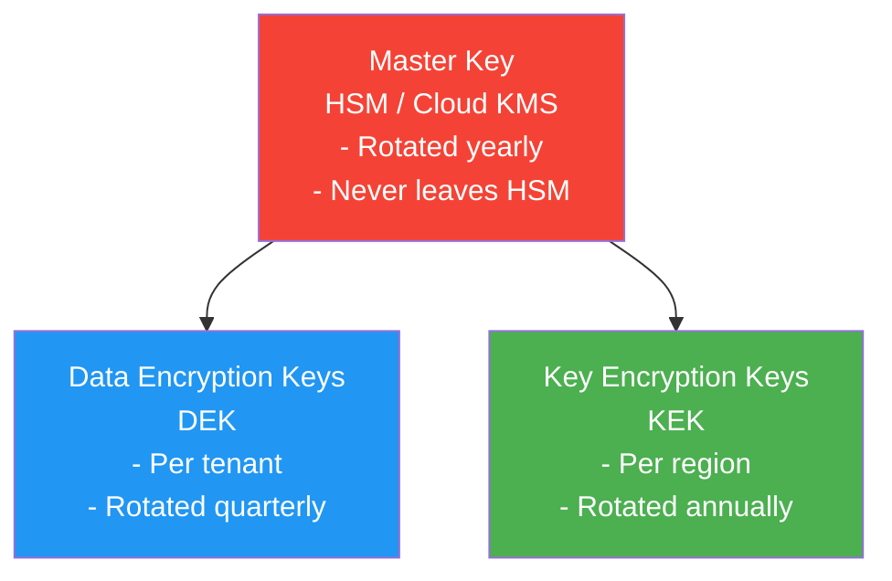

---

## Layer 5: Audit & Monitoring

### Audit Logging Strategy

#### Event Categories

```typescript
enum AuditEventCategory {
  AUTHENTICATION = 'auth',
  AUTHORIZATION = 'authz',
  DATA_ACCESS = 'data',
  DATA_MODIFICATION = 'data_mod',
  CONFIGURATION = 'config',
  SECURITY = 'security',
  ADMIN = 'admin'
}

interface AuditLog {
  id: string;
  timestamp: Date;
  tenantId: string;
  userId: string;
  category: AuditEventCategory;
  action: string;
  resource: {
    type: string;
    id: string;
  };
  changes?: {
    before: any;
    after: any;
  };
  metadata: {
    ip: string;
    userAgent: string;
    requestId: string;
    sessionId: string;
  };
  result: 'success' | 'failure';
  errorCode?: string;
}
```

#### Critical Events to Log

```typescript
const CRITICAL_EVENTS = [
  // Authentication
  'user.login.success',
  'user.login.failure',
  'user.logout',
  'user.mfa.enabled',
  'user.mfa.disabled',
  'user.password.changed',

  // Authorization
  'permission.denied',
  'role.assigned',
  'role.revoked',

  // Data Access
  'pii.accessed',
  'export.generated',
  'bulk.download',

  // Data Modification
  'user.created',
  'user.deleted',
  'campaign.published',
  'payment.processed',
  'settings.changed',

  // Security
  'mfa.bypass.attempted',
  'rate_limit.exceeded',
  'suspicious.activity.detected',
  'token.reuse.detected',

  // Admin
  'tenant.created',
  'tenant.suspended',
  'system.configuration.changed'
];
```

#### Audit Log Implementation

```typescript
class AuditLogger {
  async log(event: AuditLog): Promise<void> {
    // Write to database (queryable)
    await db.audit_logs.create(event);

    // Write to SIEM (security monitoring)
    await this.siem.send(event);

    // Alert on critical security events
    if (this.isCriticalSecurityEvent(event)) {
      await this.securityAlert.send({
        severity: 'HIGH',
        event,
        requiresInvestigation: true
      });
    }
  }

  private isCriticalSecurityEvent(event: AuditLog): boolean {
    return [
      'mfa.bypass.attempted',
      'token.reuse.detected',
      'permission.elevation.suspicious',
      'bulk.data.export',
      'user.login.bruteforce'
    ].includes(event.action);
  }
}
```

### Anomaly Detection

#### Behavioral Analysis

```typescript
class AnomalyDetector {
  async analyzeLoginAttempt(event: LoginEvent): Promise<RiskScore> {
    const factors = await Promise.all([
      this.checkGeolocation(event),
      this.checkDeviceFingerprint(event),
      this.checkVelocity(event),
      this.checkTimeOfDay(event),
      this.checkFailureHistory(event)
    ]);

    const riskScore = this.calculateRiskScore(factors);

    if (riskScore > 70) {
      // High risk - require additional verification
      return {
        score: riskScore,
        action: 'REQUIRE_MFA',
        reasons: factors.filter(f => f.risky)
      };
    }

    if (riskScore > 40) {
      // Medium risk - notify user
      return {
        score: riskScore,
        action: 'NOTIFY_USER',
        reasons: factors.filter(f => f.risky)
      };
    }

    return {
      score: riskScore,
      action: 'ALLOW',
      reasons: []
    };
  }

  private async checkGeolocation(event: LoginEvent): Promise<RiskFactor> {
    const previousLocations = await this.getUserLocations(event.userId);
    const currentLocation = await this.geoip.lookup(event.ip);

    const distance = this.calculateDistance(
      previousLocations[0],
      currentLocation
    );

    // Impossible travel (>500 mph)
    if (distance > 500 * this.hoursSinceLastLogin(event.userId)) {
      return {
        factor: 'geolocation',
        risky: true,
        score: 30,
        details: 'Impossible travel detected'
      };
    }

    return { factor: 'geolocation', risky: false, score: 0 };
  }
}
```

### Incident Response Plan

#### Incident Severity Levels

| Level | Description | Response Time | Escalation |
|-------|-------------|---------------|------------|
| **P0 - Critical** | Data breach, system compromise | Immediate | CEO, CTO, Legal |
| **P1 - High** | Service outage, auth failure | < 15 min | Engineering Lead |
| **P2 - Medium** | Performance degradation | < 1 hour | On-call engineer |
| **P3 - Low** | Minor bugs, UX issues | < 4 hours | Regular queue |

#### Incident Response Workflow

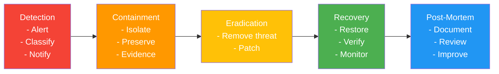

---

## Vulnerability Management

### Security Testing

```yaml
Testing Schedule:
  SAST (Static Analysis):
    frequency: Every commit
    tools: [SonarQube, Checkmarx]

  DAST (Dynamic Analysis):
    frequency: Weekly
    tools: [OWASP ZAP, Burp Suite]

  Dependency Scanning:
    frequency: Daily
    tools: [Snyk, npm audit, Dependabot]

  Penetration Testing:
    frequency: Quarterly
    type: External firm
    scope: Full application

  Bug Bounty Program:
    launch: v3
    platform: HackerOne / Bugcrowd
    scope: Production environment
```

### Patch Management

```mermaid
graph TD
    Critical["Critical Vulnerabilities<br>CVSS 9.0-10.0"]
    CritNotif["Notification: Immediate"]
    CritAssess["Assessment: < 4 hours"]
    CritPatch["Patch deployment: < 24 hours"]
    CritVerify["Verification: < 48 hours"]

    High["High Vulnerabilities<br>CVSS 7.0-8.9"]
    HighNotif["Notification: < 24 hours"]
    HighAssess["Assessment: < 48 hours"]
    HighPatch["Patch deployment: < 7 days"]
    HighVerify["Verification: < 10 days"]

    MedLow["Medium/Low"]
    MedNotif["Notification: Weekly digest"]
    MedPatch["Patch deployment: Next release cycle"]

    Critical --> CritNotif
    Critical --> CritAssess
    Critical --> CritPatch
    Critical --> CritVerify

    High --> HighNotif
    High --> HighAssess
    High --> HighPatch
    High --> HighVerify

    MedLow --> MedNotif
    MedLow --> MedPatch

    style Critical fill:#f44336,color:#fff
    style CritNotif fill:#e91e63,color:#fff
    style CritAssess fill:#e91e63,color:#fff
    style CritPatch fill:#e91e63,color:#fff
    style CritVerify fill:#e91e63,color:#fff
    style High fill:#ff9800,color:#fff
    style HighNotif fill:#ffc107,color:#fff
    style HighAssess fill:#ffc107,color:#fff
    style HighPatch fill:#ffc107,color:#fff
    style HighVerify fill:#ffc107,color:#fff
    style MedLow fill:#4caf50,color:#fff
    style MedNotif fill:#2196f3,color:#fff
    style MedPatch fill:#2196f3,color:#fff
```

---

## Compliance Certifications

### SOC 2 Type II (v3 Target)

#### Controls Required

```yaml
Security:
  - Access controls (RBAC)
  - Encryption (at rest and in transit)
  - Network security (firewalls, segmentation)
  - Vulnerability management
  - Incident response

Availability:
  - Uptime monitoring
  - Disaster recovery
  - Backup/restore procedures
  - Capacity planning

Processing Integrity:
  - Data validation
  - Error handling
  - Quality assurance

Confidentiality:
  - Data classification
  - NDA requirements
  - Secure disposal

Privacy:
  - Privacy policy
  - Data retention
  - User consent management
  - Data subject requests (GDPR)
```

### ISO 27001 (v4 Target)

```mermaid
graph TD
    ISO["ISO 27001<br>14 Domains"]

    D1["Information security policies"]
    D2["Organization of information security"]
    D3["Human resource security"]
    D4["Asset management"]
    D5["Access control"]
    D6["Cryptography"]
    D7["Physical security"]
    D8["Operations security"]
    D9["Communications security"]
    D10["System acquisition/development"]
    D11["Supplier relationships"]
    D12["Incident management"]
    D13["Business continuity"]
    D14["Compliance"]

    ISO --> D1
    ISO --> D2
    ISO --> D3
    ISO --> D4
    ISO --> D5
    ISO --> D6
    ISO --> D7
    ISO --> D8
    ISO --> D9
    ISO --> D10
    ISO --> D11
    ISO --> D12
    ISO --> D13
    ISO --> D14

    style ISO fill:#2196f3,color:#fff
    style D1 fill:#9c27b0,color:#fff
    style D2 fill:#9c27b0,color:#fff
    style D3 fill:#9c27b0,color:#fff
    style D4 fill:#9c27b0,color:#fff
    style D5 fill:#9c27b0,color:#fff
    style D6 fill:#9c27b0,color:#fff
    style D7 fill:#9c27b0,color:#fff
    style D8 fill:#9c27b0,color:#fff
    style D9 fill:#9c27b0,color:#fff
    style D10 fill:#9c27b0,color:#fff
    style D11 fill:#9c27b0,color:#fff
    style D12 fill:#9c27b0,color:#fff
    style D13 fill:#9c27b0,color:#fff
    style D14 fill:#9c27b0,color:#fff
```

---

## Security Metrics & KPIs

### Key Metrics

```typescript
const securityMetrics = {
  authentication: {
    mfaAdoptionRate: 'target: > 95%',
    passwordStrength: 'target: > 90% strong',
    failedLogins: 'threshold: < 5% of total'
  },

  vulnerabilities: {
    meanTimeToDetect: 'target: < 24 hours',
    meanTimeToPatch: 'critical: < 24h, high: < 7d',
    openVulnerabilities: 'critical: 0, high: < 5'
  },

  incidents: {
    meanTimeToRespond: 'target: < 15 min',
    meanTimeToResolve: 'target: < 4 hours',
    incidentsPerMonth: 'target: < 2'
  },

  compliance: {
    auditLogCompleteness: 'target: 100%',
    policyCompliance: 'target: > 98%',
    trainingCompletion: 'target: 100% annually'
  }
};
```

---

## Key Takeaways

1. **Defense in Depth:** Multiple overlapping security layers
2. **Zero Trust:** Verify everything, trust nothing
3. **Encryption Everywhere:** Data at rest, in transit, in use
4. **Audit Everything:** Comprehensive logging for compliance and forensics
5. **Automate Security:** SAST, DAST, dependency scanning in CI/CD
6. **Incident Readiness:** Plan and practice before incidents occur
7. **Compliance is Continuous:** Not a one-time certification

---

**Document Version:** 1.0
**Last Updated:** 2025-12-21
**Owner:** Security Team & CISO
**Review Cycle:** Quarterly
**Next Security Audit:** 2026-03-21
