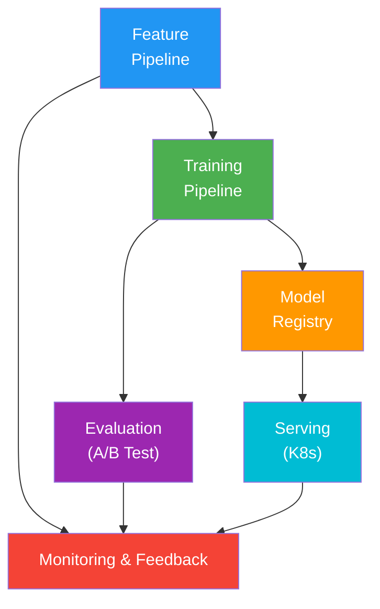
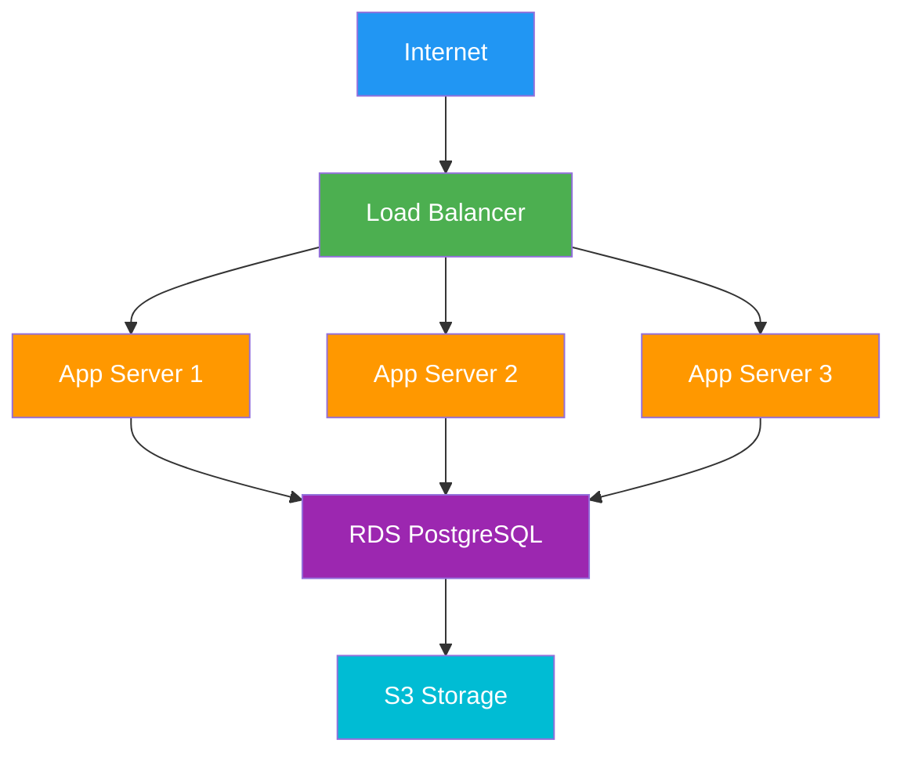
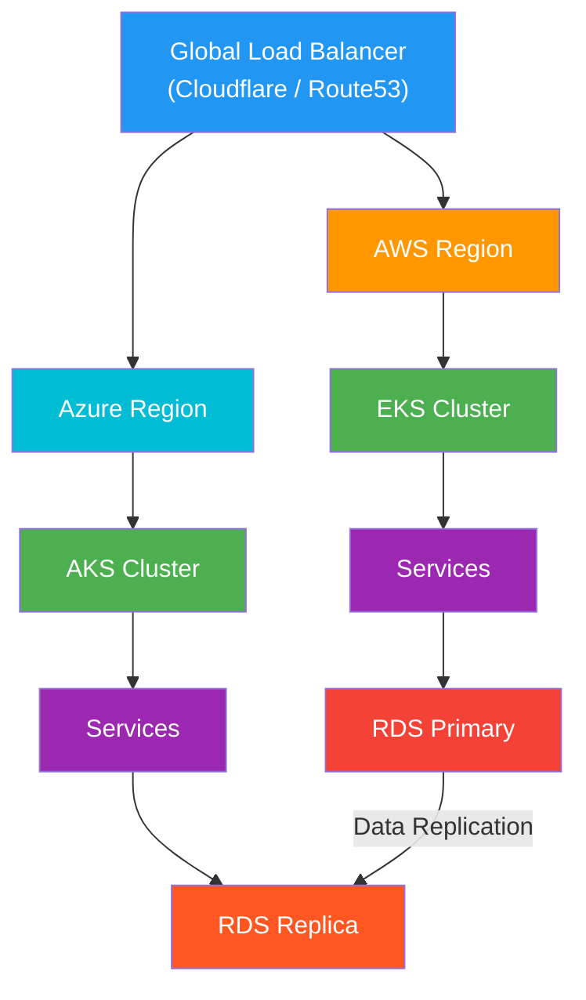
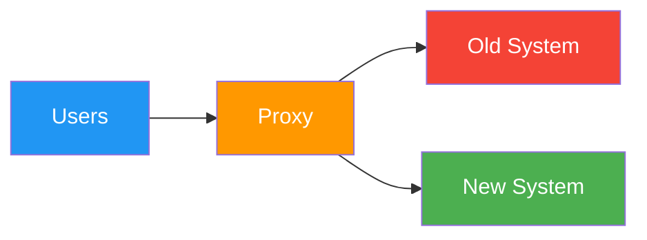

# Technology Stack Evolution

## Overview

This document outlines the technology progression for PopSystem from v1 (current state) through v4+, detailing the rationale for each technology choice, migration strategies, and decision-making frameworks for future technology adoption.

---

## Technology Stack Matrix

| Layer | v1 (Current) | v2-v3 | v4+ |
|-------|--------------|-------|-----|
| **Frontend** | React 18, TypeScript 5.x | + React Native, Next.js 14 | + Micro-frontends, Module Federation |
| **Backend** | Node.js 20 LTS, Express 4.x | + NestJS, Event Bus (RabbitMQ) | + GraphQL Federation, gRPC |
| **Database** | PostgreSQL 16 | + Redis 7.x (caching), Prisma ORM | + Read replicas, pgBouncer, TimescaleDB |
| **Storage** | AWS S3 / Azure Blob | + CloudFront CDN, Image optimization | + Multi-region replication, edge caching |
| **AI/ML** | OpenAI API, Claude API | + Internal ML services (Python/FastAPI) | + Custom models, MLOps pipeline |
| **Infrastructure** | Cloud VMs (EC2/Azure VM) | + Docker, Kubernetes (EKS/AKS) | + Multi-cloud, Terraform, GitOps |
| **Message Queue** | N/A | RabbitMQ / AWS SQS | Apache Kafka, Redis Streams |
| **Authentication** | JWT (custom) | Auth0 / Cognito | + Keycloak, OAuth 2.1, FIDO2 |
| **Monitoring** | CloudWatch / App Insights | + Prometheus, Grafana, Sentry | + OpenTelemetry, DataDog/New Relic |
| **CI/CD** | GitHub Actions | + ArgoCD, automated testing | + Progressive delivery, feature flags |
| **Search** | PostgreSQL full-text | Elasticsearch 8.x | + OpenSearch, vector search |
| **Analytics** | PostgreSQL queries | + ClickHouse / BigQuery | + Real-time analytics, data warehouse |

---

## Layer-by-Layer Evolution

### 1. Frontend Layer

#### v1 (Current State)

**Stack:**
```json
{
  "framework": "React 18.2",
  "language": "TypeScript 5.3",
  "build": "Vite 5.x",
  "state": "Zustand / React Query",
  "ui": "Tailwind CSS + shadcn/ui",
  "routing": "React Router 6"
}
```

**Rationale:**
- **React:** Largest ecosystem, best talent pool, component reusability
- **TypeScript:** Type safety reduces bugs, better IDE support, self-documenting
- **Vite:** Fast builds, modern tooling, better DX than Webpack
- **Zustand:** Lightweight state management, simpler than Redux
- **Tailwind:** Rapid UI development, consistent design system
- **React Query:** Declarative data fetching, automatic caching

**Architecture:**
```
/src
  /components
    /ui (shadcn components)
    /campaigns
    /analytics
    /influencers
  /hooks
  /lib
  /stores
  /types
```

#### v2-v3 (Mobile + SSR)

**Additions:**
```json
{
  "mobile": "React Native 0.74+",
  "ssr": "Next.js 14 (App Router)",
  "shared": "Monorepo (Turborepo)",
  "components": "Shared component library",
  "native": "Expo for React Native"
}
```

**Rationale:**
- **React Native:** Code sharing with web (60-70%), single team
- **Next.js:** SEO for public pages, better performance, React Server Components
- **Turborepo:** Efficient monorepo, shared code between web/mobile
- **Expo:** Faster RN development, OTA updates, managed workflow

**Monorepo Structure:**
```
/apps
  /web (Next.js)
  /mobile (React Native)
  /admin (React SPA)
/packages
  /ui (shared components)
  /api-client (generated SDK)
  /types (shared TypeScript types)
  /config (shared configs)
```

**Code Sharing Example:**
```typescript
// packages/ui/src/CampaignCard.tsx
// Works in web AND mobile with platform-specific styling
import { View, Text } from '@popsystem/ui/primitives';

export const CampaignCard = ({ campaign }) => (
  <View className="card">
    <Text className="title">{campaign.name}</Text>
  </View>
);
```

#### v4+ (Micro-frontends)

**Additions:**
```json
{
  "architecture": "Module Federation (Webpack 5)",
  "routing": "Single-SPA",
  "deployment": "Independent deployments per micro-frontend",
  "sharing": "Shared dependencies via Module Federation"
}
```

**Rationale:**
- **Module Federation:** Team autonomy, independent deployments
- **Single-SPA:** Mature framework for micro-frontend orchestration
- **Why v4?** Only needed at scale with multiple frontend teams

**Architecture:**
```
Shell App (Host)
├─ @popsystem/campaigns (Remote)
├─ @popsystem/analytics (Remote)
├─ @popsystem/marketplace (Remote)
└─ Shared: React, Router, Auth
```

---

### 2. Backend Layer

#### v1 (Current State)

**Stack:**
```json
{
  "runtime": "Node.js 20 LTS",
  "framework": "Express.js 4.x",
  "language": "TypeScript 5.x",
  "validation": "Zod",
  "database": "PostgreSQL with node-postgres",
  "testing": "Jest + Supertest"
}
```

**Rationale:**
- **Node.js:** JavaScript everywhere, large ecosystem, good for I/O
- **Express:** Battle-tested, minimal, flexible
- **TypeScript:** Same benefits as frontend
- **Zod:** Runtime + compile-time type safety, great error messages
- **PostgreSQL:** Reliable, feature-rich, JSON support, strong ACID

**API Structure:**
```
/src
  /modules
    /campaigns
      campaigns.controller.ts
      campaigns.service.ts
      campaigns.repository.ts
      campaigns.schema.ts
      campaigns.routes.ts
  /middleware
    auth.middleware.ts
    tenant.middleware.ts
    error.middleware.ts
  /shared
    database.ts
    logger.ts
```

**Example Endpoint:**
```typescript
// campaigns.controller.ts
export class CampaignsController {
  async createCampaign(req: Request, res: Response) {
    const data = createCampaignSchema.parse(req.body); // Zod validation
    const campaign = await this.service.create(data, req.context);
    res.status(201).json({ data: campaign });
  }
}
```

#### v2-v3 (Event-Driven + Structure)

**Additions:**
```json
{
  "framework": "NestJS 10+ (optional migration)",
  "events": "RabbitMQ / AWS SQS",
  "orm": "Prisma 5.x",
  "api-docs": "OpenAPI 3.0 (swagger-jsdoc)",
  "caching": "Redis 7.x",
  "jobs": "BullMQ"
}
```

**Rationale:**
- **NestJS:** Better structure at scale, built-in DI, decorators, testability
- **RabbitMQ:** Proven message broker, easier than Kafka for moderate scale
- **Prisma:** Type-safe ORM, migrations, better DX than raw SQL
- **Redis:** Caching, session storage, rate limiting
- **BullMQ:** Reliable job queue, built on Redis, good UI

**Event-Driven Example:**
```typescript
// Campaign published → trigger multiple actions
@Injectable()
export class CampaignService {
  constructor(private eventBus: EventBus) {}

  async publish(id: string) {
    const campaign = await this.repo.publish(id);

    // Emit event instead of direct calls
    await this.eventBus.publish('campaign.published', {
      campaignId: campaign.id,
      tenantId: campaign.tenantId,
      publishedAt: new Date()
    });

    return campaign;
  }
}

// Other services listen
@EventHandler('campaign.published')
async handleCampaignPublished(event: CampaignPublishedEvent) {
  // Send notifications
  // Update analytics
  // Notify influencers
}
```

**Migration Strategy:**
- **Phase 1:** Add NestJS alongside Express (proxy pattern)
- **Phase 2:** Move modules one by one
- **Phase 3:** Deprecate Express
- **Timeline:** 6-9 months

#### v4+ (Microservices + Advanced)

**Additions:**
```json
{
  "api-gateway": "GraphQL Federation (Apollo)",
  "microservices": "Python (ML), Go (high-performance)",
  "rpc": "gRPC for service-to-service",
  "streaming": "Apache Kafka",
  "service-mesh": "Istio / Linkerd"
}
```

**Rationale:**
- **GraphQL Federation:** Unified API across microservices
- **Python:** Best ML ecosystem (PyTorch, TensorFlow, scikit-learn)
- **Go:** High-performance services (real-time processing)
- **gRPC:** Efficient binary protocol for internal communication
- **Kafka:** Event streaming at scale, event sourcing
- **Service Mesh:** Observability, security, traffic management

**Microservices Architecture:**
```
API Gateway (GraphQL Federation)
├─ Campaign Service (Node.js/NestJS)
├─ ML Service (Python/FastAPI)
│  ├─ Content scoring
│  ├─ Influencer matching
│  └─ Predictive analytics
├─ Analytics Service (Go)
│  └─ Real-time metrics processing
├─ Payment Service (Node.js)
│  └─ PCI-DSS isolated
└─ Notification Service (Node.js)
   └─ Email, SMS, Push
```

**GraphQL Federation Example:**
```typescript
// Campaign Service
@ObjectType()
export class Campaign {
  @Field() id: string;
  @Field() name: string;

  // Reference to Analytics Service
  @Field(() => CampaignAnalytics)
  analytics(@Parent() campaign: Campaign) {
    return { __typename: 'CampaignAnalytics', campaignId: campaign.id };
  }
}

// Analytics Service
@ObjectType()
export class CampaignAnalytics {
  @Field() campaignId: string;

  @ResolveReference()
  resolveReference(ref: { campaignId: string }) {
    return this.service.getAnalytics(ref.campaignId);
  }
}
```

---

### 3. Database Layer

#### v1 (Current State)

**Stack:**
```json
{
  "primary": "PostgreSQL 16",
  "version": "PostgreSQL 16.1",
  "extensions": ["uuid-ossp", "pg_trgm", "pg_stat_statements"],
  "connection": "node-postgres (pg)",
  "pooling": "Built-in pool (max 20 connections)"
}
```

**Schema Design:**
```sql
-- Multi-tenant with row-level security
CREATE TABLE campaigns (
  id UUID PRIMARY KEY DEFAULT uuid_generate_v4(),
  tenant_id UUID NOT NULL REFERENCES tenants(id),
  name VARCHAR(255) NOT NULL,
  status VARCHAR(50) NOT NULL,
  created_at TIMESTAMPTZ DEFAULT NOW(),
  updated_at TIMESTAMPTZ DEFAULT NOW()
);

CREATE INDEX idx_campaigns_tenant ON campaigns(tenant_id);
CREATE INDEX idx_campaigns_status ON campaigns(status) WHERE status = 'ACTIVE';

-- Row-Level Security
ALTER TABLE campaigns ENABLE ROW LEVEL SECURITY;

CREATE POLICY tenant_isolation ON campaigns
  USING (tenant_id = current_setting('app.current_tenant')::UUID);
```

**Rationale:**
- **PostgreSQL 16:** Latest features (MERGE, JSON improvements)
- **UUID:** Distributed system friendly, no collisions
- **Indexes:** Tenant isolation critical for query performance
- **RLS:** Defense in depth for multi-tenancy

#### v2-v3 (Caching + ORM)

**Additions:**
```json
{
  "orm": "Prisma 5.x",
  "cache": "Redis 7.x",
  "pooling": "PgBouncer (transaction mode)",
  "migration": "Prisma Migrate",
  "backup": "Automated daily backups + PITR"
}
```

**Prisma Schema:**
```prisma
model Campaign {
  id        String   @id @default(uuid())
  tenantId  String   @map("tenant_id")
  name      String
  status    String
  createdAt DateTime @default(now()) @map("created_at")
  updatedAt DateTime @updatedAt @map("updated_at")

  tenant Tenant @relation(fields: [tenantId], references: [id])
  posts  Post[]

  @@index([tenantId])
  @@index([status])
  @@map("campaigns")
}
```

**Caching Strategy:**
```typescript
// Cache-aside pattern
async getCampaign(id: string, tenantId: string): Promise<Campaign> {
  const cacheKey = `campaign:${tenantId}:${id}`;

  // Check cache
  const cached = await redis.get(cacheKey);
  if (cached) return JSON.parse(cached);

  // Database query
  const campaign = await prisma.campaign.findUnique({
    where: { id, tenantId }
  });

  // Set cache (TTL: 5 minutes)
  await redis.setex(cacheKey, 300, JSON.stringify(campaign));

  return campaign;
}
```

**PgBouncer Configuration:**
```ini
[databases]
popsystem = host=db.internal port=5432 dbname=popsystem

[pgbouncer]
pool_mode = transaction
max_client_conn = 1000
default_pool_size = 25
reserve_pool_size = 5
```

**Rationale:**
- **Prisma:** Type-safe queries, automatic migrations, great DX
- **Redis:** 10-100x faster than DB for hot data
- **PgBouncer:** Connection pooling essential at scale (PG max: 100-200 connections)

#### v4+ (Distributed Database)

**Additions:**
```json
{
  "read-replicas": "3+ replicas for read scaling",
  "sharding": "Tenant-based sharding via Citus",
  "timeseries": "TimescaleDB for analytics data",
  "search": "PostgreSQL + pg_vector for embeddings",
  "analytics-db": "ClickHouse / BigQuery (separate)"
}
```

**Read Replica Routing:**
```typescript
// Write to primary
await prisma.$primary.campaign.create({ data });

// Read from replica
await prisma.$replica.campaign.findMany({ where: { tenantId } });
```

**Sharding Strategy:**
```sql
-- Citus extension for distributed PostgreSQL
SELECT create_distributed_table('campaigns', 'tenant_id');

-- Queries automatically routed to correct shard
SELECT * FROM campaigns WHERE tenant_id = 'abc123';
```

**TimescaleDB for Metrics:**
```sql
CREATE TABLE campaign_metrics (
  time TIMESTAMPTZ NOT NULL,
  campaign_id UUID NOT NULL,
  tenant_id UUID NOT NULL,
  impressions BIGINT,
  clicks BIGINT,
  conversions BIGINT
);

-- Convert to hypertable
SELECT create_hypertable('campaign_metrics', 'time');

-- Automatic partitioning by time
-- Compression after 7 days
SELECT add_compression_policy('campaign_metrics', INTERVAL '7 days');
```

**Rationale:**
- **Read Replicas:** 80% of queries are reads, scale independently
- **Citus:** Horizontal scaling while keeping PostgreSQL benefits
- **TimescaleDB:** Time-series optimized, 10x better than vanilla PG for analytics
- **ClickHouse:** Column-store for complex analytical queries

---

### 4. Storage Layer

#### v1 (Current State)

**Stack:**
```json
{
  "object-storage": "AWS S3 / Azure Blob Storage",
  "structure": "Tenant-based prefixes",
  "access": "Pre-signed URLs (15-minute expiry)",
  "upload": "Direct-to-S3 with presigned POST"
}
```

**Storage Structure:**
```
s3://popsystem-prod/
  tenants/
    {tenant-id}/
      campaigns/
        {campaign-id}/
          images/
            original/
            thumbnails/
          videos/
          documents/
```

**Upload Flow:**
```typescript
// Generate presigned URL
async getUploadUrl(tenantId: string, fileName: string) {
  const key = `tenants/${tenantId}/campaigns/${uuid()}/${fileName}`;

  const url = await s3.getSignedUrlPromise('putObject', {
    Bucket: 'popsystem-prod',
    Key: key,
    Expires: 900, // 15 minutes
    ContentType: 'image/jpeg'
  });

  return { uploadUrl: url, fileKey: key };
}
```

**Rationale:**
- **S3/Blob:** Industry standard, 99.999999999% durability
- **Presigned URLs:** Secure, no server bandwidth, faster uploads
- **Tenant prefixes:** Isolation, easier management

#### v2-v3 (CDN + Optimization)

**Additions:**
```json
{
  "cdn": "CloudFront / Azure CDN",
  "image-processing": "Sharp / Imgix",
  "optimization": "WebP conversion, responsive images",
  "video": "AWS MediaConvert / Azure Media Services"
}
```

**CDN Configuration:**
```typescript
// CloudFront distribution
{
  origins: [{
    domainName: 'popsystem-prod.s3.amazonaws.com',
    originPath: '/tenants',
    customHeaders: [{
      headerName: 'x-source',
      headerValue: 'cdn'
    }]
  }],
  cacheBehaviors: [{
    pathPattern: '/*/images/*',
    minTTL: 86400, // 1 day
    maxTTL: 31536000, // 1 year
    compress: true
  }]
}
```

**Image Optimization:**
```typescript
// On-the-fly image transformation
app.get('/media/:tenantId/images/:id', async (req, res) => {
  const { width, format = 'webp' } = req.query;

  const image = await s3.getObject({ Key: originalKey }).promise();

  const optimized = await sharp(image.Body)
    .resize(parseInt(width))
    .toFormat(format)
    .toBuffer();

  res.set('Content-Type', `image/${format}`);
  res.set('Cache-Control', 'public, max-age=31536000');
  res.send(optimized);
});
```

**Rationale:**
- **CDN:** 10-50x faster delivery, reduced S3 costs
- **WebP:** 25-35% smaller than JPEG, supported by 95%+ browsers
- **MediaConvert:** Professional video processing, adaptive bitrates

#### v4+ (Multi-Region + Edge)

**Additions:**
```json
{
  "replication": "Multi-region S3 replication",
  "edge": "Lambda@Edge / Cloudflare Workers",
  "video-cdn": "Specialized video CDN (Cloudflare Stream)",
  "ai-processing": "AWS Rekognition / Azure Vision"
}
```

**Multi-Region Architecture:**
```
Primary Region (US-East)
├─ S3 Bucket (primary)
├─ Automatic replication →
└─ CloudFront (global distribution)

Secondary Region (EU-West)
├─ S3 Bucket (replica)
└─ Read access for EU users

APAC Region
├─ S3 Bucket (replica)
└─ Read access for APAC users
```

**Edge Processing:**
```typescript
// Cloudflare Worker at edge
export default {
  async fetch(request: Request): Promise<Response> {
    const url = new URL(request.url);
    const width = url.searchParams.get('w');

    // Transform images at edge (lowest latency)
    return fetch(request, {
      cf: {
        image: {
          width: parseInt(width),
          format: 'auto', // WebP/AVIF based on browser
          quality: 85
        }
      }
    });
  }
};
```

---

### 5. AI/ML Layer

#### v1 (Current State)

**Stack:**
```json
{
  "providers": ["OpenAI GPT-4", "Anthropic Claude", "OpenAI DALL-E"],
  "use-cases": [
    "Campaign content generation",
    "Caption writing",
    "Image generation",
    "Content moderation"
  ],
  "implementation": "Direct API calls"
}
```

**Example Integration:**
```typescript
async generateCampaignCopy(brief: string): Promise<string> {
  const response = await openai.chat.completions.create({
    model: 'gpt-4',
    messages: [{
      role: 'system',
      content: 'You are a marketing copywriter...'
    }, {
      role: 'user',
      content: brief
    }],
    temperature: 0.7,
    max_tokens: 500
  });

  return response.choices[0].message.content;
}
```

**Rationale:**
- **Third-party APIs:** Fastest time to market, best models
- **No ML expertise required:** Focus on product features
- **Cost:** Pay-per-use, no infrastructure

#### v2-v3 (Internal ML Services)

**Additions:**
```json
{
  "ml-service": "Python 3.11 + FastAPI",
  "models": [
    "Fine-tuned content scoring",
    "Influencer-brand matching",
    "Predictive engagement metrics",
    "Content moderation (NSFW detection)"
  ],
  "infrastructure": "GPU instances (T4/V100)",
  "mlops": "MLflow for experiment tracking"
}
```

**ML Service Architecture:**
```python
# FastAPI service
from fastapi import FastAPI
from transformers import pipeline

app = FastAPI()

# Load model at startup
classifier = pipeline(
    'text-classification',
    model='./models/content-scorer-v1',
    device=0  # GPU
)

@app.post('/score-content')
async def score_content(text: str):
    result = classifier(text)[0]
    return {
        'score': result['score'],
        'label': result['label'],
        'model_version': 'v1.2.3'
    }
```

**Model Training Pipeline:**
```
Data Collection → Labeling → Training → Evaluation → Deployment
      ↓              ↓          ↓           ↓            ↓
  PostgreSQL    Label Studio  PyTorch   MLflow    Kubernetes
```

**Rationale:**
- **Custom models:** Better performance for specific use cases
- **Data ownership:** Train on proprietary data
- **Cost:** Lower long-term costs at scale (vs. API)
- **Control:** Fine-tuning, versioning, A/B testing

#### v4+ (Advanced ML Platform)

**Additions:**
```json
{
  "custom-models": "Fully custom transformer models",
  "infrastructure": "Kubernetes + KubeFlow",
  "serving": "Triton Inference Server / TorchServe",
  "mlops": "Full MLOps pipeline (CI/CD for models)",
  "features": [
    "Real-time recommendation engine",
    "Computer vision for content analysis",
    "NLP for sentiment and trend analysis",
    "Predictive churn modeling"
  ]
}
```

**MLOps Pipeline:**


**Advanced Features:**
```python
# Real-time recommendation engine
class RecommendationEngine:
    def __init__(self):
        self.model = load_model('influencer-matcher-v2')
        self.embedding_cache = RedisEmbeddingCache()

    async def recommend_influencers(
        self,
        campaign_id: str,
        top_k: int = 10
    ) -> List[Influencer]:
        # Get campaign embedding
        campaign_embedding = await self.get_campaign_embedding(campaign_id)

        # Vector similarity search
        similar_influencers = await self.vector_search(
            campaign_embedding,
            top_k=top_k * 2  # Get more for filtering
        )

        # Re-rank with ML model
        scores = self.model.predict([
            (campaign, influencer)
            for influencer in similar_influencers
        ])

        return sorted(
            zip(similar_influencers, scores),
            key=lambda x: x[1],
            reverse=True
        )[:top_k]
```

---

### 6. Infrastructure Layer

#### v1 (Current State)

**Stack:**
```json
{
  "compute": "AWS EC2 / Azure VMs",
  "load-balancer": "ALB / Azure Load Balancer",
  "database": "RDS PostgreSQL / Azure Database",
  "storage": "S3 / Blob Storage",
  "iac": "Manual + CloudFormation/ARM templates",
  "deployment": "GitHub Actions → SSH deploy"
}
```

**Simple Architecture:**


**Rationale:**
- **VMs:** Simple, familiar, low operational complexity
- **Managed database:** No DB admin expertise needed
- **Quick to deploy:** Minimal DevOps overhead

#### v2-v3 (Containerization)

**Additions:**
```json
{
  "containers": "Docker",
  "orchestration": "Kubernetes (EKS/AKS)",
  "service-mesh": "Optional: Istio lite",
  "iac": "Terraform",
  "gitops": "ArgoCD",
  "secrets": "HashiCorp Vault / AWS Secrets Manager"
}
```

**Kubernetes Architecture:**
```yaml
# Campaign service deployment
apiVersion: apps/v1
kind: Deployment
metadata:
  name: campaign-service
spec:
  replicas: 3
  selector:
    matchLabels:
      app: campaign-service
  template:
    spec:
      containers:
      - name: app
        image: popsystem/campaign-service:v2.3.1
        resources:
          requests:
            memory: "512Mi"
            cpu: "500m"
          limits:
            memory: "1Gi"
            cpu: "1000m"
        env:
        - name: DATABASE_URL
          valueFrom:
            secretKeyRef:
              name: db-credentials
              key: url
---
apiVersion: autoscaling/v2
kind: HorizontalPodAutoscaler
metadata:
  name: campaign-service-hpa
spec:
  scaleTargetRef:
    apiVersion: apps/v1
    kind: Deployment
    name: campaign-service
  minReplicas: 3
  maxReplicas: 10
  metrics:
  - type: Resource
    resource:
      name: cpu
      target:
        type: Utilization
        averageUtilization: 70
```

**GitOps Workflow:**
```
1. Developer commits code
2. CI builds Docker image
3. CI updates Kubernetes manifests in Git
4. ArgoCD detects change
5. ArgoCD applies to cluster
6. Automatic rollback on failure
```

**Rationale:**
- **Kubernetes:** Industry standard, horizontal scaling, self-healing
- **Terraform:** Infrastructure as code, version controlled
- **ArgoCD:** Declarative deployments, easy rollbacks

#### v4+ (Multi-Cloud + Advanced)

**Additions:**
```json
{
  "multi-cloud": "Primary: AWS, Secondary: Azure/GCP",
  "service-mesh": "Istio for traffic management",
  "edge": "Cloudflare Workers for edge compute",
  "observability": "Full OpenTelemetry stack",
  "disaster-recovery": "Multi-region active-active",
  "iac": "Terraform + Crossplane for K8s-native IaC"
}
```

**Multi-Cloud Architecture:**


**Service Mesh Benefits:**
```yaml
# Automatic retries, circuit breaking
apiVersion: networking.istio.io/v1alpha3
kind: DestinationRule
metadata:
  name: campaign-service
spec:
  host: campaign-service
  trafficPolicy:
    connectionPool:
      http:
        http1MaxPendingRequests: 100
        maxRequestsPerConnection: 2
    outlierDetection:
      consecutive5xxErrors: 5
      interval: 30s
      baseEjectionTime: 30s
```

---

## Technology Decision Framework

### When to Adopt New Technology

Use this scorecard (need 15+ points):

| Criteria | Points |
|----------|--------|
| Solves current pain point | 5 |
| Team has expertise | 3 |
| Active community/support | 3 |
| Production-ready (1.0+) | 3 |
| Cost-effective | 2 |
| Migration path exists | 2 |
| Reduces complexity | 2 |
| Improves performance | 2 |
| Security benefits | 2 |
| Compliance requirements | 2 |

### When to Avoid New Technology

Red flags:
- No clear problem it solves
- Requires complete rewrite
- Limited adoption (<1000 GitHub stars)
- No commercial support available
- Experimental/alpha stage
- Team would need extensive training
- Vendor lock-in without benefits

---

## Migration Strategies

### 1. Strangler Fig Pattern
Gradually replace old system:


### 2. Feature Flags
Toggle new technology:
```typescript
if (featureFlags.useNewCache) {
  return await redisCache.get(key);
} else {
  return await inMemoryCache.get(key);
}
```

### 3. Parallel Running
Run both, compare results:
```typescript
const [oldResult, newResult] = await Promise.all([
  oldService.process(data),
  newService.process(data)
]);

// Compare and log differences
comparator.check(oldResult, newResult);

// Return old result (safe)
return oldResult;
```

---

## Key Takeaways

1. **Progressive Enhancement:** Each version builds on the previous
2. **Boring Technology:** Prefer proven tech over bleeding edge
3. **Polyglot When Needed:** Different tools for different jobs (Node.js, Python, Go)
4. **Managed Services First:** Reduce operational burden (RDS, Redis, etc.)
5. **Measure Before Optimizing:** Don't adopt technology for hypothetical problems

---

**Document Version:** 1.0
**Last Updated:** 2025-12-21
**Owner:** Engineering Leadership & Architecture Team
**Review Cycle:** Semi-annual
