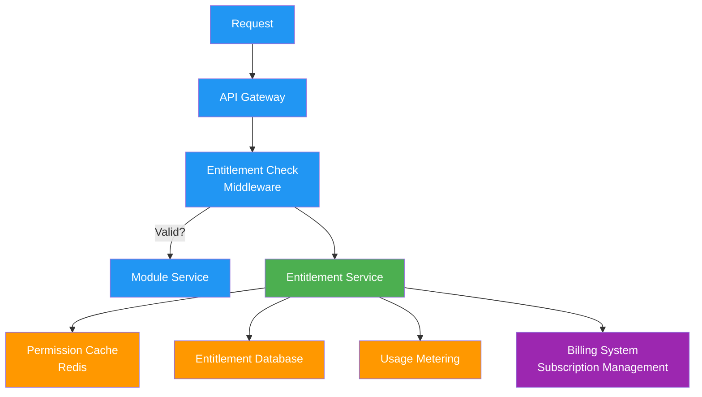
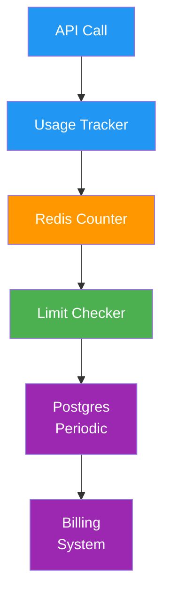

# Entitlement Service
**Technical Specification for Module Access Control**

## Overview
The Entitlement Service is the central authorization system that controls access to PopSystem modules and features. It provides real-time validation of tenant permissions, usage tracking, and integration with billing systems.

---

## Architecture Overview

### High-Level Flow


---

## Data Model

### Core Entities

#### Entitlement
```typescript
interface Entitlement {
  id: string;
  tenantId: string;
  moduleId: string;
  moduleName: string;
  tier: TierType;
  status: EntitlementStatus;

  // Activation
  activatedAt: datetime;
  expiresAt: datetime | null;
  autoRenew: boolean;

  // Limits
  limits: UsageLimit[];

  // Billing
  subscriptionId: string;
  billingCycle: BillingCycle;

  // Metadata
  createdAt: datetime;
  updatedAt: datetime;
  activatedBy: string;
  notes: string;
}

enum EntitlementStatus {
  ACTIVE = 'active',
  SUSPENDED = 'suspended',
  EXPIRED = 'expired',
  TRIAL = 'trial',
  CANCELLED = 'cancelled'
}

enum TierType {
  BASE = 'base',
  ADDON = 'addon',
  PREMIUM = 'premium',
  ENTERPRISE = 'enterprise'
}

enum BillingCycle {
  MONTHLY = 'monthly',
  QUARTERLY = 'quarterly',
  ANNUAL = 'annual',
  CUSTOM = 'custom'
}
```

#### Usage Limit
```typescript
interface UsageLimit {
  id: string;
  entitlementId: string;
  limitType: LimitType;

  // Quota
  maxValue: number | null; // null = unlimited
  currentValue: number;
  resetPeriod: ResetPeriod;
  lastResetAt: datetime;

  // Behavior
  enforceLimit: boolean;
  notifyThreshold: number; // percentage (e.g., 80)
  notifyEmails: string[];

  // Metadata
  createdAt: datetime;
  updatedAt: datetime;
}

enum LimitType {
  API_CALLS = 'api_calls',
  STORAGE_GB = 'storage_gb',
  USERS = 'users',
  LOCATIONS = 'locations',
  CAMPAIGNS = 'campaigns',
  ASSETS = 'assets',
  WORKFLOWS = 'workflows',
  ORDERS_PER_MONTH = 'orders_per_month',
  CUSTOM = 'custom'
}

enum ResetPeriod {
  HOURLY = 'hourly',
  DAILY = 'daily',
  MONTHLY = 'monthly',
  NEVER = 'never'
}
```

#### Feature Flag
```typescript
interface FeatureFlag {
  id: string;
  moduleId: string;
  featureName: string;
  description: string;

  // Access Control
  requiredTier: TierType;
  betaOnly: boolean;

  // Rollout
  enabledFor: EnablementRule[];
  rolloutPercentage: number; // 0-100

  // Status
  isActive: boolean;

  // Metadata
  createdAt: datetime;
  updatedAt: datetime;
}

interface EnablementRule {
  type: RuleType;
  values: string[];
  operator: 'IN' | 'NOT_IN';
}

enum RuleType {
  TENANT_ID = 'tenant_id',
  TIER = 'tier',
  BETA_PROGRAM = 'beta_program',
  ACCOUNT_AGE_DAYS = 'account_age_days',
  CUSTOM_ATTRIBUTE = 'custom_attribute'
}
```

#### Tenant-Module Mapping
```typescript
interface TenantModule {
  tenantId: string;
  modules: ModuleEntitlement[];

  // Account Info
  accountTier: AccountTier;
  billingStatus: BillingStatus;

  // Metadata
  createdAt: datetime;
  updatedAt: datetime;
}

interface ModuleEntitlement {
  moduleId: string;
  moduleName: string;
  entitlementId: string;
  features: string[]; // Enabled feature IDs
  limits: { [key: string]: number };
  metadata: { [key: string]: any };
}

enum AccountTier {
  FREE = 'free',
  STARTER = 'starter',
  PROFESSIONAL = 'professional',
  ENTERPRISE = 'enterprise'
}

enum BillingStatus {
  GOOD_STANDING = 'good_standing',
  PAST_DUE = 'past_due',
  SUSPENDED = 'suspended',
  CANCELLED = 'cancelled'
}
```

---

## API Specification

### Entitlement Queries

#### Check Module Access
```http
GET /api/v1/entitlements/check
Authorization: Bearer {token}

Query Parameters:
- tenant_id: string (required)
- module_id: string (required)
- feature_name: string (optional)

Response 200:
{
  "allowed": true,
  "entitlementId": "ent_abc123",
  "tier": "professional",
  "expiresAt": "2026-12-31T23:59:59Z",
  "limits": {
    "api_calls": {
      "max": 100000,
      "current": 45231,
      "remaining": 54769,
      "resetAt": "2026-01-01T00:00:00Z"
    },
    "storage_gb": {
      "max": 500,
      "current": 287.4,
      "remaining": 212.6,
      "resetAt": null
    }
  },
  "features": {
    "advanced_analytics": true,
    "api_access": true,
    "custom_branding": false
  }
}

Response 403:
{
  "allowed": false,
  "reason": "MODULE_NOT_ENTITLED",
  "message": "Your account does not have access to the AI - Data module",
  "upgradeUrl": "https://app.popsystem.com/billing/upgrade?module=ai-data"
}
```

#### Get Tenant Entitlements
```http
GET /api/v1/entitlements/tenant/{tenant_id}
Authorization: Bearer {token}

Response 200:
{
  "tenantId": "tenant_xyz789",
  "accountTier": "professional",
  "billingStatus": "good_standing",
  "entitlements": [
    {
      "moduleId": "core",
      "moduleName": "Core Platform",
      "status": "active",
      "tier": "base",
      "activatedAt": "2024-01-15T10:00:00Z",
      "expiresAt": null,
      "features": ["sso", "api_access", "custom_reports"],
      "limits": {
        "users": 50,
        "locations": 100,
        "api_calls": 100000
      }
    },
    {
      "moduleId": "dam",
      "moduleName": "Digital Asset Management",
      "status": "active",
      "tier": "addon",
      "activatedAt": "2024-03-01T10:00:00Z",
      "expiresAt": "2025-03-01T10:00:00Z",
      "features": ["version_control", "ai_tagging"],
      "limits": {
        "storage_gb": 500,
        "assets": 50000
      }
    }
  ]
}
```

#### Validate Feature Access
```http
POST /api/v1/entitlements/validate-feature
Authorization: Bearer {token}
Content-Type: application/json

Request Body:
{
  "tenantId": "tenant_xyz789",
  "moduleId": "designer",
  "featureName": "custom_fonts"
}

Response 200:
{
  "allowed": true,
  "featureName": "custom_fonts",
  "requiredTier": "professional",
  "tenantTier": "enterprise"
}

Response 403:
{
  "allowed": false,
  "featureName": "custom_fonts",
  "requiredTier": "professional",
  "tenantTier": "starter",
  "upgradeRequired": true
}
```

### Entitlement Management

#### Activate Module
```http
POST /api/v1/entitlements
Authorization: Bearer {token}
Content-Type: application/json

Request Body:
{
  "tenantId": "tenant_xyz789",
  "moduleId": "workflow",
  "tier": "addon",
  "billingCycle": "monthly",
  "limits": [
    {
      "limitType": "workflows",
      "maxValue": 50,
      "enforceLimit": true
    },
    {
      "limitType": "api_calls",
      "maxValue": 50000,
      "resetPeriod": "monthly",
      "enforceLimit": true
    }
  ],
  "autoRenew": true
}

Response 201:
{
  "entitlementId": "ent_new456",
  "status": "active",
  "activatedAt": "2025-12-21T10:30:00Z",
  "message": "Workflow module activated successfully"
}
```

#### Deactivate Module
```http
DELETE /api/v1/entitlements/{entitlement_id}
Authorization: Bearer {token}

Query Parameters:
- immediate: boolean (default: false)
- preserve_data: boolean (default: true)

Response 200:
{
  "entitlementId": "ent_abc123",
  "status": "cancelled",
  "deactivatedAt": "2025-12-21T10:35:00Z",
  "dataPreservedUntil": "2026-01-21T10:35:00Z",
  "message": "Module will be deactivated at the end of current billing cycle"
}
```

#### Update Limits
```http
PATCH /api/v1/entitlements/{entitlement_id}/limits
Authorization: Bearer {token}
Content-Type: application/json

Request Body:
{
  "limits": [
    {
      "limitType": "api_calls",
      "maxValue": 200000
    },
    {
      "limitType": "storage_gb",
      "maxValue": 1000
    }
  ]
}

Response 200:
{
  "entitlementId": "ent_abc123",
  "updatedLimits": [
    {
      "limitType": "api_calls",
      "previousMax": 100000,
      "newMax": 200000,
      "currentValue": 45231
    },
    {
      "limitType": "storage_gb",
      "previousMax": 500,
      "newMax": 1000,
      "currentValue": 287.4
    }
  ],
  "effectiveAt": "2025-12-21T10:40:00Z"
}
```

### Usage Tracking

#### Record Usage
```http
POST /api/v1/entitlements/usage
Authorization: Bearer {service_token}
Content-Type: application/json

Request Body:
{
  "tenantId": "tenant_xyz789",
  "moduleId": "dam",
  "metricType": "storage_gb",
  "value": 1.5,
  "operation": "increment",
  "metadata": {
    "assetId": "asset_123",
    "uploadedBy": "user_456"
  }
}

Response 200:
{
  "recorded": true,
  "currentValue": 288.9,
  "maxValue": 500,
  "remainingPercentage": 42.22,
  "warningTriggered": false
}

Response 429 (Limit Exceeded):
{
  "recorded": false,
  "limitExceeded": true,
  "metricType": "storage_gb",
  "currentValue": 500,
  "maxValue": 500,
  "message": "Storage limit exceeded. Please upgrade your plan.",
  "upgradeUrl": "https://app.popsystem.com/billing/upgrade"
}
```

#### Get Usage Report
```http
GET /api/v1/entitlements/{entitlement_id}/usage
Authorization: Bearer {token}

Query Parameters:
- period: string (hour|day|month) (default: month)
- metric_type: string (optional)

Response 200:
{
  "entitlementId": "ent_abc123",
  "period": "month",
  "startDate": "2025-12-01T00:00:00Z",
  "endDate": "2025-12-31T23:59:59Z",
  "metrics": [
    {
      "metricType": "api_calls",
      "currentValue": 45231,
      "maxValue": 100000,
      "utilizationPercentage": 45.23,
      "trend": "up",
      "projectedEndOfPeriod": 67000
    },
    {
      "metricType": "storage_gb",
      "currentValue": 288.9,
      "maxValue": 500,
      "utilizationPercentage": 57.78,
      "trend": "stable"
    }
  ]
}
```

---

## Feature Flag System

### Implementation

#### Feature Flag Evaluation
```typescript
class FeatureFlagService {
  async isEnabled(
    tenantId: string,
    moduleId: string,
    featureName: string
  ): Promise<boolean> {
    // 1. Get feature flag configuration
    const flag = await this.getFeatureFlag(moduleId, featureName);

    if (!flag || !flag.isActive) {
      return false;
    }

    // 2. Check tier requirement
    const entitlement = await this.getEntitlement(tenantId, moduleId);
    if (!this.meetsRequiredTier(entitlement.tier, flag.requiredTier)) {
      return false;
    }

    // 3. Check enablement rules
    const rulesMatch = await this.evaluateRules(tenantId, flag.enabledFor);
    if (!rulesMatch) {
      return false;
    }

    // 4. Check rollout percentage
    if (flag.rolloutPercentage < 100) {
      const tenantHash = this.hashTenant(tenantId, featureName);
      if (tenantHash > flag.rolloutPercentage) {
        return false;
      }
    }

    return true;
  }

  private hashTenant(tenantId: string, featureName: string): number {
    // Consistent hashing for gradual rollout
    const hash = crypto
      .createHash('md5')
      .update(`${tenantId}:${featureName}`)
      .digest('hex');
    return parseInt(hash.substring(0, 8), 16) % 100;
  }
}
```

### API Endpoints

#### Create Feature Flag
```http
POST /api/v1/feature-flags
Authorization: Bearer {admin_token}
Content-Type: application/json

Request Body:
{
  "moduleId": "designer",
  "featureName": "ai_layout_suggestions",
  "description": "AI-powered layout suggestions in template designer",
  "requiredTier": "professional",
  "rolloutPercentage": 10,
  "enabledFor": [
    {
      "type": "beta_program",
      "values": ["early_adopters"],
      "operator": "IN"
    }
  ],
  "isActive": true
}

Response 201:
{
  "featureFlagId": "ff_789xyz",
  "featureName": "ai_layout_suggestions",
  "status": "active",
  "affectedTenants": 47
}
```

#### Update Rollout Percentage
```http
PATCH /api/v1/feature-flags/{flag_id}/rollout
Authorization: Bearer {admin_token}
Content-Type: application/json

Request Body:
{
  "rolloutPercentage": 50
}

Response 200:
{
  "featureFlagId": "ff_789xyz",
  "previousRollout": 10,
  "newRollout": 50,
  "additionalTenants": 235,
  "totalAffectedTenants": 282
}
```

---

## Caching Strategy

### Redis Cache Structure

#### Cache Keys
```
entitlement:{tenant_id}:{module_id}
feature_flag:{module_id}:{feature_name}
usage_limit:{entitlement_id}:{metric_type}
tenant_modules:{tenant_id}
```

#### Cache Implementation
```typescript
class EntitlementCache {
  private redis: RedisClient;
  private defaultTTL = 300; // 5 minutes

  async checkAccess(
    tenantId: string,
    moduleId: string
  ): Promise<EntitlementCheckResult | null> {
    const cacheKey = `entitlement:${tenantId}:${moduleId}`;
    const cached = await this.redis.get(cacheKey);

    if (cached) {
      return JSON.parse(cached);
    }

    return null;
  }

  async setAccess(
    tenantId: string,
    moduleId: string,
    result: EntitlementCheckResult
  ): Promise<void> {
    const cacheKey = `entitlement:${tenantId}:${moduleId}`;
    await this.redis.setex(
      cacheKey,
      this.defaultTTL,
      JSON.stringify(result)
    );
  }

  async invalidate(tenantId: string, moduleId?: string): Promise<void> {
    if (moduleId) {
      await this.redis.del(`entitlement:${tenantId}:${moduleId}`);
    } else {
      // Invalidate all modules for tenant
      const pattern = `entitlement:${tenantId}:*`;
      const keys = await this.redis.keys(pattern);
      if (keys.length > 0) {
        await this.redis.del(...keys);
      }
    }
  }
}
```

### Cache Invalidation Events
- Entitlement activated/deactivated
- Limits updated
- Subscription status changed
- Feature flag toggled
- Module upgraded/downgraded

---

## Real-Time Entitlement Checks

### Middleware Implementation

```typescript
// Express middleware example
async function entitlementMiddleware(
  req: Request,
  res: Response,
  next: NextFunction
) {
  const tenantId = req.user.tenantId;
  const moduleId = req.path.split('/')[3]; // Extract from route

  try {
    // 1. Check cache first
    let result = await cache.checkAccess(tenantId, moduleId);

    // 2. Cache miss - query service
    if (!result) {
      result = await entitlementService.checkAccess(tenantId, moduleId);
      await cache.setAccess(tenantId, moduleId, result);
    }

    // 3. Validate access
    if (!result.allowed) {
      return res.status(403).json({
        error: 'ACCESS_DENIED',
        message: result.message,
        upgradeUrl: result.upgradeUrl
      });
    }

    // 4. Attach entitlement info to request
    req.entitlement = result;

    next();
  } catch (error) {
    // Fail open or closed based on configuration
    if (config.failOpen) {
      console.error('Entitlement check failed, allowing access', error);
      next();
    } else {
      res.status(503).json({
        error: 'SERVICE_UNAVAILABLE',
        message: 'Unable to verify access at this time'
      });
    }
  }
}
```

### Route Protection
```typescript
// Apply to specific routes
app.use('/api/v1/dam/*',
  authenticate,
  entitlementMiddleware,
  damRoutes
);

// Feature-level protection
app.post('/api/v1/designer/templates',
  authenticate,
  entitlementMiddleware,
  requireFeature('custom_templates'),
  createTemplate
);
```

---

## Usage Metering

### Real-Time Metering Pipeline



### Implementation
```typescript
class UsageMeter {
  async recordUsage(
    tenantId: string,
    moduleId: string,
    metricType: LimitType,
    value: number
  ): Promise<UsageResult> {
    // 1. Get entitlement and limits
    const entitlement = await this.getEntitlement(tenantId, moduleId);
    const limit = entitlement.limits.find(l => l.limitType === metricType);

    if (!limit) {
      throw new Error(`No limit configured for ${metricType}`);
    }

    // 2. Increment Redis counter
    const cacheKey = `usage:${entitlement.id}:${metricType}`;
    const newValue = await this.redis.incrByFloat(cacheKey, value);

    // 3. Check against limit
    if (limit.enforceLimit && limit.maxValue && newValue > limit.maxValue) {
      // Rollback increment
      await this.redis.incrByFloat(cacheKey, -value);

      throw new UsageLimitExceededError(
        metricType,
        newValue,
        limit.maxValue
      );
    }

    // 4. Check notification threshold
    if (limit.maxValue && limit.notifyThreshold) {
      const percentage = (newValue / limit.maxValue) * 100;
      if (percentage >= limit.notifyThreshold) {
        await this.sendThresholdNotification(entitlement, limit, percentage);
      }
    }

    // 5. Persist asynchronously (every 5 minutes or on threshold)
    await this.queuePersistence(entitlement.id, metricType, newValue);

    return {
      currentValue: newValue,
      maxValue: limit.maxValue,
      remaining: limit.maxValue ? limit.maxValue - newValue : null
    };
  }
}
```

---

## Billing Integration

### Subscription Sync

#### Webhook from Billing System
```http
POST /api/v1/entitlements/webhooks/billing
Content-Type: application/json
X-Signature: {hmac_signature}

Request Body:
{
  "event": "subscription.updated",
  "timestamp": "2025-12-21T10:45:00Z",
  "data": {
    "subscriptionId": "sub_abc123",
    "tenantId": "tenant_xyz789",
    "modules": [
      {
        "moduleId": "dam",
        "status": "active",
        "limits": {
          "storage_gb": 1000,
          "assets": 100000
        }
      }
    ],
    "billingStatus": "good_standing",
    "nextBillingDate": "2026-01-21T00:00:00Z"
  }
}

Response 200:
{
  "processed": true,
  "entitlementsUpdated": 1
}
```

### Billing Events Handled
- `subscription.created` - Activate new entitlements
- `subscription.updated` - Update limits/features
- `subscription.cancelled` - Schedule deactivation
- `invoice.payment_failed` - Suspend access
- `invoice.payment_succeeded` - Restore access

---

## Security Considerations

### Access Control
- Entitlement checks require valid authentication token
- Service-to-service calls use dedicated service tokens
- Admin operations require elevated privileges
- All API calls are rate-limited

### Audit Logging
```typescript
interface EntitlementAuditLog {
  id: string;
  tenantId: string;
  action: EntitlementAction;
  actorId: string;
  actorType: 'user' | 'system' | 'admin';
  moduleId: string;
  changes: object;
  ipAddress: string;
  timestamp: datetime;
}

enum EntitlementAction {
  ACTIVATED = 'activated',
  DEACTIVATED = 'deactivated',
  LIMITS_UPDATED = 'limits_updated',
  FEATURE_ENABLED = 'feature_enabled',
  FEATURE_DISABLED = 'feature_disabled',
  ACCESS_DENIED = 'access_denied',
  LIMIT_EXCEEDED = 'limit_exceeded'
}
```

### Data Privacy
- Tenant entitlements are isolated per tenant
- Usage metrics are aggregated for billing
- PII is not stored in entitlement records
- All data encrypted at rest and in transit

---

## Performance Requirements

### SLAs
- **Entitlement Check Latency**: < 50ms (p95)
- **Cache Hit Rate**: > 95%
- **API Availability**: 99.9%
- **Usage Recording**: < 10ms (async)

### Scalability
- Horizontal scaling of API servers
- Redis cluster for cache
- Database read replicas
- Event-driven architecture for usage persistence

---

## Monitoring and Alerting

### Key Metrics
- Entitlement check success rate
- Cache hit/miss ratio
- Usage limit violations
- API response times
- Billing sync errors

### Alerts
- Critical: Entitlement service down
- High: Cache unavailable (failover to database)
- Medium: Billing sync delayed > 5 minutes
- Low: Usage approaching 80% of limit

---

**Document Version**: 1.0
**Last Updated**: December 2025
**Maintained By**: Platform Engineering Team
**Review Cycle**: Monthly
