# Module Dependencies
**Dependency Mapping and Architecture for PopSystem Platform**

## Overview
This document provides comprehensive mapping of module dependencies, communication patterns, and architectural guidelines for the PopSystem platform. Understanding these dependencies is critical for system design, deployment planning, and troubleshooting.

---

## Dependency Philosophy

### Core Principles
1. **Loose Coupling**: Modules should be independent where possible
2. **Clear Interfaces**: Well-defined APIs between modules
3. **Graceful Degradation**: Modules function with reduced capability if dependencies unavailable
4. **Explicit Dependencies**: All dependencies documented and versioned
5. **No Circular Dependencies**: Strict prevention of circular dependency chains
6. **Version Compatibility**: Clear compatibility requirements between module versions

### Dependency Categories

#### Hard Dependencies (Required)
- Module cannot function without the dependency
- Dependency must be activated and healthy
- Failure of dependency causes module failure
- Example: Designer requires DAM

#### Soft Dependencies (Recommended)
- Module has reduced functionality without the dependency
- Graceful degradation when dependency unavailable
- Core features still operational
- Example: Proofing recommends DAM

#### Optional Dependencies (Enhanced)
- Module gains additional features with dependency
- Fully functional without dependency
- Integration provides bonus capabilities
- Example: AI-Image enhances Designer

#### Integration Dependencies (Connected)
- Modules work together for specific workflows
- Neither requires the other for core functionality
- Connected via shared data or events
- Example: Workflow + any module

---

## Core vs Optional Modules

### Module Classification

#### Core Platform (Required)
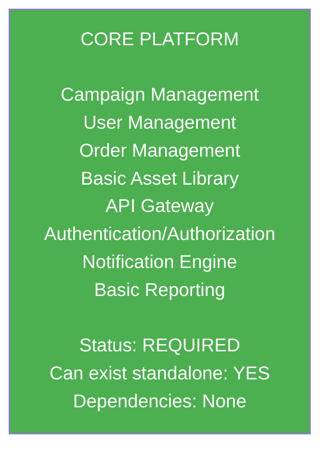

#### Tier 1 Add-ons (Standalone)

Modules that require only Core Platform:

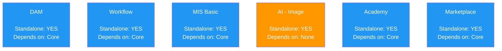

#### Tier 2 Add-ons (Dependent)

Modules that require other add-ons:

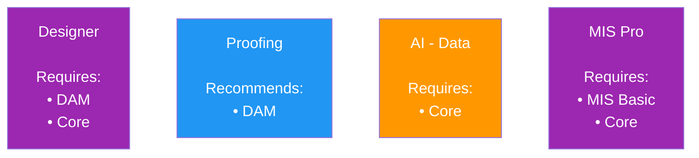

#### Universal Add-ons (Cross-Cutting)
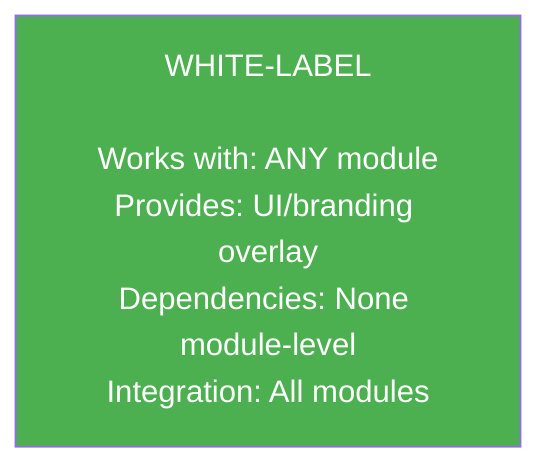

---

## Dependency Matrix

### Complete Module Dependency Table

| Module | Hard Dependencies | Soft Dependencies | Optional Enhancements | Version Requirements |
|--------|------------------|-------------------|----------------------|---------------------|
| **Core Platform** | None | None | All modules | - |
| **DAM** | None | None | AI-Image, Designer | Core v2.0+ |
| **AI - Data** | Core | DAM, MIS | Workflow | Core v2.1+ |
| **AI - Image** | None | DAM | Designer, Proofing | - |
| **Designer** | DAM, Core | AI-Image | Proofing, Workflow | Core v2.0+, DAM v2.0+ |
| **Proofing** | Core | DAM | Designer, Workflow | Core v2.0+ |
| **Workflow** | Core | None | All modules | Core v2.1+ |
| **MIS Basic** | Core | None | AI-Data | Core v2.0+ |
| **MIS Pro** | MIS Basic, Core | AI-Data | Workflow | Core v2.1+, MIS Basic v2.0+ |
| **Academy** | Core | None | Marketplace | Core v2.0+ |
| **Marketplace** | Core | Academy | Workflow | Core v2.0+ |
| **White-Label** | None | None | All modules | Core v2.0+ |

### Visual Dependency Map

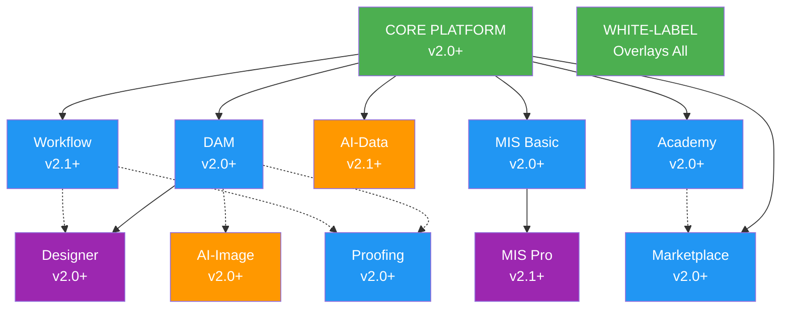

**Legend:**
- Solid line (→) = Hard Dependency (required)
- Dashed line (-.→) = Soft Dependency (recommended)

### Detailed Dependency Descriptions

#### Core Platform Dependencies
```
Core Platform:
  Hard: None
  Soft: None
  Optional: All modules

  Provides to others:
  • User authentication/authorization
  • Tenant management
  • API gateway
  • Event bus
  • Notification service
  • Basic asset storage
  • Campaign orchestration
```

#### DAM Dependencies
```
DAM (Digital Asset Management):
  Hard: None (fully standalone)
  Soft: None
  Optional:
    • AI-Image → Enhanced asset processing
    • Designer → Template asset source
    • Proofing → Asset approval workflows

  Provides to others:
  • Centralized asset repository
  • Asset metadata management
  • Version control
  • CDN-optimized delivery
  • Advanced search capabilities
  • Usage rights management
```

#### Designer Dependencies
```
Designer:
  Hard:
    • DAM → Asset library (required)
    • Core → User/tenant management

  Soft:
    • AI-Image → Auto-enhancement

  Optional:
    • Proofing → Design approvals
    • Workflow → Automated design generation

  Provides to others:
  • Template creation
  • Variable data design
  • Print-ready output
```

#### AI Modules Dependencies
```
AI - Data:
  Hard:
    • Core → Data source

  Soft:
    • DAM → Asset analytics
    • MIS → Financial analytics

  Optional:
    • Workflow → Insight-driven automation

  Provides to others:
  • Predictive analytics
  • Performance insights
  • Recommendations

AI - Image:
  Hard: None (processes any images)

  Soft:
    • DAM → Asset input/output

  Optional:
    • Designer → Enhanced editing
    • Proofing → Quality validation

  Provides to others:
  • Background removal
  • AI upscaling
  • Smart cropping
  • Quality assessment
```

#### MIS Dependencies
```
MIS Basic:
  Hard:
    • Core → Order data

  Soft: None

  Optional:
    • AI-Data → Financial insights

  Provides to others:
  • Job costing
  • Purchase orders
  • Invoicing

MIS Pro:
  Hard:
    • MIS Basic → Base functionality
    • Core → Platform services

  Soft:
    • AI-Data → Advanced analytics

  Optional:
    • Workflow → Production automation

  Provides to others:
  • Full ERP capabilities
  • Production scheduling
  • Multi-location inventory
  • GL integration
```

#### Workflow Dependencies
```
Workflow:
  Hard:
    • Core → Event system

  Soft: None

  Optional: All modules (for automation)

  Provides to others:
  • Automation engine
  • Event-driven processes
  • Integration orchestration
  • Custom business logic
```

#### Academy & Marketplace Dependencies
```
Academy:
  Hard:
    • Core → User management

  Soft: None

  Optional:
    • Marketplace → Installer certification

  Provides to others:
  • Training content
  • Certification tracking
  • User onboarding

Marketplace:
  Hard:
    • Core → Platform services

  Soft:
    • Academy → Installer certification

  Optional:
    • Workflow → Automated matching

  Provides to others:
  • Installer directory
  • Job matching
  • Quote management
```

#### White-Label Dependencies
```
White-Label:
  Hard: None

  Soft: None

  Optional: All modules (applies branding)

  Provides to others:
  • Custom branding
  • Domain configuration
  • Theme customization
  • Brand management
```

---

## API Dependencies Between Modules

### Inter-Module API Communication

#### API Dependency Graph

**Core Platform APIs:**
- /api/v1/auth → Used by: ALL modules
- /api/v1/users → Used by: ALL modules
- /api/v1/tenants → Used by: ALL modules
- /api/v1/campaigns → Used by: Designer, DAM, AI-Data, MIS
- /api/v1/orders → Used by: MIS Basic, MIS Pro, AI-Data
- /api/v1/notifications → Used by: ALL modules

**DAM APIs:**
- /api/v1/dam/assets → Used by: Designer, AI-Image, Proofing
- /api/v1/dam/collections → Used by: Designer, Core
- /api/v1/dam/search → Used by: Designer, Core, AI-Image
- /api/v1/dam/analytics → Used by: AI-Data

**Designer APIs:**
- /api/v1/designer/templates → Used by: Core, Workflow
- /api/v1/designer/export → Used by: Core, Proofing
- /api/v1/designer/preview → Used by: Proofing

**AI-Image APIs:**
- /api/v1/ai/image/enhance → Used by: DAM, Designer
- /api/v1/ai/image/upscale → Used by: DAM, Designer
- /api/v1/ai/image/quality → Used by: Proofing

**AI-Data APIs:**
- /api/v1/ai/analytics → Used by: Core, MIS Pro
- /api/v1/ai/recommendations → Used by: Core, MIS
- /api/v1/ai/forecasts → Used by: MIS Pro

**Proofing APIs:**
- /api/v1/proofing/proofs → Used by: Designer, DAM
- /api/v1/proofing/approve → Used by: Workflow
- /api/v1/proofing/workflows → Used by: Core

**Workflow APIs:**
- /api/v1/workflow/execute → Used by: ALL modules
- /api/v1/workflow/trigger → Used by: ALL modules
- /api/v1/workflow/webhooks → Used by: External systems

**MIS APIs:**
- /api/v1/mis/jobs → Used by: Core, AI-Data
- /api/v1/mis/invoices → Used by: Core
- /api/v1/mis-pro/schedule → Used by: Workflow, AI-Data

**Academy APIs:**
- /api/v1/academy/courses → Used by: Core, Marketplace
- /api/v1/academy/certs → Used by: Marketplace

**Marketplace APIs:**
- /api/v1/marketplace/installers → Used by: Core
- /api/v1/marketplace/quotes → Used by: MIS Basic
- /api/v1/marketplace/reviews → Used by: Academy

**White-Label APIs:**
- /api/v1/white-label/config → Used by: ALL modules
- /api/v1/white-label/themes → Used by: ALL modules

### API Contract Examples

#### Core to DAM Integration
```typescript
// Core Platform calls DAM to retrieve campaign assets
interface CampaignAssetRequest {
  campaignId: string;
  assetTypes?: string[];
  includeMetadata?: boolean;
}

// Core → DAM
const assets = await damClient.getAssets({
  campaignId: 'camp_123',
  assetTypes: ['image', 'video'],
  includeMetadata: true
});

// DAM Response
interface AssetResponse {
  assets: Asset[];
  total: number;
  hasMore: boolean;
}

// Dependency contract:
// - DAM must expose /api/v1/dam/assets/by-campaign endpoint
// - Core must handle DAM unavailability (graceful degradation)
// - Response format versioned and backward compatible
```

#### Designer to DAM Integration
```typescript
// Designer retrieves assets for template editing
interface DesignerAssetRequest {
  tenantId: string;
  search?: string;
  filters?: {
    fileType?: string[];
    tags?: string[];
    collections?: string[];
  };
  pagination: {
    page: number;
    pageSize: number;
  };
}

// Designer → DAM
const assetLibrary = await damClient.searchAssets({
  tenantId: 'tenant_456',
  filters: {
    fileType: ['image/png', 'image/jpeg'],
    tags: ['logo', 'brand']
  },
  pagination: { page: 1, pageSize: 50 }
});

// Dependency contract:
// - Designer REQUIRES DAM to be active
// - DAM must provide real-time search
// - Designer must handle search timeouts (fallback to cached results)
```

#### Workflow to Any Module Integration
```typescript
// Workflow triggers actions across modules
interface WorkflowAction {
  module: string;
  endpoint: string;
  method: 'GET' | 'POST' | 'PUT' | 'DELETE';
  payload: any;
  retryPolicy: {
    maxRetries: number;
    backoffMs: number;
  };
}

// Workflow → Designer (example)
const action: WorkflowAction = {
  module: 'designer',
  endpoint: '/api/v1/designer/templates/generate',
  method: 'POST',
  payload: {
    campaignId: 'camp_789',
    templateId: 'template_abc',
    variables: { location: 'New York', date: '2025-12-25' }
  },
  retryPolicy: {
    maxRetries: 3,
    backoffMs: 1000
  }
};

await workflowEngine.executeAction(action);

// Dependency contract:
// - All modules must expose documented API endpoints
// - Modules must support idempotent operations (safe retries)
// - Modules return standardized error responses
```

---

## Database Schema Dependencies

### Shared Data Models

#### Tenant Reference
```sql
-- Core Platform owns tenant data
CREATE TABLE tenants (
  id VARCHAR(50) PRIMARY KEY,
  name VARCHAR(255) NOT NULL,
  status VARCHAR(20) NOT NULL,
  created_at TIMESTAMP NOT NULL,
  updated_at TIMESTAMP NOT NULL
);

-- All modules reference tenant
-- DAM
CREATE TABLE dam_assets (
  id VARCHAR(50) PRIMARY KEY,
  tenant_id VARCHAR(50) NOT NULL,
  FOREIGN KEY (tenant_id) REFERENCES tenants(id)
);

-- Designer
CREATE TABLE designer_templates (
  id VARCHAR(50) PRIMARY KEY,
  tenant_id VARCHAR(50) NOT NULL,
  FOREIGN KEY (tenant_id) REFERENCES tenants(id)
);

-- Pattern: All modules have tenant_id FK to core.tenants
-- Dependency: Modules require Core tenant table
```

#### User Reference
```sql
-- Core Platform owns user data
CREATE TABLE users (
  id VARCHAR(50) PRIMARY KEY,
  tenant_id VARCHAR(50) NOT NULL,
  email VARCHAR(255) NOT NULL UNIQUE,
  created_at TIMESTAMP NOT NULL,
  FOREIGN KEY (tenant_id) REFERENCES tenants(id)
);

-- All modules reference users for ownership/audit
-- Proofing
CREATE TABLE proofing_approvals (
  id VARCHAR(50) PRIMARY KEY,
  proof_id VARCHAR(50) NOT NULL,
  user_id VARCHAR(50) NOT NULL,
  FOREIGN KEY (user_id) REFERENCES users(id)
);

-- Academy
CREATE TABLE academy_enrollments (
  id VARCHAR(50) PRIMARY KEY,
  user_id VARCHAR(50) NOT NULL,
  course_id VARCHAR(50) NOT NULL,
  FOREIGN KEY (user_id) REFERENCES users(id)
);

-- Pattern: All modules reference users for audit trail
-- Dependency: Modules require Core user table
```

#### Campaign Reference
```sql
-- Core Platform owns campaign data
CREATE TABLE campaigns (
  id VARCHAR(50) PRIMARY KEY,
  tenant_id VARCHAR(50) NOT NULL,
  name VARCHAR(255) NOT NULL,
  status VARCHAR(20) NOT NULL,
  FOREIGN KEY (tenant_id) REFERENCES tenants(id)
);

-- Other modules reference campaigns
-- DAM
CREATE TABLE dam_campaign_assets (
  campaign_id VARCHAR(50) NOT NULL,
  asset_id VARCHAR(50) NOT NULL,
  PRIMARY KEY (campaign_id, asset_id),
  FOREIGN KEY (campaign_id) REFERENCES campaigns(id),
  FOREIGN KEY (asset_id) REFERENCES dam_assets(id)
);

-- Designer
CREATE TABLE designer_campaign_templates (
  campaign_id VARCHAR(50) NOT NULL,
  template_id VARCHAR(50) NOT NULL,
  PRIMARY KEY (campaign_id, template_id),
  FOREIGN KEY (campaign_id) REFERENCES campaigns(id)
);

-- Pattern: Modules link their entities to campaigns
-- Dependency: Soft FK (doesn't cascade, orphans allowed)
```

### Cross-Database References

#### Reference Data Synchronization
```typescript
// Pattern: Event-driven synchronization instead of FKs

// Core Platform publishes events
class TenantService {
  async createTenant(tenant: Tenant): Promise<void> {
    await db.insert('tenants', tenant);

    // Publish event to all modules
    await eventBus.publish('tenant.created', {
      tenantId: tenant.id,
      name: tenant.name,
      status: tenant.status
    });
  }

  async updateTenant(tenant: Tenant): Promise<void> {
    await db.update('tenants', tenant);

    await eventBus.publish('tenant.updated', {
      tenantId: tenant.id,
      changes: { name: tenant.name, status: tenant.status }
    });
  }
}

// Other modules listen and maintain local cache
class DAMTenantSync {
  @EventHandler('tenant.created')
  async onTenantCreated(event: TenantCreatedEvent): Promise<void> {
    await this.cache.set(`tenant:${event.tenantId}`, {
      id: event.tenantId,
      name: event.name,
      status: event.status
    });
  }

  @EventHandler('tenant.updated')
  async onTenantUpdated(event: TenantUpdatedEvent): Promise<void> {
    await this.cache.update(`tenant:${event.tenantId}`, event.changes);
  }
}

// Benefits:
// - No cross-database FKs
// - Modules can have separate databases
// - Eventual consistency acceptable for reference data
// - Resilient to temporary module outages
```

#### Data Consistency Patterns

##### Pattern 1: Saga Pattern for Distributed Transactions
```typescript
// Example: Creating a campaign with DAM assets

class CampaignCreationSaga {
  async execute(request: CreateCampaignRequest): Promise<void> {
    const sagaId = generateId();
    const compensations: Function[] = [];

    try {
      // Step 1: Create campaign in Core
      const campaign = await coreService.createCampaign({
        name: request.name,
        tenantId: request.tenantId
      });
      compensations.push(() => coreService.deleteCampaign(campaign.id));

      // Step 2: Create asset collection in DAM
      const collection = await damService.createCollection({
        name: campaign.name,
        campaignId: campaign.id
      });
      compensations.push(() => damService.deleteCollection(collection.id));

      // Step 3: Upload initial assets
      for (const asset of request.assets) {
        const uploadedAsset = await damService.uploadAsset({
          file: asset,
          collectionId: collection.id
        });
        compensations.push(() => damService.deleteAsset(uploadedAsset.id));
      }

      // Step 4: Link campaign to collection
      await coreService.linkCampaignAssets({
        campaignId: campaign.id,
        collectionId: collection.id
      });

      // Success - commit saga
      await sagaLog.markComplete(sagaId);

    } catch (error) {
      // Failure - run compensations in reverse order
      for (const compensate of compensations.reverse()) {
        await compensate();
      }

      await sagaLog.markFailed(sagaId, error);
      throw error;
    }
  }
}
```

##### Pattern 2: Event Sourcing for Audit Trail
```typescript
// All state changes recorded as events
interface DomainEvent {
  eventId: string;
  eventType: string;
  aggregateId: string;
  aggregateType: string;
  timestamp: datetime;
  userId: string;
  data: any;
  metadata: {
    correlationId?: string;
    causationId?: string;
    module: string;
    version: string;
  };
}

// Example events
const events: DomainEvent[] = [
  {
    eventId: 'evt_1',
    eventType: 'CampaignCreated',
    aggregateId: 'camp_123',
    aggregateType: 'Campaign',
    timestamp: '2025-12-21T10:00:00Z',
    userId: 'user_456',
    data: { name: 'Summer Sale', status: 'draft' },
    metadata: { module: 'core', version: '4.0' }
  },
  {
    eventId: 'evt_2',
    eventType: 'AssetCollectionCreated',
    aggregateId: 'coll_789',
    aggregateType: 'Collection',
    timestamp: '2025-12-21T10:00:05Z',
    userId: 'user_456',
    data: { name: 'Summer Sale Assets', campaignId: 'camp_123' },
    metadata: {
      module: 'dam',
      version: '4.0',
      correlationId: 'evt_1' // Links to campaign creation
    }
  }
];

// Benefits:
// - Complete audit trail across modules
// - Replay events to rebuild state
// - Temporal queries (state at any point in time)
// - Debugging and troubleshooting
```

---

## Shared Service Dependencies

### Common Infrastructure Services

#### Authentication Service
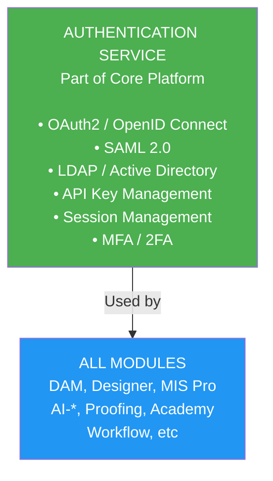

**Dependency Type:** Hard
**Failure Impact:** Module access denied
**Fallback:** None (auth required for security)

#### Notification Service
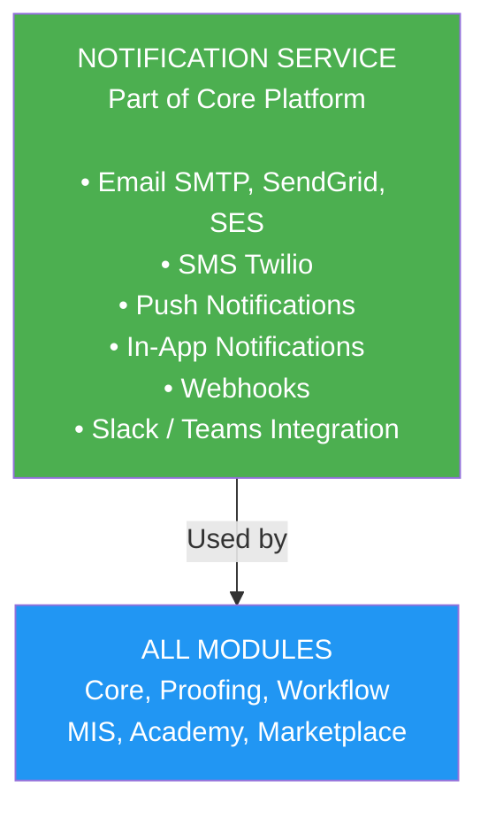

**Dependency Type:** Soft
**Failure Impact:** Notifications not sent
**Fallback:** Queue for retry, log errors

#### Event Bus
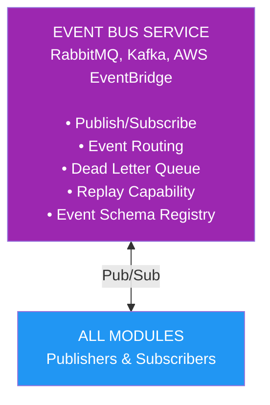

**Dependency Type:** Soft
**Failure Impact:** Async operations delayed
**Fallback:** Local queue, retry on recovery

#### Storage Service
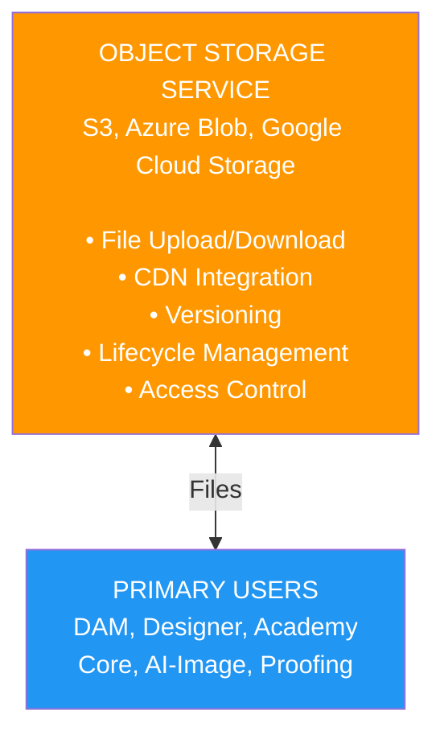

**Dependency Type:** Hard (for these modules)
**Failure Impact:** Cannot upload/access files
**Fallback:** Local temp storage, sync when available

#### Cache Service
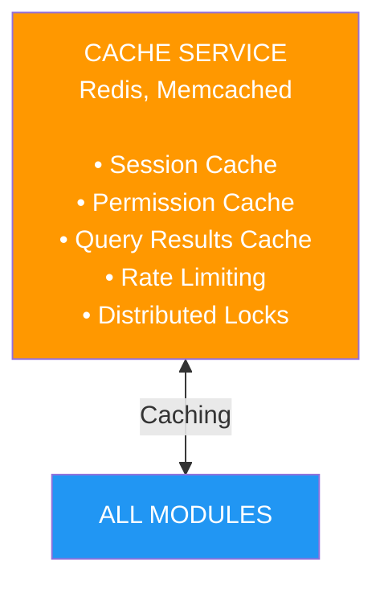

**Dependency Type:** Soft
**Failure Impact:** Degraded performance
**Fallback:** Direct database queries

#### Search Service
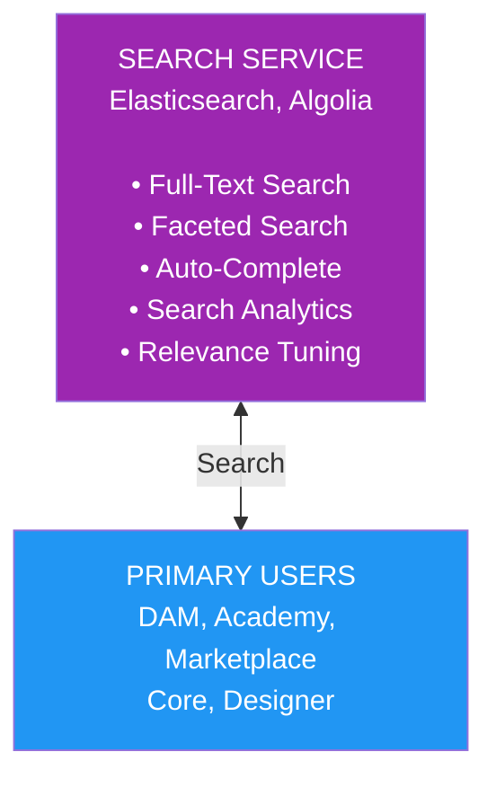

**Dependency Type:** Soft
**Failure Impact:** Search unavailable
**Fallback:** Basic database LIKE queries

### Service Mesh Architecture

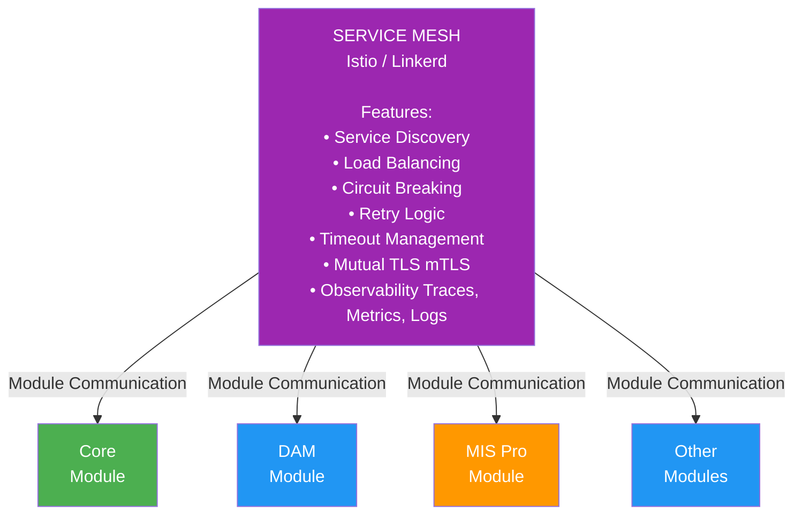

**Benefits:**
- Standardized communication patterns
- Automatic retries and circuit breaking
- Security by default (mTLS)
- Observability without code changes
- Service-to-service authentication

---

## Circular Dependency Prevention

### Architectural Rules

#### Rule 1: Layered Architecture
```
Layer 0: Infrastructure Services
  └─ Authentication, Storage, Cache, Event Bus

Layer 1: Core Platform
  └─ Depends on: Layer 0

Layer 2: Independent Add-ons
  └─ Depends on: Layer 0, Layer 1
  └─ Examples: DAM, Workflow, MIS Basic, Academy

Layer 3: Dependent Add-ons
  └─ Depends on: Layer 0, Layer 1, Layer 2
  └─ Examples: Designer, AI-Data, MIS Pro

Layer 4: Cross-Cutting
  └─ Depends on: None (applied as overlay)
  └─ Example: White-Label

RULE: Modules can only depend on lower layers
PROHIBITED: Cross-layer or upward dependencies
```

#### Rule 2: Event-Driven Decoupling

**WRONG (Circular Dependency):**
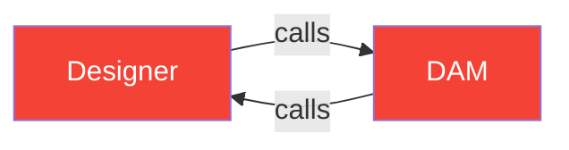

**RIGHT (Event-Driven):**
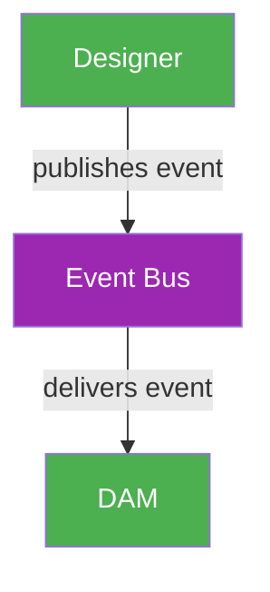

**Benefits:**
- No direct coupling
- Modules don't need to know about each other
- Can add new listeners without changing publishers
- Temporal decoupling (async)

#### Rule 3: Dependency Inversion

**WRONG (Concrete Dependency):**
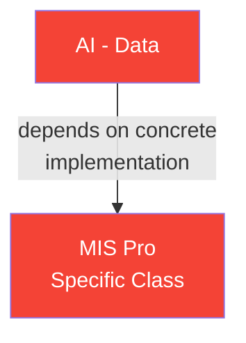

**RIGHT (Abstracted Dependency):**
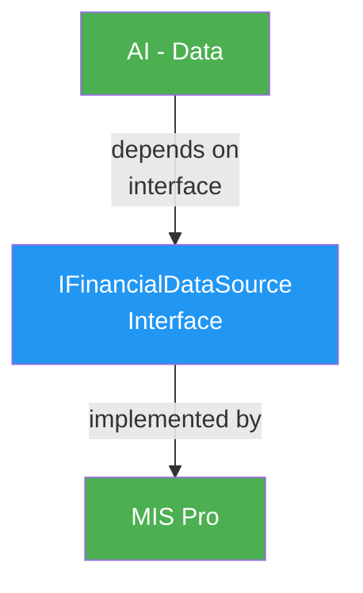

**Benefits:**
- AI-Data doesn't know about MIS Pro
- Can swap implementations
- Can mock for testing
- Follows SOLID principles

### Automated Dependency Checking

#### Static Analysis
```typescript
// Example: Dependency rule enforcement

interface DependencyRule {
  module: string;
  allowedDependencies: string[];
  prohibitedDependencies: string[];
}

const dependencyRules: DependencyRule[] = [
  {
    module: 'core',
    allowedDependencies: ['infrastructure/*'],
    prohibitedDependencies: ['dam', 'designer', 'ai-*', 'mis-*']
  },
  {
    module: 'dam',
    allowedDependencies: ['infrastructure/*', 'core'],
    prohibitedDependencies: ['designer', 'ai-data']
  },
  {
    module: 'designer',
    allowedDependencies: ['infrastructure/*', 'core', 'dam'],
    prohibitedDependencies: ['proofing', 'ai-data']
  },
  {
    module: 'ai-data',
    allowedDependencies: ['infrastructure/*', 'core'],
    prohibitedDependencies: ['designer', 'proofing', 'workflow']
  }
];

// CI/CD pipeline check
class DependencyValidator {
  validate(module: string, imports: string[]): ValidationResult {
    const rules = this.getRulesFor(module);

    for (const imp of imports) {
      if (this.isProhibited(imp, rules.prohibitedDependencies)) {
        return {
          valid: false,
          error: `Module ${module} cannot depend on ${imp}`
        };
      }

      if (!this.isAllowed(imp, rules.allowedDependencies)) {
        return {
          valid: false,
          error: `Module ${module} has undeclared dependency on ${imp}`
        };
      }
    }

    return { valid: true };
  }
}

// Run in CI/CD
// npm run validate-dependencies
```

#### Runtime Dependency Graph
```typescript
// Generate dependency graph at runtime
class DependencyGraphBuilder {
  buildGraph(): DependencyGraph {
    const graph = new DirectedGraph();

    // Add nodes (modules)
    for (const module of getAllModules()) {
      graph.addNode(module.name);
    }

    // Add edges (dependencies)
    for (const module of getAllModules()) {
      for (const dep of module.dependencies) {
        graph.addEdge(module.name, dep);
      }
    }

    return graph;
  }

  detectCycles(graph: DependencyGraph): string[][] {
    const cycles: string[][] = [];
    const visited = new Set<string>();
    const recursionStack = new Set<string>();

    const dfs = (node: string, path: string[]) => {
      visited.add(node);
      recursionStack.add(node);
      path.push(node);

      for (const neighbor of graph.getNeighbors(node)) {
        if (!visited.has(neighbor)) {
          dfs(neighbor, [...path]);
        } else if (recursionStack.has(neighbor)) {
          // Cycle detected
          const cycleStart = path.indexOf(neighbor);
          cycles.push(path.slice(cycleStart).concat(neighbor));
        }
      }

      recursionStack.delete(node);
    };

    for (const node of graph.getNodes()) {
      if (!visited.has(node)) {
        dfs(node, []);
      }
    }

    return cycles;
  }
}

// Alert on cycles
const graph = new DependencyGraphBuilder().buildGraph();
const cycles = new DependencyGraphBuilder().detectCycles(graph);

if (cycles.length > 0) {
  console.error('CIRCULAR DEPENDENCIES DETECTED:');
  for (const cycle of cycles) {
    console.error(`  ${cycle.join(' → ')}`);
  }
  process.exit(1);
}
```

---

## Version Compatibility Matrix

### Module Version Compatibility

#### Core Platform Versions
```
Core Platform Version Support:

v4.0 (Current) supports:
✓ DAM: v2.0+
✓ Designer: v2.0+
✓ Proofing: v2.0+
✓ AI-Image: v2.0+
✓ AI-Data: v2.1+
✓ Workflow: v2.1+
✓ MIS Basic: v2.0+
✓ MIS Pro: v2.1+
✓ Academy: v2.0+
✓ Marketplace: v2.0+
✓ White-Label: v2.0+

v3.5 (Maintenance) supports:
✓ DAM: v1.0 - v3.5
✓ Designer: v1.0 - v3.5
✓ Proofing: v1.0 - v3.5
✗ AI modules: Not supported
✓ Workflow: v2.0 - v3.5
✓ MIS Basic: v1.0 - v3.5
✗ MIS Pro: Not supported
✓ Academy: v1.0 - v3.5
✗ Marketplace: Not supported
```

#### Cross-Module Compatibility
```
Designer v4.0 requires:
  • DAM: v3.0+ (v2.x deprecated)
  • Core: v3.5+
  • AI-Image (optional): v2.0+

MIS Pro v4.0 requires:
  • MIS Basic: v3.0+
  • Core: v4.0+
  • AI-Data (optional): v2.5+

AI-Data v4.0 requires:
  • Core: v4.0+
  • DAM (optional): v2.0+
  • MIS (optional): v2.0+

Workflow v4.0 supports:
  • Any module v2.0+ (via API)
```

### Compatibility Testing Matrix

| Module | v2.0 | v2.5 | v3.0 | v3.5 | v4.0 |
|--------|------|------|------|------|------|
| **Core v4.0** | ? | ? | ✓ | ✓ | ✓ |
| **DAM v4.0** | ✓ | ✓ | ✓ | ✓ | ✓ |
| **Designer v4.0** | ✗ | ✗ | ✓ | ✓ | ✓ |
| **AI-Data v4.0** | ✗ | ✗ | ✗ | ✗ | ✓ |

**Legend:**
- ✓ = Fully supported & tested
- ? = Supported but not recommended
- ✗ = Not supported

*Rows: Module versions | Columns: Dependent module versions*

---

## Breaking Change Management

### Breaking Change Policy

#### Definition of Breaking Changes
```
Breaking changes include:

API Changes:
✗ Removing endpoints
✗ Changing endpoint paths
✗ Removing request/response fields
✗ Changing data types
✗ Changing authentication requirements
✗ Changing rate limits (significant reduction)

Database Changes:
✗ Removing tables or columns
✗ Changing primary keys
✗ Removing indexes (performance impact)
✗ Changing data types
✗ Adding NOT NULL constraints (without defaults)

Event Changes:
✗ Removing event types
✗ Changing event payload structure
✗ Changing event names

Non-Breaking Changes:
✓ Adding new endpoints
✓ Adding optional request fields
✓ Adding response fields
✓ Adding new event types
✓ Adding database columns (nullable)
✓ Adding indexes
✓ Improving performance
```

#### Breaking Change Process

```mermaid
flowchart LR
    subgraph P1["Phase 1: Proposal<br>(T-6 months)"]
        A1[Document proposed change]
        A2[Identify affected modules]
        A3[Estimate migration effort]
        A4[Review & approve/reject]
    end

    subgraph P2["Phase 2: Announcement<br>(T-5 months)"]
        B1[Publish deprecation notice]
        B2[Update documentation]
        B3[Notify customers]
        B4[Provide migration guide]
    end

    subgraph P3["Phase 3: Dual Support<br>(T-4 to T-1 months)"]
        C1[Implement new version]
        C2[Support both versions]
        C3[Add deprecation warnings]
        C4[Monitor adoption]
    end

    subgraph P4["Phase 4: Breaking Change<br>(T)"]
        D1[Release breaking change]
        D2[Remove old version support]
        D3[Monitor for issues]
        D4[Provide emergency support]
    end

    subgraph P5["Phase 5: Cleanup<br>(T+1 month)"]
        E1[Remove deprecated code]
        E2[Update documentation]
        E3[Conduct post-mortem]
        E4[Document lessons learned]
    end

    P1 --> P2 --> P3 --> P4 --> P5

    style P1 fill:#e3f2fd
    style P2 fill:#fff3e0
    style P3 fill:#e8f5e9
    style P4 fill:#ffebee
    style P5 fill:#f3e5f5
```

**Minimum Timeline:** 6 months from proposal to breaking change

### Breaking Change Examples

#### Example 1: API Endpoint Removal
```typescript
// Current (v3): Two endpoints for campaigns
GET /api/v3/campaigns         // List all
GET /api/v3/campaigns/{id}    // Get one

// Deprecated (v3.5): Announce removal
GET /api/v3/campaigns         // Deprecated, use v4
GET /api/v3/campaigns/{id}    // Deprecated, use v4

// Add deprecation header
app.get('/api/v3/campaigns', (req, res) => {
  res.header('Deprecation', 'true');
  res.header('Sunset', 'Wed, 01 Jul 2026 23:59:59 GMT');
  res.header('Link', '</api/v4/campaigns>; rel="alternate"');

  // Return data with warning in response
  res.json({
    warning: 'This endpoint is deprecated. Use /api/v4/campaigns',
    data: campaigns
  });
});

// New (v4): Consolidated endpoint
GET /api/v4/campaigns?id={id}  // Get one or many

// Remove (v5): Old endpoint removed
// /api/v3/campaigns no longer exists
```

#### Example 2: Database Schema Change
```sql
-- Current (v3): Separate first_name, last_name
CREATE TABLE users (
  id VARCHAR(50) PRIMARY KEY,
  first_name VARCHAR(100),
  last_name VARCHAR(100),
  email VARCHAR(255)
);

-- Dual Support (v3.5 to v4): Both old and new columns
CREATE TABLE users (
  id VARCHAR(50) PRIMARY KEY,
  -- Deprecated columns
  first_name VARCHAR(100),
  last_name VARCHAR(100),
  -- New column
  full_name VARCHAR(255),
  email VARCHAR(255)
);

-- Application code supports both
class User {
  get displayName(): string {
    // Prefer new format
    if (this.fullName) {
      return this.fullName;
    }
    // Fallback to old format
    return `${this.firstName} ${this.lastName}`;
  }

  set displayName(value: string) {
    this.fullName = value;
    // Also update old columns for backward compat
    const parts = value.split(' ');
    this.firstName = parts[0];
    this.lastName = parts.slice(1).join(' ');
  }
}

-- New (v5): Only new column
CREATE TABLE users (
  id VARCHAR(50) PRIMARY KEY,
  full_name VARCHAR(255) NOT NULL,
  email VARCHAR(255)
);

-- Cleanup: Drop old columns
ALTER TABLE users DROP COLUMN first_name;
ALTER TABLE users DROP COLUMN last_name;
```

#### Example 3: Event Payload Change
```typescript
// Current (v3): Flat event payload
interface CampaignCreatedEvent {
  eventType: 'campaign.created';
  campaignId: string;
  campaignName: string;
  tenantId: string;
  userId: string;
  timestamp: string;
}

// Dual Support (v3.5 to v4): Both formats
interface CampaignCreatedEventV4 {
  eventType: 'campaign.created';
  version: '4.0'; // Version indicator

  // Deprecated (flat structure)
  campaignId?: string;
  campaignName?: string;
  tenantId?: string;
  userId?: string;

  // New (nested structure)
  data?: {
    campaign: {
      id: string;
      name: string;
    };
    context: {
      tenantId: string;
      userId: string;
    };
  };

  timestamp: string;
}

// Event publisher supports both
class EventPublisher {
  publishCampaignCreated(campaign: Campaign, userId: string): void {
    const event: CampaignCreatedEventV4 = {
      eventType: 'campaign.created',
      version: '4.0',

      // Old format (deprecated)
      campaignId: campaign.id,
      campaignName: campaign.name,
      tenantId: campaign.tenantId,
      userId: userId,

      // New format
      data: {
        campaign: {
          id: campaign.id,
          name: campaign.name
        },
        context: {
          tenantId: campaign.tenantId,
          userId: userId
        }
      },

      timestamp: new Date().toISOString()
    };

    this.eventBus.publish(event);
  }
}

// Event consumers handle both
class CampaignEventHandler {
  @EventHandler('campaign.created')
  handleCampaignCreated(event: CampaignCreatedEventV4): void {
    // Support both formats
    const campaignId = event.data?.campaign.id || event.campaignId;
    const campaignName = event.data?.campaign.name || event.campaignName;
    const tenantId = event.data?.context.tenantId || event.tenantId;

    // Process event...
  }
}

// New (v5): Only new format
interface CampaignCreatedEventV5 {
  eventType: 'campaign.created';
  version: '5.0';
  data: {
    campaign: { id: string; name: string; };
    context: { tenantId: string; userId: string; };
  };
  timestamp: string;
}
```

---

## Module Communication Patterns

### Synchronous Communication

#### REST API Pattern
```typescript
// Module A calls Module B directly via HTTP

class DesignerService {
  private damClient: DAMClient;

  async getAssetsForTemplate(templateId: string): Promise<Asset[]> {
    // Synchronous HTTP call to DAM
    const response = await this.damClient.get(`/api/v1/dam/assets`, {
      params: { templateId }
    });

    return response.data.assets;
  }
}

// Characteristics:
// - Immediate response required
// - Blocking operation
// - Tight coupling
// - Error propagation
// - Timeout management critical

// Best for:
// ✓ User-initiated requests requiring immediate response
// ✓ Queries that must return current state
// ✓ Operations requiring immediate validation
```

#### GraphQL Federation Pattern
```graphql
# Designer service schema
type Template {
  id: ID!
  name: String!
  assets: [Asset!]! @requires(fields: "assetIds")
}

# DAM service schema
type Asset {
  id: ID!
  filename: String!
  url: String!
}

# Federated query resolves across services
query GetTemplateWithAssets($templateId: ID!) {
  template(id: $templateId) {
    id
    name
    assets {  # Automatically fetched from DAM service
      id
      filename
      url
    }
  }
}

# Benefits:
# - Single query fetches from multiple modules
# - Client doesn't need to know about module boundaries
# - Type-safe across module boundaries
# - Efficient (batching, caching)
```

### Asynchronous Communication

#### Event-Driven Pattern
```typescript
// Module A publishes event, Module B subscribes

// Publisher (Core Platform)
class CampaignService {
  async createCampaign(data: CreateCampaignDto): Promise<Campaign> {
    const campaign = await this.repository.save(data);

    // Publish event (fire-and-forget)
    await this.eventBus.publish('campaign.created', {
      campaignId: campaign.id,
      tenantId: campaign.tenantId,
      timestamp: new Date()
    });

    return campaign;
  }
}

// Subscriber (DAM Module)
class DAMCampaignHandler {
  @EventHandler('campaign.created')
  async onCampaignCreated(event: CampaignCreatedEvent): Promise<void> {
    // Create asset collection for campaign
    await this.damService.createCollection({
      name: `Campaign ${event.campaignId} Assets`,
      campaignId: event.campaignId
    });
  }
}

// Subscriber (AI-Data Module)
class AIDataCampaignHandler {
  @EventHandler('campaign.created')
  async onCampaignCreated(event: CampaignCreatedEvent): Promise<void> {
    // Initialize analytics tracking
    await this.analyticsService.initializeCampaignTracking(
      event.campaignId
    );
  }
}

// Characteristics:
// - Non-blocking
// - Loose coupling
// - Multiple subscribers
// - Eventual consistency
// - Retry/error handling required

// Best for:
// ✓ Notifications
// ✓ Cross-module data synchronization
// ✓ Audit logging
// ✓ Analytics tracking
// ✓ Workflow triggers
```

#### Message Queue Pattern
```typescript
// Module A sends message to queue, Module B processes

// Producer (Workflow Module)
class WorkflowExecutor {
  async executeAction(action: WorkflowAction): Promise<void> {
    // Send message to module-specific queue
    await this.messageQueue.send(`designer.generate-template`, {
      jobId: action.id,
      templateId: action.parameters.templateId,
      variables: action.parameters.variables,
      priority: action.priority
    });
  }
}

// Consumer (Designer Module)
class DesignerQueueProcessor {
  @QueueConsumer('designer.generate-template')
  async processTemplateGeneration(
    message: GenerateTemplateMessage
  ): Promise<void> {
    try {
      const result = await this.templateService.generate(
        message.templateId,
        message.variables
      );

      // Acknowledge message (removes from queue)
      await message.ack();

      // Optionally publish completion event
      await this.eventBus.publish('designer.template.generated', {
        jobId: message.jobId,
        templateUrl: result.url
      });

    } catch (error) {
      // Reject message (goes to dead letter queue after max retries)
      await message.nack({
        requeue: message.retryCount < 3,
        reason: error.message
      });
    }
  }
}

// Characteristics:
// - Guaranteed delivery
// - Retry logic
// - Dead letter queue
// - Load leveling
// - Back pressure handling

// Best for:
// ✓ Batch processing
// ✓ Background jobs
// ✓ Resource-intensive operations
// ✓ Rate-limited operations
// ✓ Operations requiring guaranteed execution
```

### Hybrid Communication

#### Request-Reply Pattern (Async with Correlation)
```typescript
// Module A sends request via queue, waits for reply

class AIDataService {
  async getPrediction(campaignId: string): Promise<Prediction> {
    const correlationId = generateId();

    // Send request to AI processing queue
    await this.messageQueue.send('ai.prediction.request', {
      correlationId,
      campaignId,
      replyTo: 'ai.prediction.response'
    });

    // Wait for response (with timeout)
    const response = await this.waitForResponse(
      correlationId,
      { timeout: 30000 } // 30 seconds
    );

    return response.prediction;
  }

  private async waitForResponse(
    correlationId: string,
    options: { timeout: number }
  ): Promise<any> {
    return new Promise((resolve, reject) => {
      const timeout = setTimeout(() => {
        this.removeListener(correlationId);
        reject(new Error('Response timeout'));
      }, options.timeout);

      this.responseListeners.set(correlationId, (response) => {
        clearTimeout(timeout);
        resolve(response);
      });
    });
  }

  @QueueConsumer('ai.prediction.response')
  async handleResponse(message: ResponseMessage): Promise<void> {
    const listener = this.responseListeners.get(message.correlationId);
    if (listener) {
      listener(message.data);
      this.responseListeners.delete(message.correlationId);
    }
    await message.ack();
  }
}

// Benefits:
// - Non-blocking (doesn't hold HTTP connection)
// - Reliable (queue guarantees)
// - Timeout handling
// - Load balancing across consumers
```

---

## Dependency Injection Architecture

### Service Container Pattern

```typescript
// Central service container manages dependencies

interface ServiceDefinition {
  name: string;
  factory: () => any;
  dependencies: string[];
  lifecycle: 'singleton' | 'transient' | 'scoped';
}

class ServiceContainer {
  private services = new Map<string, ServiceDefinition>();
  private instances = new Map<string, any>();

  register(definition: ServiceDefinition): void {
    this.services.set(definition.name, definition);
  }

  resolve<T>(serviceName: string): T {
    const definition = this.services.get(serviceName);
    if (!definition) {
      throw new Error(`Service ${serviceName} not registered`);
    }

    // Check if singleton already instantiated
    if (definition.lifecycle === 'singleton' &&
        this.instances.has(serviceName)) {
      return this.instances.get(serviceName);
    }

    // Resolve dependencies first
    const dependencies = definition.dependencies.map(dep =>
      this.resolve(dep)
    );

    // Create instance
    const instance = definition.factory(...dependencies);

    // Cache if singleton
    if (definition.lifecycle === 'singleton') {
      this.instances.set(serviceName, instance);
    }

    return instance;
  }
}

// Module registration example
const container = new ServiceContainer();

// Register Core services
container.register({
  name: 'AuthService',
  factory: () => new AuthService(),
  dependencies: [],
  lifecycle: 'singleton'
});

container.register({
  name: 'UserService',
  factory: (auth) => new UserService(auth),
  dependencies: ['AuthService'],
  lifecycle: 'singleton'
});

// Register DAM services
container.register({
  name: 'DAMClient',
  factory: (auth) => new DAMClient(auth),
  dependencies: ['AuthService'],
  lifecycle: 'singleton'
});

container.register({
  name: 'AssetService',
  factory: (damClient, userService) =>
    new AssetService(damClient, userService),
  dependencies: ['DAMClient', 'UserService'],
  lifecycle: 'scoped'
});

// Usage
const assetService = container.resolve<AssetService>('AssetService');
// Dependencies automatically injected
```

### Module Interface Pattern

```typescript
// Each module exposes standard interface

interface ModuleInterface {
  name: string;
  version: string;
  dependencies: ModuleDependency[];

  initialize(container: ServiceContainer): Promise<void>;
  healthCheck(): Promise<HealthStatus>;
  shutdown(): Promise<void>;
}

interface ModuleDependency {
  module: string;
  version: string;
  required: boolean;
}

// Example module implementation
class DAMModule implements ModuleInterface {
  name = 'dam';
  version = '4.0.0';

  dependencies: ModuleDependency[] = [
    { module: 'core', version: '>= 3.0.0', required: true },
    { module: 'ai-image', version: '>= 2.0.0', required: false }
  ];

  async initialize(container: ServiceContainer): Promise<void> {
    // Register DAM services
    container.register({
      name: 'DAMService',
      factory: () => new DAMService(/* ... */),
      dependencies: ['AuthService', 'StorageService'],
      lifecycle: 'singleton'
    });

    // Start background jobs
    await this.startBackgroundJobs();

    // Subscribe to events
    await this.subscribeToEvents();
  }

  async healthCheck(): Promise<HealthStatus> {
    return {
      status: 'healthy',
      checks: {
        database: await this.checkDatabase(),
        storage: await this.checkStorage(),
        cache: await this.checkCache()
      }
    };
  }

  async shutdown(): Promise<void> {
    // Stop background jobs
    await this.stopBackgroundJobs();

    // Close connections
    await this.closeConnections();
  }
}

// Module loader
class ModuleLoader {
  async loadModules(moduleConfigs: ModuleConfig[]): Promise<void> {
    const modules: ModuleInterface[] = [];

    // Load all modules
    for (const config of moduleConfigs) {
      const module = await this.loadModule(config);
      modules.push(module);
    }

    // Verify dependencies
    this.verifyDependencies(modules);

    // Initialize in dependency order
    const initOrder = this.topologicalSort(modules);
    for (const module of initOrder) {
      await module.initialize(this.container);
    }
  }

  private verifyDependencies(modules: ModuleInterface[]): void {
    for (const module of modules) {
      for (const dep of module.dependencies) {
        const depModule = modules.find(m => m.name === dep.module);

        if (!depModule && dep.required) {
          throw new Error(
            `Module ${module.name} requires ${dep.module} but it's not loaded`
          );
        }

        if (depModule && !this.isVersionCompatible(
          depModule.version,
          dep.version
        )) {
          throw new Error(
            `Module ${module.name} requires ${dep.module} ${dep.version} ` +
            `but ${depModule.version} is loaded`
          );
        }
      }
    }
  }

  private topologicalSort(modules: ModuleInterface[]): ModuleInterface[] {
    // Sort modules by dependency order
    // Modules with no dependencies first, then modules that depend on them, etc.
    // Returns array in initialization order
    // Implementation omitted for brevity
    return modules;
  }
}
```

---

## Best Practices Summary

### Dependency Management
✓ Declare all dependencies explicitly
✓ Use semantic versioning for compatibility
✓ Minimize hard dependencies
✓ Prefer events over direct calls
✓ Implement circuit breakers for external calls
✓ Use dependency injection for testability
✓ Document all integration points
✓ Version all APIs
✓ Test dependency failures

### Communication Patterns
✓ Use async for cross-module operations
✓ Implement idempotent operations
✓ Add correlation IDs for tracing
✓ Handle timeouts gracefully
✓ Retry with exponential backoff
✓ Use dead letter queues
✓ Monitor message queue depths
✓ Log all cross-module calls

### Architecture Principles
✓ Prevent circular dependencies
✓ Use layered architecture
✓ Apply dependency inversion
✓ Keep modules loosely coupled
✓ Design for failure
✓ Build in observability
✓ Maintain backward compatibility
✓ Plan for breaking changes

---

**Document Version**: 1.0
**Last Updated**: December 2025
**Maintained By**: Architecture & Platform Engineering Team
**Review Cycle**: Quarterly
**Next Review**: March 2026
