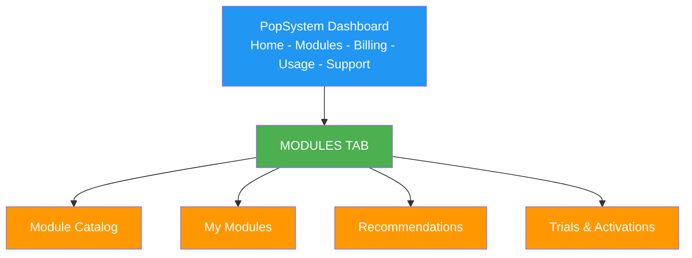

# Self-Service Portal
**Customer Module Management User Experience**

## Overview
The Self-Service Portal empowers PopSystem customers to discover, trial, purchase, and manage their modules independently. This reduces sales friction, accelerates time-to-value, and provides complete transparency into usage and billing.

---

## Portal Architecture

### Navigation Structure


---

## Module Catalog Browsing

### Catalog View Wireframe

```
┌───────────────────────────────────────────────────────────┐
│  Module Catalog                                           │
│                                                           │
│  [All Modules ▼] [Sort: Popular ▼]     [🔍 Search...]    │
│  ┌─────────────────────────────────────────────────────┐ │
│  │ Filters:                                            │ │
│  │ □ Add-ons  □ Premium  □ Available  ☑ All          │ │
│  └─────────────────────────────────────────────────────┘ │
│                                                           │
│  ┌─────────────┐  ┌─────────────┐  ┌─────────────┐     │
│  │ [DAM Icon]  │  │ [Designer]  │  │ [AI - Data] │     │
│  │             │  │             │  │             │     │
│  │ Digital     │  │ Template    │  │ Analytics & │     │
│  │ Asset Mgmt  │  │ Designer    │  │ Insights    │     │
│  │             │  │             │  │             │     │
│  │ From $99/mo │  │ From $79/mo │  │ From $199/mo│     │
│  │             │  │             │  │             │     │
│  │ ★★★★★ (127) │  │ ★★★★☆ (89)  │  │ ★★★★★ (56)  │     │
│  │             │  │             │  │             │     │
│  │ [Try Free] │  │ [Try Free] │  │ [Try Free] │     │
│  │ [Learn More]│  │ [Learn More]│  │ [Learn More]│     │
│  └─────────────┘  └─────────────┘  └─────────────┘     │
│                                                           │
│  ┌─────────────┐  ┌─────────────┐  ┌─────────────┐     │
│  │ [Proofing]  │  │ [Workflow]  │  │ [MIS Basic] │     │
│  │  ...        │  │  ...        │  │  ...        │     │
└───────────────────────────────────────────────────────────┘
```

### Module Card Components

#### Card Information
- **Module Icon**: Distinct visual identity
- **Module Name**: Clear, descriptive
- **One-Line Description**: Value proposition
- **Pricing**: Starting price prominently displayed
- **Rating & Reviews**: Social proof
- **Status Badge**: "Active", "Trial", "Available", "Recommended"
- **CTAs**: "Try Free" (primary), "Learn More" (secondary)

### Filtering & Search

#### Filter Categories
- **By Type**: Add-ons, Premium, Bundles
- **By Status**: Available, Active, In Trial
- **By Price Range**: $0-99, $100-299, $300-499, $500+
- **By Category**: Marketing, Operations, Sales, Analytics
- **By Compatibility**: Works with your active modules

#### Search Functionality
- **Real-time search**: As you type
- **Search by**: Module name, features, use case
- **Suggestions**: "Looking for approval workflows? Try Proofing"

---

## Module Detail Page

### Page Structure
```
┌───────────────────────────────────────────────────────────┐
│  ← Back to Catalog                                        │
│                                                            │
│  ┌────────────┐  Digital Asset Management (DAM)          │
│  │            │  Centralize and manage all your brand     │
│  │ [DAM Icon] │  assets in one powerful platform          │
│  │            │                                            │
│  └────────────┘  ★★★★★ 4.8 (127 reviews)                 │
│                                                            │
│  [Start 14-Day Free Trial]  [Schedule Demo]               │
│                                                            │
├───────────────────────────────────────────────────────────┤
│  [Overview] [Features] [Pricing] [Reviews] [FAQs]        │
├───────────────────────────────────────────────────────────┤
│                                                            │
│  OVERVIEW                                                  │
│  ════════                                                  │
│  The DAM module transforms how you store, organize, and   │
│  distribute brand assets. Perfect for teams managing...   │
│                                                            │
│  ✓ Centralized asset library                             │
│  ✓ AI-powered auto-tagging                               │
│  ✓ Version control                                        │
│  ✓ Advanced search & filters                             │
│                                                            │
│  [Watch Video Demo (2:30)]                                │
│                                                            │
│  KEY BENEFITS                                              │
│  ────────────                                             │
│  • 70% faster asset retrieval                            │
│  • Eliminate duplicate assets                            │
│  • Maintain brand consistency                            │
│  • Streamline approval workflows                         │
│                                                            │
│  PERFECT FOR                                               │
│  ───────────                                              │
│  🎯 Marketing teams managing 1,000+ assets               │
│  🎯 Multi-location brands needing central control        │
│  🎯 Agencies serving multiple clients                    │
│                                                            │
│  INTEGRATIONS                                              │
│  ─────────────                                            │
│  Works seamlessly with: Designer, Proofing, AI-Image     │
│  External: Dropbox, Google Drive, Adobe CC               │
│                                                            │
│  REQUIREMENTS                                              │
│  ─────────────                                            │
│  • PopSystem Core Platform (any tier)                    │
│  • 100 GB available storage (Basic tier)                 │
│                                                            │
└───────────────────────────────────────────────────────────┘
```

### Features Tab
- **Feature List**: Detailed capabilities by tier
- **Comparison Table**: Basic vs. Professional vs. Enterprise
- **Video Demos**: Feature walkthroughs
- **Screenshots**: Visual tour of interface

### Pricing Tab

```
┌───────────────────────────────────────────────────────────┐
│  Choose Your Plan                                         │
│                                                            │
│  ┌──────────────┐ ┌──────────────┐ ┌──────────────┐     │
│  │   Basic      │ │ Professional │ │  Enterprise  │     │
│  │              │ │              │ │              │     │
│  │   $99/mo     │ │   $249/mo    │ │   $499/mo    │     │
│  │              │ │              │ │              │     │
│  │ 100 GB       │ │ 500 GB       │ │ 2 TB         │     │
│  │ 10K assets   │ │ 50K assets   │ │ Unlimited    │     │
│  │ 10 users     │ │ 50 users     │ │ Unlimited    │     │
│  │              │ │              │ │              │     │
│  │ • Collections│ │ Everything   │ │ Everything   │     │
│  │ • Search     │ │ in Basic +   │ │ in Pro +     │     │
│  │ • Metadata   │ │ • AI tagging │ │ • Usage      │     │
│  │              │ │ • Version    │ │   rights     │     │
│  │              │ │   control    │ │ • Advanced   │     │
│  │              │ │ • CDN        │ │   workflows  │     │
│  │              │ │              │ │ • API access │     │
│  │              │ │              │ │              │     │
│  │[Try Free]    │ │[Try Free]    │ │[Try Free]    │     │
│  │[Activate]    │ │[Activate]    │ │[Contact]     │     │
│  └──────────────┘ └──────────────┘ └──────────────┘     │
│                                                            │
│  💡 Save 20% with annual billing                          │
│  📦 Bundle with Designer and save 15% more                │
│                                                            │
│  [See All Bundles]                                        │
└───────────────────────────────────────────────────────────┘
```

### Reviews Tab
- **Overall Rating**: Aggregate score
- **Rating Distribution**: 5-star breakdown
- **Verified Reviews**: From active customers
- **Sort/Filter**: Most recent, highest rated, your industry
- **Review Highlights**: Common themes extracted

### FAQs Tab
- **Common Questions**: Pre-written Q&A
- **Search FAQs**: Find specific answers
- **Still Have Questions?**: [Contact Support] button

---

## Try-Before-Buy Trial Flow

### 14-Day Free Trial Experience

#### Step 1: Initiate Trial
```
┌───────────────────────────────────────────────────────────┐
│  Start Your 14-Day Free Trial                            │
│                                                            │
│  Get full access to Digital Asset Management              │
│  Professional tier - no credit card required              │
│                                                            │
│  ✓ Full feature access                                   │
│  ✓ Import up to 1,000 assets                             │
│  ✓ Invite up to 5 team members                           │
│  ✓ Free onboarding session                               │
│                                                            │
│  Trial ends: January 4, 2026                              │
│                                                            │
│  ┌────────────────────────────────────────────────────┐  │
│  │ Email: user@company.com (pre-filled)               │  │
│  │                                                     │  │
│  │ Company Size: [250-500 employees ▼]                │  │
│  │                                                     │  │
│  │ Primary Use Case: [Multi-location asset mgmt ▼]    │  │
│  │                                                     │  │
│  │ □ I agree to Terms of Service                      │  │
│  │                                                     │  │
│  │            [Start Free Trial]                       │  │
│  └────────────────────────────────────────────────────┘  │
│                                                            │
│  No credit card required • Cancel anytime                 │
└───────────────────────────────────────────────────────────┘
```

#### Step 2: Activation Confirmation
```
┌───────────────────────────────────────────────────────────┐
│  🎉 Your DAM Trial is Active!                            │
│                                                            │
│  Your 14-day trial ends on January 4, 2026                │
│                                                            │
│  NEXT STEPS:                                               │
│  1. [Upload your first assets]                           │
│  2. [Invite team members]                                │
│  3. [Schedule onboarding call]                           │
│                                                            │
│  📚 Helpful Resources:                                    │
│     • Video: Getting Started with DAM (5 min)            │
│     • Guide: Best Practices for Asset Organization       │
│     • Template: Asset Metadata Schema                    │
│                                                            │
│  [Go to DAM Module]                                       │
└───────────────────────────────────────────────────────────┘
```

#### Step 3: In-Trial Experience

**Trial Dashboard Widget**
```
┌──────────────────────────────────────────┐
│ DAM Trial: 10 days remaining             │
│                                          │
│ Progress: 45% complete                   │
│ [████████░░░░░░░]                        │
│                                          │
│ You've completed:                        │
│ ✓ Uploaded assets                       │
│ ✓ Created collections                   │
│ ⧗ Invited team members (0/5)            │
│ ⧗ Set up approval workflow              │
│                                          │
│ [Complete Setup]  [Activate Now]        │
└──────────────────────────────────────────┘
```

**Trial Emails**
- **Day 0**: Welcome & getting started
- **Day 3**: Tips for maximizing your trial
- **Day 7**: You're halfway through (case study)
- **Day 10**: 4 days left - schedule upgrade call
- **Day 13**: Last day - special upgrade offer

#### Step 4: Conversion Flow
```
┌───────────────────────────────────────────────────────────┐
│  Your Trial Ends Tomorrow                                 │
│                                                            │
│  Continue with Digital Asset Management                   │
│  and keep all your data                                   │
│                                                            │
│  During your trial, you:                                  │
│  • Uploaded 487 assets                                   │
│  • Created 12 collections                                │
│  • Saved ~15 hours with AI auto-tagging                 │
│                                                            │
│  SPECIAL TRIAL OFFER                                       │
│  Get 25% off your first 3 months                          │
│                                                            │
│  ┌──────────────────────────────────────────────────┐    │
│  │ Professional Plan                                 │    │
│  │                                                    │    │
│  │ Regular: $249/month                               │    │
│  │ Trial Price: $187/month (first 3 months)         │    │
│  │ Then: $249/month                                  │    │
│  │                                                    │    │
│  │ Billing: ○ Monthly  ● Annual (save 20%)          │    │
│  │                                                    │    │
│  │ Annual Price: $1,796/year ($149.67/mo)           │    │
│  │ With trial discount: $1,347 first year           │    │
│  │                                                    │    │
│  │ [Add Payment Method & Activate]                   │    │
│  └──────────────────────────────────────────────────┘    │
│                                                            │
│  Not ready? [Extend trial 7 days] [Export your data]     │
└───────────────────────────────────────────────────────────┘
```

---

## Instant Activation Flow

### For Existing Customers (No Trial)

```
┌───────────────────────────────────────────────────────────┐
│  Activate Digital Asset Management                        │
│                                                            │
│  Selected Plan: Professional                              │
│  Price: $249/month                                        │
│                                                            │
│  ┌────────────────────────────────────────────────────┐  │
│  │ Billing:                                            │  │
│  │ ● Monthly ($249/mo)                                │  │
│  │ ○ Annual ($2,390/year - Save $598!)                │  │
│  │                                                     │  │
│  │ Payment Method:                                     │  │
│  │ ● Visa ending in 4242 (on file)                   │  │
│  │ ○ Add new payment method                           │  │
│  │                                                     │  │
│  │ Prorated charge today: $187.50                     │  │
│  │ (15 days remaining in billing cycle)               │  │
│  │                                                     │  │
│  │ Next charge: $249.00 on January 1, 2026           │  │
│  │                                                     │  │
│  │ ☑ I agree to the DAM Module Terms                 │  │
│  │                                                     │  │
│  │            [Activate Module]                        │  │
│  └────────────────────────────────────────────────────┘  │
│                                                            │
│  💡 Bundle with Designer and save 15% [Learn more]       │
└───────────────────────────────────────────────────────────┘
```

### Activation Confirmation
```
┌───────────────────────────────────────────────────────────┐
│  ✅ Digital Asset Management Activated!                  │
│                                                            │
│  Your module is ready to use.                             │
│                                                            │
│  What's Next:                                              │
│  1. [Set up your asset library]                          │
│  2. [Configure metadata fields]                          │
│  3. [Invite team members]                                │
│  4. [Schedule training session] (Free)                   │
│                                                            │
│  📧 Confirmation sent to: user@company.com                │
│  📄 Invoice: INV-2025-12345                               │
│                                                            │
│  [Launch DAM Module]  [View Invoice]                      │
└───────────────────────────────────────────────────────────┘
```

---

## My Modules Dashboard

### Active Modules View
```
┌───────────────────────────────────────────────────────────┐
│  My Modules                               [+ Add Module]  │
│                                                            │
│  ┌────────────────────────────────────────────────────┐  │
│  │ Core Platform - Professional                       │  │
│  │ Status: Active • Next billing: Jan 1, 2026         │  │
│  │                                                     │  │
│  │ Usage:                                              │  │
│  │ • Locations: 23/50                                 │  │
│  │ • Users: 18/25                                     │  │
│  │ • API Calls: 45,231/100,000 (45%)                 │  │
│  │ • Storage: 28.4/50 GB (57%)                       │  │
│  │                                                     │  │
│  │ [Manage] [Upgrade] [View Details]                  │  │
│  └────────────────────────────────────────────────────┘  │
│                                                            │
│  ┌────────────────────────────────────────────────────┐  │
│  │ Digital Asset Management - Professional            │  │
│  │ Status: Active • Next billing: Jan 1, 2026         │  │
│  │                                                     │  │
│  │ Usage:                                              │  │
│  │ • Storage: 287/500 GB (57%)                       │  │
│  │ • Assets: 12,453/50,000 (25%)                     │  │
│  │ • AI Tagging: 3,241/unlimited                     │  │
│  │                                                     │  │
│  │ 💡 Tip: Bundle with Designer and save 15%         │  │
│  │                                                     │  │
│  │ [Manage] [Upgrade to Enterprise] [View Details]    │  │
│  └────────────────────────────────────────────────────┘  │
│                                                            │
│  ┌────────────────────────────────────────────────────┐  │
│  │ Workflow Automation - Starter                      │  │
│  │ Status: Trial (7 days left)                        │  │
│  │                                                     │  │
│  │ Trial Usage:                                        │  │
│  │ • Workflows Created: 3/5                           │  │
│  │ • Executions: 127/1,000                           │  │
│  │                                                     │  │
│  │ [Activate Now] [Extend Trial] [Cancel]             │  │
│  └────────────────────────────────────────────────────┘  │
└───────────────────────────────────────────────────────────┘
```

---

## Usage Dashboards

### Module Usage Detail View
```
┌───────────────────────────────────────────────────────────┐
│  Digital Asset Management - Usage                         │
│  [This Month ▼]                                           │
│                                                            │
│  STORAGE                                                   │
│  287.4 GB / 500 GB (57%)                                  │
│  [█████████████████░░░░░░░░░░░░░░]                        │
│  Trend: ↑ 12.3 GB this month                             │
│                                                            │
│  ASSETS                                                    │
│  12,453 / 50,000 (25%)                                    │
│  [████████░░░░░░░░░░░░░░░░░░░░░░]                        │
│  Added this month: 487                                    │
│                                                            │
│  AI TAGGING                                                │
│  3,241 tags generated (Unlimited)                         │
│  Average: 2.6 tags per asset                              │
│                                                            │
│  USERS                                                     │
│  15 active users / 50 (30%)                               │
│  Top users: jsmith (523 uploads), mjones (412 uploads)   │
│                                                            │
│  API CALLS                                                 │
│  8,234 calls (Unlimited in Professional tier)            │
│                                                            │
│  ┌─────────────────────────────────────────────┐         │
│  │      Storage Growth (Last 6 Months)          │         │
│  │                                              │         │
│  │  GB                                         │         │
│  │  300┤                                    ●   │         │
│  │  250┤                            ●           │         │
│  │  200┤                    ●                   │         │
│  │  150┤            ●                           │         │
│  │  100┤    ●                                   │         │
│  │   50┤●                                       │         │
│  │     └────────────────────────────────────── │         │
│  │      Jul  Aug  Sep  Oct  Nov  Dec          │         │
│  └─────────────────────────────────────────────┘         │
│                                                            │
│  RECOMMENDATIONS                                           │
│  • You're using 57% of storage. Consider upgrading to    │
│    Enterprise tier for 2 TB storage.                     │
│  • Enable AI auto-tagging for new uploads to save time.  │
│                                                            │
│  [Export Usage Report] [Set Usage Alerts]                 │
└───────────────────────────────────────────────────────────┘
```

### Usage Alerts Configuration
```
┌───────────────────────────────────────────────────────────┐
│  Usage Alerts - Digital Asset Management                 │
│                                                            │
│  Get notified when you approach usage limits              │
│                                                            │
│  Storage (500 GB limit)                                   │
│  ☑ Alert at 80% (400 GB) - Email                         │
│  ☑ Alert at 90% (450 GB) - Email + In-app               │
│  ☑ Alert at 95% (475 GB) - Email + In-app + SMS         │
│                                                            │
│  Assets (50,000 limit)                                    │
│  ☑ Alert at 80% (40,000) - Email                         │
│  ☑ Alert at 90% (45,000) - Email + In-app               │
│                                                            │
│  Send alerts to:                                          │
│  ☑ user@company.com                                       │
│  ☑ admin@company.com                                      │
│  □ billing@company.com                                    │
│                                                            │
│  [Save Alert Settings]                                    │
└───────────────────────────────────────────────────────────┘
```

---

## Recommendations Engine

### Personalized Recommendations
```
┌───────────────────────────────────────────────────────────┐
│  Recommended for You                                      │
│                                                            │
│  Based on your usage and similar customers                │
│                                                            │
│  ┌────────────────────────────────────────────────────┐  │
│  │ ⭐ Top Pick: Designer Module                        │  │
│  │                                                     │  │
│  │ Since you're using DAM Professional, Designer       │  │
│  │ integrates seamlessly for template creation.        │  │
│  │                                                     │  │
│  │ Customers like you report:                          │  │
│  │ • 50% faster campaign setup                        │  │
│  │ • 3x more consistent branding                      │  │
│  │                                                     │  │
│  │ Bundle Deal: Save 15% when added to DAM            │  │
│  │ Regular $199/mo → Your price $169/mo               │  │
│  │                                                     │  │
│  │ [Start Free Trial] [Learn More]                    │  │
│  └────────────────────────────────────────────────────┘  │
│                                                            │
│  ┌────────────────────────────────────────────────────┐  │
│  │ Proofing Module                                     │  │
│  │                                                     │  │
│  │ 73% of DAM users also use Proofing for approval    │  │
│  │ workflows. Streamline your review process.         │  │
│  │                                                     │  │
│  │ Starting at $49/mo                                  │  │
│  │                                                     │  │
│  │ [Try Free] [Learn More]                            │  │
│  └────────────────────────────────────────────────────┘  │
│                                                            │
│  ┌────────────────────────────────────────────────────┐  │
│  │ AI - Image Module                                   │  │
│  │                                                     │  │
│  │ Enhance your DAM assets with AI-powered image      │  │
│  │ processing. Background removal, upscaling & more.   │  │
│  │                                                     │  │
│  │ Starting at $49/mo (500 credits)                   │  │
│  │                                                     │  │
│  │ [Try Free] [Learn More]                            │  │
│  └────────────────────────────────────────────────────┘  │
└───────────────────────────────────────────────────────────┘
```

### Recommendation Logic
- **Based on active modules**: Suggest complementary modules
- **Based on usage patterns**: High DAM usage → suggest Designer
- **Based on industry**: Similar companies' module mix
- **Based on company size**: Modules typically used at their scale
- **Based on growth trajectory**: Proactive tier upgrade suggestions

---

## Upgrade/Downgrade Flows

### Upgrade Flow
```
┌───────────────────────────────────────────────────────────┐
│  Upgrade Digital Asset Management                         │
│                                                            │
│  Current: Professional ($249/mo)                          │
│  Upgrade to: Enterprise ($499/mo)                         │
│                                                            │
│  WHAT'S INCLUDED                                           │
│  ✓ 2 TB storage (vs. 500 GB)                             │
│  ✓ Unlimited assets (vs. 50,000)                         │
│  ✓ Unlimited users (vs. 50)                              │
│  ✓ Usage rights management (NEW)                         │
│  ✓ Advanced workflows (NEW)                              │
│  ✓ API access (NEW)                                      │
│  ✓ Priority support (NEW)                                │
│                                                            │
│  BILLING                                                   │
│  Prorated charge today: $187.50                           │
│  (15 days remaining in billing cycle)                     │
│                                                            │
│  Next full charge: $499 on January 1, 2026                │
│                                                            │
│  ☑ Keep all existing data and settings                   │
│  ☑ No downtime during upgrade                            │
│  ☑ New features available immediately                    │
│                                                            │
│  [Confirm Upgrade]  [Cancel]                              │
└───────────────────────────────────────────────────────────┘
```

### Downgrade Flow
```
┌───────────────────────────────────────────────────────────┐
│  Downgrade Digital Asset Management                       │
│                                                            │
│  Current: Professional ($249/mo)                          │
│  Downgrade to: Basic ($99/mo)                             │
│                                                            │
│  ⚠️ IMPORTANT: Review changes before downgrading         │
│                                                            │
│  LIMITS CHANGING                                           │
│  • Storage: 500 GB → 100 GB                              │
│    ❌ Your current usage: 287 GB (exceeds Basic limit)   │
│  • Assets: 50,000 → 10,000                               │
│    ✓ Your current: 12,453 (within limit)                │
│  • Users: 50 → 10                                        │
│    ❌ Your current: 15 users (exceeds Basic limit)       │
│                                                            │
│  FEATURES REMOVED                                          │
│  ❌ AI auto-tagging                                       │
│  ❌ Version control                                       │
│  ❌ CDN delivery                                          │
│                                                            │
│  ACTION REQUIRED                                           │
│  Before downgrading, you must:                            │
│  • Delete 187 GB of assets (or upgrade storage)          │
│  • Remove 5 users from the module                        │
│                                                            │
│  WHEN THIS TAKES EFFECT                                   │
│  Downgrade will occur on: January 1, 2026                 │
│  (End of current billing cycle)                           │
│                                                            │
│  You'll save: $150/month                                  │
│  Annual savings: $1,800                                   │
│                                                            │
│  [Proceed with Downgrade]  [Cancel]                       │
│                                                            │
│  💡 Need help reducing usage? [Contact support]          │
└───────────────────────────────────────────────────────────┘
```

---

## Billing Management

### Billing Overview
```
┌───────────────────────────────────────────────────────────┐
│  Billing                                                  │
│                                                            │
│  Next billing date: January 1, 2026                       │
│  Estimated total: $847.00                                 │
│                                                            │
│  CURRENT SUBSCRIPTIONS                                     │
│                                                            │
│  Core Platform - Professional         $499.00/mo          │
│  Digital Asset Management - Pro        $249.00/mo          │
│  Workflow Automation - Starter          $99.00/mo          │
│  ───────────────────────────────────────────────          │
│  Subtotal                              $847.00/mo          │
│  Multi-module discount (15%)          -$127.05/mo         │
│  ───────────────────────────────────────────────          │
│  TOTAL                                 $719.95/mo          │
│                                                            │
│  💰 You're saving $127.05/month with your bundle!         │
│                                                            │
│  PAYMENT METHOD                                            │
│  Visa ending in 4242                                      │
│  Expires 12/2027                                          │
│  [Update Payment Method]                                  │
│                                                            │
│  BILLING CYCLE                                             │
│  Currently: Monthly                                       │
│  💡 Switch to annual and save 20% ($1,727/year)          │
│  [Switch to Annual Billing]                               │
│                                                            │
│  [View Invoice History] [Download All Invoices]           │
└───────────────────────────────────────────────────────────┘
```

### Invoice History
```
┌───────────────────────────────────────────────────────────┐
│  Invoice History                         [Download All]   │
│                                                            │
│  ┌────────────────────────────────────────────────────┐  │
│  │ Dec 1, 2025  INV-2025-12001  $719.95  [Paid]      │  │
│  │ [Download PDF] [Email Invoice]                     │  │
│  └────────────────────────────────────────────────────┘  │
│                                                            │
│  ┌────────────────────────────────────────────────────┐  │
│  │ Nov 1, 2025  INV-2025-11001  $719.95  [Paid]      │  │
│  │ [Download PDF] [Email Invoice]                     │  │
│  └────────────────────────────────────────────────────┘  │
│                                                            │
│  ┌────────────────────────────────────────────────────┐  │
│  │ Oct 1, 2025  INV-2025-10001  $748.00  [Paid]      │  │
│  │ [Download PDF] [Email Invoice]                     │  │
│  └────────────────────────────────────────────────────┘  │
│                                                            │
│  [Load More]                                              │
└───────────────────────────────────────────────────────────┘
```

---

## API Key Management

### Developer Access
```
┌───────────────────────────────────────────────────────────┐
│  API Keys                                [+ Create Key]   │
│                                                            │
│  Manage API access for your modules                       │
│                                                            │
│  ┌────────────────────────────────────────────────────┐  │
│  │ Production Key                                      │  │
│  │ pk_live_abc123...xyz789                            │  │
│  │                                                     │  │
│  │ Created: Jan 15, 2025                              │  │
│  │ Last used: 2 hours ago                             │  │
│  │ Modules: Core, DAM, Workflow                       │  │
│  │ Rate limit: 100,000 calls/month (45,231 used)     │  │
│  │                                                     │  │
│  │ [Regenerate] [Revoke] [View Logs]                  │  │
│  └────────────────────────────────────────────────────┘  │
│                                                            │
│  ┌────────────────────────────────────────────────────┐  │
│  │ Development Key                                     │  │
│  │ pk_test_def456...uvw012                            │  │
│  │                                                     │  │
│  │ Created: Jan 10, 2025                              │  │
│  │ Last used: 1 day ago                               │  │
│  │ Modules: All (test mode)                           │  │
│  │ Rate limit: 10,000 calls/month (2,134 used)       │  │
│  │                                                     │  │
│  │ [Regenerate] [Revoke] [View Logs]                  │  │
│  └────────────────────────────────────────────────────┘  │
│                                                            │
│  📚 [View API Documentation] [See Code Examples]          │
└───────────────────────────────────────────────────────────┘
```

---

## Mobile Experience

### Responsive Design Priorities
1. **Module Catalog**: Card-based layout, vertical scroll
2. **My Modules**: Collapsible cards, key metrics visible
3. **Usage**: Simplified charts, critical alerts
4. **Activation**: Streamlined forms, Apple/Google Pay support

### Mobile-Specific Features
- **Push Notifications**: Trial expiring, usage alerts, new modules
- **Quick Actions**: Activate trial, view usage, contact support
- **Saved Payment**: Biometric authentication for purchases

---

## Help & Support Integration

### Contextual Help
- **Inline Tooltips**: On hover/tap explanations
- **Help Icons**: Next to complex features
- **Video Embeds**: Short demos within pages
- **Live Chat**: Proactive offers during critical flows

### Support Channels
- **Knowledge Base**: Searchable articles
- **Community Forum**: Peer-to-peer support
- **Email Support**: Standard tier
- **Phone Support**: Business+ tier
- **Dedicated CSM**: Enterprise tier

---

## Success Metrics

### Portal KPIs
- **Module Discovery**: Catalog page views
- **Trial Starts**: Conversion rate from catalog to trial
- **Trial-to-Paid**: Conversion rate from trial to activation
- **Self-Service Activation**: % activated without sales call
- **Upgrade Rate**: % of customers upgrading tiers
- **Churn Reduction**: Downgrade/cancellation rate
- **Time to Value**: Days from signup to first usage

### Target Benchmarks
- **Trial Start Rate**: 15% of catalog visitors
- **Trial Conversion**: 25%
- **Self-Service Activation**: 70%
- **Module Expansion**: 40% add 2nd module within 6 months

---

**Document Version**: 1.0
**Last Updated**: December 2025
**Maintained By**: Product & UX Team
**Review Cycle**: Quarterly
