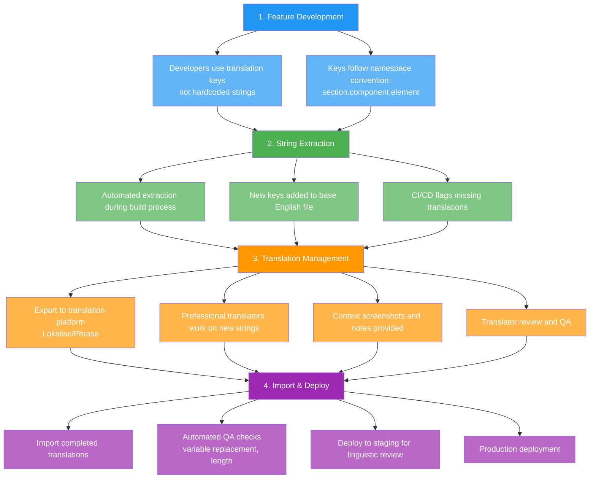
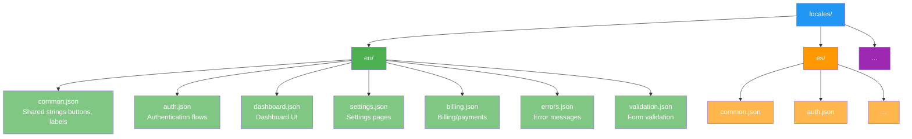

# Language Strategy

## Overview

This document outlines PopSystem's multi-language support roadmap, establishing a phased approach to internationalization that aligns with our global expansion strategy. The strategy balances technical complexity with market opportunity, ensuring we can effectively serve users across linguistic boundaries.

## Language Rollout Roadmap

| Phase | Languages | Priority | Timeline | Market Coverage |
|-------|-----------|----------|----------|-----------------|
| v1-v2 | English only | Core | Current | North America, UK, Ireland, Australia, NZ |
| v3 | + Spanish | North America | Q2 2026 | + Mexico, Spain, LATAM |
| v4 | + French, German, Portuguese | EU/LATAM | Q4 2026 | + France, Germany, Brazil, Portugal |
| v4+ | + Mandarin, Japanese, Korean | APAC | 2027+ | + China, Japan, Korea, Taiwan, Singapore |

### Phase Rationale

**Phase 1-2 (English Only)**
- Focus on product-market fit in English-speaking markets
- Build core functionality without translation overhead
- Establish technical foundations for future i18n
- Market size: 500M+ potential users

**Phase 3 (Spanish)**
- Second most spoken language globally (460M native speakers)
- Critical for North American expansion (Mexico, US Hispanic market)
- Opens LATAM markets (Spain, Argentina, Colombia, etc.)
- Relatively straightforward implementation (similar to English structure)

**Phase 4 (French, German, Portuguese)**
- EU market expansion (GDPR compliance aligned)
- French: 280M speakers (France, Canada, Belgium, Africa)
- German: 100M speakers (Germany, Austria, Switzerland - high GDP markets)
- Portuguese: 260M speakers (Brazil - largest LATAM market, Portugal)

**Phase 4+ (APAC Languages)**
- Massive market potential but complex requirements
- Mandarin: 1.1B speakers (China, Taiwan, Singapore)
- Japanese: 125M speakers (high-value market)
- Korean: 80M speakers (tech-savvy market)
- Requires significant infrastructure (data residency, partnerships)

## Translation Workflow

### Development Workflow



### Translation Quality Gates

- **Technical QA**: Variable placeholders intact, no syntax errors
- **Length Validation**: UI overflow detection (German often 30% longer)
- **Contextual Review**: In-app review by native speakers
- **A/B Testing**: User feedback on translation quality
- **Continuous Improvement**: Analytics on language-specific user issues

### Roles and Responsibilities

| Role | Responsibility |
|------|----------------|
| Developers | Use translation keys, provide context |
| Product Managers | Define UI text, approve translations |
| Translators | Professional translation, cultural adaptation |
| Linguistic Reviewers | Native speaker QA, context verification |
| DevOps | Automation, CI/CD integration |

## String Externalization

### Key Naming Convention

```javascript
// Namespace structure: [section].[component].[element].[variant]

// Good examples:
"dashboard.header.welcome_message"
"settings.billing.payment_method.add_button"
"auth.login.error.invalid_credentials"
"common.actions.save"
"common.actions.cancel"

// Bad examples:
"welcomeMsg" // Not namespaced
"button1" // Not descriptive
"Click here to save your changes" // Hardcoded string
```

### String Organization



### Context Provision

```javascript
// Provide context for translators
{
  "dashboard.stats.active_users": {
    "message": "{{count}} active users",
    "description": "Shows the number of currently active users in the system",
    "screenshot": "dashboard-stats-section.png",
    "maxLength": 50,
    "context": "Displayed in dashboard statistics card"
  }
}
```

## Pluralization Rules

### Language-Specific Plural Forms

Different languages have different pluralization rules:

| Language | Plural Forms | Example |
|----------|--------------|---------|
| English | 2 (one, other) | 1 item, 2 items |
| Spanish | 2 (one, other) | 1 artículo, 2 artículos |
| French | 2 (one, other) | 1 élément, 2 éléments |
| German | 2 (one, other) | 1 Element, 2 Elemente |
| Portuguese | 2 (one, other) | 1 item, 2 itens |
| Polish | 3 (one, few, many) | 1 przedmiot, 2-4 przedmioty, 5+ przedmiotów |
| Russian | 3 (one, few, many) | 1 элемент, 2-4 элемента, 5+ элементов |
| Arabic | 6 (zero, one, two, few, many, other) | Complex rules |

### Implementation Example

```javascript
// Using i18next pluralization
{
  "en": {
    "items_count": "{{count}} item",
    "items_count_plural": "{{count}} items"
  },
  "es": {
    "items_count": "{{count}} artículo",
    "items_count_plural": "{{count}} artículos"
  },
  "ru": {
    "items_count_one": "{{count}} элемент",
    "items_count_few": "{{count}} элемента",
    "items_count_many": "{{count}} элементов"
  }
}

// Usage
t('items_count', { count: userCount })
```

### Ordinal Numbers

```javascript
{
  "en": {
    "ordinal_1": "1st",
    "ordinal_2": "2nd",
    "ordinal_3": "3rd",
    "ordinal_other": "{{count}}th"
  },
  "es": {
    "ordinal_1": "1º",
    "ordinal_2": "2º",
    "ordinal_other": "{{count}}º"
  }
}
```

## Date/Time Formatting

### Locale-Specific Formats

| Locale | Date Format | Time Format | Example |
|--------|-------------|-------------|---------|
| en-US | MM/DD/YYYY | 12-hour (AM/PM) | 12/21/2025 3:45 PM |
| en-GB | DD/MM/YYYY | 24-hour | 21/12/2025 15:45 |
| es-ES | DD/MM/YYYY | 24-hour | 21/12/2025 15:45 |
| es-MX | DD/MM/YYYY | 12-hour | 21/12/2025 3:45 PM |
| de-DE | DD.MM.YYYY | 24-hour | 21.12.2025 15:45 |
| fr-FR | DD/MM/YYYY | 24-hour | 21/12/2025 15:45 |
| pt-BR | DD/MM/YYYY | 24-hour | 21/12/2025 15:45 |
| ja-JP | YYYY/MM/DD | 24-hour | 2025/12/21 15:45 |
| zh-CN | YYYY-MM-DD | 24-hour | 2025-12-21 15:45 |

### Implementation

```javascript
import { format, formatDistanceToNow } from 'date-fns';
import { enUS, es, de, fr, ptBR, ja, zhCN } from 'date-fns/locale';

const localeMap = {
  'en-US': enUS,
  'es-ES': es,
  'de-DE': de,
  'fr-FR': fr,
  'pt-BR': ptBR,
  'ja-JP': ja,
  'zh-CN': zhCN
};

// Format date according to user's locale
function formatDate(date, userLocale) {
  return format(date, 'P', { locale: localeMap[userLocale] });
}

// Relative time formatting
function formatRelativeTime(date, userLocale) {
  return formatDistanceToNow(date, {
    locale: localeMap[userLocale],
    addSuffix: true
  });
}
```

### Timezone Handling

```javascript
// Store all timestamps in UTC
// Display in user's timezone
import { formatInTimeZone } from 'date-fns-tz';

function displayTime(utcTimestamp, userTimezone, userLocale) {
  return formatInTimeZone(
    utcTimestamp,
    userTimezone,
    'PPpp', // Long date and time format
    { locale: localeMap[userLocale] }
  );
}
```

### Calendar Considerations

- Week start day varies (Sunday in US, Monday in EU)
- First week of year definition
- Holiday calendars
- Business day calculations

## Number Formatting

### Locale-Specific Number Formats

| Locale | Decimal Sep | Thousands Sep | Example |
|--------|-------------|---------------|---------|
| en-US | . | , | 1,234,567.89 |
| en-GB | . | , | 1,234,567.89 |
| es-ES | , | . | 1.234.567,89 |
| de-DE | , | . | 1.234.567,89 |
| fr-FR | , | (space) | 1 234 567,89 |
| pt-BR | , | . | 1.234.567,89 |

### Implementation

```javascript
// Use Intl.NumberFormat API
function formatNumber(number, locale, options = {}) {
  return new Intl.NumberFormat(locale, options).format(number);
}

// Examples
formatNumber(1234567.89, 'en-US') // "1,234,567.89"
formatNumber(1234567.89, 'de-DE') // "1.234.567,89"
formatNumber(1234567.89, 'fr-FR') // "1 234 567,89"

// Percentage formatting
formatNumber(0.1234, 'en-US', { style: 'percent' }) // "12.34%"

// Compact notation (large numbers)
formatNumber(1234567, 'en-US', { notation: 'compact' }) // "1.2M"
formatNumber(1234567, 'es-ES', { notation: 'compact' }) // "1,2 M"
```

### Unit Formatting

```javascript
// Measurement units
const distanceFormatter = new Intl.NumberFormat('en-US', {
  style: 'unit',
  unit: 'kilometer'
});
distanceFormatter.format(123.45) // "123.45 km"

// Storage units
formatBytes(bytes, locale) {
  const sizes = ['Bytes', 'KB', 'MB', 'GB', 'TB'];
  if (bytes === 0) return '0 Bytes';
  const i = parseInt(Math.floor(Math.log(bytes) / Math.log(1024)));
  return formatNumber(bytes / Math.pow(1024, i), locale, {
    maximumFractionDigits: 2
  }) + ' ' + sizes[i];
}
```

## Currency Formatting

### Currency by Locale

| Locale | Currency | Symbol | Position | Example |
|--------|----------|--------|----------|---------|
| en-US | USD | $ | Prefix | $1,234.56 |
| en-GB | GBP | £ | Prefix | £1,234.56 |
| en-CA | CAD | $ | Prefix | $1,234.56 |
| es-ES | EUR | € | Suffix | 1.234,56 € |
| es-MX | MXN | $ | Prefix | $1,234.56 |
| de-DE | EUR | € | Suffix | 1.234,56 € |
| fr-FR | EUR | € | Suffix | 1 234,56 € |
| pt-BR | BRL | R$ | Prefix | R$ 1.234,56 |
| ja-JP | JPY | ¥ | Prefix | ¥1,235 |
| zh-CN | CNY | ¥ | Prefix | ¥1,234.56 |

### Implementation

```javascript
function formatCurrency(amount, currency, locale) {
  return new Intl.NumberFormat(locale, {
    style: 'currency',
    currency: currency,
    currencyDisplay: 'symbol' // or 'code', 'name'
  }).format(amount);
}

// Examples
formatCurrency(1234.56, 'USD', 'en-US') // "$1,234.56"
formatCurrency(1234.56, 'EUR', 'de-DE') // "1.234,56 €"
formatCurrency(1234.56, 'JPY', 'ja-JP') // "¥1,235" (no decimals)
formatCurrency(1234.56, 'BRL', 'pt-BR') // "R$ 1.234,56"
```

### Multi-Currency Display

```javascript
// User settings
{
  "displayCurrency": "USD",  // What user wants to see
  "billingCurrency": "EUR",  // What they're actually charged
  "locale": "en-US"          // Format preference
}

// Display with conversion
function displayAmount(amount, fromCurrency, toCurrency, locale, exchangeRate) {
  const converted = amount * exchangeRate;
  return `${formatCurrency(converted, toCurrency, locale)}
          (${formatCurrency(amount, fromCurrency, locale)})`;
}

// Example: €100 displayed to US user
// "$110.00 (€100.00)"
```

## RTL (Right-to-Left) Support

### Future RTL Languages

- Arabic (420M speakers)
- Hebrew (9M speakers)
- Persian/Farsi (110M speakers)
- Urdu (230M speakers)

### Technical Considerations (v5+)

```css
/* Direction-aware CSS */
html[dir="rtl"] {
  direction: rtl;
}

/* Use logical properties */
.container {
  margin-inline-start: 20px; /* left in LTR, right in RTL */
  padding-inline-end: 10px;  /* right in LTR, left in RTL */
}

/* Avoid fixed directional properties */
/* Bad */
.element { margin-left: 20px; }

/* Good */
.element { margin-inline-start: 20px; }
```

### UI/UX Considerations

- Mirror layout (navigation, menus)
- Icon directionality (arrows, chevrons)
- Text alignment (right-aligned for RTL)
- Form field order
- Reading flow (right to left)
- Number formatting (still LTR in RTL languages)

### Implementation Strategy

```javascript
// Detect text direction from locale
function getTextDirection(locale) {
  const rtlLocales = ['ar', 'he', 'fa', 'ur'];
  const lang = locale.split('-')[0];
  return rtlLocales.includes(lang) ? 'rtl' : 'ltr';
}

// Apply to document
document.documentElement.setAttribute('dir', getTextDirection(userLocale));
```

## Translation Management Tools

### Tool Evaluation Matrix

| Tool | Pros | Cons | Best For | Cost |
|------|------|------|----------|------|
| **Lokalise** | Developer-friendly, GitHub integration, Screenshots, Translation memory | Higher cost | Tech companies, Agile teams | $120/mo+ |
| **Phrase** | Enterprise features, API, Workflow automation | Complex setup | Large enterprises | $198/mo+ |
| **Crowdin** | Community translation, Good free tier | Less enterprise features | Open source, Community | $40/mo+ |
| **POEditor** | Simple, Affordable | Basic features | Small teams, Startups | $19/mo+ |
| **Transifex** | Good UI, Many integrations | Medium cost | Mid-size companies | $119/mo+ |

### Recommended: Lokalise

**Selection Rationale:**
- Excellent developer experience (CLI, API, webhooks)
- GitHub/GitLab integration for CI/CD
- Context provision (screenshots, descriptions)
- Translation memory and glossary management
- Professional translator marketplace
- Scalable pricing
- Strong support for React/Next.js

### Lokalise Integration Workflow

```yaml
# .github/workflows/i18n.yml
name: Sync Translations

on:
  push:
    paths:
      - 'locales/en/**'
  schedule:
    - cron: '0 0 * * *' # Daily sync

jobs:
  sync:
    runs-on: ubuntu-latest
    steps:
      - uses: actions/checkout@v3

      - name: Upload source files
        run: |
          lokalise2 file upload \
            --token ${{ secrets.LOKALISE_TOKEN }} \
            --project-id ${{ secrets.LOKALISE_PROJECT_ID }} \
            --file locales/en/**/*.json \
            --lang-iso en

      - name: Download translations
        run: |
          lokalise2 file download \
            --token ${{ secrets.LOKALISE_TOKEN }} \
            --project-id ${{ secrets.LOKALISE_PROJECT_ID }} \
            --format json \
            --dest locales/

      - name: Create PR with translations
        uses: peter-evans/create-pull-request@v5
        with:
          commit-message: 'chore: update translations'
          title: 'Update translations from Lokalise'
```

### Translation Memory Benefits

- **Consistency**: Same phrase translated identically across app
- **Cost Reduction**: Don't re-translate existing strings
- **Speed**: Instant translation for repeated phrases
- **Quality**: Build terminology glossary over time

### Glossary Management

```json
{
  "glossary": [
    {
      "term": "PopSystem",
      "translation": "PopSystem", // Brand name - do not translate
      "description": "Product name",
      "caseSensitive": true
    },
    {
      "term": "Dashboard",
      "translations": {
        "es": "Panel de Control",
        "de": "Dashboard",
        "fr": "Tableau de Bord"
      }
    },
    {
      "term": "Workspace",
      "note": "Refers to a team's shared environment"
    }
  ]
}
```

## Success Metrics

### Translation Quality KPIs

- **Translation Completeness**: % of strings translated per language
- **Time to Translate**: Average time from string creation to translation
- **User Satisfaction**: Language-specific NPS scores
- **Error Rate**: Bugs reported related to translations
- **Adoption Rate**: % of users selecting non-English languages

### Target Metrics (Phase 3+)

| Metric | Target | Measurement |
|--------|--------|-------------|
| Translation Completeness | 100% for released languages | Automated checks |
| Translation Turnaround | < 48 hours for critical strings | Lokalise analytics |
| User Satisfaction | NPS > 40 for all languages | User surveys |
| Adoption Rate | > 30% in target markets | Analytics |
| String Reuse | > 60% from translation memory | Lokalise reports |

## Risk Mitigation

### Common Pitfalls

1. **Hardcoded Strings**: Enforce linting rules to prevent
2. **Concatenation**: Breaks grammar in other languages
3. **Text in Images**: Requires separate assets per language
4. **Fixed UI Dimensions**: German text can be 30% longer
5. **Date/Number Assumptions**: Different formats break functionality
6. **Cultural Insensitivity**: Requires native speaker review

### Quality Assurance Process

```mermaid
graph TD
    A[Quality Assurance Process]
    A --> B[1. Automated QA]
    A --> C[2. Translation QA]
    A --> D[3. Visual QA]
    A --> E[4. Linguistic QA]
    A --> F[5. User Testing]

    B --> B1[ESLint rules<br>no hardcoded strings]
    B --> B2[Build-time translation<br>key validation]
    B --> B3[Character length warnings]

    C --> C1[Variable placeholder verification]
    C --> C2[Syntax validation]
    C --> C3[Glossary compliance]

    D --> D1[Automated screenshot comparison]
    D --> D2[UI overflow detection]
    D --> D3[Layout shift monitoring]

    E --> E1[Native speaker review]
    E --> E2[Context verification]
    E --> E3[Cultural appropriateness]

    F --> F1[Beta testing with target markets]
    F --> F2[Feedback collection]
    F --> F3[Iterative improvements]

    style A fill:#2196f3,color:#fff
    style B fill:#4caf50,color:#fff
    style C fill:#ff9800,color:#fff
    style D fill:#9c27b0,color:#fff
    style E fill:#00bcd4,color:#fff
    style F fill:#f44336,color:#fff
    style B1 fill:#81c784,color:#fff
    style B2 fill:#81c784,color:#fff
    style B3 fill:#81c784,color:#fff
    style C1 fill:#ffb74d,color:#fff
    style C2 fill:#ffb74d,color:#fff
    style C3 fill:#ffb74d,color:#fff
    style D1 fill:#ba68c8,color:#fff
    style D2 fill:#ba68c8,color:#fff
    style D3 fill:#ba68c8,color:#fff
    style E1 fill:#4dd0e1,color:#fff
    style E2 fill:#4dd0e1,color:#fff
    style E3 fill:#4dd0e1,color:#fff
    style F1 fill:#e57373,color:#fff
    style F2 fill:#e57373,color:#fff
    style F3 fill:#e57373,color:#fff
```



## Next Steps

### Phase 1-2 (Current - v2 Launch)
- [ ] Implement i18n framework (see Localization_Tech.md)
- [ ] Externalize all strings to translation files
- [ ] Set up Lokalise account and integration
- [ ] Establish translation workflow and QA process
- [ ] Create English glossary and style guide

### Phase 3 (Spanish Launch)
- [ ] Hire professional Spanish translators
- [ ] Translate all strings to Spanish
- [ ] Native speaker QA and testing
- [ ] Beta launch in Mexico/Spain markets
- [ ] Collect feedback and iterate

### Phase 4 (EU/LATAM Expansion)
- [ ] Add French, German, Portuguese support
- [ ] Regional compliance alignment (GDPR, LGPD)
- [ ] Multi-currency implementation
- [ ] European market launch

### Phase 4+ (APAC Planning)
- [ ] APAC market research and strategy
- [ ] Partnership discussions for China market
- [ ] Technical evaluation for CJK languages
- [ ] Data residency planning

## Appendix

### Language Codes (ISO 639-1 + ISO 3166-1)

| Code | Language | Region |
|------|----------|--------|
| en-US | English | United States |
| en-GB | English | United Kingdom |
| en-CA | English | Canada |
| en-AU | English | Australia |
| es-ES | Spanish | Spain |
| es-MX | Spanish | Mexico |
| es-AR | Spanish | Argentina |
| fr-FR | French | France |
| fr-CA | French | Canada |
| de-DE | German | Germany |
| de-AT | German | Austria |
| pt-BR | Portuguese | Brazil |
| pt-PT | Portuguese | Portugal |
| ja-JP | Japanese | Japan |
| zh-CN | Chinese (Simplified) | China |
| zh-TW | Chinese (Traditional) | Taiwan |
| ko-KR | Korean | South Korea |

### Resources

- [Unicode CLDR](http://cldr.unicode.org/) - Locale data repository
- [i18next Documentation](https://www.i18next.com/)
- [Lokalise Developer Hub](https://docs.lokalise.com/)
- [W3C Internationalization](https://www.w3.org/International/)
- [Mozilla L10n Guide](https://mozilla-l10n.github.io/localizer-documentation/)
