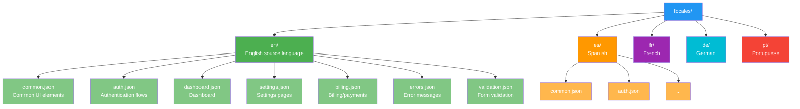
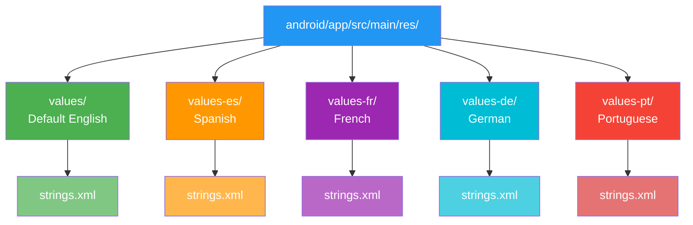
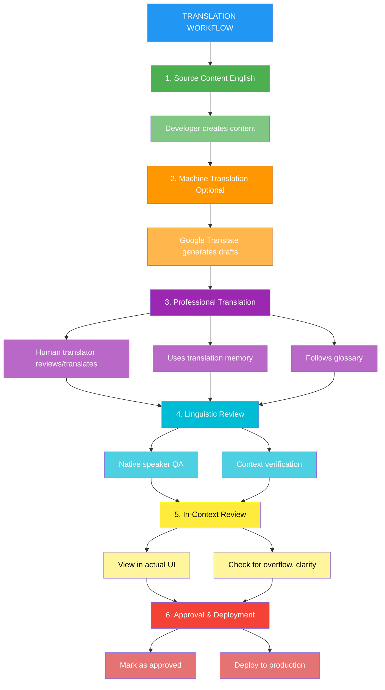

# Localization Technology Strategy

## Overview

This document outlines the technical strategy and implementation details for internationalizing (i18n) and localizing (l10n) PopSystem across multiple languages and regions. Building on the Language Strategy, this document provides detailed technical specifications, framework selections, integration patterns, and workflow automation for delivering a truly global product.

## i18n Framework Selection

### Framework Evaluation

#### i18next (Recommended)

**Selection Rationale**: Industry-leading JavaScript i18n framework with comprehensive features and ecosystem.

**Pros**:
- Comprehensive feature set (pluralization, context, nesting, interpolation)
- Framework-agnostic core with React, Vue, Angular adapters
- Excellent documentation and community support
- Plugin ecosystem (detection, backend loading, caching)
- JSON-based translation files (easy for translators)
- Namespace support for code splitting
- ICU message format support
- RTL language support built-in

**Cons**:
- Learning curve for advanced features
- Bundle size (mitigated with tree-shaking and lazy loading)

**Technical Specs**:
- Core library: ~15KB gzipped
- React bindings: ~5KB gzipped
- Total with plugins: ~25-30KB gzipped

```bash
npm install i18next react-i18next i18next-browser-languagedetector i18next-http-backend
```

#### Alternatives Considered

**FormatJS (react-intl)**
- Pros: React-focused, ICU messages, good TypeScript support
- Cons: React-only, larger bundle, less flexible
- Verdict: Good alternative if React-only, but i18next more versatile

**LinguiJS**
- Pros: Modern, great DX, macro-based extraction
- Cons: Smaller community, newer, less proven at scale
- Verdict: Promising but i18next more mature

**Polyglot.js**
- Pros: Lightweight (3KB), simple
- Cons: Limited features, no framework integration
- Verdict: Too basic for our needs

### i18next Configuration

```javascript
// i18n.config.js
import i18n from 'i18next';
import { initReactI18next } from 'react-i18next';
import LanguageDetector from 'i18next-browser-languagedetector';
import Backend from 'i18next-http-backend';

i18n
  // Load translations from backend
  .use(Backend)
  // Detect user language
  .use(LanguageDetector)
  // Pass i18n instance to react-i18next
  .use(initReactI18next)
  // Initialize
  .init({
    // Fallback language if translation missing
    fallbackLng: 'en',

    // Supported languages
    supportedLngs: ['en', 'es', 'fr', 'de', 'pt'],

    // Namespace separation for code splitting
    ns: ['common', 'auth', 'dashboard', 'settings', 'billing', 'errors', 'validation'],
    defaultNS: 'common',

    // Debug in development
    debug: process.env.NODE_ENV === 'development',

    // Interpolation options
    interpolation: {
      escapeValue: false, // React already escapes
      formatSeparator: ',',
      format: function(value, format, lng) {
        // Custom formatting
        if (format === 'uppercase') return value.toUpperCase();
        if (format === 'lowercase') return value.toLowerCase();
        if (value instanceof Date) {
          return new Intl.DateTimeFormat(lng).format(value);
        }
        return value;
      }
    },

    // Backend configuration
    backend: {
      loadPath: '/locales/{{lng}}/{{ns}}.json',
      addPath: '/locales/add/{{lng}}/{{ns}}',
      allowMultiLoading: false,
      crossDomain: false,
      withCredentials: false,
      overrideMimeType: false,
      requestOptions: {
        mode: 'cors',
        credentials: 'same-origin',
        cache: 'default'
      }
    },

    // Language detection options
    detection: {
      // Order of detection methods
      order: [
        'querystring',
        'cookie',
        'localStorage',
        'sessionStorage',
        'navigator',
        'htmlTag',
        'path',
        'subdomain'
      ],

      // Keys to lookup language from
      lookupQuerystring: 'lng',
      lookupCookie: 'i18next',
      lookupLocalStorage: 'i18nextLng',
      lookupSessionStorage: 'i18nextLng',
      lookupFromPathIndex: 0,
      lookupFromSubdomainIndex: 0,

      // Cache user language
      caches: ['localStorage', 'cookie'],
      excludeCacheFor: ['cimode'],

      // Cookie options
      cookieMinutes: 10080, // 1 week
      cookieDomain: 'popsystem.com',
      cookieSecure: true,
      cookieSameSite: 'strict'
    },

    // React-specific options
    react: {
      useSuspense: true,
      bindI18n: 'languageChanged loaded',
      bindI18nStore: 'added removed',
      transEmptyNodeValue: '',
      transSupportBasicHtmlNodes: true,
      transKeepBasicHtmlNodesFor: ['br', 'strong', 'i', 'p']
    },

    // Save missing keys (development only)
    saveMissing: process.env.NODE_ENV === 'development',
    missingKeyHandler: (lng, ns, key, fallbackValue) => {
      if (process.env.NODE_ENV === 'development') {
        console.warn(`Missing translation: ${lng}:${ns}:${key}`);
      }
    }
  });

export default i18n;
```

### React Implementation

```typescript
// App.tsx - Initialize i18n
import React, { Suspense } from 'react';
import './i18n.config';

function App() {
  return (
    <Suspense fallback={<LoadingSpinner />}>
      <AppContent />
    </Suspense>
  );
}

// Component usage
import { useTranslation } from 'react-i18next';

function Dashboard() {
  const { t, i18n } = useTranslation('dashboard');

  const changeLanguage = (lng: string) => {
    i18n.changeLanguage(lng);
  };

  return (
    <div>
      <h1>{t('welcome_message', { name: user.name })}</h1>
      <p>{t('description')}</p>

      {/* Pluralization */}
      <p>{t('items_count', { count: items.length })}</p>

      {/* Context-based translation */}
      <p>{t('status', { context: subscription.status })}</p>

      {/* Nested translation */}
      <p>{t('nested.key.example')}</p>

      {/* HTML in translations */}
      <Trans i18nKey="terms_agreement">
        I agree to the <a href="/terms">Terms of Service</a>
      </Trans>
    </div>
  );
}

// Hook for current language
function LanguageSwitcher() {
  const { i18n } = useTranslation();
  const currentLang = i18n.language;

  return (
    <select
      value={currentLang}
      onChange={(e) => i18n.changeLanguage(e.target.value)}
    >
      <option value="en">English</option>
      <option value="es">Español</option>
      <option value="fr">Français</option>
      <option value="de">Deutsch</option>
      <option value="pt">Português</option>
    </select>
  );
}
```

### TypeScript Support

```typescript
// types/i18next.d.ts
import 'i18next';
import common from '../public/locales/en/common.json';
import auth from '../public/locales/en/auth.json';
import dashboard from '../public/locales/en/dashboard.json';

declare module 'i18next' {
  interface CustomTypeOptions {
    defaultNS: 'common';
    resources: {
      common: typeof common;
      auth: typeof auth;
      dashboard: typeof dashboard;
    };
  }
}

// Now you get autocomplete and type checking
const { t } = useTranslation('dashboard');
t('welcome_message'); // ✓ Type-safe
t('invalid_key');     // ✗ TypeScript error
```

## String Extraction and Management

### Automated String Extraction

```bash
# Install extraction tool
npm install --save-dev i18next-parser

# Configure extraction
# i18next-parser.config.js
module.exports = {
  contextSeparator: '_',
  createOldCatalogs: false,
  defaultNamespace: 'common',
  defaultValue: '',
  indentation: 2,
  keepRemoved: false,
  keySeparator: '.',
  lexers: {
    js: ['JavascriptLexer'],
    ts: ['JavascriptLexer'],
    jsx: ['JsxLexer'],
    tsx: ['JsxLexer'],
    default: ['JavascriptLexer']
  },
  lineEnding: 'auto',
  locales: ['en', 'es', 'fr', 'de', 'pt'],
  namespaceSeparator: ':',
  output: 'public/locales/$LOCALE/$NAMESPACE.json',
  pluralSeparator: '_',
  input: ['src/**/*.{js,jsx,ts,tsx}'],
  sort: true,
  verbose: false,
  failOnWarnings: false,
  failOnUpdate: false,
  customValueTemplate: null
};
```

```json
// package.json scripts
{
  "scripts": {
    "i18n:extract": "i18next-parser",
    "i18n:validate": "node scripts/validate-translations.js",
    "i18n:sync": "node scripts/sync-to-lokalise.js"
  }
}
```

### Translation File Structure



```json
// locales/en/common.json
{
  "actions": {
    "save": "Save",
    "cancel": "Cancel",
    "delete": "Delete",
    "edit": "Edit",
    "confirm": "Confirm",
    "close": "Close"
  },
  "navigation": {
    "dashboard": "Dashboard",
    "settings": "Settings",
    "billing": "Billing",
    "users": "Users",
    "logout": "Log Out"
  },
  "status": {
    "active": "Active",
    "inactive": "Inactive",
    "pending": "Pending",
    "cancelled": "Cancelled"
  }
}

// locales/en/auth.json
{
  "login": {
    "title": "Log In to Your Account",
    "email_label": "Email Address",
    "password_label": "Password",
    "submit_button": "Log In",
    "forgot_password": "Forgot password?",
    "no_account": "Don't have an account?",
    "signup_link": "Sign up"
  },
  "signup": {
    "title": "Create Your Account",
    "name_label": "Full Name",
    "email_label": "Email Address",
    "password_label": "Password",
    "password_confirm_label": "Confirm Password",
    "submit_button": "Sign Up",
    "have_account": "Already have an account?",
    "login_link": "Log in",
    "terms_agreement": "By signing up, you agree to our <1>Terms of Service</1> and <3>Privacy Policy</3>"
  },
  "errors": {
    "invalid_credentials": "Invalid email or password",
    "email_taken": "This email is already registered",
    "password_mismatch": "Passwords do not match",
    "weak_password": "Password must be at least 8 characters"
  }
}

// locales/en/dashboard.json
{
  "welcome_message": "Welcome back, {{name}}!",
  "description": "Here's what's happening with your account today.",
  "stats": {
    "active_users": "Active Users",
    "active_users_count": "{{count}} active user",
    "active_users_count_plural": "{{count}} active users",
    "revenue_this_month": "Revenue This Month",
    "new_signups": "New Signups",
    "conversion_rate": "Conversion Rate"
  },
  "recent_activity": {
    "title": "Recent Activity",
    "no_activity": "No recent activity to display",
    "view_all": "View All Activity"
  }
}

// locales/en/validation.json
{
  "required": "This field is required",
  "email_invalid": "Please enter a valid email address",
  "min_length": "Must be at least {{min}} characters",
  "max_length": "Must be no more than {{max}} characters",
  "number_min": "Must be at least {{min}}",
  "number_max": "Must be no more than {{max}}",
  "url_invalid": "Please enter a valid URL",
  "phone_invalid": "Please enter a valid phone number"
}
```

### Context and Disambiguation

```json
// Using context for same word, different meaning
{
  "status": "Status",
  "status_active": "Active",        // Context: user is active
  "status_inactive": "Inactive",

  // Using context parameter in code
  // t('button', { context: 'save' })
  "button": "Button",
  "button_save": "Save",
  "button_cancel": "Cancel",
  "button_delete": "Delete",

  // Provide context with comments for translators
  "cancel": "Cancel",  // @context: Button to cancel the current operation
  "cancel_subscription": "Cancel", // @context: Button to cancel subscription (permanent)

  // Different contexts for "read"
  "read_past": "I read the book",     // Past tense
  "read_present": "I will read it",   // Present/future
  "read_adjective": "Read message"    // Adjective
}
```

## Translation Management Systems

### Platform Comparison

| Feature | Lokalise | Phrase | Crowdin | POEditor | Transifex |
|---------|----------|--------|---------|----------|-----------|
| **Pricing** | $120/mo | $198/mo | $40/mo | $19/mo | $119/mo |
| **Developer Tools** | Excellent | Excellent | Good | Basic | Good |
| **GitHub Integration** | Yes | Yes | Yes | Limited | Yes |
| **Screenshot Context** | Yes | Yes | Yes | No | Yes |
| **Translation Memory** | Yes | Yes | Yes | Yes | Yes |
| **Glossary** | Yes | Yes | Yes | Yes | Yes |
| **API** | Robust | Robust | Good | Basic | Good |
| **Translator Marketplace** | Yes | Yes | Yes | No | Yes |
| **Machine Translation** | Yes | Yes | Yes | Yes | Yes |
| **Pluralization Support** | Excellent | Excellent | Good | Basic | Good |
| **ICU Message Format** | Yes | Yes | Yes | Limited | Yes |
| **React/i18next Support** | Excellent | Good | Good | Basic | Good |

### Lokalise Implementation (Recommended)

**Why Lokalise**:
- Best-in-class developer experience
- Excellent GitHub/CI/CD integration
- Screenshot context for translators
- i18next native support
- Translation memory and glossary
- Professional translator marketplace
- Reasonable pricing for value

```bash
# Install Lokalise CLI
npm install -g @lokalise/cli

# Configure Lokalise
# .lokalise.yml
project_id: "123456789abcdef.12345678"
file_format: json
base_locale: en

pull:
  from_locale: "*"
  to_locale: "%LOCALE_ISO%"
  file_path: "public/locales/%LOCALE_ISO%/%FILENAME%.json"
  all_platforms: true
  filter_langs: ["es", "fr", "de", "pt"]
  replace_breaks: false
  placeholder_format: "icu"
  filter_data: ["translated"]

push:
  file_path: "public/locales/en/*.json"
  to_locale: "en"
  cleanup_mode: false
  detect_icu_plurals: true
  convert_placeholders: true
  skip_detect_lang_iso: false
```

### CI/CD Integration

```yaml
# .github/workflows/i18n-sync.yml
name: Sync Translations

on:
  # Run on push to translation files
  push:
    paths:
      - 'public/locales/en/**/*.json'

  # Run daily to pull latest translations
  schedule:
    - cron: '0 9 * * *'  # 9 AM UTC daily

  # Manual trigger
  workflow_dispatch:

jobs:
  sync-translations:
    runs-on: ubuntu-latest

    steps:
      - name: Checkout code
        uses: actions/checkout@v3
        with:
          fetch-depth: 0

      - name: Setup Node.js
        uses: actions/setup-node@v3
        with:
          node-version: '18'

      - name: Install dependencies
        run: npm ci

      - name: Extract strings
        run: npm run i18n:extract

      - name: Install Lokalise CLI
        run: npm install -g @lokalise/cli

      - name: Push source strings to Lokalise
        if: github.event_name == 'push'
        env:
          LOKALISE_API_TOKEN: ${{ secrets.LOKALISE_API_TOKEN }}
        run: |
          lokalise2 file upload \
            --token "$LOKALISE_API_TOKEN" \
            --project-id "${{ secrets.LOKALISE_PROJECT_ID }}" \
            --file public/locales/en/*.json \
            --lang-iso en \
            --replace-modified \
            --distinguish-by-file \
            --detect-icu-plurals \
            --convert-placeholders

      - name: Pull translations from Lokalise
        env:
          LOKALISE_API_TOKEN: ${{ secrets.LOKALISE_API_TOKEN }}
        run: |
          lokalise2 file download \
            --token "$LOKALISE_API_TOKEN" \
            --project-id "${{ secrets.LOKALISE_PROJECT_ID }}" \
            --format json \
            --original-filenames=true \
            --directory-prefix=public/locales/ \
            --placeholder-format icu

      - name: Validate translations
        run: npm run i18n:validate

      - name: Create Pull Request
        uses: peter-evans/create-pull-request@v5
        with:
          token: ${{ secrets.GITHUB_TOKEN }}
          commit-message: 'chore(i18n): update translations from Lokalise'
          title: 'Update translations from Lokalise'
          body: |
            Automated translation update from Lokalise

            - Synced with latest translations
            - Validated all translation files
            - Ready for review and merge
          branch: i18n/lokalise-sync
          delete-branch: true
```

### Translation Validation Script

```javascript
// scripts/validate-translations.js
const fs = require('fs');
const path = require('path');

const LOCALES_DIR = path.join(__dirname, '../public/locales');
const SOURCE_LANG = 'en';

function validateTranslations() {
  const errors = [];
  const warnings = [];

  // Get all locales
  const locales = fs.readdirSync(LOCALES_DIR).filter(f =>
    fs.statSync(path.join(LOCALES_DIR, f)).isDirectory()
  );

  // Get all namespaces from source language
  const sourceNamespaces = fs.readdirSync(path.join(LOCALES_DIR, SOURCE_LANG))
    .filter(f => f.endsWith('.json'));

  for (const namespace of sourceNamespaces) {
    const sourcePath = path.join(LOCALES_DIR, SOURCE_LANG, namespace);
    const sourceKeys = getAllKeys(JSON.parse(fs.readFileSync(sourcePath, 'utf8')));

    for (const locale of locales) {
      if (locale === SOURCE_LANG) continue;

      const targetPath = path.join(LOCALES_DIR, locale, namespace);

      // Check if file exists
      if (!fs.existsSync(targetPath)) {
        errors.push(`Missing translation file: ${locale}/${namespace}`);
        continue;
      }

      const targetKeys = getAllKeys(JSON.parse(fs.readFileSync(targetPath, 'utf8')));

      // Check for missing keys
      const missingKeys = sourceKeys.filter(key => !targetKeys.includes(key));
      if (missingKeys.length > 0) {
        warnings.push(`${locale}/${namespace} missing keys: ${missingKeys.join(', ')}`);
      }

      // Check for extra keys (may indicate removed source keys)
      const extraKeys = targetKeys.filter(key => !sourceKeys.includes(key));
      if (extraKeys.length > 0) {
        warnings.push(`${locale}/${namespace} extra keys: ${extraKeys.join(', ')}`);
      }

      // Validate placeholders match
      const source = JSON.parse(fs.readFileSync(sourcePath, 'utf8'));
      const target = JSON.parse(fs.readFileSync(targetPath, 'utf8'));

      for (const key of sourceKeys) {
        const sourcePlaceholders = extractPlaceholders(getNestedValue(source, key));
        const targetPlaceholders = extractPlaceholders(getNestedValue(target, key));

        if (JSON.stringify(sourcePlaceholders.sort()) !== JSON.stringify(targetPlaceholders.sort())) {
          errors.push(
            `${locale}/${namespace}:${key} - placeholder mismatch. ` +
            `Source: ${sourcePlaceholders.join(', ')} | Target: ${targetPlaceholders.join(', ')}`
          );
        }
      }
    }
  }

  // Output results
  console.log('\n=== Translation Validation Results ===\n');

  if (errors.length > 0) {
    console.error('ERRORS:');
    errors.forEach(err => console.error(`  ❌ ${err}`));
  }

  if (warnings.length > 0) {
    console.warn('\nWARNINGS:');
    warnings.forEach(warn => console.warn(`  ⚠️  ${warn}`));
  }

  if (errors.length === 0 && warnings.length === 0) {
    console.log('✅ All translations valid!');
  }

  console.log(`\nTotal: ${errors.length} errors, ${warnings.length} warnings\n`);

  process.exit(errors.length > 0 ? 1 : 0);
}

function getAllKeys(obj, prefix = '') {
  let keys = [];
  for (const key in obj) {
    const fullKey = prefix ? `${prefix}.${key}` : key;
    if (typeof obj[key] === 'object' && obj[key] !== null && !Array.isArray(obj[key])) {
      keys = keys.concat(getAllKeys(obj[key], fullKey));
    } else {
      keys.push(fullKey);
    }
  }
  return keys;
}

function getNestedValue(obj, path) {
  return path.split('.').reduce((current, key) => current?.[key], obj);
}

function extractPlaceholders(text) {
  if (typeof text !== 'string') return [];
  const matches = text.match(/\{\{([^}]+)\}\}/g) || [];
  return matches.map(m => m.replace(/[{}]/g, ''));
}

validateTranslations();
```

## RTL Language Support

### CSS Implementation

```css
/* Global RTL support */
html[dir="rtl"] {
  direction: rtl;
  text-align: right;
}

html[dir="ltr"] {
  direction: ltr;
  text-align: left;
}

/* Use logical properties instead of directional */
.container {
  /* ❌ Bad - hardcoded direction */
  margin-left: 20px;
  padding-right: 10px;
  border-left: 1px solid #ccc;

  /* ✅ Good - direction-agnostic */
  margin-inline-start: 20px;
  padding-inline-end: 10px;
  border-inline-start: 1px solid #ccc;
}

/* Logical property reference */
.element {
  /* Horizontal */
  margin-inline-start: 10px;    /* left in LTR, right in RTL */
  margin-inline-end: 10px;      /* right in LTR, left in RTL */
  padding-inline: 10px 20px;    /* horizontal padding */

  /* Vertical */
  margin-block-start: 10px;     /* top */
  margin-block-end: 10px;       /* bottom */
  padding-block: 10px 20px;     /* vertical padding */

  /* Borders */
  border-inline-start: 1px solid #ccc;
  border-inline-end: 1px solid #ccc;
  border-block-start: 1px solid #ccc;
  border-block-end: 1px solid #ccc;

  /* Border radius */
  border-start-start-radius: 4px;  /* top-left in LTR, top-right in RTL */
  border-start-end-radius: 4px;    /* top-right in LTR, top-left in RTL */
  border-end-start-radius: 4px;
  border-end-end-radius: 4px;
}

/* FlexBox - automatically reverses in RTL */
.flex-container {
  display: flex;
  flex-direction: row;  /* Reverses in RTL */
  justify-content: flex-start;  /* Reverses in RTL */
}

/* Grid - use logical properties */
.grid-container {
  display: grid;
  grid-template-columns: 1fr 2fr;
  gap: 20px;
}

/* Icons that should flip in RTL */
.icon-arrow {
  transform: scaleX(1);
}

html[dir="rtl"] .icon-arrow {
  transform: scaleX(-1);  /* Flip horizontally */
}

/* Text alignment */
.text-start {
  text-align: start;  /* left in LTR, right in RTL */
}

.text-end {
  text-align: end;  /* right in LTR, left in RTL */
}

/* Float alternatives */
.float-start {
  float: inline-start;  /* left in LTR, right in RTL */
}

.float-end {
  float: inline-end;  /* right in LTR, left in RTL */
}
```

### React RTL Detection

```typescript
// hooks/useTextDirection.ts
import { useEffect } from 'react';
import { useTranslation } from 'react-i18next';

const RTL_LANGUAGES = ['ar', 'he', 'fa', 'ur'];

export function useTextDirection() {
  const { i18n } = useTranslation();

  const direction = RTL_LANGUAGES.includes(i18n.language.split('-')[0]) ? 'rtl' : 'ltr';

  useEffect(() => {
    document.documentElement.setAttribute('dir', direction);
    document.documentElement.setAttribute('lang', i18n.language);
  }, [direction, i18n.language]);

  return direction;
}

// Component usage
function App() {
  const direction = useTextDirection();

  return (
    <div className={`app ${direction}`}>
      {/* Content */}
    </div>
  );
}
```

### Tailwind CSS RTL Plugin

```javascript
// tailwind.config.js
module.exports = {
  plugins: [
    require('tailwindcss-rtl'),
  ],
  theme: {
    extend: {
      // Custom spacing with RTL support
    }
  }
}

// Usage in components
<div className="ml-4 rtl:mr-4 rtl:ml-0">
  Content
</div>

<div className="text-left rtl:text-right">
  Text
</div>
```

## Date/Time/Number Formatting

### Comprehensive Formatting Service

```typescript
// services/formatting.service.ts
import { format, formatDistanceToNow, parseISO } from 'date-fns';
import { enUS, es, fr, de, ptBR, ja, zhCN, ar } from 'date-fns/locale';

const LOCALE_MAP = {
  'en': enUS,
  'en-US': enUS,
  'en-GB': enUS,  // date-fns doesn't have en-GB, uses enUS with different format
  'es': es,
  'es-ES': es,
  'es-MX': es,
  'fr': fr,
  'fr-FR': fr,
  'de': de,
  'de-DE': de,
  'pt': ptBR,
  'pt-BR': ptBR,
  'ja': ja,
  'ja-JP': ja,
  'zh': zhCN,
  'zh-CN': zhCN,
  'ar': ar
};

export class FormattingService {
  constructor(private locale: string) {}

  /**
   * Format date according to locale
   */
  formatDate(date: Date | string, formatStr: string = 'P'): string {
    const dateObj = typeof date === 'string' ? parseISO(date) : date;
    const locale = LOCALE_MAP[this.locale] || enUS;

    return format(dateObj, formatStr, { locale });
  }

  /**
   * Format time according to locale
   */
  formatTime(date: Date | string): string {
    const dateObj = typeof date === 'string' ? parseISO(date) : date;
    const locale = LOCALE_MAP[this.locale] || enUS;

    // 'p' = localized time format
    return format(dateObj, 'p', { locale });
  }

  /**
   * Format date and time
   */
  formatDateTime(date: Date | string): string {
    const dateObj = typeof date === 'string' ? parseISO(date) : date;
    const locale = LOCALE_MAP[this.locale] || enUS;

    // 'PPpp' = localized date and time format
    return format(dateObj, 'PPpp', { locale });
  }

  /**
   * Format relative time (e.g., "2 hours ago")
   */
  formatRelativeTime(date: Date | string): string {
    const dateObj = typeof date === 'string' ? parseISO(date) : date;
    const locale = LOCALE_MAP[this.locale] || enUS;

    return formatDistanceToNow(dateObj, {
      locale,
      addSuffix: true
    });
  }

  /**
   * Format number with locale-specific formatting
   */
  formatNumber(value: number, options?: Intl.NumberFormatOptions): string {
    return new Intl.NumberFormat(this.locale, options).format(value);
  }

  /**
   * Format currency
   */
  formatCurrency(amount: number, currency: string): string {
    return new Intl.NumberFormat(this.locale, {
      style: 'currency',
      currency: currency
    }).format(amount);
  }

  /**
   * Format percentage
   */
  formatPercent(value: number, decimals: number = 2): string {
    return new Intl.NumberFormat(this.locale, {
      style: 'percent',
      minimumFractionDigits: decimals,
      maximumFractionDigits: decimals
    }).format(value);
  }

  /**
   * Format compact number (e.g., 1.2K, 1.5M)
   */
  formatCompact(value: number): string {
    return new Intl.NumberFormat(this.locale, {
      notation: 'compact',
      compactDisplay: 'short'
    }).format(value);
  }

  /**
   * Format file size
   */
  formatFileSize(bytes: number): string {
    const sizes = ['Bytes', 'KB', 'MB', 'GB', 'TB'];
    if (bytes === 0) return '0 Bytes';

    const i = Math.floor(Math.log(bytes) / Math.log(1024));
    const size = bytes / Math.pow(1024, i);

    return `${this.formatNumber(size, { maximumFractionDigits: 2 })} ${sizes[i]}`;
  }
}

// React hook
export function useFormatting() {
  const { i18n } = useTranslation();
  return new FormattingService(i18n.language);
}

// Usage in components
function Dashboard() {
  const fmt = useFormatting();

  return (
    <div>
      <p>Date: {fmt.formatDate(new Date())}</p>
      <p>Time: {fmt.formatTime(new Date())}</p>
      <p>DateTime: {fmt.formatDateTime(new Date())}</p>
      <p>Relative: {fmt.formatRelativeTime(createdAt)}</p>
      <p>Number: {fmt.formatNumber(1234567.89)}</p>
      <p>Currency: {fmt.formatCurrency(1234.56, 'USD')}</p>
      <p>Percent: {fmt.formatPercent(0.1234)}</p>
      <p>Compact: {fmt.formatCompact(1234567)}</p>
      <p>File: {fmt.formatFileSize(1234567)}</p>
    </div>
  );
}
```

## PDF Generation in Multiple Languages

### PDF Library Selection

**pdfmake** (Recommended for multi-language)
- Supports Unicode fonts
- RTL text support
- Good i18n capabilities
- Client or server-side generation

```bash
npm install pdfmake
```

### Multi-Language PDF Implementation

```javascript
// services/pdf.service.js
import pdfMake from 'pdfmake/build/pdfmake';
import pdfFonts from 'pdfmake/build/vfs_fonts';

// Register fonts
pdfMake.vfs = pdfFonts.pdfMake.vfs;

// Add custom fonts for different languages
pdfMake.fonts = {
  // Latin languages
  Roboto: {
    normal: 'Roboto-Regular.ttf',
    bold: 'Roboto-Bold.ttf',
    italics: 'Roboto-Italic.ttf',
    bolditalics: 'Roboto-BoldItalic.ttf'
  },
  // Arabic
  Cairo: {
    normal: 'Cairo-Regular.ttf',
    bold: 'Cairo-Bold.ttf'
  },
  // CJK languages
  NotoSansCJK: {
    normal: 'NotoSansCJKsc-Regular.ttf',
    bold: 'NotoSansCJKsc-Bold.ttf'
  }
};

export class PDFService {
  constructor(locale, translations, formatting) {
    this.locale = locale;
    this.t = translations;
    this.fmt = formatting;
    this.direction = this.getTextDirection(locale);
    this.font = this.getFontFamily(locale);
  }

  getTextDirection(locale) {
    const rtlLanguages = ['ar', 'he', 'fa', 'ur'];
    return rtlLanguages.includes(locale.split('-')[0]) ? 'rtl' : 'ltr';
  }

  getFontFamily(locale) {
    const lang = locale.split('-')[0];
    if (['ar', 'fa', 'ur'].includes(lang)) return 'Cairo';
    if (['zh', 'ja', 'ko'].includes(lang)) return 'NotoSansCJK';
    return 'Roboto';
  }

  /**
   * Generate invoice PDF in user's language
   */
  generateInvoice(invoice, user) {
    const docDefinition = {
      pageSize: 'A4',
      pageOrientation: 'portrait',
      defaultStyle: {
        font: this.font,
        direction: this.direction
      },

      content: [
        // Header
        {
          text: this.t('invoice.title'),
          style: 'header',
          alignment: this.direction === 'rtl' ? 'right' : 'left'
        },
        {
          text: `${this.t('invoice.number')}: ${invoice.invoice_number}`,
          style: 'subheader'
        },
        {
          text: `${this.t('invoice.date')}: ${this.fmt.formatDate(invoice.issue_date)}`,
          margin: [0, 0, 0, 20]
        },

        // Bill To
        {
          text: this.t('invoice.bill_to'),
          style: 'sectionHeader'
        },
        {
          text: [
            `${user.company_name}\n`,
            `${user.billing_address}\n`,
            `${user.city}, ${user.postal_code}\n`,
            `${user.country}`
          ],
          margin: [0, 0, 0, 20]
        },

        // Line Items Table
        {
          table: {
            headerRows: 1,
            widths: ['*', 'auto', 'auto', 'auto'],
            body: [
              // Header
              [
                { text: this.t('invoice.description'), style: 'tableHeader' },
                { text: this.t('invoice.quantity'), style: 'tableHeader' },
                { text: this.t('invoice.unit_price'), style: 'tableHeader' },
                { text: this.t('invoice.amount'), style: 'tableHeader' }
              ],
              // Line items
              ...invoice.line_items.map(item => [
                item.description,
                item.quantity.toString(),
                this.fmt.formatCurrency(item.unit_price, invoice.currency),
                this.fmt.formatCurrency(item.amount, invoice.currency)
              ]),
              // Spacer
              ['', '', '', ''],
              // Subtotal
              [
                '', '',
                { text: this.t('invoice.subtotal'), style: 'totalLabel' },
                { text: this.fmt.formatCurrency(invoice.subtotal, invoice.currency), style: 'totalAmount' }
              ],
              // Tax
              [
                '', '',
                { text: this.t('invoice.tax'), style: 'totalLabel' },
                { text: this.fmt.formatCurrency(invoice.tax_amount, invoice.currency), style: 'totalAmount' }
              ],
              // Total
              [
                '', '',
                { text: this.t('invoice.total'), style: 'totalLabel', bold: true },
                { text: this.fmt.formatCurrency(invoice.total, invoice.currency), style: 'totalAmount', bold: true }
              ]
            ]
          },
          layout: {
            hLineWidth: (i, node) => (i === 0 || i === node.table.body.length) ? 2 : 1,
            vLineWidth: () => 0,
            hLineColor: () => '#ddd',
            paddingLeft: () => 10,
            paddingRight: () => 10
          }
        },

        // Payment Terms
        {
          text: this.t('invoice.payment_terms'),
          style: 'sectionHeader',
          margin: [0, 20, 0, 10]
        },
        {
          text: this.t('invoice.payment_terms_text', { days: 30 })
        },

        // Footer
        {
          text: this.t('invoice.thank_you'),
          style: 'footer',
          margin: [0, 40, 0, 0]
        }
      ],

      styles: {
        header: {
          fontSize: 22,
          bold: true,
          margin: [0, 0, 0, 10]
        },
        subheader: {
          fontSize: 14,
          margin: [0, 0, 0, 5]
        },
        sectionHeader: {
          fontSize: 16,
          bold: true,
          margin: [0, 0, 0, 10]
        },
        tableHeader: {
          bold: true,
          fillColor: '#f5f5f5'
        },
        totalLabel: {
          alignment: this.direction === 'rtl' ? 'left' : 'right'
        },
        totalAmount: {
          alignment: this.direction === 'rtl' ? 'left' : 'right'
        },
        footer: {
          fontSize: 12,
          italics: true,
          alignment: 'center'
        }
      }
    };

    return pdfMake.createPdf(docDefinition);
  }

  /**
   * Download PDF
   */
  downloadInvoice(invoice, user) {
    const pdf = this.generateInvoice(invoice, user);
    pdf.download(`invoice-${invoice.invoice_number}.pdf`);
  }

  /**
   * Open PDF in new tab
   */
  openInvoice(invoice, user) {
    const pdf = this.generateInvoice(invoice, user);
    pdf.open();
  }

  /**
   * Get PDF as base64 (for email attachments)
   */
  async getInvoiceBase64(invoice, user) {
    return new Promise((resolve) => {
      const pdf = this.generateInvoice(invoice, user);
      pdf.getBase64((data) => {
        resolve(data);
      });
    });
  }
}
```

## Mobile App Localization

### React Native i18n

```bash
npm install react-native-localize i18next react-i18next
```

```javascript
// i18n.config.mobile.js
import { getLocales } from 'react-native-localize';
import i18n from 'i18next';
import { initReactI18next } from 'react-i18next';

// Import translations
import en from './locales/en/common.json';
import es from './locales/es/common.json';
import fr from './locales/fr/common.json';
import de from './locales/de/common.json';
import pt from './locales/pt/common.json';

const resources = {
  en: { translation: en },
  es: { translation: es },
  fr: { translation: fr },
  de: { translation: de },
  pt: { translation: pt }
};

// Get device locale
const deviceLocales = getLocales();
const deviceLanguage = deviceLocales[0]?.languageCode || 'en';

i18n
  .use(initReactI18next)
  .init({
    resources,
    lng: deviceLanguage,
    fallbackLng: 'en',
    interpolation: {
      escapeValue: false
    }
  });

export default i18n;
```

### iOS Localization

```xml
<!-- Info.plist -->
<key>CFBundleDevelopmentRegion</key>
<string>en</string>
<key>CFBundleLocalizations</key>
<array>
  <string>en</string>
  <string>es</string>
  <string>fr</string>
  <string>de</string>
  <string>pt</string>
</array>
```

### Android Localization



```xml
<!-- values/strings.xml -->
<resources>
    <string name="app_name">PopSystem</string>
    <string name="welcome">Welcome</string>
</resources>

<!-- values-es/strings.xml -->
<resources>
    <string name="app_name">PopSystem</string>
    <string name="welcome">Bienvenido</string>
</resources>
```

## API Response Localization

### Backend i18n Implementation

```javascript
// server/i18n.config.js
const i18next = require('i18next');
const Backend = require('i18next-fs-backend');
const middleware = require('i18next-http-middleware');

i18next
  .use(Backend)
  .use(middleware.LanguageDetector)
  .init({
    backend: {
      loadPath: './locales/{{lng}}/{{ns}}.json'
    },
    fallbackLng: 'en',
    preload: ['en', 'es', 'fr', 'de', 'pt'],
    ns: ['api', 'errors', 'validation'],
    defaultNS: 'api',
    detection: {
      order: ['header', 'querystring'],
      lookupHeader: 'accept-language',
      lookupQuerystring: 'lng',
      caches: false
    }
  });

module.exports = { i18next, middleware };
```

```javascript
// server/routes/api.js
const express = require('express');
const { i18next, middleware } = require('./i18n.config');

const app = express();

// Use i18n middleware
app.use(middleware.handle(i18next));

// API endpoints with localized responses
app.post('/api/users', async (req, res) => {
  try {
    const user = await createUser(req.body);

    res.json({
      success: true,
      message: req.t('api:user.created_successfully'),
      data: user
    });
  } catch (error) {
    res.status(400).json({
      success: false,
      message: req.t('api:user.creation_failed'),
      error: req.t(`errors:${error.code}`)
    });
  }
});

// Validation errors
app.post('/api/login', async (req, res) => {
  const errors = validateLogin(req.body);

  if (errors.length > 0) {
    return res.status(400).json({
      success: false,
      errors: errors.map(err => ({
        field: err.field,
        message: req.t(`validation:${err.code}`, err.params)
      }))
    });
  }

  // Continue with login
});
```

### Localized Error Messages

```json
// locales/en/errors.json
{
  "user_not_found": "User not found",
  "invalid_credentials": "Invalid email or password",
  "email_already_exists": "An account with this email already exists",
  "insufficient_permissions": "You don't have permission to perform this action",
  "rate_limit_exceeded": "Too many requests. Please try again later.",
  "server_error": "An unexpected error occurred. Please try again.",
  "payment_failed": "Payment processing failed. Please check your payment method.",
  "subscription_expired": "Your subscription has expired. Please renew to continue."
}

// locales/es/errors.json
{
  "user_not_found": "Usuario no encontrado",
  "invalid_credentials": "Email o contraseña inválidos",
  "email_already_exists": "Ya existe una cuenta con este email",
  "insufficient_permissions": "No tienes permiso para realizar esta acción",
  "rate_limit_exceeded": "Demasiadas solicitudes. Por favor, inténtalo más tarde.",
  "server_error": "Ocurrió un error inesperado. Por favor, inténtalo de nuevo.",
  "payment_failed": "El procesamiento del pago falló. Por favor, verifica tu método de pago.",
  "subscription_expired": "Tu suscripción ha expirado. Por favor, renuévala para continuar."
}
```

## Dynamic Content Translation

### Content Management

```javascript
// For user-generated or dynamic content
CREATE TABLE content_translations (
    id BIGSERIAL PRIMARY KEY,
    content_type VARCHAR(100) NOT NULL,  -- 'email_template', 'help_article', 'notification'
    content_id BIGINT NOT NULL,
    language CHAR(2) NOT NULL,
    field_name VARCHAR(100) NOT NULL,    -- 'title', 'body', 'description'
    translated_text TEXT NOT NULL,
    translator_id BIGINT REFERENCES users(id),
    translation_method VARCHAR(50),       -- 'professional', 'machine', 'community'
    quality_score DECIMAL(3, 2),
    created_at TIMESTAMP DEFAULT NOW(),
    updated_at TIMESTAMP DEFAULT NOW(),

    UNIQUE(content_type, content_id, language, field_name)
);

-- Example: Email templates
CREATE TABLE email_templates (
    id BIGSERIAL PRIMARY KEY,
    template_key VARCHAR(100) UNIQUE NOT NULL,
    created_at TIMESTAMP DEFAULT NOW()
);

INSERT INTO content_translations (content_type, content_id, language, field_name, translated_text) VALUES
-- Welcome email
('email_template', 1, 'en', 'subject', 'Welcome to PopSystem!'),
('email_template', 1, 'en', 'body', 'We''re excited to have you on board...'),
('email_template', 1, 'es', 'subject', '¡Bienvenido a PopSystem!'),
('email_template', 1, 'es', 'body', 'Estamos emocionados de tenerte a bordo...'),
('email_template', 1, 'fr', 'subject', 'Bienvenue sur PopSystem!'),
('email_template', 1, 'fr', 'body', 'Nous sommes ravis de vous accueillir...');
```

### Retrieval Service

```javascript
// services/content.service.js
class ContentService {
  /**
   * Get translated content
   */
  async getContent(contentType, contentId, language, fallbackLang = 'en') {
    const translations = await db.query(`
      SELECT field_name, translated_text
      FROM content_translations
      WHERE content_type = $1
        AND content_id = $2
        AND language = $3
    `, [contentType, contentId, language]);

    // If no translations found for language, fall back
    if (translations.rows.length === 0 && language !== fallbackLang) {
      return this.getContent(contentType, contentId, fallbackLang);
    }

    // Convert to object
    const content = {};
    translations.rows.forEach(row => {
      content[row.field_name] = row.translated_text;
    });

    return content;
  }

  /**
   * Get email template in user's language
   */
  async getEmailTemplate(templateKey, language) {
    const template = await db.query(`
      SELECT id FROM email_templates WHERE template_key = $1
    `, [templateKey]);

    if (!template.rows[0]) {
      throw new Error(`Template not found: ${templateKey}`);
    }

    return this.getContent('email_template', template.rows[0].id, language);
  }
}
```

## Machine Translation vs Human Translation

### Translation Strategy Matrix

| Content Type | Volume | Update Frequency | Quality Need | Recommendation | Notes |
|--------------|--------|------------------|--------------|----------------|-------|
| UI Strings | High | Low | Critical | **Human** | Core product experience |
| Help Docs | Medium | Medium | High | **Human** | Support content |
| Marketing | Medium | High | Critical | **Human** | Brand voice critical |
| User-Generated | High | Continuous | Low | **Machine** | Community content |
| Dynamic Notifications | High | Continuous | Medium | **Hybrid** | Machine + human review |
| Email Templates | Medium | Low | High | **Human** | Customer communication |
| Error Messages | Low | Low | Critical | **Human** | User frustration points |
| Legal Docs | Low | Low | Critical | **Professional** | Compliance required |

### Machine Translation Integration

```javascript
// services/machine-translation.service.js
import { Translate } from '@google-cloud/translate').v2;

class MachineTranslationService {
  constructor() {
    this.translate = new Translate({
      projectId: process.env.GOOGLE_CLOUD_PROJECT_ID,
      keyFilename: process.env.GOOGLE_CLOUD_KEY_FILE
    });
  }

  /**
   * Translate text using Google Translate
   */
  async translateText(text, targetLang, sourceLang = 'en') {
    const [translation] = await this.translate.translate(text, {
      from: sourceLang,
      to: targetLang
    });

    return {
      translatedText: translation,
      sourceLang,
      targetLang,
      method: 'google_translate',
      confidence: null  // Google doesn't provide confidence scores
    };
  }

  /**
   * Bulk translate (for efficiency)
   */
  async translateBulk(texts, targetLang, sourceLang = 'en') {
    const [translations] = await this.translate.translate(texts, {
      from: sourceLang,
      to: targetLang
    });

    return translations.map((text, index) => ({
      original: texts[index],
      translatedText: text,
      sourceLang,
      targetLang,
      method: 'google_translate'
    }));
  }

  /**
   * Detect language
   */
  async detectLanguage(text) {
    const [detection] = await this.translate.detect(text);
    return {
      language: detection.language,
      confidence: detection.confidence
    };
  }
}

// Usage: Machine translation with human review workflow
async function translateWithReview(contentId, targetLanguages) {
  const mt = new MachineTranslationService();
  const content = await getOriginalContent(contentId);

  for (const lang of targetLanguages) {
    // Machine translate
    const translation = await mt.translateText(content.text, lang);

    // Save as draft
    await saveDraftTranslation({
      contentId,
      language: lang,
      text: translation.translatedText,
      method: 'machine_draft',
      needsReview: true
    });

    // Notify translator for review
    await notifyTranslator(lang, contentId);
  }
}
```

### Hybrid Workflow



## Translation Workflow Automation

### Complete CI/CD Pipeline

```yaml
# .github/workflows/translation-workflow.yml
name: Translation Workflow

on:
  push:
    branches: [main, develop]
    paths:
      - 'public/locales/en/**'
  pull_request:
    paths:
      - 'public/locales/**'
  schedule:
    - cron: '0 9 * * *'  # Daily at 9 AM UTC

jobs:
  # Extract new strings from code
  extract:
    runs-on: ubuntu-latest
    steps:
      - uses: actions/checkout@v3
      - uses: actions/setup-node@v3
        with:
          node-version: '18'

      - name: Install dependencies
        run: npm ci

      - name: Extract strings
        run: npm run i18n:extract

      - name: Check for new strings
        id: check-new
        run: |
          if git diff --quiet public/locales/en/; then
            echo "has_changes=false" >> $GITHUB_OUTPUT
          else
            echo "has_changes=true" >> $GITHUB_OUTPUT
          fi

      - name: Commit extracted strings
        if: steps.check-new.outputs.has_changes == 'true'
        run: |
          git config user.name "GitHub Actions"
          git config user.email "actions@github.com"
          git add public/locales/en/
          git commit -m "chore(i18n): extract new strings"
          git push

  # Validate translations
  validate:
    runs-on: ubuntu-latest
    steps:
      - uses: actions/checkout@v3
      - uses: actions/setup-node@v3

      - name: Install dependencies
        run: npm ci

      - name: Validate translations
        run: npm run i18n:validate

      - name: Check translation coverage
        run: |
          node scripts/translation-coverage.js

      - name: Comment PR with coverage
        if: github.event_name == 'pull_request'
        uses: actions/github-script@v6
        with:
          script: |
            const fs = require('fs');
            const coverage = JSON.parse(fs.readFileSync('coverage-report.json'));

            const comment = `## Translation Coverage

            ${Object.entries(coverage).map(([lang, percent]) =>
              `- ${lang}: ${percent}%`
            ).join('\n')}
            `;

            github.rest.issues.createComment({
              issue_number: context.issue.number,
              owner: context.repo.owner,
              repo: context.repo.repo,
              body: comment
            });

  # Sync with Lokalise
  sync-lokalise:
    runs-on: ubuntu-latest
    needs: extract
    if: github.ref == 'refs/heads/main'
    steps:
      - uses: actions/checkout@v3

      - name: Install Lokalise CLI
        run: npm install -g @lokalise/cli

      - name: Push to Lokalise
        env:
          LOKALISE_API_TOKEN: ${{ secrets.LOKALISE_API_TOKEN }}
        run: |
          lokalise2 file upload \
            --token "$LOKALISE_API_TOKEN" \
            --project-id "${{ secrets.LOKALISE_PROJECT_ID }}" \
            --file public/locales/en/*.json \
            --lang-iso en \
            --replace-modified

      - name: Pull from Lokalise
        env:
          LOKALISE_API_TOKEN: ${{ secrets.LOKALISE_API_TOKEN }}
        run: |
          lokalise2 file download \
            --token "$LOKALISE_API_TOKEN" \
            --project-id "${{ secrets.LOKALISE_PROJECT_ID }}" \
            --format json \
            --original-filenames=true \
            --directory-prefix=public/locales/

      - name: Create PR with translations
        uses: peter-evans/create-pull-request@v5
        with:
          commit-message: 'chore(i18n): sync translations from Lokalise'
          title: 'Update translations from Lokalise'
          body: 'Automated translation sync from Lokalise'
          branch: i18n/lokalise-sync

  # Deploy to CDN
  deploy:
    runs-on: ubuntu-latest
    needs: validate
    if: github.ref == 'refs/heads/main'
    steps:
      - uses: actions/checkout@v3

      - name: Upload to CDN
        run: |
          aws s3 sync public/locales/ s3://popsystem-translations/ \
            --cache-control "max-age=3600, public" \
            --content-type "application/json"
```

## Implementation Checklist

### Phase 1: Foundation (v2 - 2025)
- [ ] Install and configure i18next
- [ ] Set up translation file structure
- [ ] Implement string extraction
- [ ] Create TypeScript types for translations
- [ ] Build formatting service (dates, numbers, currency)
- [ ] Set up Lokalise account
- [ ] Configure CI/CD for translation sync
- [ ] Externalize all hardcoded strings

### Phase 2: Spanish Launch (v3 - Q2 2026)
- [ ] Professional Spanish translation
- [ ] Native speaker QA
- [ ] Spanish date/number formatting
- [ ] Spanish customer support training
- [ ] Launch beta to Spanish-speaking users

### Phase 3: EU Languages (v4 - Q4 2026)
- [ ] French translation (professional)
- [ ] German translation (professional)
- [ ] Portuguese translation (professional)
- [ ] EU-specific formatting (dates, numbers)
- [ ] Multi-language PDF generation
- [ ] Launch in EU markets

### Phase 4: Advanced Features (v4+ - 2027)
- [ ] RTL language support (Arabic, Hebrew)
- [ ] Dynamic content translation system
- [ ] Machine translation for user content
- [ ] Mobile app localization
- [ ] Video subtitle localization
- [ ] Continuous localization workflow

## Conclusion

PopSystem's localization technology strategy provides a comprehensive framework for delivering a truly global product. By leveraging i18next, Lokalise, and automated workflows, we can efficiently manage translations across multiple languages while maintaining quality and consistency.

Key achievements:
- **Scalable i18n framework** supporting multiple languages and frameworks
- **Professional translation workflow** with context, memory, and glossary
- **Automated string extraction and sync** via CI/CD
- **Comprehensive formatting** for dates, numbers, currency
- **Multi-language PDF generation** for invoices and documents
- **RTL support** for future Arabic/Hebrew markets
- **API localization** for consistent user experience

This strategy enables PopSystem to confidently expand into international markets with a localized experience that meets user expectations and drives adoption.
