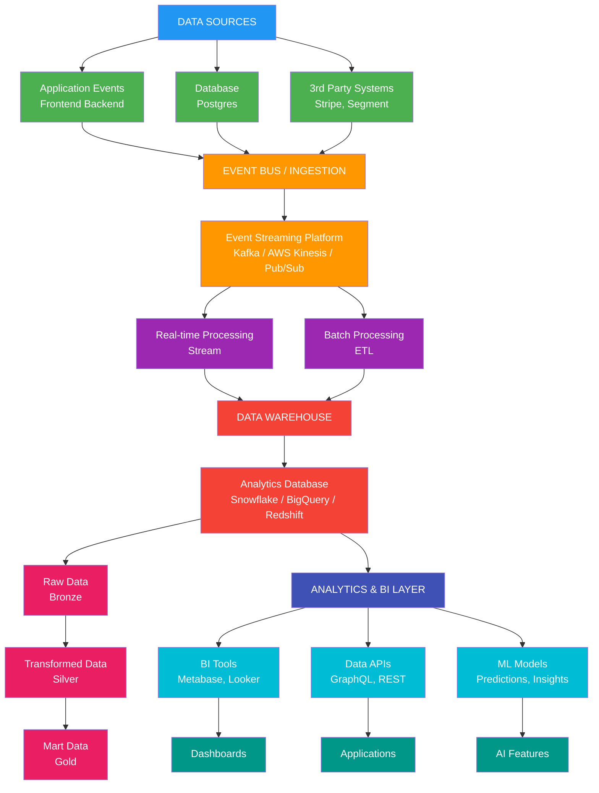

# Data Architecture for Analytics

## Overview

This document defines the data architecture and infrastructure required to support PopSystem's analytics capabilities. The architecture balances real-time operational needs with batch analytical processing while maintaining scalability, reliability, and cost-effectiveness.

## Architecture Diagram



---

## Data Sources

### 1. Application Events

**Purpose**: Capture user behavior and system events in real-time

#### Frontend Events
- User interactions (clicks, page views, form submissions)
- Feature usage tracking
- Performance metrics (page load times, errors)
- User session data

#### Backend Events
- API requests and responses
- Business logic execution
- Background job execution
- System health metrics

#### Event Schema
```json
{
  "event_id": "uuid",
  "event_name": "campaign_created",
  "timestamp": "2024-12-21T10:30:00Z",
  "user_id": "uuid",
  "session_id": "uuid",
  "properties": {
    "campaign_id": "uuid",
    "campaign_name": "Holiday Promo",
    "store_count": 156,
    "budget": 125000
  },
  "context": {
    "ip": "192.168.1.1",
    "user_agent": "Mozilla/5.0...",
    "page": "/campaigns/new",
    "referrer": "/dashboard"
  }
}
```

#### Implementation
- **Client-side**: JavaScript SDK (Segment, RudderStack, or custom)
- **Server-side**: Event emitter in application code
- **Collection**: Send to event bus via HTTP or direct integration

### 2. Application Database

**Purpose**: Source of truth for transactional data

#### Data Categories
- **Users**: User accounts, profiles, permissions
- **Campaigns**: Campaign details, status, timeline
- **Orders**: Order data, production status, fulfillment
- **Assets**: Asset metadata, usage tracking
- **Approvals**: Approval workflows, decisions, comments
- **Billing**: Subscriptions, invoices, payments

#### Extraction Strategy
- **CDC (Change Data Capture)**: Real-time replication of changes
- **Scheduled Snapshots**: Full table snapshots on schedule
- **Incremental Loads**: Query for records modified since last run

#### Considerations
- Minimize impact on production database
- Use read replicas for extraction
- Avoid full table scans during peak hours

### 3. Third-Party Systems

**Purpose**: Integrate external data sources

#### Key Systems
- **Stripe**: Payment data, subscription events
- **SendGrid**: Email delivery metrics
- **Intercom**: Support conversations, customer data
- **Google Analytics**: Web traffic (if used alongside internal tracking)
- **Social Media**: Campaign performance on social platforms

#### Integration Methods
- **Webhooks**: Real-time event notifications
- **APIs**: Scheduled polling for data
- **CSV Exports**: Manual or automated file imports

---

## Event Bus & Ingestion

### Event Streaming Platform

**Options**:
1. **Apache Kafka**: Industry standard, self-hosted or managed
2. **AWS Kinesis**: Fully managed, AWS ecosystem
3. **Google Pub/Sub**: Fully managed, GCP ecosystem
4. **RabbitMQ**: Lighter weight, simpler setup

**Recommendation**: Start with managed service (Kinesis or Pub/Sub) for ease of operation, consider Kafka for scale

### Event Ingestion Pipeline

#### 1. Event Collection
```
Client/Server → Event Collector → Validation → Event Bus
```

- **Event Collector**: HTTP endpoint or SDK
- **Validation**: Schema validation, enrichment
- **Routing**: Send to appropriate topics/streams

#### 2. Event Topics/Streams
Organize events by domain:
- `user_events`: User actions and behavior
- `system_events`: Application and infrastructure events
- `business_events`: Business transactions (orders, campaigns)
- `external_events`: Third-party webhooks

#### 3. Event Processing
- **Stream Processing**: Real-time aggregation, filtering
- **Batch Processing**: Bulk loading to warehouse

---

## Data Processing

### Real-time Stream Processing

**Purpose**: Immediate insights and alerting

#### Use Cases
- Real-time dashboards (current active users, order volume)
- Operational alerts (error rate spikes, SLA breaches)
- Fraud detection
- Personalization

#### Technology Options
- **Apache Flink**: Powerful, complex
- **Apache Spark Streaming**: Batch + streaming
- **AWS Kinesis Analytics**: Managed, SQL-based
- **Cloud Dataflow**: Managed, unified batch/stream

#### Example: Real-time Active Users
```sql
SELECT
  COUNT(DISTINCT user_id) as active_users,
  TUMBLE_START(event_time, INTERVAL '1' MINUTE) as window_start
FROM user_events
WHERE event_time > NOW() - INTERVAL '5' MINUTES
GROUP BY TUMBLE(event_time, INTERVAL '1' MINUTE)
```

### Batch ETL/ELT Processing

**Purpose**: Load and transform data for analytics

#### ETL vs ELT

**ETL (Extract, Transform, Load)**:
- Transform data before loading to warehouse
- Good for complex transformations
- Higher upfront processing cost

**ELT (Extract, Load, Transform)**:
- Load raw data, transform in warehouse
- Leverages warehouse compute power
- More flexible, easier debugging

**Recommendation**: Use ELT approach with modern data warehouses

#### ETL/ELT Pipeline

```
Source → Extract → Load (Raw) → Transform (Staging) → Load (Mart)
```

#### Tool Options
1. **dbt (Data Build Tool)**: SQL-based transformations (recommended)
2. **Apache Airflow**: Workflow orchestration
3. **Prefect**: Modern workflow orchestration
4. **Fivetran/Stitch**: Managed EL (Extract, Load)
5. **Custom Scripts**: Python/Node.js

#### Example dbt Transformation
```sql
-- models/marts/campaigns/campaign_performance.sql
WITH campaign_orders AS (
  SELECT
    campaign_id,
    COUNT(*) as total_orders,
    COUNT(CASE WHEN status = 'completed' THEN 1 END) as completed_orders,
    AVG(EXTRACT(EPOCH FROM (completed_at - created_at))/86400) as avg_days_to_complete
  FROM {{ ref('stg_orders') }}
  GROUP BY campaign_id
),

campaign_stores AS (
  SELECT
    campaign_id,
    COUNT(*) as total_stores,
    COUNT(CASE WHEN compliant = true THEN 1 END) as compliant_stores
  FROM {{ ref('stg_campaign_stores') }}
  GROUP BY campaign_id
)

SELECT
  c.campaign_id,
  c.campaign_name,
  c.brand_id,
  co.total_orders,
  co.completed_orders,
  co.avg_days_to_complete,
  cs.total_stores,
  cs.compliant_stores,
  cs.compliant_stores::float / NULLIF(cs.total_stores, 0) as compliance_rate
FROM {{ ref('stg_campaigns') }} c
LEFT JOIN campaign_orders co ON c.campaign_id = co.campaign_id
LEFT JOIN campaign_stores cs ON c.campaign_id = cs.campaign_id
```

### Orchestration

**Airflow DAG Example**:
```python
from airflow import DAG
from airflow.operators.python import PythonOperator
from datetime import datetime, timedelta

default_args = {
    'owner': 'analytics',
    'depends_on_past': False,
    'start_date': datetime(2024, 1, 1),
    'retries': 2,
    'retry_delay': timedelta(minutes=5),
}

dag = DAG(
    'daily_analytics_pipeline',
    default_args=default_args,
    schedule_interval='0 2 * * *',  # 2 AM daily
    catchup=False
)

# Extract from application database
extract_db = PythonOperator(
    task_id='extract_database',
    python_callable=extract_postgres_data,
    dag=dag
)

# Extract events from stream
extract_events = PythonOperator(
    task_id='extract_events',
    python_callable=extract_kinesis_events,
    dag=dag
)

# Load to warehouse
load_warehouse = PythonOperator(
    task_id='load_warehouse',
    python_callable=load_to_snowflake,
    dag=dag
)

# Run dbt transformations
transform_data = BashOperator(
    task_id='transform_data',
    bash_command='cd /dbt && dbt run --models marts',
    dag=dag
)

# Data quality checks
quality_checks = PythonOperator(
    task_id='quality_checks',
    python_callable=run_data_quality_tests,
    dag=dag
)

# Define dependencies
[extract_db, extract_events] >> load_warehouse >> transform_data >> quality_checks
```

---

## Data Warehouse

### Warehouse Technology Selection

| Option | Pros | Cons | Best For |
|--------|------|------|----------|
| **PostgreSQL** | Familiar, free, good for small scale | Limited scaling, lacks analytics features | v1, <100GB data |
| **Snowflake** | Excellent performance, separation of compute/storage, easy scaling | Costs can grow | Scale-up phase |
| **BigQuery** | Serverless, great for large datasets, GCP integration | GCP lock-in, query costs | Large scale, GCP users |
| **Redshift** | AWS integration, mature, cost-effective at scale | Requires more tuning | AWS users, large scale |
| **ClickHouse** | Extremely fast, open-source, cost-effective | Less mature ecosystem | Real-time analytics |

**Recommendation**:
- **v1-v2**: PostgreSQL with analytics extensions (TimescaleDB, Citus)
- **v3+**: Migrate to Snowflake or BigQuery for scale

### Data Warehouse Schema Design

#### Medallion Architecture (Bronze/Silver/Gold)

**Bronze Layer (Raw)**:
- Raw data as-is from sources
- Minimal transformation
- Full history retained
- Append-only

**Silver Layer (Transformed)**:
- Cleaned and validated data
- Deduplicated
- Type conversions
- Business logic applied
- Conformed dimensions

**Gold Layer (Mart)**:
- Aggregated for specific use cases
- Optimized for query performance
- Dashboard-ready tables
- Metric calculations materialized

### Dimensional Modeling (Star Schema)

#### Fact Tables
Store measurable events and metrics

**Example: fact_orders**
```sql
CREATE TABLE fact_orders (
  order_id UUID PRIMARY KEY,
  order_date DATE NOT NULL,
  campaign_id UUID NOT NULL,
  brand_id UUID NOT NULL,
  psp_id UUID NOT NULL,
  store_id UUID,

  -- Metrics
  order_value DECIMAL(10,2),
  production_hours DECIMAL(10,2),
  approval_hours DECIMAL(10,2),
  shipping_cost DECIMAL(10,2),

  -- Status dimensions
  status VARCHAR(50),
  first_time_approved BOOLEAN,
  rework_required BOOLEAN,
  on_time_delivery BOOLEAN,

  -- Timestamps
  created_at TIMESTAMP,
  started_at TIMESTAMP,
  completed_at TIMESTAMP,
  delivered_at TIMESTAMP,

  -- Foreign keys
  FOREIGN KEY (campaign_id) REFERENCES dim_campaigns(campaign_id),
  FOREIGN KEY (brand_id) REFERENCES dim_brands(brand_id),
  FOREIGN KEY (psp_id) REFERENCES dim_psps(psp_id),
  FOREIGN KEY (store_id) REFERENCES dim_stores(store_id)
);
```

**Example: fact_events**
```sql
CREATE TABLE fact_events (
  event_id UUID PRIMARY KEY,
  event_timestamp TIMESTAMP NOT NULL,
  event_name VARCHAR(255) NOT NULL,
  user_id UUID,
  session_id UUID,

  -- Dimensions
  brand_id UUID,
  feature_name VARCHAR(100),
  page_url TEXT,

  -- Metrics
  duration_ms INTEGER,
  error BOOLEAN,

  -- Properties (JSON for flexibility)
  properties JSONB,

  -- Foreign keys
  FOREIGN KEY (user_id) REFERENCES dim_users(user_id)
);
```

#### Dimension Tables
Descriptive attributes for analysis

**Example: dim_campaigns**
```sql
CREATE TABLE dim_campaigns (
  campaign_id UUID PRIMARY KEY,
  campaign_name VARCHAR(255),
  campaign_type VARCHAR(50),
  brand_id UUID,

  -- Attributes
  budget DECIMAL(12,2),
  target_stores INTEGER,
  start_date DATE,
  end_date DATE,

  -- SCD Type 2 (track changes over time)
  valid_from TIMESTAMP,
  valid_to TIMESTAMP,
  is_current BOOLEAN,

  FOREIGN KEY (brand_id) REFERENCES dim_brands(brand_id)
);
```

**Example: dim_brands**
```sql
CREATE TABLE dim_brands (
  brand_id UUID PRIMARY KEY,
  brand_name VARCHAR(255),
  industry VARCHAR(100),
  account_tier VARCHAR(50),
  customer_since DATE,

  -- Current status
  is_active BOOLEAN,
  health_score INTEGER,
  arr DECIMAL(12,2),

  -- SCD tracking
  valid_from TIMESTAMP,
  valid_to TIMESTAMP,
  is_current BOOLEAN
);
```

**Example: dim_users**
```sql
CREATE TABLE dim_users (
  user_id UUID PRIMARY KEY,
  email VARCHAR(255),
  full_name VARCHAR(255),
  role VARCHAR(50),
  brand_id UUID,
  psp_id UUID,

  -- Attributes
  signup_date DATE,
  is_active BOOLEAN,
  last_login TIMESTAMP,

  FOREIGN KEY (brand_id) REFERENCES dim_brands(brand_id),
  FOREIGN KEY (psp_id) REFERENCES dim_psps(psp_id)
);
```

**Example: dim_date**
```sql
CREATE TABLE dim_date (
  date_key DATE PRIMARY KEY,
  day_of_week VARCHAR(10),
  day_of_month INTEGER,
  week_of_year INTEGER,
  month INTEGER,
  month_name VARCHAR(10),
  quarter INTEGER,
  year INTEGER,
  is_weekend BOOLEAN,
  is_holiday BOOLEAN,
  fiscal_year INTEGER,
  fiscal_quarter INTEGER
);
```

### Slowly Changing Dimensions (SCD)

**Type 1**: Overwrite (no history)
- Simple, minimal storage
- Lose historical context

**Type 2**: Add new row (recommended)
- Track full history
- Query point-in-time state
- Use `valid_from`, `valid_to`, `is_current`

**Type 3**: Add new column
- Limited history (previous value only)
- Simple queries

---

## Data Retention Policies

### Event Data
- **Hot Storage** (Warehouse): 90 days of detailed events
- **Warm Storage** (Aggregated): 12 months of hourly aggregates
- **Cold Storage** (Archive): 7 years of daily aggregates (compliance)
- **Deleted**: After 7 years

### Transactional Data
- **Active Records**: Indefinitely in warehouse
- **Deleted Records**: Soft delete, retained 7 years for compliance

### Aggregated Metrics
- **Retained Indefinitely**: Pre-aggregated metrics and KPIs

### Personal Data (GDPR/CCPA)
- **Deletion Requests**: Purge within 30 days
- **Anonymization**: Replace PII with hashed identifiers after retention period

---

## Query Optimization

### Indexing Strategy

```sql
-- Fact table indexes
CREATE INDEX idx_orders_campaign ON fact_orders(campaign_id);
CREATE INDEX idx_orders_brand ON fact_orders(brand_id);
CREATE INDEX idx_orders_date ON fact_orders(order_date);
CREATE INDEX idx_orders_status ON fact_orders(status);

-- Composite indexes for common queries
CREATE INDEX idx_orders_brand_date ON fact_orders(brand_id, order_date);

-- Event table indexes
CREATE INDEX idx_events_timestamp ON fact_events(event_timestamp);
CREATE INDEX idx_events_user ON fact_events(user_id);
CREATE INDEX idx_events_name ON fact_events(event_name);
```

### Partitioning

**Time-based partitioning** for large fact tables:

```sql
-- Partition by month
CREATE TABLE fact_orders (
  -- columns...
) PARTITION BY RANGE (order_date);

CREATE TABLE fact_orders_2024_01 PARTITION OF fact_orders
  FOR VALUES FROM ('2024-01-01') TO ('2024-02-01');

CREATE TABLE fact_orders_2024_02 PARTITION OF fact_orders
  FOR VALUES FROM ('2024-02-01') TO ('2024-03-01');
```

### Materialized Views

Pre-compute expensive aggregations:

```sql
CREATE MATERIALIZED VIEW mv_daily_campaign_metrics AS
SELECT
  campaign_id,
  order_date,
  COUNT(*) as order_count,
  COUNT(CASE WHEN status = 'completed' THEN 1 END) as completed_count,
  AVG(order_value) as avg_order_value,
  SUM(order_value) as total_revenue
FROM fact_orders
GROUP BY campaign_id, order_date;

-- Refresh daily
REFRESH MATERIALIZED VIEW CONCURRENTLY mv_daily_campaign_metrics;
```

### Query Performance Monitoring

Track slow queries:
```sql
-- Enable query logging (PostgreSQL)
ALTER DATABASE analytics SET log_min_duration_statement = 1000; -- Log queries >1s

-- Query statistics
SELECT
  query,
  calls,
  mean_exec_time,
  max_exec_time
FROM pg_stat_statements
ORDER BY mean_exec_time DESC
LIMIT 20;
```

---

## Real-time vs Batch Processing

### Decision Matrix

| Requirement | Real-time | Batch |
|-------------|-----------|-------|
| Dashboard needs data within seconds | ✓ | |
| Dashboard refreshes hourly/daily | | ✓ |
| Complex multi-table joins required | | ✓ |
| Simple aggregations (counts, sums) | ✓ | |
| High data volume (millions of events/day) | ✓ | ✓ |
| Low latency critical | ✓ | |
| Cost-sensitive | | ✓ |

### Hybrid Approach

- **Real-time**: Operational metrics (active users, current orders, platform health)
- **Batch**: Analytical queries (trends, cohorts, complex reports)
- **Lambda Architecture**: Both real-time and batch views, merged at query time

---

## Data Quality & Validation

### Data Quality Framework

#### 1. Completeness
- Required fields not null
- Expected record counts met
- No unexpected gaps in time-series data

```sql
-- Check for null critical fields
SELECT
  COUNT(*) as null_count,
  COUNT(*) * 100.0 / (SELECT COUNT(*) FROM fact_orders) as null_percentage
FROM fact_orders
WHERE campaign_id IS NULL OR brand_id IS NULL;
```

#### 2. Accuracy
- Metrics match known ground truth
- Cross-system reconciliation (e.g., billing vs analytics)

```sql
-- Reconcile order revenue with billing
SELECT
  DATE_TRUNC('month', order_date) as month,
  SUM(order_value) as analytics_revenue,
  (SELECT SUM(amount) FROM billing.invoices WHERE month = ...) as billing_revenue,
  ABS(analytics_revenue - billing_revenue) as variance
FROM fact_orders
GROUP BY month
HAVING ABS(analytics_revenue - billing_revenue) > 100;
```

#### 3. Consistency
- Same metric across systems matches
- Dimensional integrity (all foreign keys valid)

```sql
-- Check referential integrity
SELECT COUNT(*)
FROM fact_orders o
LEFT JOIN dim_campaigns c ON o.campaign_id = c.campaign_id
WHERE c.campaign_id IS NULL;
```

#### 4. Timeliness
- Data loaded within SLA
- No unexpected delays

```sql
-- Check data freshness
SELECT
  MAX(event_timestamp) as latest_event,
  NOW() - MAX(event_timestamp) as lag
FROM fact_events
WHERE lag > INTERVAL '1 hour';
```

### Automated Data Quality Tests

Use tools like **Great Expectations** or **dbt tests**:

```yaml
# dbt schema.yml
version: 2

models:
  - name: fact_orders
    tests:
      - dbt_utils.recency:
          datepart: day
          field: created_at
          interval: 1
    columns:
      - name: order_id
        tests:
          - unique
          - not_null
      - name: campaign_id
        tests:
          - not_null
          - relationships:
              to: ref('dim_campaigns')
              field: campaign_id
      - name: order_value
        tests:
          - not_null
          - dbt_utils.accepted_range:
              min_value: 0
              max_value: 1000000
```

---

## Security & Access Control

### Role-Based Access

```sql
-- Create roles
CREATE ROLE analytics_admin;
CREATE ROLE analytics_analyst;
CREATE ROLE analytics_viewer;

-- Grant permissions
GRANT ALL ON SCHEMA analytics TO analytics_admin;
GRANT SELECT ON ALL TABLES IN SCHEMA analytics TO analytics_analyst;
GRANT SELECT ON analytics.mv_* TO analytics_viewer; -- Materialized views only
```

### Row-Level Security

Restrict data by brand or PSP:

```sql
-- Enable RLS
ALTER TABLE fact_orders ENABLE ROW LEVEL SECURITY;

-- Policy: Users see only their brand's data
CREATE POLICY brand_isolation ON fact_orders
  FOR SELECT
  TO analytics_analyst
  USING (brand_id = current_setting('app.current_brand_id')::UUID);
```

### Data Masking

Protect PII in non-production environments:

```sql
-- Create masked view for dev/test
CREATE VIEW dim_users_masked AS
SELECT
  user_id,
  'user_' || user_id AS email,  -- Mask email
  'User ' || user_id AS full_name,  -- Mask name
  role,
  brand_id,
  signup_date,
  is_active
FROM dim_users;
```

---

## Monitoring & Observability

### Pipeline Monitoring

Track:
- **Job Success/Failure**: Alert on failures
- **Runtime Duration**: Alert on anomalies
- **Data Volume**: Alert on unexpected spikes/drops
- **Data Freshness**: Alert on stale data
- **Cost**: Monitor warehouse and compute spend

### Metrics to Track

```yaml
analytics_pipeline_metrics:
  - pipeline_success_rate
  - pipeline_duration_seconds
  - records_processed_count
  - data_freshness_lag_seconds
  - warehouse_query_count
  - warehouse_cost_dollars
  - query_performance_p95_seconds
```

### Alerting

```yaml
alerts:
  - name: Pipeline Failure
    condition: pipeline_success_rate < 100%
    severity: critical

  - name: Data Staleness
    condition: data_freshness_lag_seconds > 7200  # 2 hours
    severity: warning

  - name: High Query Cost
    condition: warehouse_cost_dollars > 1000/day
    severity: warning
```

---

## Disaster Recovery

### Backup Strategy
- **Warehouse**: Automated daily snapshots (7-day retention)
- **Event Stream**: Replicate to S3/GCS for durability
- **Transformation Code**: Version controlled in Git

### Recovery Procedures
1. Restore warehouse from snapshot
2. Replay events from backup if needed
3. Re-run transformations from dbt

### Testing
- Quarterly DR drills
- Document recovery procedures
- Maintain runbooks

---

## Cost Optimization

### Strategies

1. **Partition Pruning**: Query only relevant partitions
2. **Materialized Views**: Pre-compute expensive queries
3. **Clustering**: Co-locate related data for faster scans
4. **Result Caching**: Reuse query results when possible
5. **Warehouse Scaling**: Right-size compute resources
6. **Data Lifecycle**: Move old data to cheaper storage

### Cost Monitoring

```sql
-- Query cost tracking (Snowflake example)
SELECT
  query_text,
  warehouse_name,
  execution_time,
  credits_used_cloud_services,
  (credits_used_cloud_services * 3) as estimated_cost_usd  -- $3/credit
FROM snowflake.account_usage.query_history
WHERE start_time > DATEADD(day, -7, CURRENT_TIMESTAMP())
ORDER BY credits_used_cloud_services DESC
LIMIT 20;
```

---

## Implementation Roadmap

### Phase 1: Foundation (Months 1-3)
- Set up PostgreSQL analytics database
- Implement basic ETL from application database
- Build simple event tracking (server-side only)
- Create core fact and dimension tables
- Develop first dashboards in Metabase

### Phase 2: Event Tracking (Months 4-6)
- Implement client-side event tracking
- Set up event streaming platform (Kinesis/Pub/Sub)
- Build real-time processing for operational metrics
- Add more comprehensive event coverage

### Phase 3: Scale & Automation (Months 7-12)
- Migrate to cloud data warehouse (Snowflake/BigQuery)
- Implement dbt for transformation logic
- Set up Airflow for orchestration
- Build comprehensive data quality framework
- Implement automated alerting

### Phase 4: Advanced Analytics (Year 2)
- Add ML models and predictions
- Implement AI-powered insights
- Build self-service analytics capabilities
- Advanced segmentation and cohort analysis

---

## Technology Stack Recommendation

### v1-v2 (Startup Phase)
- **Database**: PostgreSQL (application + analytics)
- **ETL**: Custom Python scripts
- **Orchestration**: Cron jobs or simple Airflow
- **BI**: Metabase (open-source)
- **Event Tracking**: Custom implementation or Segment

### v3 (Scale-up Phase)
- **Warehouse**: Snowflake or BigQuery
- **ETL**: dbt for transformations
- **Orchestration**: Airflow or Prefect
- **BI**: Preset (Superset) or Looker
- **Event Tracking**: Segment or RudderStack
- **Streaming**: AWS Kinesis or Google Pub/Sub

### v4 (Enterprise Phase)
- **Warehouse**: Snowflake or BigQuery (scaled)
- **ETL**: dbt + Fivetran/Stitch for connectors
- **Orchestration**: Airflow with robust monitoring
- **BI**: Looker or Tableau
- **Event Tracking**: Segment with warehouse-first approach
- **Streaming**: Kafka for high-volume, low-latency needs
- **ML Platform**: SageMaker, Vertex AI, or Databricks

---

## Related Documents

- Metrics_Framework.md - Metric definitions and calculations
- Dashboard_Specs.md - Dashboard requirements and designs
- BI_Tool_Evaluation.md - BI tool selection criteria
- AI_Insights_Roadmap.md - Advanced analytics and AI features
