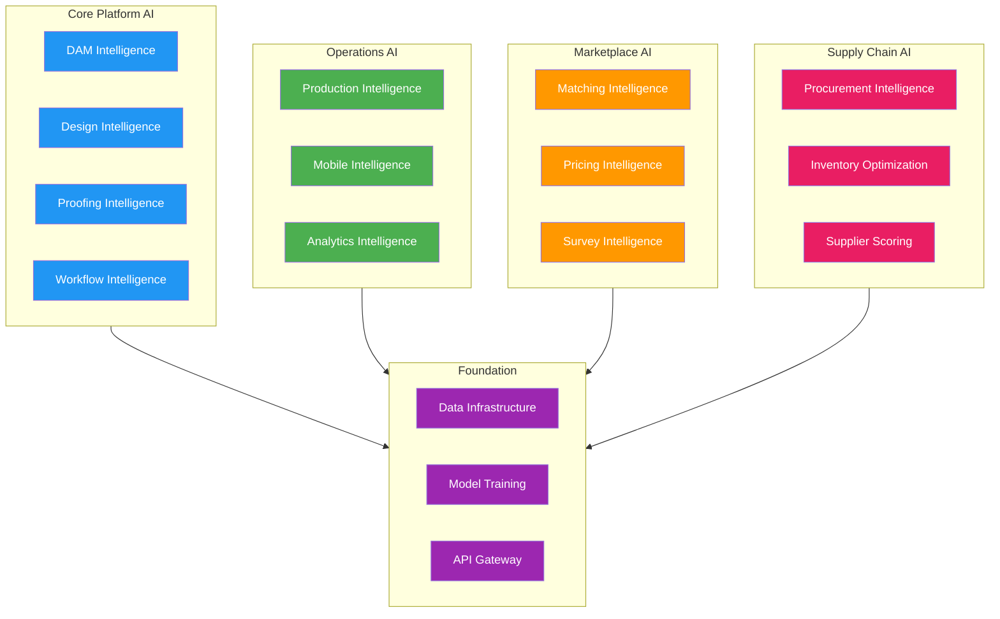
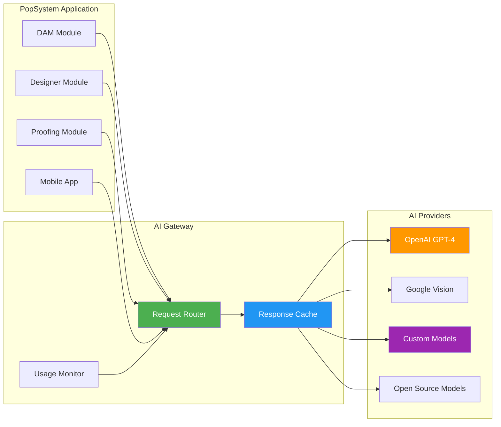

# AI Capabilities Overview

## Executive Summary

AI is woven throughout PopSystem to automate tedious tasks, predict outcomes, ensure quality, and enable users to accomplish more with less effort. This folder contains detailed specifications for AI features across every platform capability.

**AI Philosophy:**
- **Augment, Don't Replace:** AI assists humans rather than replacing judgment
- **Invisible When Working:** AI features should feel natural, not intrusive
- **Graceful Degradation:** Platform works without AI; AI makes it better
- **Continuous Learning:** Models improve from platform usage data

---

## AI Capabilities by Pillar

---

## Documents in This Folder

| Document | Pillar | Key AI Features |
|----------|--------|-----------------|
| [01_AI_DAM.md](01_AI_DAM.md) | P02 DAM | Auto-tagging, smart search, duplicate detection, brand compliance |
| [02_AI_Designer.md](02_AI_Designer.md) | P04 Online Designer | Text-to-design, auto-resize, layout suggestions, brand enforcement |
| [03_AI_Proofing.md](03_AI_Proofing.md) | P05 Online Proofing | Pre-flight checks, auto-approval, revision prediction |
| [04_AI_Workflow.md](04_AI_Workflow.md) | P06 Workflow Automation | Smart routing, bottleneck prediction, NL workflow creation |
| [05_AI_Production.md](05_AI_Production.md) | P07 MIS/ERP | Demand forecasting, cost optimization, job scheduling |
| [06_AI_Mobile.md](06_AI_Mobile.md) | P08 Native Mobile | AR guidance, photo validation, offline AI, voice notes |
| [07_AI_Marketplace.md](07_AI_Marketplace.md) | P11 Marketplace | Smart matching, performance prediction, fraud detection |
| [08_AI_Survey.md](08_AI_Survey.md) | Survey as a Service | Photo-to-measurement, auto-templates, surface detection |
| [09_AI_Analytics.md](09_AI_Analytics.md) | Analytics | NLP queries, predictive dashboards, anomaly detection |
| [10_AI_Verification.md](10_AI_Verification.md) | Verification | Compliance checking, damage detection, auto-approval |
| [11_AI_Procurement.md](11_AI_Procurement.md) | P12 Procurement | Demand forecasting, inventory optimization, supplier scoring |

---

## Value by User Type

### For Clients (Brand Teams)

| AI Feature | Value | Time Saved |
|------------|-------|------------|
| Smart search in DAM | Find assets instantly vs. browsing folders | 80% |
| Auto-resize designs | One upload serves all locations | 90% |
| Predictive analytics | Know campaign outcomes before launch | N/A (new capability) |
| NLP queries | Ask questions in plain English | 70% |
| Compliance verification | Real-time installation confirmation | 85% |

**ROI Example:** A 1,000-store campaign previously required 40 hours of asset prep. With AI: 4 hours.

### For PSPs (Print Service Providers)

| AI Feature | Value | Impact |
|------------|-------|--------|
| Demand forecasting | Predict material needs | 30% less waste |
| Job scheduling optimization | Maximize equipment utilization | 15% more throughput |
| Quality prediction | Catch issues before printing | 25% fewer reprints |
| Production QC verification | AI verifies output before shipping | 95%+ ship-ready accuracy |
| Smart order routing | Match jobs to capabilities | Better margins |
| Invoice anomaly detection | Flag billing errors | Reduced disputes |

**ROI Example:** AI routing reduces reprints by 25%, saving $50K/year for a mid-size PSP.

**Quality Loop:** Production QC verification catches defects before shipping:
1. Operator photographs printed output
2. AI compares to approved design (color, content, quality)
3. Pass → ship to installer | Fail → auto-reprint scheduled
4. Defects logged for equipment calibration and continuous improvement
5. PSP quality scores tracked for marketplace routing decisions

### For Installers

| AI Feature | Value | Impact |
|------------|-------|--------|
| AR installation guidance | Visual overlay shows exact placement | 40% faster installs |
| Photo quality validation | Know photo is acceptable before leaving | Zero return visits for photos |
| Location/mockup validation | Compare installation to approved proof | 95%+ first-time accuracy |
| Smart scheduling | Optimized routes | 20% more jobs per day |
| Voice-to-text notes | Hands-free documentation | 50% faster reporting |
| Real-time compliance feedback | Instant approval | Confidence in completion |
| Auto reprint generation | Defective materials trigger automatic reorder | Zero downtime for material issues |
| Error logging & analytics | Track installation issues by type/location | Continuous quality improvement |

**ROI Example:** AR guidance + smart scheduling = 2 extra installations per week per installer.

**Quality Loop:** When AI detects a mismatch between installation and approved mockup:
1. Installer notified immediately with specific issue
2. If material defect → auto-generate reprint order to PSP
3. Error logged with photo evidence for root cause analysis
4. Brand notified of delay with updated ETA

### For Designers

| AI Feature | Value | Impact |
|------------|-------|--------|
| Auto-resize/crop | One design serves all sizes | 80% time savings |
| Background removal | Instant asset prep | Minutes vs. hours |
| Brand compliance checking | Catch errors before review | 50% fewer revisions |
| Design suggestions | AI-powered layout ideas | Faster iteration |
| Text-to-design | Generate starting points | Creative acceleration |

**ROI Example:** Designer handles 3x more campaigns with AI assistance.

### For Platform Operators

| AI Feature | Value | Impact |
|------------|-------|--------|
| Anomaly detection | Catch issues before escalation | 60% fewer support tickets |
| Churn prediction | Intervene before cancellation | 20% retention improvement |
| Usage analytics | Understand feature adoption | Data-driven roadmap |
| Cost optimization | Reduce infrastructure spend | 15% cost reduction |
| Fraud detection | Protect marketplace integrity | Trust & safety |

---

## Technical Architecture

### AI Gateway Pattern

All AI capabilities flow through a unified AI Gateway that provides:
- Request routing to appropriate AI service
- Credential management and security
- Rate limiting and cost control
- Response caching (30-50% cost reduction)
- Fallback handling
- Usage tracking and billing

### Build vs. Buy Strategy

| Phase | Strategy | Rationale |
|-------|----------|-----------|
| **v3 (2026)** | Commercial APIs | Speed to market, proven quality |
| **v4 (2027)** | APIs + FOSS evaluation | Cost optimization at scale |
| **v4+ (2028+)** | Custom models for high-volume | ROI justifies investment |

**Decision Trigger:** Migrate to custom/FOSS when API costs exceed $30K/year per feature.

---

## Implementation Phases

### Phase 1: Foundation (v1-v2)
- Data capture for future training
- API-ready architecture
- No AI features (data quality focus)

### Phase 2: Basic AI (v3)
- Predictive analytics (completion forecasting)
- Compliance verification (60% auto-approval)
- Anomaly detection (statistical thresholds)
- **Investment:** $150-200K | **Timeline:** 6-8 months

### Phase 3: Advanced AI (v4)
- NLP queries across platform
- Auto-resize and mockup generation
- Smart matching in marketplace
- Enhanced compliance (80% auto-approval)
- **Investment:** $400-600K | **Timeline:** 12-18 months

### Phase 4: Full Intelligence (v4+)
- Autonomous campaign optimization
- Custom model training per client
- Edge AI for mobile
- Damage detection and predictive maintenance
- **Investment:** $500-800K Year 1 + ongoing | **Timeline:** Continuous

---

## Cost Projections

### API Costs by Scale

| Scale | Campaigns/Year | Monthly API Cost | Annual Cost |
|-------|---------------|------------------|-------------|
| Small | 500 | $200 | $2,400 |
| Medium | 2,500 | $1,000 | $12,000 |
| Large | 10,000 | $4,500 | $54,000 |
| Enterprise | 50,000 | $22,000 | $264,000 |

### Cost Control Strategies

1. **Intelligent Caching:** 30-50% reduction
2. **Tiered Processing:** Cheap models for simple tasks
3. **Batch Processing:** Volume discounts
4. **Client Cost Allocation:** Usage-based pricing tiers

---

## Success Metrics

### Platform-Wide AI KPIs

| Metric | v3 Target | v4 Target | v4+ Target |
|--------|-----------|-----------|------------|
| AI feature adoption | 40% of users | 60% of users | 80% of users |
| Automation rate | 60% | 80% | 90% |
| User satisfaction with AI | 70% positive | 80% positive | 90% positive |
| Cost per AI action | $0.15 | $0.10 | $0.05 |
| API uptime | 99.5% | 99.9% | 99.9% |

---

## Related Documents

- [P03_AI_Intelligence.md](../02_Capability_Pillars/P03_AI_Intelligence.md) - Original AI pillar specification
- [P12_Procurement_Marketplace.md](../02_Capability_Pillars/P12_Procurement_Marketplace.md) - Procurement ecosystem and network effects
- Individual AI capability documents in this folder

---

*This folder consolidates all AI specifications. Each document details features, user value, technical approach, and integration points for its respective pillar.*
