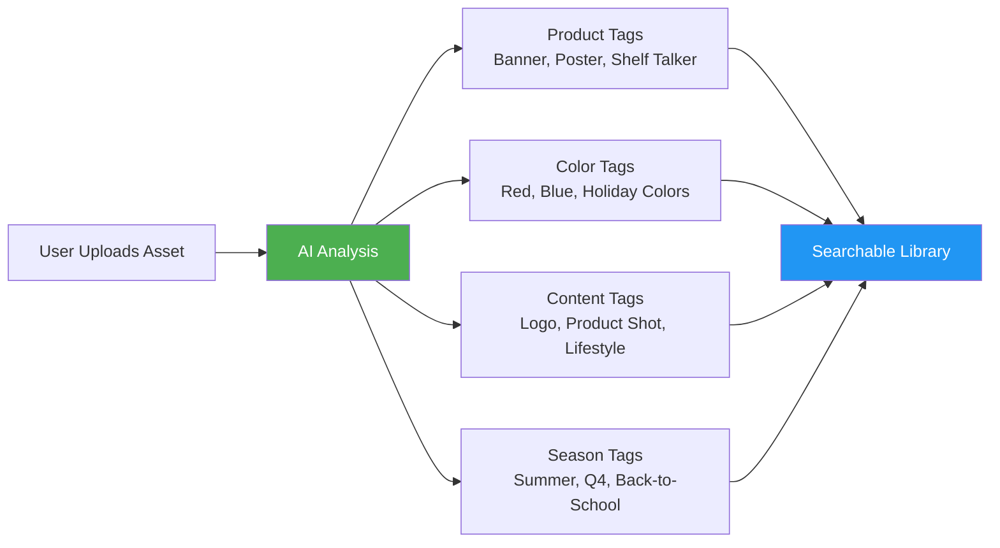
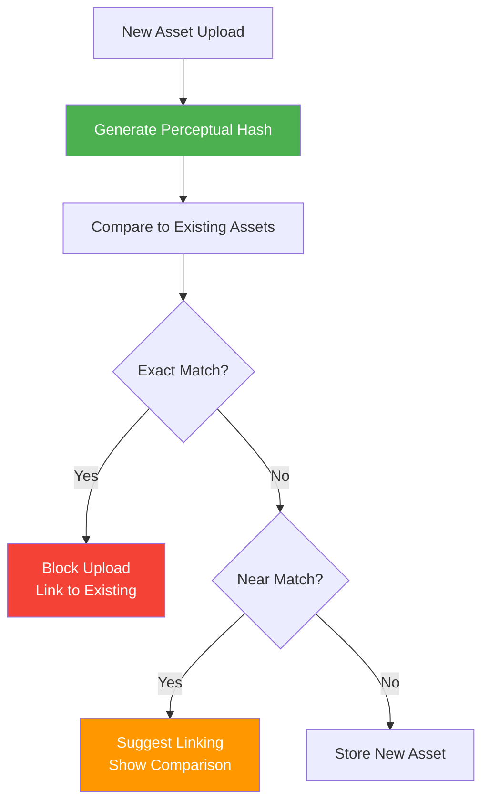
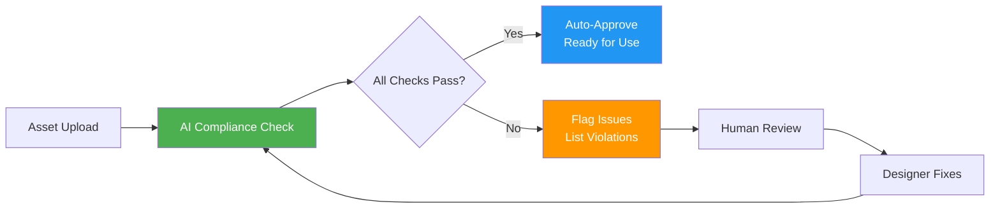

# AI for Digital Asset Management (DAM)

## Overview

AI transforms the DAM from a simple file storage system into an intelligent asset management platform that understands content, enforces brand standards, and helps users find exactly what they need instantly.

**Related Pillar:** [P02_DAM.md](../02_Capability_Pillars/P02_DAM.md)

---

## AI Features

### 1. Automatic Asset Tagging

**What It Does:** AI analyzes uploaded assets and automatically applies relevant tags based on visual content, text, and metadata.

**Tag Categories:**
| Category | Example Tags | Detection Method |
|----------|-------------|------------------|
| **Asset Type** | Poster, banner, shelf talker, window cling | Object detection + dimensions |
| **Product** | Beverage, food, electronics, apparel | Image classification |
| **Color Palette** | Primary colors, brand colors, seasonal | Color extraction |
| **Content Elements** | Logo, product shot, lifestyle, text-heavy | Object detection |
| **Season/Campaign** | Summer, holiday, back-to-school | Text + visual cues |
| **Brand** | Client brand, sub-brand | Logo detection + metadata |

**User Value:**
- **Time Saved:** 5-10 minutes per asset (manual tagging)
- **Consistency:** AI applies tags consistently vs. human variation
- **Discoverability:** Assets are findable even without manual tagging

**Technical Approach:**
- Google Cloud Vision API for object detection
- Custom classifier for POP-specific asset types
- Color extraction algorithms
- OCR for text content
- Confidence threshold: 85%+ for auto-apply, lower scores suggested for review

---

### 2. Smart Search

**What It Does:** Natural language search that understands intent, synonyms, and context.

**Search Examples:**
| User Query | AI Interpretation | Results |
|------------|-------------------|---------|
| "red holiday posters" | Color: red, Season: holiday, Type: poster | Filtered results |
| "last year's summer campaign" | Date: 2024, Season: summer | Historical assets |
| "designs like this one" | Visual similarity search | Similar assets |
| "Nike approved logos" | Brand: Nike, Status: approved, Type: logo | Compliant assets |
| "high-res product shots" | Resolution: >300dpi, Content: product | Quality-filtered |

**Search Capabilities:**
1. **Natural Language:** "Find the blue banner from the spring campaign"
2. **Visual Similarity:** Upload image, find similar assets
3. **Faceted Filtering:** Combine AI tags with manual filters
4. **Contextual:** Considers user role, recent activity, brand access

**User Value:**
- **Time Saved:** 70-80% reduction in search time
- **Findability:** Discover assets you didn't know existed
- **Accuracy:** Find exactly what you need vs. browsing folders

**Technical Approach:**
- NLP query parsing (OpenAI GPT-4)
- Vector embeddings for visual similarity (CLIP)
- Elasticsearch for indexed search
- User context injection for personalization

---

### 3. Duplicate Detection

**What It Does:** Identifies duplicate or near-duplicate assets to reduce clutter and storage costs.

**Detection Types:**
| Type | Description | Action |
|------|-------------|--------|
| **Exact Duplicate** | Identical files | Auto-flag, suggest deletion |
| **Visual Duplicate** | Same image, different format/size | Link versions, suggest primary |
| **Near Duplicate** | Minor variations (crop, color adjust) | Group together, show differences |
| **Version Candidate** | Same design, different iteration | Suggest version linking |

**Workflow:**

**User Value:**
- **Storage Savings:** 15-25% reduction in storage
- **Clarity:** Know which version is authoritative
- **Speed:** Prevent redundant uploads

**Technical Approach:**
- Perceptual hashing (pHash, dHash)
- CLIP embeddings for semantic similarity
- Threshold tuning per asset type
- Admin controls for duplicate policy

---

### 4. Brand Compliance Checking

**What It Does:** AI automatically checks uploaded assets against brand guidelines.

**Compliance Checks:**
| Check | What AI Looks For | Pass/Fail Criteria |
|-------|-------------------|-------------------|
| **Logo Usage** | Logo present, correct version, clear space | Logo detection + measurement |
| **Color Accuracy** | Brand colors within tolerance | Color extraction vs. brand palette |
| **Typography** | Approved fonts used | Font recognition |
| **Required Elements** | Disclaimers, legal text, copyright | OCR + text matching |
| **Image Quality** | Resolution, aspect ratio | Technical metadata |
| **Restricted Content** | Competitor logos, banned imagery | Object detection |

**Compliance Workflow:**

**User Value:**
- **Brand Consistency:** Catch violations before distribution
- **Time Saved:** 50-70% reduction in manual review
- **Risk Reduction:** Prevent non-compliant materials in market

**Technical Approach:**
- Custom-trained logo detector per brand
- Color matching with tolerance thresholds
- OCR with text matching rules
- Configurable rule engine per brand/client

---

### 5. Auto-Generate Size Variations

**What It Does:** Automatically create multiple size variations from a single master design.

**Size Generation:**
| Input | AI Processing | Output |
|-------|--------------|--------|
| Master design (24x36") | Intelligent resize + crop | 47 size variations |
| Key elements marked | Preserve critical content | Optimized for each size |
| Brand guidelines | Apply rules per size | Compliant variations |

**Smart Resize Logic:**
1. **Element Detection:** AI identifies logos, headlines, key visuals
2. **Priority Mapping:** Critical elements protected from cropping
3. **Aspect Ratio Handling:** Intelligent fill or crop decisions
4. **Text Scaling:** Maintain readability at smaller sizes
5. **Quality Validation:** Verify output meets specs

**User Value:**
- **Time Saved:** 80-90% reduction (hours → minutes)
- **Consistency:** All sizes from same source
- **Quality:** AI maintains design integrity

**Technical Approach:**
- Content-aware resize (seam carving)
- Object detection for element preservation
- Template-based generation for known sizes
- Quality validation pipeline

---

### 6. Background Removal

**What It Does:** Automatically remove backgrounds from product images for clean compositing.

**Use Cases:**
- Prepare product shots for catalog use
- Create assets for mockup generation
- Enable flexible background options
- Standardize product imagery

**Quality Levels:**
| Level | Processing | Best For | Speed |
|-------|-----------|----------|-------|
| **Quick** | AI background removal | Simple backgrounds | 2-5 sec |
| **Standard** | AI + edge refinement | Complex products | 10-15 sec |
| **Premium** | AI + manual QA | Hair, transparency | 30-60 sec |

**User Value:**
- **Time Saved:** 70-90% vs. manual masking
- **Consistency:** Uniform quality across assets
- **Flexibility:** Repurpose assets easily

**Technical Approach:**
- Segment Anything Model (SAM) for segmentation
- Remove.bg API for quick processing
- Custom edge refinement for POP products
- Batch processing for bulk operations

---

## Integration Points

### With Online Designer
- Auto-tagged assets appear in design tool library
- Smart search available within designer
- Compliance checking on design export

### With Online Proofing
- AI flags assets for review
- Compliance scores visible in proofing workflow
- Auto-approve compliant assets

### With Workflow Automation
- AI tags trigger workflows (e.g., "holiday" tag → route to seasonal team)
- Compliance failures auto-create tasks
- Duplicate detection alerts asset managers

---

## User Value Summary

| User Type | Key Benefits | Quantified Impact |
|-----------|-------------|-------------------|
| **Designers** | Faster asset prep, auto-resize | 80% time savings |
| **Brand Managers** | Automated compliance, consistency | 50% fewer violations |
| **Marketing Teams** | Instant search, discoverability | 70% faster asset retrieval |
| **Asset Managers** | Duplicate control, storage savings | 20% storage reduction |

---

## Implementation

### Phase 1 (v3)
- Auto-tagging with commercial APIs
- Basic smart search
- Duplicate detection (exact matches)

### Phase 2 (v4)
- Advanced smart search with NLP
- Brand compliance checking
- Near-duplicate detection
- Auto-resize (basic)

### Phase 3 (v4+)
- Custom tagging models per client
- Full background removal
- Intelligent resize with element preservation
- Visual similarity search

---

## Success Metrics

| Metric | Target | Measurement |
|--------|--------|-------------|
| Tagging accuracy | 90%+ | User correction rate |
| Search success rate | 85%+ | First-result clicks |
| Duplicate prevention | 95%+ | Duplicates blocked |
| Compliance catch rate | 80%+ | Issues found by AI vs. human |
| User satisfaction | 80%+ positive | Feature ratings |

---

*AI for DAM transforms asset management from tedious folder-browsing to intelligent content discovery and management.*
