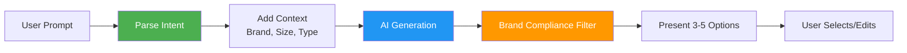
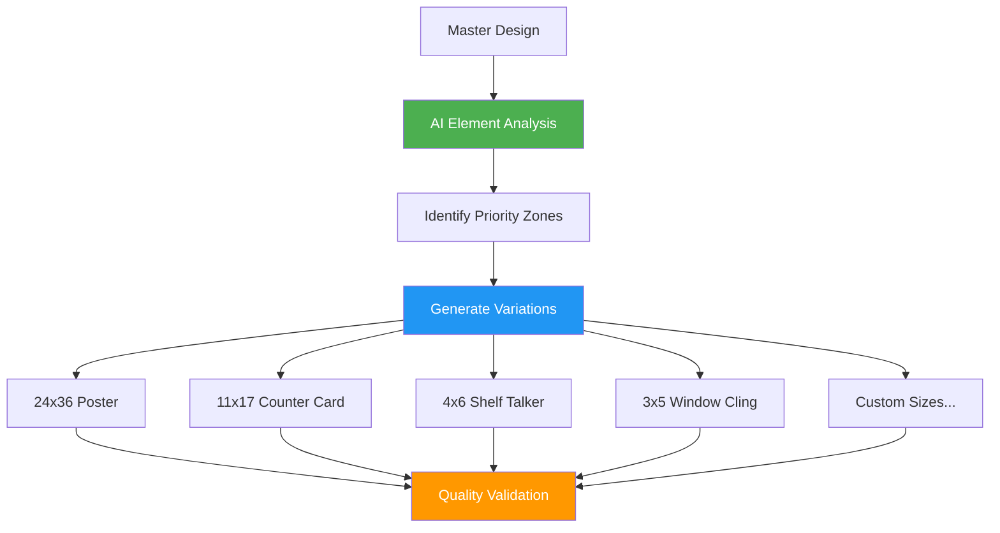
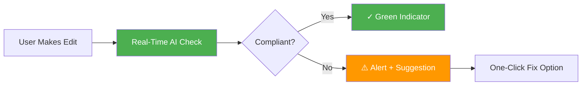

# AI for Online Designer

## Overview

AI empowers non-designers to create production-ready artwork and accelerates professional designers by automating repetitive tasks. The Online Designer becomes an intelligent creative partner that understands brand guidelines, suggests improvements, and handles tedious production work.

**Related Pillar:** [P04_Online_Designer.md](../02_Capability_Pillars/P04_Online_Designer.md)

---

## AI Features

### 1. Text-to-Design Generation

**What It Does:** Users describe what they want in plain English, and AI generates design starting points.

**Examples:**
| User Prompt | AI Output |
|-------------|-----------|
| "Summer sale banner for cooler doors" | 3 design variations with summer theme |
| "Product launch poster with our new energy drink" | Poster layouts featuring product |
| "Holiday window cling with snow theme" | Winter-themed window designs |
| "Professional bank lobby sign" | Clean, corporate design options |

**Generation Process:**


**Guardrails:**
- Generated designs use approved brand assets
- Colors constrained to brand palette
- Fonts limited to approved typography
- Layouts follow brand templates
- Human review before production

**User Value:**
- **Non-Designers:** Create professional designs without training
- **Designers:** Quick starting points, faster iteration
- **Speed:** Hours to minutes for initial concepts

**Technical Approach:**
- Stable Diffusion / DALL-E 3 for generation
- ControlNet for layout guidance
- Brand asset injection
- Post-processing compliance filter

---

### 2. Intelligent Auto-Resize

**What It Does:** One master design automatically generates all required size variations while preserving design intent.

**Smart Resize Features:**
| Feature | Description | Benefit |
|---------|-------------|---------|
| **Element Detection** | AI identifies key design elements | Protected from cropping |
| **Priority Zones** | Mark must-keep vs. flexible areas | Intelligent content placement |
| **Text Scaling** | Maintain readability across sizes | Legible at all dimensions |
| **Aspect Handling** | Smart crop or fill decisions | Design integrity preserved |
| **Template Mapping** | Auto-map to location templates | Production-ready outputs |

**Workflow:**


**User Value:**
- **Time Saved:** 80-90% reduction (47 sizes in minutes vs. hours)
- **Consistency:** All sizes from authoritative source
- **Quality:** AI ensures design integrity at every size

**Technical Approach:**
- Content-aware scaling (seam carving)
- Object detection for element identification
- Rule-based layout adaptation
- Template-based generation for survey locations

---

### 3. Design Suggestions & Improvements

**What It Does:** AI analyzes designs and suggests improvements for visual hierarchy, readability, and impact.

**Suggestion Types:**
| Type | What AI Checks | Example Suggestion |
|------|---------------|-------------------|
| **Visual Hierarchy** | Element sizing, placement | "Increase headline size by 20% for better visibility" |
| **Color Contrast** | Text readability | "Low contrast on price text - suggest darker background" |
| **Balance** | Visual weight distribution | "Design feels left-heavy - suggest centering logo" |
| **Whitespace** | Breathing room | "Elements crowded - increase margins by 10%" |
| **Call-to-Action** | CTA prominence | "CTA could be more prominent - suggest color pop" |

**Suggestion Interface:**
```
┌─────────────────────────────────────────┐
│ AI Design Assistant                      │
├─────────────────────────────────────────┤
│ 🔶 3 Suggestions Available              │
│                                         │
│ 1. ⚠️ Contrast Issue                    │
│    Price text may be hard to read       │
│    [Apply Fix] [Dismiss]                │
│                                         │
│ 2. 💡 Layout Suggestion                 │
│    Center-aligning may improve balance  │
│    [Preview] [Apply] [Dismiss]          │
│                                         │
│ 3. ✓ Brand Compliance                   │
│    Logo clear space looks good!         │
└─────────────────────────────────────────┘
```

**User Value:**
- **Quality:** Better designs through AI guidance
- **Learning:** Designers improve from suggestions
- **Speed:** Catch issues before review

**Technical Approach:**
- Rule-based analysis for brand guidelines
- ML models for visual hierarchy scoring
- Comparison to high-performing historical designs
- A/B test data informs suggestions

---

### 4. Brand Guideline Enforcement

**What It Does:** Real-time checking ensures designs comply with brand standards as users work.

**Enforcement Areas:**
| Area | What AI Checks | Enforcement Level |
|------|---------------|-------------------|
| **Logo** | Correct version, clear space, size minimum | Block non-compliant export |
| **Colors** | Palette adherence, color combinations | Warning + auto-correct option |
| **Typography** | Approved fonts, size minimums | Block unapproved fonts |
| **Imagery** | Resolution, approved assets only | Warning on low-res |
| **Legal** | Required disclaimers present | Block export if missing |

**Real-Time Feedback:**


**User Value:**
- **Brand Safety:** Impossible to export non-compliant designs
- **Speed:** Fix issues in real-time vs. review rejection
- **Confidence:** Know designs will be approved

**Technical Approach:**
- Rule engine for brand guidelines
- Object detection for logo/element checking
- Color extraction and matching
- OCR for text compliance

---

### 5. Smart Object Placement

**What It Does:** AI suggests optimal placement for design elements based on design principles and surface type.

**Placement Considerations:**
| Factor | What AI Considers | Example |
|--------|------------------|---------|
| **Surface Type** | Window, shelf, poster | Eye-level placement for windows |
| **Viewing Distance** | Near vs. far viewing | Larger elements for distant viewing |
| **Reading Pattern** | Left-to-right, Z-pattern | Key info in natural scan path |
| **Obstructions** | Handles, frames, fixtures | Avoid critical info in blocked areas |
| **Environment** | Indoor, outdoor, lighting | High contrast for bright environments |

**Template Intelligence:**
When placing design on a surveyed location template:
- AI knows where handle/obstruction zones are
- Suggests safe placement areas
- Warns if key content overlaps hazards
- Auto-adjusts to optimal positions

**User Value:**
- **Effectiveness:** Designs work in actual environment
- **Speed:** Less trial and error
- **Quality:** Professional placement automatically

**Technical Approach:**
- Survey data integration for obstruction mapping
- Design pattern recognition
- Surface-specific placement rules
- ML model trained on high-performing placements

---

### 6. Version Comparison & Change Detection

**What It Does:** AI automatically identifies and highlights differences between design versions.

**Comparison Features:**
| Feature | Description | Use Case |
|---------|-------------|----------|
| **Visual Diff** | Highlight changed areas | Quick review of edits |
| **Element Tracking** | Track specific element changes | Verify requested changes made |
| **Change Summary** | Text description of changes | Documentation/audit |
| **Rollback Assist** | Identify what to undo | Recover from mistakes |

**User Value:**
- **Review Speed:** Instantly see what changed
- **Accuracy:** Don't miss subtle changes
- **Communication:** Clear change documentation

---

## Integration Points

### With DAM
- AI-tagged assets appear in designer library
- Background-removed assets ready for compositing
- Brand-compliant assets prioritized

### With Online Proofing
- Compliance pre-check before submission
- AI suggestions visible to approvers
- Change highlights in revision comparisons

### With Survey Data
- Location templates auto-load for selected surfaces
- Obstruction zones visible during design
- Dimensions auto-populated

---

## User Value Summary

| User Type | Key Benefits | Quantified Impact |
|-----------|-------------|-------------------|
| **Non-Designers** | Create professional designs | Enable self-service |
| **Professional Designers** | Faster production, AI assistance | 3x throughput |
| **Brand Managers** | Guaranteed compliance | 90%+ compliant outputs |
| **Marketing Teams** | Faster campaigns | 50% faster design cycle |

---

## Implementation

### Phase 1 (v3)
- Basic auto-resize
- Brand compliance checking (rules-based)
- Simple design suggestions

### Phase 2 (v4)
- Text-to-design generation
- Intelligent auto-resize with element detection
- Smart object placement
- Advanced compliance with ML

### Phase 3 (v4+)
- Full generative design
- Custom models per brand
- Real-time collaborative AI
- Style transfer and adaptation

---

## Success Metrics

| Metric | Target | Measurement |
|--------|--------|-------------|
| Design completion rate | 90%+ | Designs exported vs. started |
| Auto-resize accuracy | 95%+ | Designs usable without manual adjustment |
| Compliance pass rate | 85%+ | First-submission approval rate |
| User satisfaction | 80%+ | Feature ratings |
| Time to design | 50% reduction | Average design completion time |

---

*AI for Online Designer democratizes design creation while ensuring brand consistency and production quality.*
