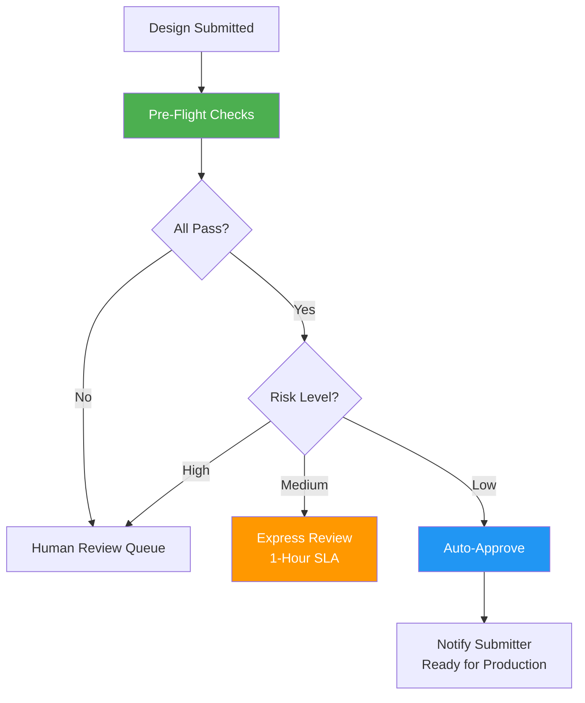

# AI for Online Proofing

## Overview

AI accelerates the proofing and approval workflow by catching issues before human review, auto-approving low-risk items, and predicting which designs will require revisions. This reduces approval cycles from days to hours while maintaining quality standards.

**Related Pillar:** [P05_Online_Proofing.md](../02_Capability_Pillars/P05_Online_Proofing.md)

---

## AI Features

### 1. Pre-Flight Checks

**What It Does:** AI automatically reviews submitted designs against a comprehensive checklist before human review begins.

**Check Categories:**
| Category | What AI Checks | Pass/Fail Criteria |
|----------|---------------|-------------------|
| **Technical** | Resolution, color mode, bleed, file format | Meets production specs |
| **Brand** | Logo usage, colors, fonts, required elements | Matches brand guidelines |
| **Content** | Spelling, pricing accuracy, legal text | No errors detected |
| **Quality** | Image sharpness, compression artifacts | Above quality threshold |
| **Compliance** | Disclaimers, regulatory requirements | All required elements present |

**Pre-Flight Report:**
```
┌─────────────────────────────────────────────────┐
│ Pre-Flight Check Results                        │
├─────────────────────────────────────────────────┤
│ ✅ Technical Specs          PASS                │
│    • Resolution: 300 dpi ✓                      │
│    • Color Mode: CMYK ✓                         │
│    • Bleed: 0.125" ✓                           │
│                                                 │
│ ✅ Brand Compliance          PASS               │
│    • Logo: Correct version ✓                    │
│    • Colors: Within tolerance ✓                 │
│    • Typography: Approved fonts ✓               │
│                                                 │
│ ⚠️ Content Review           WARNING             │
│    • Possible spelling: "Summmer" → "Summer"?   │
│    • Price format inconsistent: $5.99 vs $5,99  │
│                                                 │
│ ✅ Quality                   PASS               │
│    • All images sharp ✓                         │
│                                                 │
│ [Submit for Review] [Fix Issues First]          │
└─────────────────────────────────────────────────┘
```

**User Value:**
- **Time Saved:** Catch 60-70% of issues before human review
- **Quality:** Fewer revision rounds
- **Speed:** Faster overall approval cycle

**Technical Approach:**
- Image analysis APIs for technical checks
- Custom brand rule engine
- OCR + spell checking + grammar checking
- Quality assessment algorithms

---

### 2. Auto-Approval

**What It Does:** Low-risk submissions that pass all checks are automatically approved without human intervention.

**Auto-Approval Criteria:**
| Criterion | Requirement | Rationale |
|-----------|-------------|-----------|
| **All pre-flight checks pass** | 100% pass rate | No known issues |
| **Minor revision** | <10% change from approved version | Limited risk |
| **Trusted submitter** | Designer with 95%+ approval history | Proven track record |
| **Template-based** | Design from approved template | Pre-validated layout |
| **Low-risk content** | No pricing, legal, or sensitive content | Reduced impact of errors |

**Auto-Approval Flow:**


**User Value:**
- **Speed:** Instant approval for qualifying designs
- **Efficiency:** Human reviewers focus on complex items
- **Consistency:** Same standards applied every time

**Technical Approach:**
- Confidence scoring across all checks
- Historical approval data for trust scoring
- Risk classification model
- Configurable thresholds per client/brand

---

### 3. Revision Prediction

**What It Does:** AI predicts which submissions are likely to require revisions and why, helping prioritize review effort.

**Prediction Factors:**
| Factor | Weight | Example |
|--------|--------|---------|
| **Submitter History** | High | New designer = higher revision risk |
| **Design Complexity** | Medium | Multi-element designs = more risk |
| **Brand Sensitivity** | High | Premium brands = stricter review |
| **Content Type** | Medium | Pricing/legal = higher scrutiny |
| **Template Deviation** | High | Off-template = more likely to fail |

**Prediction Output:**
```
┌─────────────────────────────────────────────────┐
│ Revision Risk Prediction                        │
├─────────────────────────────────────────────────┤
│ Risk Score: 73% (Medium-High)                   │
│                                                 │
│ Contributing Factors:                           │
│ • New designer (first 10 submissions)     +25%  │
│ • Complex multi-panel design              +15%  │
│ • Holiday campaign (higher standards)     +10%  │
│ • Non-template layout                     +20%  │
│ • Pre-flight warnings present             +3%   │
│                                                 │
│ Likely Issues:                                  │
│ • Typography inconsistency (45% probability)    │
│ • Color accuracy (30% probability)              │
│                                                 │
│ Recommendation: Assign to senior reviewer       │
└─────────────────────────────────────────────────┘
```

**User Value:**
- **Prioritization:** Focus attention where it's needed
- **Training:** Identify designers needing coaching
- **Planning:** Predict review workload

**Technical Approach:**
- Gradient boosting model (XGBoost)
- Features: submitter history, design attributes, content type
- Training data: historical approval/rejection data
- Continuous learning from new outcomes

---

### 4. AI-Assisted Feedback

**What It Does:** AI suggests standardized feedback for common issues, making reviewer comments faster and more consistent.

**Feedback Suggestions:**
| Issue Detected | Suggested Feedback | One-Click Action |
|----------------|-------------------|------------------|
| Logo too small | "Logo does not meet minimum size requirement. Please increase to at least 2 inches wide." | Insert feedback |
| Color mismatch | "Background color #FF5733 does not match brand color #FF5500. Please adjust to approved palette." | Insert + highlight |
| Missing disclaimer | "Required disclaimer text is missing. Please add [standard disclaimer] in footer area." | Insert + template |
| Low resolution | "Main image resolution is 150 dpi. Please replace with 300 dpi minimum." | Insert feedback |

**Feedback Interface:**
```
┌─────────────────────────────────────────────────┐
│ Reviewer Panel                                   │
├─────────────────────────────────────────────────┤
│ AI Suggested Comments:                           │
│                                                 │
│ [+] Logo clear space violation                  │
│     "The logo requires 0.5" clear space on all  │
│     sides. Current spacing is 0.25" on left."   │
│                                                 │
│ [+] Font substitution detected                  │
│     "Helvetica Neue is required. Arial is not   │
│     an approved substitute."                    │
│                                                 │
│ Custom Comment: [                            ]  │
│                                                 │
│ [Request Revision] [Approve] [Approve with Note]│
└─────────────────────────────────────────────────┘
```

**User Value:**
- **Speed:** 50% faster feedback creation
- **Consistency:** Standardized language across reviewers
- **Clarity:** Specific, actionable feedback for designers

**Technical Approach:**
- Issue classification linked to feedback templates
- NLP for comment generation
- Learning from reviewer edits to suggestions
- Per-brand/client feedback customization

---

### 5. Version Comparison

**What It Does:** AI automatically identifies and highlights differences between design versions for faster review.

**Comparison Features:**
| Feature | Description | Benefit |
|---------|-------------|---------|
| **Visual Overlay** | Side-by-side with differences highlighted | Instant change visibility |
| **Change List** | Text summary of all modifications | Quick scanning |
| **Element Tracking** | Track specific element changes | Verify requested fixes |
| **Metric Comparison** | Size, color, position changes | Precise change documentation |

**Comparison View:**
```
┌───────────────────────┬───────────────────────┐
│ Version 1.2 (Previous)│ Version 1.3 (Current) │
├───────────────────────┼───────────────────────┤
│                       │                       │
│  [Design with         │  [Design with         │
│   changes in          │   changes in          │
│   RED highlight]      │   GREEN highlight]    │
│                       │                       │
├───────────────────────┴───────────────────────┤
│ Changes Detected:                             │
│ • Headline: "SUMMER SALE" → "SUMMER SAVINGS"  │
│ • Price: "$9.99" → "$8.99"                   │
│ • Logo: Moved 0.25" left                     │
│ • Background: Color adjusted (#FF5500→#FF5733)│
└───────────────────────────────────────────────┘
```

**User Value:**
- **Speed:** Instant understanding of changes
- **Accuracy:** Don't miss subtle modifications
- **Documentation:** Clear audit trail

**Technical Approach:**
- Image differencing algorithms
- Object detection for element tracking
- OCR for text change detection
- Measurement extraction for position/size

---

### 6. Approval Pattern Learning

**What It Does:** AI learns from approval patterns to continuously improve predictions and suggestions.

**Learning Areas:**
| Area | What AI Learns | Application |
|------|---------------|-------------|
| **Reviewer Preferences** | Individual reviewer standards | Route to best-fit reviewer |
| **Brand Standards** | Brand-specific approval patterns | Tighter/looser thresholds |
| **Seasonal Patterns** | Holiday = stricter review | Adjust risk scores |
| **Designer Growth** | Improvement over time | Update trust scores |
| **Common Issues** | Frequently caught problems | Prioritize in pre-flight |

**User Value:**
- **Continuous Improvement:** System gets smarter over time
- **Personalization:** Adapts to organization's standards
- **Efficiency:** Less manual configuration needed

---

## Integration Points

### With Online Designer
- Pre-flight checks run before submission
- AI suggestions visible in designer
- Version comparison in revision workflow

### With DAM
- Approved designs auto-tagged and stored
- Asset compliance status visible
- Historical versions linked

### With Workflow Automation
- Auto-approval triggers production workflow
- Revision requests auto-create tasks
- Escalation based on prediction scores

---

## User Value Summary

| User Type | Key Benefits | Quantified Impact |
|-----------|-------------|-------------------|
| **Reviewers** | Faster review, AI assistance | 50% faster per review |
| **Designers** | Faster feedback, clearer direction | 40% fewer revision rounds |
| **Brand Managers** | Consistent standards | 90%+ compliance rate |
| **Operations** | Predictable workload | Better resource planning |

---

## Implementation

### Phase 1 (v3)
- Basic pre-flight checks (technical only)
- Simple auto-approval (template-based designs)
- Version comparison

### Phase 2 (v4)
- Full pre-flight suite (brand + content)
- Smart auto-approval with risk scoring
- AI-assisted feedback
- Revision prediction

### Phase 3 (v4+)
- Custom models per brand
- Real-time collaborative review
- Autonomous approval for trusted workflows
- Predictive workload management

---

## Success Metrics

| Metric | Target | Measurement |
|--------|--------|-------------|
| Pre-flight catch rate | 70%+ | Issues found before review |
| Auto-approval rate | 40%+ | Submissions auto-approved |
| Review time | 50% reduction | Average time per review |
| Revision rounds | 30% reduction | Average rounds per design |
| Reviewer satisfaction | 80%+ | Feature ratings |

---

*AI for Online Proofing transforms the approval process from a bottleneck into an accelerator.*
