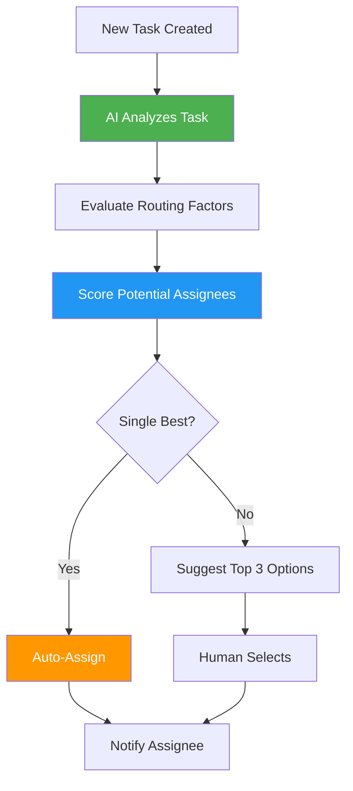
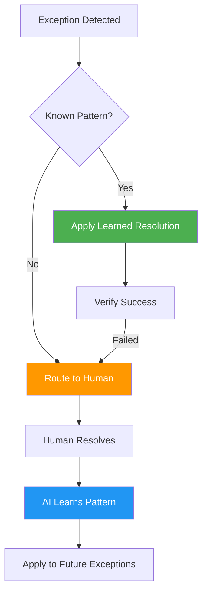

# AI for Workflow Automation

## Overview

AI transforms workflow automation from rigid rule-based systems into intelligent orchestration that adapts to real-world conditions, predicts bottlenecks, and continuously optimizes itself. The platform becomes a self-improving system that learns from every campaign.

**Related Pillar:** [P06_Workflow_Automation.md](../02_Capability_Pillars/P06_Workflow_Automation.md)

---

## AI Features

### 1. Smart Routing

**What It Does:** AI dynamically routes tasks to the optimal resource based on skills, workload, performance history, and current capacity.

**Routing Factors:**
| Factor | Weight | How AI Uses It |
|--------|--------|----------------|
| **Skill Match** | High | Route complex designs to senior designers |
| **Current Workload** | High | Balance work across team members |
| **Historical Performance** | Medium | Consider past success with similar tasks |
| **Deadline Urgency** | High | Prioritize time-sensitive items |
| **Geographic Proximity** | Medium | Route installations to nearest qualified installer |
| **Cost Optimization** | Medium | Consider labor costs for margin-sensitive jobs |

**Routing Flow:**


**User Value:**
- **Efficiency:** 30% faster task completion through optimal matching
- **Quality:** Right person for each task
- **Balance:** Even workload distribution

**Technical Approach:**
- Multi-factor scoring model
- Real-time capacity monitoring
- Historical performance data
- Learning from reassignment patterns

---

### 2. Bottleneck Prediction

**What It Does:** AI predicts workflow bottlenecks before they occur, enabling proactive intervention.

**Prediction Signals:**
| Signal | What AI Monitors | Early Warning |
|--------|-----------------|---------------|
| **Queue Depth** | Tasks waiting at each stage | Unusual accumulation |
| **Processing Time** | Time per task vs. historical | Slowdowns detected |
| **Resource Availability** | Upcoming PTO, capacity changes | Coverage gaps |
| **Incoming Volume** | New campaign submissions | Surge prediction |
| **Dependencies** | Blocked tasks | Chain reaction risk |

**Bottleneck Dashboard:**
```
┌─────────────────────────────────────────────────────────┐
│ Workflow Health Monitor                                  │
├─────────────────────────────────────────────────────────┤
│                                                         │
│ ⚠️ PREDICTED BOTTLENECK: Design Review                  │
│                                                         │
│ Current State:     ████████░░ 82% capacity              │
│ Predicted (24h):   ██████████ 115% capacity             │
│                                                         │
│ Contributing Factors:                                   │
│ • 3 new campaigns submitting tomorrow (+45 designs)     │
│ • Sarah (reviewer) PTO starts Thursday                  │
│ • Q4 deadline push increasing submission rate           │
│                                                         │
│ Recommended Actions:                                    │
│ 1. Assign backup reviewer to queue                      │
│ 2. Enable auto-approval for low-risk submissions        │
│ 3. Notify campaign managers of potential delays         │
│                                                         │
│ [Take Action] [Dismiss] [Snooze 4 Hours]               │
└─────────────────────────────────────────────────────────┘
```

**User Value:**
- **Proactive:** Address issues before they cause delays
- **Visibility:** See problems coming days in advance
- **Planning:** Better resource allocation

**Technical Approach:**
- Time series forecasting (Prophet)
- Anomaly detection for unusual patterns
- Integration with calendar/PTO systems
- Alert threshold configuration

---

### 3. Natural Language Workflow Creation

**What It Does:** Users describe workflows in plain English, and AI generates the workflow configuration.

**Examples:**
| User Says | AI Creates |
|-----------|-----------|
| "When a design is submitted, get approval from brand manager, then route to production" | 3-stage workflow with approval gate |
| "Rush orders skip the queue and go straight to the fastest printer" | Priority routing rule with vendor scoring |
| "If proofing takes more than 48 hours, escalate to the supervisor" | Time-based escalation rule |
| "Split large campaigns across multiple PSPs based on their capacity" | Load-balancing distribution rule |

**Creation Interface:**
```
┌─────────────────────────────────────────────────────────┐
│ AI Workflow Builder                                      │
├─────────────────────────────────────────────────────────┤
│                                                         │
│ Describe your workflow:                                 │
│ ┌─────────────────────────────────────────────────────┐ │
│ │ When a new campaign is created for a premium client,│ │
│ │ it should go to a senior designer first, then to    │ │
│ │ the brand manager for approval. If they reject it,  │ │
│ │ send back to design with their comments.            │ │
│ └─────────────────────────────────────────────────────┘ │
│                                                         │
│ [Generate Workflow]                                     │
│                                                         │
│ ═══════════════════════════════════════════════════════ │
│                                                         │
│ Generated Workflow Preview:                             │
│                                                         │
│ ┌──────────┐    ┌──────────┐    ┌──────────┐           │
│ │ Campaign │ ─> │ Senior   │ ─> │ Brand    │           │
│ │ Created  │    │ Designer │    │ Manager  │           │
│ └──────────┘    └──────────┘    └────┬─────┘           │
│                       ↑              │                  │
│                       └──── Reject ──┘                  │
│                              │                          │
│                           Approve                       │
│                              ↓                          │
│                       ┌──────────┐                      │
│                       │Production│                      │
│                       └──────────┘                      │
│                                                         │
│ [Edit] [Test] [Activate]                               │
└─────────────────────────────────────────────────────────┘
```

**User Value:**
- **Accessibility:** Non-technical users create workflows
- **Speed:** Minutes instead of hours
- **Iteration:** Quickly test and modify

**Technical Approach:**
- NLP parsing for workflow intent
- Template matching to common patterns
- Workflow DSL generation
- Visual preview rendering

---

### 4. Automatic SLA Management

**What It Does:** AI monitors SLA compliance in real-time and takes corrective action when deadlines are at risk.

**SLA Monitoring:**
| SLA Type | AI Monitors | Auto-Actions |
|----------|-------------|--------------|
| **Design Turnaround** | Time in design queue | Escalate, reassign, alert |
| **Approval Response** | Reviewer response time | Reminder, escalate, auto-approve |
| **Production Lead Time** | Print + ship timeline | Route to faster vendor |
| **Installation Window** | Scheduled vs. actual | Reschedule, dispatch backup |
| **Campaign Completion** | Overall timeline | Daily status, intervention alerts |

**SLA Dashboard:**
```
┌─────────────────────────────────────────────────────────┐
│ SLA Performance                                          │
├─────────────────────────────────────────────────────────┤
│                                                         │
│ Campaign: Summer Refresh 2026                           │
│ Overall Status: ⚠️ AT RISK                              │
│                                                         │
│ Stage            SLA      Current   Status              │
│ ─────────────────────────────────────────────          │
│ Design           48h      52h       🔴 BREACH          │
│ Approval         24h      18h       ✅ On Track         │
│ Production       5 days   4 days    ✅ On Track         │
│ Shipping         3 days   3 days    🟡 Tight           │
│ Installation     2 days   -         ⏳ Pending         │
│                                                         │
│ AI Actions Taken:                                       │
│ • Design escalated to backup team (2h ago)              │
│ • Expedited shipping pre-authorized                     │
│ • Installation crew on standby                          │
│                                                         │
│ Projected Completion: On Time (with interventions)      │
└─────────────────────────────────────────────────────────┘
```

**User Value:**
- **Visibility:** Real-time SLA tracking
- **Automation:** AI takes action, not just alerts
- **Accountability:** Clear responsibility tracking

**Technical Approach:**
- Rule engine for SLA definitions
- Predictive completion modeling
- Automated action triggers
- Integration with notification systems

---

### 5. Workflow Optimization Recommendations

**What It Does:** AI analyzes workflow performance and suggests improvements based on patterns across all campaigns.

**Optimization Areas:**
| Area | What AI Analyzes | Example Recommendation |
|------|-----------------|----------------------|
| **Stage Duration** | Time spent at each step | "Combining design review with brand approval saves 8 hours average" |
| **Approval Patterns** | Who approves what, when | "85% of Sarah's approvals are auto-approvable by rules" |
| **Rejection Patterns** | Why items get sent back | "Add brand checklist to reduce 40% of rejections" |
| **Resource Utilization** | Who's over/underutilized | "Redistribute workload: Team A at 120%, Team B at 60%" |
| **Parallel Opportunities** | Sequential vs. parallel | "Run production prep parallel to final approval" |

**Optimization Report:**
```
┌─────────────────────────────────────────────────────────┐
│ Monthly Workflow Optimization Report                     │
├─────────────────────────────────────────────────────────┤
│                                                         │
│ 📊 Analysis Period: November 2026                       │
│ 📁 Campaigns Analyzed: 127                              │
│                                                         │
│ TOP RECOMMENDATIONS:                                    │
│                                                         │
│ 1. ⭐ HIGH IMPACT: Parallel Processing                  │
│    Current: Design → Approval → Production (sequential) │
│    Proposed: Start production prep during approval      │
│    Impact: -1.5 days average campaign time              │
│    Risk: Low (prep is reversible)                       │
│    [Implement] [Learn More]                             │
│                                                         │
│ 2. 🔄 MEDIUM IMPACT: Auto-Approval Expansion           │
│    Finding: 340 manual approvals met auto-criteria      │
│    Proposed: Expand auto-approval rules                 │
│    Impact: 85 hours saved monthly                       │
│    [Review Rules] [Implement]                           │
│                                                         │
│ 3. 👥 RESOURCE: Workload Rebalancing                   │
│    Finding: Design Team A overloaded                    │
│    Proposed: Route 30% to Team B                        │
│    Impact: Reduce Team A burnout, faster turnaround     │
│    [Adjust Routing] [Discuss with Managers]             │
│                                                         │
└─────────────────────────────────────────────────────────┘
```

**User Value:**
- **Continuous Improvement:** Workflow gets better over time
- **Data-Driven:** Recommendations based on actual performance
- **Easy Implementation:** One-click improvements

**Technical Approach:**
- Process mining algorithms
- Statistical analysis of timing data
- Pattern recognition for inefficiencies
- A/B testing for changes

---

### 6. Exception Handling Intelligence

**What It Does:** AI detects and handles workflow exceptions automatically, learning from human resolutions.

**Exception Types:**
| Exception | AI Detection | AI Resolution |
|-----------|-------------|---------------|
| **Missing Information** | Incomplete submission | Request specific missing items |
| **Invalid Data** | Failed validation | Suggest corrections |
| **Resource Unavailable** | Assignee on PTO/overloaded | Auto-reassign to backup |
| **Deadline Impossible** | Timeline can't be met | Propose alternatives |
| **Approval Stalled** | No response past threshold | Escalate or auto-proceed |
| **External Dependency** | Waiting on vendor/client | Track and remind |

**Exception Learning:**


**User Value:**
- **Reduced Manual Work:** AI handles routine exceptions
- **Faster Resolution:** Immediate action on known issues
- **Learning System:** Gets smarter over time

**Technical Approach:**
- Pattern recognition for exception types
- Resolution playbook database
- Supervised learning from human resolutions
- Confidence scoring for auto-resolution

---

## Integration Points

### With Online Proofing
- Routing decisions consider reviewer expertise
- SLA tracking includes approval stages
- Auto-approval triggers workflow advancement

### With Production/MIS
- Bottleneck prediction includes vendor capacity
- Routing considers production schedules
- SLA tracking end-to-end through fulfillment

### With Analytics
- Workflow performance feeds dashboards
- Optimization recommendations data-backed
- Trend analysis for planning

---

## User Value Summary

| User Type | Key Benefits | Quantified Impact |
|-----------|-------------|-------------------|
| **Operations Managers** | Proactive bottleneck management | 40% fewer delays |
| **Workflow Designers** | Natural language creation | 80% faster setup |
| **Team Leads** | Intelligent workload balancing | 25% better utilization |
| **Executives** | SLA visibility and control | 90%+ SLA compliance |

---

## Implementation

### Phase 1 (v3)
- Basic smart routing (skill + availability)
- SLA monitoring with alerts
- Simple escalation rules

### Phase 2 (v4)
- Bottleneck prediction
- Natural language workflow creation
- Workflow optimization recommendations
- Exception handling with learning

### Phase 3 (v4+)
- Autonomous workflow optimization
- Cross-client pattern learning
- Predictive resource planning
- Self-healing workflows

---

## Success Metrics

| Metric | Target | Measurement |
|--------|--------|-------------|
| SLA compliance | 95%+ | On-time completion rate |
| Bottleneck prediction accuracy | 80%+ | Predicted vs. actual delays |
| Auto-resolution rate | 60%+ | Exceptions resolved without human |
| Workflow setup time | 75% reduction | Time to create new workflows |
| Optimization adoption | 70%+ | Recommendations implemented |

---

*AI for Workflow Automation transforms manual orchestration into intelligent, self-optimizing process management.*
