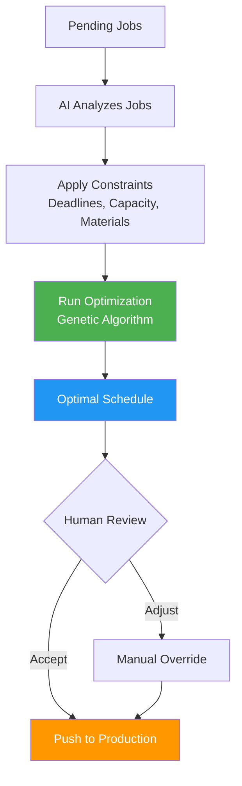
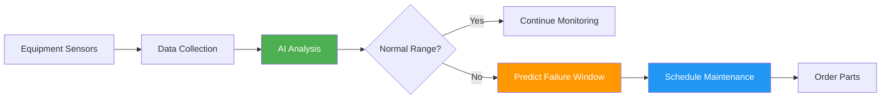
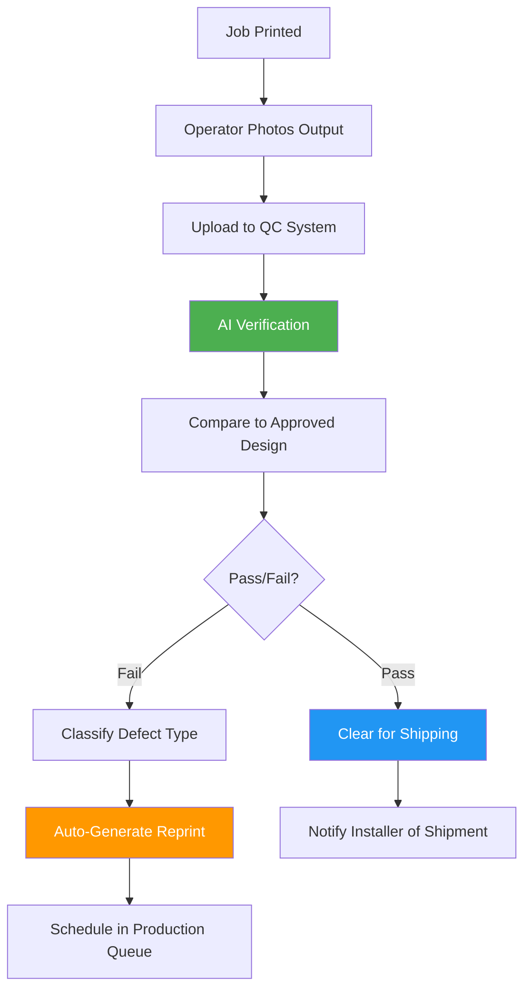

# AI for MIS/ERP (Production Intelligence)

## Overview

AI transforms production management from reactive scheduling to predictive optimization. The system anticipates demand, optimizes job routing, predicts quality issues, and maximizes equipment utilization—turning print production into a data-driven, efficient operation.

**Related Pillar:** [P07_MIS_ERP.md](../02_Capability_Pillars/P07_MIS_ERP.md)

---

## AI Features

### 1. Demand Forecasting

**What It Does:** AI predicts upcoming production volume by analyzing historical patterns, campaign schedules, and external factors.

**Forecasting Inputs:**
| Input | Source | Impact on Forecast |
|-------|--------|-------------------|
| **Historical Data** | Past production volumes | Baseline patterns |
| **Campaign Calendar** | Scheduled campaigns | Planned demand |
| **Seasonal Patterns** | Holiday, back-to-school, etc. | Cyclical adjustments |
| **Client Behavior** | Order patterns per client | Client-specific trends |
| **Market Events** | Product launches, promotions | Spike prediction |
| **Weather** | Regional forecasts | Outdoor signage demand |

**Forecast Dashboard:**
```
┌─────────────────────────────────────────────────────────┐
│ Production Demand Forecast                               │
├─────────────────────────────────────────────────────────┤
│                                                         │
│ Next 30 Days Forecast                                   │
│                                                         │
│ Volume   ▲                                              │
│ (units)  │     ╭──╮                                     │
│    1500  │    ╱    ╲    Holiday                        │
│          │   ╱      ╲   Rush                           │
│    1000  │──╱        ╲──────╮                          │
│          │ ╱              ╲  ╲                          │
│     500  │╱                ╲──╲─────                   │
│          └────────────────────────────▶ Days           │
│           Week1  Week2  Week3  Week4                    │
│                                                         │
│ Key Predictions:                                        │
│ • Nov 15-22: +45% volume (holiday campaign surge)       │
│ • Nov 23-25: -30% (Thanksgiving lull)                   │
│ • Nov 26-30: +60% (Black Friday materials)              │
│                                                         │
│ Confidence: 87% (based on 3 years historical data)      │
│                                                         │
│ Recommended Actions:                                    │
│ • Pre-order substrate for Week 2 surge                  │
│ • Schedule overtime for Nov 15-22                       │
│ • Defer maintenance to Nov 23-25                        │
└─────────────────────────────────────────────────────────┘
```

**User Value:**
- **Inventory Optimization:** Order materials just-in-time
- **Staffing:** Plan crew schedules in advance
- **Capacity:** Negotiate overflow partnerships proactively

**Technical Approach:**
- Time series forecasting (Prophet, ARIMA)
- Feature engineering from campaign data
- External data integration (weather, holidays)
- Confidence intervals for planning ranges

---

### 2. Job Scheduling Optimization

**What It Does:** AI creates optimal production schedules that minimize changeovers, maximize throughput, and meet delivery deadlines.

**Optimization Factors:**
| Factor | Optimization Goal | Example |
|--------|------------------|---------|
| **Changeover Time** | Minimize setup changes | Group similar substrates |
| **Equipment Capacity** | Maximize utilization | Balance across machines |
| **Deadline Priority** | Meet all due dates | Rush jobs scheduled first |
| **Material Batching** | Reduce waste | Combine same-stock jobs |
| **Ink Usage** | Efficient color runs | Sequence by ink setup |
| **Labor Availability** | Match to shift schedules | Complex jobs during full shifts |

**Schedule Optimization:**


**Schedule View:**
```
┌─────────────────────────────────────────────────────────┐
│ Optimized Production Schedule - Nov 15                  │
├─────────────────────────────────────────────────────────┤
│                                                         │
│ Printer A (Large Format)                                │
│ ├─ 06:00 Setup: Vinyl substrate                        │
│ ├─ 06:30 Job #4521 - Nike Window Clings (85 units)     │
│ ├─ 08:15 Job #4525 - Nike Floor Graphics (120 units)   │
│ ├─ 10:00 Setup: Change to PVC                          │
│ ├─ 10:20 Job #4518 - Banner Signs (45 units)           │
│ └─ 12:00 Lunch Break                                   │
│                                                         │
│ Efficiency: 94% utilization | 2 changeovers (vs 5)     │
│                                                         │
│ Printer B (Sheet Fed)                                   │
│ ├─ 06:00 Job #4519 - Good2Go Posters (500 units)       │
│ ├─ 09:30 Job #4522 - Good2Go Shelf Tags (1200 units)   │
│ └─ 11:00 Job #4523 - Banner Medical Brochures          │
│                                                         │
│ Efficiency: 91% utilization | Same stock all morning   │
│                                                         │
│ ⚡ Optimization Savings Today:                          │
│ • 2.5 hours saved from reduced changeovers             │
│ • 3% material savings from batching                    │
│ • 100% on-time delivery projected                      │
└─────────────────────────────────────────────────────────┘
```

**User Value:**
- **Throughput:** 15-25% increase in daily output
- **Efficiency:** 40% reduction in changeover time
- **On-Time:** 98%+ deadline compliance

**Technical Approach:**
- Constraint satisfaction solver
- Genetic algorithm for optimization
- Real-time reoptimization on changes
- Integration with equipment monitoring

---

### 3. Quality Prediction

**What It Does:** AI predicts which jobs are likely to have quality issues based on job characteristics and conditions.

**Risk Factors:**
| Factor | Risk Indicator | AI Detection |
|--------|---------------|--------------|
| **File Issues** | Low resolution, wrong color mode | Pre-flight analysis |
| **Complex Graphics** | Fine details, gradients | Image complexity scoring |
| **Substrate Match** | Ink/material compatibility | Historical success rates |
| **Equipment State** | Maintenance due, calibration drift | Sensor data + patterns |
| **Environmental** | Humidity, temperature variance | Environmental sensors |
| **Operator** | Experience level, fatigue (shift hours) | Performance history |

**Quality Prediction Alert:**
```
┌─────────────────────────────────────────────────────────┐
│ Quality Risk Alert                                       │
├─────────────────────────────────────────────────────────┤
│                                                         │
│ ⚠️ Job #4521 - Nike Window Clings                       │
│                                                         │
│ Quality Risk Score: 72% (Medium-High)                   │
│                                                         │
│ Risk Factors:                                           │
│ • Complex gradient in swoosh logo              +20%     │
│ • Vinyl substrate + metallic ink combo         +15%     │
│ • Printer A due for calibration tomorrow       +12%     │
│ • First time producing this design             +15%     │
│ • High humidity today (78%)                    +10%     │
│                                                         │
│ Historical: 23% reprint rate for similar jobs           │
│                                                         │
│ Recommended Actions:                                    │
│ 1. Run calibration before this job                      │
│ 2. Print test strip first                               │
│ 3. Assign to senior operator                            │
│ 4. Reduce print speed 10% for gradient quality          │
│                                                         │
│ [Apply Recommendations] [Proceed with Caution] [Flag]   │
└─────────────────────────────────────────────────────────┘
```

**User Value:**
- **Reduced Reprints:** 25-35% fewer quality failures
- **Proactive:** Fix issues before they occur
- **Cost Savings:** Less waste, fewer rush redos

**Technical Approach:**
- Gradient boosting model (XGBoost)
- Features from job specs, equipment state, environment
- Training on historical quality data
- Continuous learning from outcomes

---

### 4. Cost Optimization

**What It Does:** AI analyzes job costs and suggests optimizations for materials, routing, and pricing.

**Optimization Areas:**
| Area | What AI Optimizes | Savings Potential |
|------|------------------|-------------------|
| **Material Selection** | Substrate alternatives that meet specs | 10-20% material cost |
| **Nesting/Ganging** | Combine jobs on same sheet | 15-25% substrate waste |
| **Vendor Routing** | Route to lowest-cost capable vendor | 5-15% production cost |
| **Rush Avoidance** | Predict delays, prevent rush fees | 20-30% of rush premiums |
| **Quantity Breaks** | Suggest combining orders | Volume discount capture |

**Cost Analysis View:**
```
┌─────────────────────────────────────────────────────────┐
│ Job Cost Optimization - Campaign #1247                  │
├─────────────────────────────────────────────────────────┤
│                                                         │
│ Current Cost Estimate: $4,850                           │
│ Optimized Cost:        $3,920 (-$930 / -19%)           │
│                                                         │
│ OPTIMIZATION OPPORTUNITIES:                             │
│                                                         │
│ 1. Material Alternative                    Save: $340   │
│    Current: Premium vinyl ($2.40/sqft)                  │
│    Suggested: Standard vinyl ($1.80/sqft)               │
│    Note: Meets specs for indoor application             │
│    [Apply] [Keep Premium]                               │
│                                                         │
│ 2. Gang with Job #1249                     Save: $280   │
│    Same substrate, ship to same region                  │
│    Reduces setup + improves nesting                     │
│    [Combine Jobs] [Keep Separate]                       │
│                                                         │
│ 3. Route to Vendor B                       Save: $310   │
│    Vendor A: $2,100 | Vendor B: $1,790                  │
│    Both meet quality/timeline requirements              │
│    [Switch to Vendor B] [Keep Vendor A]                 │
│                                                         │
│ Margin Impact: 18% → 24% gross margin                   │
└─────────────────────────────────────────────────────────┘
```

**User Value:**
- **Margin Improvement:** 5-10% better gross margins
- **Competitive Pricing:** Pass savings to clients
- **Waste Reduction:** Environmental and cost benefits

**Technical Approach:**
- Cost modeling with variable inputs
- Optimization algorithms for nesting
- Vendor capability/pricing database
- Real-time rate comparison

---

### 5. Equipment Predictive Maintenance

**What It Does:** AI predicts equipment failures before they happen, enabling proactive maintenance.

**Monitoring Points:**
| Equipment | Sensors/Data | Failure Indicators |
|-----------|-------------|-------------------|
| **Print Heads** | Print patterns, color accuracy | Banding, color drift |
| **Rollers** | Pressure sensors, tension | Uneven pressure |
| **Heating Elements** | Temperature sensors | Temperature variance |
| **Motors** | Vibration, current draw | Unusual patterns |
| **Ink System** | Flow rates, levels | Flow irregularities |

**Maintenance Prediction:**


**Maintenance Dashboard:**
```
┌─────────────────────────────────────────────────────────┐
│ Equipment Health Monitor                                 │
├─────────────────────────────────────────────────────────┤
│                                                         │
│ Printer A - HP Latex 3200                               │
│ Overall Health: ████████░░ 82%                          │
│                                                         │
│ Component Status:                                       │
│ • Print Heads:    ████████░░ Good (800h remaining)     │
│ • Belt System:    ██████░░░░ Attention (120h est.)     │
│ • Heating Unit:   █████████░ Good                       │
│ • Ink Delivery:   ████████░░ Good                       │
│                                                         │
│ ⚠️ PREDICTION: Belt System                              │
│ Estimated failure window: 5-7 days                      │
│ Confidence: 78%                                         │
│ Recommended: Schedule replacement this weekend          │
│ Parts status: In stock (Warehouse A)                    │
│                                                         │
│ [Schedule Maintenance] [Order Parts] [Defer Alert]      │
│                                                         │
│ Last unplanned downtime: 45 days ago                    │
│ Predicted savings this month: $3,200 (avoided downtime) │
└─────────────────────────────────────────────────────────┘
```

**User Value:**
- **Uptime:** 95%+ equipment availability
- **Cost Avoidance:** Prevent expensive emergency repairs
- **Planning:** Schedule maintenance during low-demand periods

**Technical Approach:**
- IoT sensor integration
- Anomaly detection models
- Remaining useful life (RUL) prediction
- Maintenance scheduling optimization

---

### 6. Inventory Intelligence

**What It Does:** AI manages inventory levels automatically based on demand forecasts and usage patterns.

**Intelligence Features:**
| Feature | Description | Benefit |
|---------|-------------|---------|
| **Auto-Reorder** | Trigger orders at optimal points | Never run out |
| **Demand Matching** | Order based on upcoming jobs | Just-in-time inventory |
| **Vendor Selection** | Choose vendor by price, lead time | Best value |
| **Waste Prediction** | Predict material usage + waste | Accurate ordering |
| **Expiry Management** | Track and prioritize aging stock | Reduce spoilage |

**Inventory Dashboard:**
```
┌─────────────────────────────────────────────────────────┐
│ Smart Inventory Management                               │
├─────────────────────────────────────────────────────────┤
│                                                         │
│ REORDER RECOMMENDATIONS:                                │
│                                                         │
│ ⚠️ Vinyl 54" White Gloss                               │
│ Current: 120 sqft | Forecast need (7d): 450 sqft       │
│ Reorder point: 150 sqft | Lead time: 3 days            │
│ Recommended: Order 500 sqft by tomorrow                 │
│ [Auto-Order] [Adjust Quantity] [Dismiss]               │
│                                                         │
│ ✅ PVC Board 4x8 3mm                                    │
│ Current: 85 sheets | Forecast need (7d): 40 sheets     │
│ Status: Adequate inventory                              │
│                                                         │
│ 📦 Upcoming Auto-Orders (approved):                     │
│ • Nov 16: Latex ink cyan (2L) - Vendor: Supplies Co    │
│ • Nov 18: Mounting adhesive (5 rolls) - Vendor: FastShip│
│                                                         │
│ 💡 COST SAVINGS OPPORTUNITY:                            │
│ Combine vinyl + adhesive order with Vendor A            │
│ Shipping savings: $45 | Volume discount: $120           │
│ [Combine Orders]                                        │
└─────────────────────────────────────────────────────────┘
```

**User Value:**
- **Capital Efficiency:** 20-30% less inventory tied up
- **Zero Stockouts:** Never miss production for materials
- **Cost Savings:** Volume discounts, shipping optimization

**Technical Approach:**
- Demand forecasting integration
- Economic order quantity (EOQ) models
- Multi-vendor price comparison
- Safety stock optimization

---

### 7. Production QC Verification

**What It Does:** AI verifies printed output quality before shipping by comparing photos of completed jobs against approved designs, catching defects at the source before they reach installers.

**Why It Matters:** Catching defects at the PSP before shipping eliminates:
- Wasted shipping costs for defective materials
- Installer downtime waiting for reprints
- Campaign delays from field-discovered issues
- Finger-pointing between PSPs and installers

**QC Check Types:**
| Check Type | What AI Verifies | Detection Method |
|------------|-----------------|------------------|
| **Color Accuracy** | Print colors match approved proof | Color histogram comparison, Delta-E measurement |
| **Content Integrity** | All text/graphics present and correct | OCR + visual diff against source |
| **Print Defects** | Banding, streaking, blotches, smearing | Defect detection model |
| **Cut/Trim Quality** | Clean edges, correct dimensions | Edge detection, measurement |
| **Material Match** | Correct substrate used | Visual + metadata verification |
| **Finish Quality** | Lamination, coating applied correctly | Surface analysis |

**QC Capture Workflow:**


**QC Verification Dashboard:**
```
┌─────────────────────────────────────────────────────────┐
│ Production QC Verification - Job #4521                  │
├─────────────────────────────────────────────────────────┤
│                                                         │
│ ┌─────────────────────┐  ┌─────────────────────┐       │
│ │   Approved Design   │  │   Printed Output    │       │
│ │                     │  │                     │       │
│ │   [Design Image]    │  │   [Photo Upload]    │       │
│ │                     │  │                     │       │
│ └─────────────────────┘  └─────────────────────┘       │
│                                                         │
│ VERIFICATION RESULTS:                                   │
│                                                         │
│ ✅ Color Accuracy         PASS (Delta-E: 2.1)          │
│    Brand red: Within tolerance                          │
│                                                         │
│ ✅ Content Integrity      PASS                          │
│    All text matches source                              │
│    Logo placement correct                               │
│                                                         │
│ ⚠️ Print Quality          WARNING                       │
│    Minor banding detected in gradient (Row 3-5)         │
│    Severity: Low | Visible at: 12"+ viewing distance   │
│                                                         │
│ ✅ Dimensions             PASS (24.02" x 36.01")       │
│    Within ±0.1" tolerance                               │
│                                                         │
│ Overall: CONDITIONAL PASS                               │
│                                                         │
│ [Ship as-is] [Reprint] [Flag for Review]               │
└─────────────────────────────────────────────────────────┘
```

**Defect Classification:**
| Defect Type | Severity | Auto-Action |
|-------------|----------|-------------|
| **Color out of spec** | Critical | Auto-reprint required |
| **Missing content** | Critical | Auto-reprint required |
| **Visible print defect** | High | Flag for supervisor decision |
| **Minor banding** | Medium | Pass with warning, log for equipment check |
| **Trim variance (within tolerance)** | Low | Auto-pass |
| **Minor dust/debris** | Low | Clean and re-verify |

**Batch QC View:**
```
┌─────────────────────────────────────────────────────────┐
│ Batch QC Status - Campaign #1247 (Good2Go Summer)       │
├─────────────────────────────────────────────────────────┤
│                                                         │
│ Total Units: 450 | Verified: 312 | Pending: 138        │
│                                                         │
│ QC Results:                                             │
│ ████████████████████████████░░░░░░░░░ 69% Complete     │
│                                                         │
│ Pass: 298 (95.5%)  | Fail: 8 (2.6%)  | Review: 6 (1.9%)│
│                                                         │
│ Failed Units - Auto-Reprint Scheduled:                  │
│ • Units 45-48: Color shift (cyan low) - Reprint @ 2pm  │
│ • Units 201-204: Banding defect - Reprint @ 2pm        │
│                                                         │
│ Pending Review:                                         │
│ • Units 156-158: Edge trim variance (supervisor req.)  │
│ • Units 299-301: Minor lamination bubble               │
│                                                         │
│ Ship-Ready: 298 units (batched for shipment)           │
│ Projected Complete: Today 4:00 PM                       │
│                                                         │
│ [View Failed Units] [Approve Pending] [Ship Ready]     │
└─────────────────────────────────────────────────────────┘
```

**PSP Quality Scorecard:**
```
┌─────────────────────────────────────────────────────────┐
│ Quality Performance - November 2026                     │
├─────────────────────────────────────────────────────────┤
│                                                         │
│ First-Pass QC Rate: 94.2% ████████████████████░░░      │
│ Target: 95%                                             │
│                                                         │
│ Defect Breakdown:                                       │
│ • Color accuracy issues:     2.1%                       │
│ • Print defects (banding):   1.8%                       │
│ • Content errors:            0.4%                       │
│ • Trim/cut issues:           0.9%                       │
│ • Other:                     0.6%                       │
│                                                         │
│ Trend: ↑ 1.3% improvement from October                 │
│                                                         │
│ Root Cause Actions:                                     │
│ • Printer A calibration scheduled (banding source)     │
│ • New color management profile deployed                 │
│                                                         │
│ Cost Impact:                                            │
│ • Reprints this month: $2,340                          │
│ • Avoided field failures: ~$8,500 (estimated)          │
│ • Net savings: $6,160                                  │
└─────────────────────────────────────────────────────────┘
```

**User Value:**
- **Defect Prevention:** Catch 95%+ of defects before shipping
- **Cost Savings:** Eliminate shipping costs for defective materials
- **Time Savings:** No installer downtime waiting for reprints
- **Accountability:** Clear documentation of QC at production

**Technical Approach:**
- Computer vision for print quality analysis
- Color measurement algorithms (Delta-E calculation)
- OCR for text verification
- Defect detection CNN trained on print defects
- Integration with production scheduling for auto-reprint

---

## Integration Points

### With Workflow Automation
- Job scheduling respects workflow deadlines
- Quality predictions inform routing decisions
- Equipment status affects capacity planning

### With Marketplace (PSP Network)
- Demand forecasting includes marketplace orders
- Cost optimization considers network routing
- Quality tracking spans internal/external production

### With Analytics
- Production data feeds business intelligence
- Equipment metrics in operational dashboards
- Cost analysis for profitability reporting

### With Installation Verification
- Production QC creates baseline for field comparison
- Defects caught at PSP reduce field failure rate
- Shared defect classification enables end-to-end tracking
- PSP quality scores inform marketplace routing decisions

---

## User Value Summary

| User Type | Key Benefits | Quantified Impact |
|-----------|-------------|-------------------|
| **Production Managers** | Optimal scheduling, quality prediction | 20% throughput increase |
| **Operators** | Proactive maintenance, clear priorities | 30% less unplanned downtime |
| **QC Staff** | AI-assisted verification, defect prevention | 95%+ ship-ready accuracy |
| **Procurement** | Smart inventory, cost optimization | 25% inventory reduction |
| **Finance** | Accurate costing, margin optimization | 8% margin improvement |

---

## Implementation

### Phase 1 (v3)
- Basic demand forecasting
- Simple schedule optimization
- Inventory reorder alerts
- Basic production QC (manual photo upload + checklist)

### Phase 2 (v4)
- Advanced scheduling with changeover optimization
- Quality prediction
- Cost optimization recommendations
- Basic predictive maintenance
- AI-assisted production QC verification
- Auto-reprint workflow integration

### Phase 3 (v4+)
- Autonomous scheduling
- Real-time IoT equipment monitoring
- Cross-facility optimization
- Custom models per production environment
- Inline automated QC scanning (camera integration)
- Predictive defect prevention (stop before printing bad output)

---

## Success Metrics

| Metric | Target | Measurement |
|--------|--------|-------------|
| Forecast accuracy | 85%+ | Predicted vs. actual volume |
| Schedule efficiency | 90%+ | Utilization rate |
| Reprint reduction | 30%+ | Quality failures avoided |
| On-time delivery | 98%+ | Jobs delivered by deadline |
| Unplanned downtime | <5% | Equipment availability |
| Production QC pass rate | 95%+ | First-pass verification success |
| Field defect rate | <2% | Defects found at installation |
| QC verification time | <30 sec | AI analysis per unit |

---

*AI for Production transforms print manufacturing from reactive to predictive, maximizing efficiency and quality while minimizing costs.*
