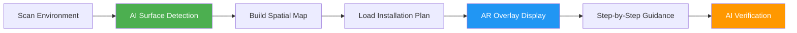
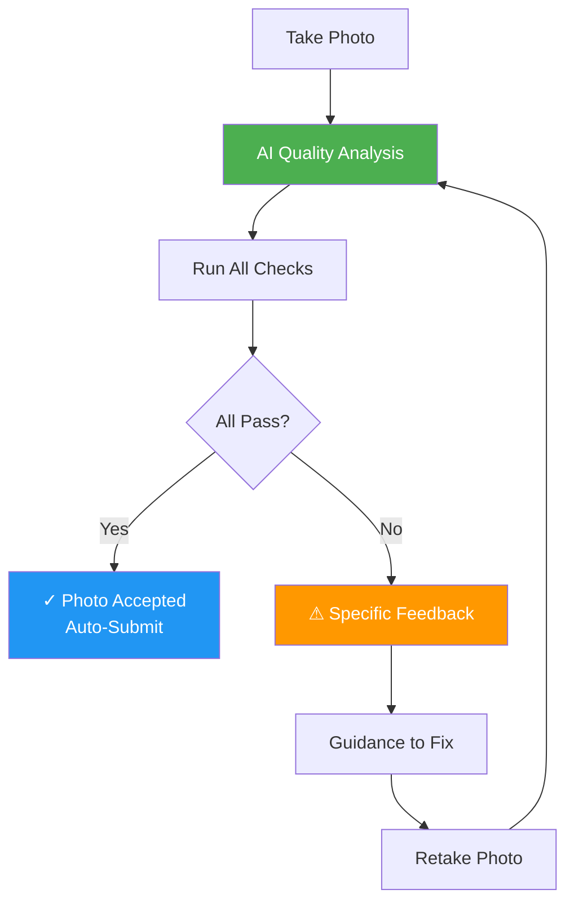
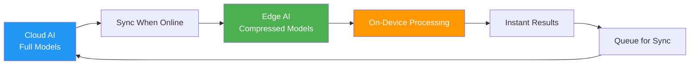
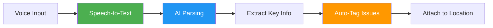
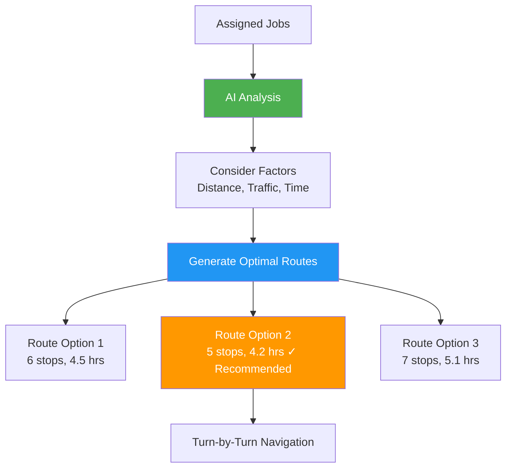
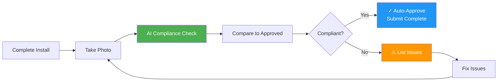

# AI for Native Mobile App

## Overview

AI transforms the Native Mobile app from a basic field tool into an intelligent installation assistant that guides installers, validates work quality, and operates effectively even without network connectivity. Mobile AI enables hands-free documentation, optimized routing, and real-time compliance verification at the point of installation.

**Related Pillar:** [P08_Native_Mobile.md](../02_Capability_Pillars/P08_Native_Mobile.md)

---

## AI Features

### 1. AR Installation Guidance

**What It Does:** Augmented reality overlays show installers exactly where and how to place signage using device camera and spatial mapping.

**AR Capabilities:**
| Feature | Description | Value |
|---------|-------------|-------|
| **Visual Overlay** | Project sign placement onto real surface | See exact position before installation |
| **Measurement Guides** | Show distances from reference points | Eliminate measuring tape guesswork |
| **Alignment Helpers** | Level indicators, center lines | Perfect alignment every time |
| **Step-by-Step** | Progressive installation steps | Guide complex multi-piece installations |
| **Warning Zones** | Highlight obstructions, hazards | Avoid placement mistakes |

**AR Workflow:**


**AR Interface:**
```
┌─────────────────────────────────────────┐
│     📱 Camera View (AR Mode)            │
├─────────────────────────────────────────┤
│                                         │
│   ╔═════════════════════╗               │
│   ║                     ║               │
│   ║   [SIGN PREVIEW]    ║  ← AR Overlay │
│   ║     24" x 36"       ║               │
│   ╚═════════════════════╝               │
│        ↕ 48" from floor                 │
│        ↔ 12" from edge                  │
│                                         │
│   ✓ Level: Perfect                      │
│   ✓ Height: 48.2" ✓                     │
│   ⚠ Warning: Door handle zone           │
│                                         │
│   [Place Here] [Adjust] [Done]          │
└─────────────────────────────────────────┘
```

**User Value:**
- **Accuracy:** Perfect placement on first try
- **Speed:** 40-60% faster installation
- **Confidence:** Visual confirmation reduces errors
- **Training:** Less experienced installers can succeed

**Technical Approach:**
- ARCore (Android) / ARKit (iOS) for spatial mapping
- Computer vision for surface detection
- Survey data integration for exact placement specs
- Offline-capable with pre-loaded location data
- Gyroscope/accelerometer for level detection

---

### 2. Photo Quality Validation

**What It Does:** AI instantly analyzes installation photos to ensure they meet quality standards before the installer leaves the site.

**Validation Checks:**
| Check | What AI Looks For | Pass/Fail Criteria |
|-------|-------------------|-------------------|
| **Image Quality** | Focus, exposure, resolution | Sharp, well-lit, >300 DPI |
| **Framing** | Full sign visible, proper angle | Complete view, straight-on |
| **Lighting** | Even lighting, no glare | No shadows, reflections minimal |
| **Context** | Installation in environment | Shows placement context |
| **Sign Condition** | No damage, wrinkles, gaps | Perfect installation |
| **Compliance** | Matches approved design | Visual match confirmation |

**Validation Process:**


**Real-Time Feedback:**
```
┌─────────────────────────────────────────┐
│  Photo Quality Check                    │
├─────────────────────────────────────────┤
│  ✓ Resolution: Good (2400 DPI)          │
│  ✓ Focus: Sharp                         │
│  ✓ Lighting: Adequate                   │
│  ⚠ Framing: Sign partially cut off      │
│  ✓ No glare detected                    │
│                                         │
│  Suggestion: Step back 2 feet and       │
│  recenter to capture full sign.         │
│                                         │
│  [Retake Photo] [Override & Submit]     │
└─────────────────────────────────────────┘
```

**User Value:**
- **First-Time Quality:** 85%+ photos accepted first try
- **No Rework:** Catch issues before leaving site
- **Faster Approval:** Quality photos auto-approved
- **Learning:** Installers improve photography skills

**Technical Approach:**
- Google Cloud Vision API for image analysis
- Custom ML model for POP-specific quality metrics
- Resolution and sharpness detection
- Glare/reflection detection algorithms
- Template matching for compliance verification
- Edge processing for instant feedback

---

### 3. Offline AI

**What It Does:** Edge AI models run directly on device, enabling full functionality in areas without cellular/WiFi connectivity.

**Offline Capabilities:**
| Feature | Offline Capability | How It Works |
|---------|-------------------|--------------|
| **AR Guidance** | Full AR installation guidance | Pre-loaded location data + on-device AR |
| **Photo Validation** | Quality checks, basic compliance | Lightweight edge models |
| **Voice Notes** | Speech-to-text transcription | On-device STT models |
| **Compliance Check** | Basic brand guideline validation | Compressed detection models |
| **Route Optimization** | Next location routing | Cached map data + local calculation |

**Offline Architecture:**


**Offline/Online Sync:**
- Pre-download location data and models before field work
- Process photos and validations on-device
- Queue results for sync when connectivity returns
- Seamless transition between offline/online modes
- Background sync optimization

**User Value:**
- **Reliability:** Works anywhere, even remote locations
- **Speed:** No network latency, instant processing
- **Coverage:** No dead zones or connectivity issues
- **Cost:** Reduced data usage

**Technical Approach:**
- TensorFlow Lite for on-device inference
- Model compression (quantization, pruning)
- CoreML (iOS) / ML Kit (Android)
- Local storage for pre-loaded data
- Smart sync with differential updates
- Model size: <50MB per feature

---

### 4. Voice-to-Text Notes

**What It Does:** Installers can dictate notes, observations, and issues hands-free while working on installations.

**Voice Features:**
| Feature | Description | Use Case |
|---------|-------------|----------|
| **Hands-Free** | No typing required | Document while installing |
| **Real-Time** | Instant transcription | See notes as you speak |
| **Context-Aware** | Understands field terms | Recognizes POP/retail terminology |
| **Auto-Tagging** | AI extracts key info | Auto-categorize issues |
| **Multi-Language** | Support for field teams | Spanish, French, etc. |

**Voice Workflow:**


**Voice Interface:**
```
┌─────────────────────────────────────────┐
│  🎤 Voice Notes                         │
├─────────────────────────────────────────┤
│  [🔴 Recording... 0:23]                 │
│                                         │
│  Transcription:                         │
│  "Window cling installed on cooler      │
│   door three. Slight bubble on bottom   │
│   right corner, will need replacement.  │
│   Surface was dusty, cleaned before     │
│   application."                         │
│                                         │
│  AI Detected:                           │
│  ⚠ Issue: Bubble (replacement needed)   │
│  📍 Location: Cooler door 3             │
│  ✓ Action: Surface cleaned              │
│                                         │
│  [Save Note] [Retake] [Add Photo]       │
└─────────────────────────────────────────┘
```

**Smart Extraction:**
- AI identifies issue keywords ("bubble," "damaged," "missing")
- Extracts location references ("door 3," "back wall")
- Recognizes action items ("need replacement," "order parts")
- Auto-creates follow-up tasks
- Links notes to specific installation photos

**User Value:**
- **Speed:** 3x faster than typing
- **Detail:** Capture more context while it's fresh
- **Safety:** Keep hands free for work
- **Accuracy:** No typing errors on small screens

**Technical Approach:**
- Google Speech-to-Text API (online)
- On-device STT (offline via iOS/Android SDKs)
- Custom vocabulary for POP/retail terms
- NLP for key phrase extraction (spaCy)
- Context injection for location/task awareness
- Language detection and translation

---

### 5. Smart Scheduling & Route Optimization

**What It Does:** AI optimizes installer routes based on location, traffic, time windows, and job complexity to maximize efficiency.

**Optimization Factors:**
| Factor | What AI Considers | Impact |
|--------|------------------|--------|
| **Distance** | Drive time, mileage | Minimize travel |
| **Traffic** | Real-time traffic patterns | Avoid delays |
| **Time Windows** | Store hours, access restrictions | Ensure availability |
| **Job Complexity** | Installation time estimates | Realistic scheduling |
| **Priority** | Urgent jobs, deadlines | Critical jobs first |
| **Skills** | Installer capabilities | Match job requirements |

**Route Optimization:**


**Smart Scheduling Interface:**
```
┌─────────────────────────────────────────┐
│  📅 Today's Schedule (AI Optimized)     │
├─────────────────────────────────────────┤
│  ⚡ Saved 47 min vs. manual route       │
│                                         │
│  1. 🏪 Store #342 - 8:30 AM (30m)       │
│     2.1 mi, 8 min drive                 │
│                                         │
│  2. 🏪 Store #156 - 9:15 AM (45m)       │
│     4.7 mi, 12 min drive                │
│                                         │
│  3. 🏪 Store #289 - 10:30 AM (30m)      │
│     1.8 mi, 6 min drive                 │
│                                         │
│  ⏸ Lunch Break - 11:15 AM (30m)         │
│                                         │
│  4. 🏪 Store #445 - 12:00 PM (60m)      │
│     8.2 mi, 18 min drive                │
│                                         │
│  [Start Route] [Adjust] [Add Stop]      │
└─────────────────────────────────────────┘
```

**Dynamic Re-Routing:**
- Adjust route if job takes longer than expected
- Suggest adding nearby urgent jobs
- Traffic-aware ETA updates
- Auto-notify if running late
- Reoptimize based on completed jobs

**User Value:**
- **Efficiency:** 30-40% more jobs per day
- **Reduced Costs:** Less drive time, fuel savings
- **Predictability:** Accurate ETAs
- **Flexibility:** Easy to adjust on the fly

**Technical Approach:**
- Google Maps API / Mapbox for routing
- Traffic data integration
- Traveling salesman problem (TSP) algorithms
- Machine learning for time estimation
- Historical completion time data
- Real-time optimization engine

---

### 6. Real-Time Compliance Feedback

**What It Does:** AI provides instant verification that installation matches approved design and brand guidelines before installer completes the job.

**Compliance Checks:**
| Check | What AI Verifies | Method |
|-------|-----------------|--------|
| **Design Match** | Installed sign matches approved artwork | Visual template matching |
| **Placement** | Position matches survey specifications | AR spatial comparison |
| **Orientation** | Correct rotation, not upside-down | Object detection + OCR |
| **Completeness** | All pieces installed | Count verification |
| **Condition** | No damage, wrinkles, gaps | Defect detection |
| **Brand Elements** | Logo visible, colors correct | Brand asset recognition |

**Real-Time Validation:**


**Compliance Feedback:**
```
┌─────────────────────────────────────────┐
│  ✓ Installation Compliance Check        │
├─────────────────────────────────────────┤
│  ✓ Design Match: 98% match              │
│  ✓ Placement: Within 1" tolerance       │
│  ✓ Level: Perfect (0.2° variance)       │
│  ⚠ Condition: Minor bubble detected     │
│  ✓ Brand: Logo visible and correct      │
│  ✓ Completeness: All 3 pieces present   │
│                                         │
│  Overall: 92% Compliance                │
│  Recommended Action: Fix bubble          │
│                                         │
│  [View Issue] [Fix & Recheck] [Override]│
└─────────────────────────────────────────┘
```

**Issue Guidance:**
When compliance check fails:
- Pinpoint exact issue location on photo
- Provide specific fix instructions
- Show reference image of correct installation
- Estimate fix time
- Allow documented override for edge cases

**User Value:**
- **Quality Assurance:** Catch errors before leaving site
- **Rework Reduction:** 75% fewer follow-up visits
- **Client Satisfaction:** Consistently compliant installations
- **Installer Confidence:** Know work is approved

**Technical Approach:**
- Template matching for design verification
- Object detection for placement/orientation
- Defect detection ML models
- Color matching algorithms
- AR spatial data comparison
- Brand asset recognition (logo detection)
- Configurable tolerance thresholds

---

## Integration Points

### With Survey Data
- Pre-loaded location specs for AR guidance
- Exact placement measurements from surveys
- Obstruction zone data for AR warnings
- Template matching for compliance

### With Workflow Automation
- Installation completion triggers next workflow step
- Issues auto-create follow-up tasks
- Photos automatically attach to work orders
- Status updates sync to dashboard

### With DAM
- Approved designs loaded to device
- Brand guidelines available offline
- Installation photos upload to asset library
- Before/after photo linking

### With Online Proofing
- Compliance verification uses approved artwork
- Photo quality meets proofing standards
- Auto-submit for final approval if compliant

---

## User Value Summary

| User Type | Key Benefits | Quantified Impact |
|-----------|-------------|-------------------|
| **Field Installers** | AR guidance, hands-free notes, offline capability | 40% faster installations |
| **Field Managers** | Route optimization, real-time status | 30% more jobs per day |
| **Quality Assurance** | Photo validation, compliance checks | 75% fewer rework visits |
| **Clients** | Consistent quality, compliance assurance | 90%+ compliant installations |

---

## Implementation

### Phase 1 (v3)
- Photo quality validation (cloud-based)
- Voice-to-text notes (online mode)
- Basic route optimization
- Manual compliance review

### Phase 2 (v4)
- AR installation guidance
- Real-time compliance feedback
- Smart scheduling with AI optimization
- Offline photo validation (edge models)

### Phase 3 (v4+)
- Full offline AI capability
- Advanced AR with multi-piece installations
- Predictive scheduling based on historical data
- Custom models per brand/client
- Computer vision-based defect detection
- Multi-language voice recognition

---

## Success Metrics

| Metric | Target | Measurement |
|--------|--------|-------------|
| Installation accuracy | 95%+ | First-time compliance rate |
| Photo acceptance rate | 85%+ | Photos approved without retake |
| Route efficiency | 30%+ improvement | Jobs per day vs. manual routing |
| Offline capability | 100% features | % of features working offline |
| Rework reduction | 75%+ reduction | Follow-up visits vs. baseline |
| User satisfaction | 85%+ positive | Installer app ratings |

---

*AI for Native Mobile transforms field installation from error-prone manual work to guided, verified, and optimized execution that works anywhere.*
