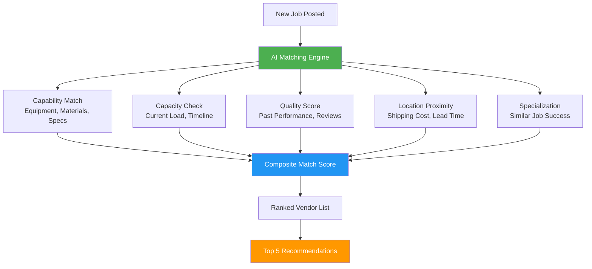
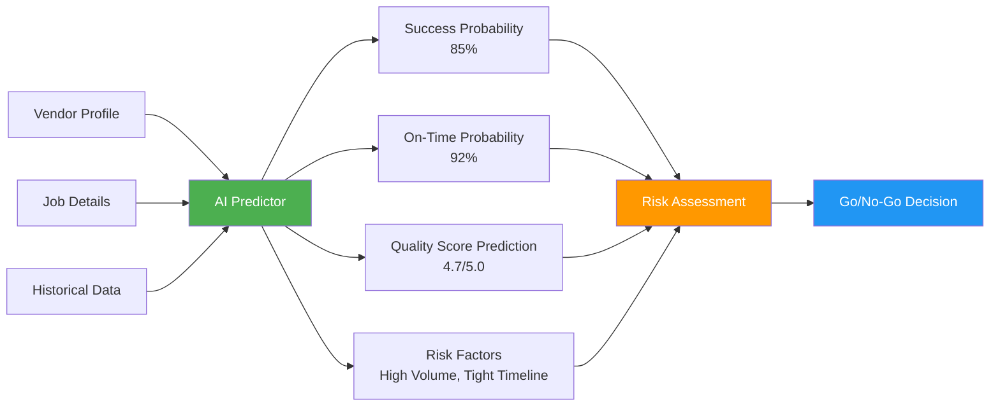
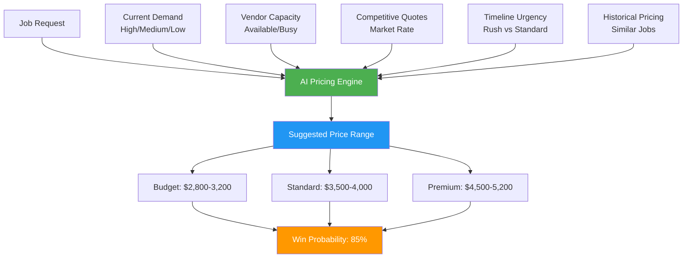
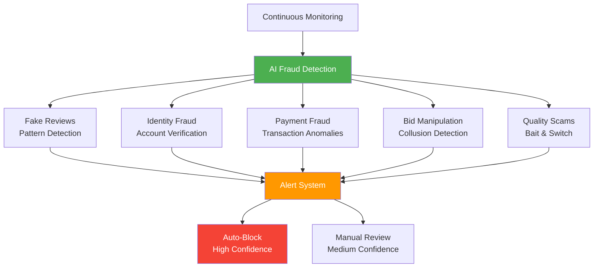
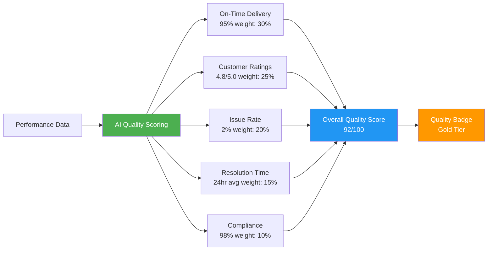
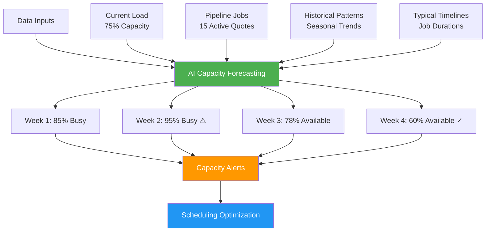

# AI for Marketplace

## Overview

AI transforms the PopSystem marketplace from a simple vendor directory into an intelligent matching and optimization platform. By analyzing capability, capacity, quality history, and performance patterns, AI ensures optimal vendor selection, predicts success rates, detects fraud, and dynamically optimizes pricing to create the most efficient marketplace for POP signage production.

**Related Pillar:** [P08_Marketplace.md](../02_Capability_Pillars/P08_Marketplace.md)

---

## AI Features

### 1. Smart Matching

**What It Does:** AI automatically matches jobs to the best-fit vendors based on capability, capacity, quality history, location, and specialization.

**Matching Factors:**


**Matching Criteria:**
| Factor | Weight | What AI Analyzes | Impact |
|--------|--------|-----------------|--------|
| **Capability Match** | 30% | Equipment, materials, certifications | Can they do it? |
| **Quality History** | 25% | Past job ratings, issue rates, rework | Will they do it well? |
| **Capacity Available** | 20% | Current load, production schedule | Can they do it on time? |
| **Location/Logistics** | 15% | Distance, shipping, installation zones | Cost & speed optimization |
| **Specialization** | 10% | Similar job success rate | Best-fit for job type |

**Match Score Display:**
```
┌─────────────────────────────────────────────────────┐
│ Top Vendor Matches for Job #12345                   │
├─────────────────────────────────────────────────────┤
│                                                     │
│ 1. PrintPro Solutions                    Match: 95% │
│    ⭐ 4.8/5.0 | 🎯 100% on-time | 📍 23 mi        │
│    └─ Specializes in cooler door graphics          │
│    └─ Available: Can start immediately              │
│    [Select] [View Profile]                         │
│                                                     │
│ 2. SignCraft Industries                  Match: 89% │
│    ⭐ 4.6/5.0 | 🎯 95% on-time | 📍 45 mi          │
│    └─ Strong POP display track record               │
│    └─ Available: 2-day lead time                    │
│    [Select] [View Profile]                         │
│                                                     │
│ 3. Elite Print Services                  Match: 86% │
│    ⭐ 4.9/5.0 | 🎯 98% on-time | 📍 67 mi          │
│    └─ Premium quality, higher cost                  │
│    └─ Available: 3-day lead time                    │
│    [Select] [View Profile]                         │
│                                                     │
│ [View All 12 Matches] [Refine Criteria]            │
└─────────────────────────────────────────────────────┘
```

**User Value:**
- **Time Saved:** 80% reduction in vendor research time
- **Quality:** Higher success rates from better matching
- **Confidence:** Data-driven vendor selection

**Technical Approach:**
- Multi-factor scoring algorithm
- Historical performance analysis
- Real-time capacity integration
- Geographic optimization
- Machine learning model trained on successful matches

---

### 2. Performance Prediction

**What It Does:** AI predicts the likelihood of vendor success for specific job types before assignment.

**Prediction Factors:**


**Prediction Categories:**
| Prediction | What AI Forecasts | Data Sources | Confidence Level |
|------------|------------------|--------------|-----------------|
| **Success Probability** | Job completion likelihood | Past completion rate, similar jobs | 85-95% |
| **On-Time Delivery** | Probability of meeting deadline | Historical timeliness, current load | 80-90% |
| **Quality Score** | Expected quality rating | Past ratings, job complexity | 75-85% |
| **Issue Rate** | Likelihood of problems | Issue history, job risk factors | 70-85% |
| **Cost Accuracy** | Quote vs. actual variance | Historical pricing accuracy | 80-90% |

**Prediction Dashboard:**
```
┌───────────────────────────────────────────────────┐
│ Performance Prediction: PrintPro Solutions        │
├───────────────────────────────────────────────────┤
│                                                   │
│ Job #12345: 500 Cooler Door Graphics             │
│                                                   │
│ ✅ Success Probability:           92% [High]     │
│ ⚠️  On-Time Delivery:             78% [Medium]   │
│ ✅ Predicted Quality:             4.6/5.0 [High] │
│ ⚠️  Issue Risk:                   23% [Medium]   │
│                                                   │
│ Risk Factors:                                     │
│ • High volume order (500 units)                   │
│ • Tight 10-day timeline                           │
│ • Vendor currently at 75% capacity                │
│                                                   │
│ Mitigation Suggestions:                           │
│ ✓ Add 2-day buffer to timeline                    │
│ ✓ Schedule mid-production check-in                │
│ ✓ Consider splitting order with backup vendor     │
│                                                   │
│ [Proceed with Vendor] [Select Alternative]       │
└───────────────────────────────────────────────────┘
```

**User Value:**
- **Risk Reduction:** Avoid problematic vendor matches
- **Informed Decisions:** Data-driven vendor selection
- **Proactive Management:** Address risks before they occur

**Technical Approach:**
- Supervised learning on historical job outcomes
- Feature engineering from vendor/job attributes
- Probabilistic predictions with confidence intervals
- Continuous model retraining on new outcomes

---

### 3. Dynamic Pricing Optimization

**What It Does:** AI optimizes marketplace pricing based on demand, vendor capacity, competition, and market conditions.

**Pricing Factors:**


**Pricing Optimization:**
| Factor | Impact | AI Adjustment | Example |
|--------|--------|--------------|---------|
| **High Demand** | +15-25% | Suggest premium pricing | Holiday season surge |
| **Low Capacity** | +20-30% | Rush pricing premium | Vendors booked |
| **High Competition** | -10-20% | Competitive adjustment | Many qualified vendors |
| **Standard Timeline** | Baseline | Market rate | Normal conditions |
| **Rush Timeline** | +25-40% | Urgency premium | <3 day turnaround |
| **Repeat Client** | -5-10% | Loyalty discount | Relationship pricing |

**Pricing Interface (Vendor Side):**
```
┌─────────────────────────────────────────────────────┐
│ Smart Pricing Assistant                              │
├─────────────────────────────────────────────────────┤
│ Job #12345: 500 Cooler Door Graphics                │
│                                                     │
│ AI Suggested Price Range:                           │
│                                                     │
│ ┌─────────────────────────────────────────────┐   │
│ │ Budget     Standard    Premium                 │   │
│ │ $3,200     $3,850      $4,600                  │   │
│ │ 85% win    65% win     35% win                 │   │
│ └─────────────────────────────────────────────┘   │
│                                                     │
│ Market Intelligence:                                │
│ • Average market rate: $3,750                       │
│ • 3 other vendors likely to quote                   │
│ • Estimated competitor range: $3,500-4,200          │
│ • Client has 15% rush timeline premium              │
│                                                     │
│ Your Quote: [$________]                             │
│                                                     │
│ 💡 Tip: Price at $3,850 for optimal win rate        │
│    while maintaining margin                         │
│                                                     │
│ [Submit Quote]                                      │
└─────────────────────────────────────────────────────┘
```

**Pricing Interface (Client Side):**
```
┌─────────────────────────────────────────────────────┐
│ Expected Pricing for Your Job                        │
├─────────────────────────────────────────────────────┤
│ Job: 500 Cooler Door Graphics                       │
│                                                     │
│ AI Price Estimate: $3,500 - $4,200                  │
│                                                     │
│ Price Range Breakdown:                              │
│ • Base production cost:        $2,800               │
│ • Materials premium:           $400                 │
│ • Rush timeline surcharge:     $300-600             │
│ • Typical vendor margin:       $500-800             │
│                                                     │
│ 📊 Similar Job History:                             │
│    Recent quotes: $3,200 - $4,500 (avg $3,850)     │
│                                                     │
│ 💡 Optimization Tips:                               │
│ • Add 3 days to timeline: Save ~$400                │
│ • Increase order to 750 units: 12% volume discount  │
│                                                     │
│ [Post Job] [Adjust Parameters]                     │
└─────────────────────────────────────────────────────┘
```

**User Value:**
- **Vendors:** Competitive pricing guidance, higher win rates
- **Clients:** Fair market pricing, budget predictability
- **Platform:** Optimal transaction volume through balanced pricing

**Technical Approach:**
- Historical pricing analysis
- Supply/demand modeling
- Competitive pricing intelligence
- Win probability estimation
- Real-time market condition monitoring

---

### 4. Fraud Detection

**What It Does:** AI identifies suspicious patterns and fraudulent activity in marketplace transactions.

**Detection Areas:**


**Fraud Patterns:**
| Fraud Type | Detection Signals | AI Response | Action |
|-----------|------------------|-------------|--------|
| **Fake Reviews** | Review velocity, text similarity, IP patterns | 95% confidence | Auto-remove, flag account |
| **Identity Fraud** | Document inconsistencies, stolen credentials | 90% confidence | Block account, notify admin |
| **Payment Fraud** | Unusual payment patterns, chargebacks | 85% confidence | Hold funds, verify transaction |
| **Bid Manipulation** | Coordinated bidding, price fixing patterns | 80% confidence | Investigation, warn parties |
| **Quality Scams** | Sample vs. delivery mismatch, complaints | 75% confidence | Escrow hold, mediation |
| **Account Takeover** | Login anomalies, behavior changes | 90% confidence | Lock account, require verification |

**Fraud Alert Dashboard:**
```
┌─────────────────────────────────────────────────────┐
│ Fraud Detection Alerts                               │
├─────────────────────────────────────────────────────┤
│                                                     │
│ 🔴 HIGH RISK - Immediate Action Required            │
│                                                     │
│ Vendor: QuickPrint Express (ID: 7829)               │
│ Alert: Suspected Review Manipulation                │
│ Confidence: 94%                                     │
│                                                     │
│ Detected Patterns:                                  │
│ • 15 reviews posted in 2-hour window                │
│ • All 5-star ratings from new accounts              │
│ • Similar text patterns (AI-generated?)             │
│ • IP addresses from same geographic cluster         │
│                                                     │
│ Recommended Action:                                 │
│ ✓ Remove flagged reviews                            │
│ ✓ Suspend vendor account pending investigation      │
│ ✓ Notify compliance team                            │
│                                                     │
│ [Take Action] [Review Evidence] [False Positive]   │
│                                                     │
├─────────────────────────────────────────────────────┤
│                                                     │
│ 🟡 MEDIUM RISK - Review Recommended                 │
│                                                     │
│ Client: RetailCo Northwest (ID: 3421)               │
│ Alert: Unusual Payment Pattern                      │
│ Confidence: 78%                                     │
│                                                     │
│ Detected Patterns:                                  │
│ • 3 high-value orders in 24 hours                   │
│ • New payment method used                           │
│ • Shipping to new addresses                         │
│                                                     │
│ [Investigate] [Contact Client] [Approve]           │
│                                                     │
└─────────────────────────────────────────────────────┘
```

**Protection Features:**
- **Vendor Verification:** AI validates credentials, certifications, business licenses
- **Payment Protection:** Escrow system with fraud detection
- **Review Authenticity:** Verified purchaser reviews only
- **Behavioral Analysis:** Unusual activity triggers review
- **Network Analysis:** Detect coordinated fraud rings

**User Value:**
- **Trust:** Safe, verified marketplace
- **Protection:** Financial security for all parties
- **Quality:** Legitimate vendors and clients only

**Technical Approach:**
- Anomaly detection algorithms
- Natural language processing for fake review detection
- Network analysis for collusion patterns
- Behavioral biometrics for account takeover detection
- Integration with payment fraud systems

---

### 5. Quality Scoring System

**What It Does:** AI automatically calculates comprehensive quality scores based on delivery performance, customer feedback, issue rates, and resolution efficiency.

**Quality Score Components:**


**Scoring Breakdown:**
| Component | Weight | Measurement | Grade Thresholds |
|-----------|--------|-------------|-----------------|
| **On-Time Delivery** | 30% | % jobs delivered by deadline | A: 95%+, B: 90-94%, C: 85-89%, D: 80-84%, F: <80% |
| **Customer Ratings** | 25% | Average review score | A: 4.7+, B: 4.3-4.6, C: 4.0-4.2, D: 3.5-3.9, F: <3.5 |
| **Issue Rate** | 20% | % jobs with reported issues | A: <3%, B: 3-5%, C: 5-8%, D: 8-12%, F: >12% |
| **Resolution Speed** | 15% | Avg time to resolve issues | A: <24hr, B: 24-48hr, C: 48-72hr, D: 72-96hr, F: >96hr |
| **Compliance** | 10% | Spec adherence, certifications | A: 98%+, B: 95-97%, C: 92-94%, D: 88-91%, F: <88% |

**Quality Badge Tiers:**
```
┌─────────────────────────────────────────────────────┐
│ Quality Badge System                                 │
├─────────────────────────────────────────────────────┤
│                                                     │
│ 🏆 Platinum (95-100 pts)                            │
│    • Priority in smart matching                      │
│    • Featured vendor listing                         │
│    • 5% lower platform fees                          │
│    • Exclusive enterprise clients                    │
│                                                     │
│ 🥇 Gold (85-94 pts)                                 │
│    • Enhanced visibility                             │
│    • Quality badge display                           │
│    • 3% lower platform fees                          │
│                                                     │
│ 🥈 Silver (75-84 pts)                               │
│    • Standard marketplace access                     │
│    • Quality badge display                           │
│                                                     │
│ 🥉 Bronze (65-74 pts)                               │
│    • Standard marketplace access                     │
│    • Improvement plan recommended                    │
│                                                     │
│ ⚠️  Provisional (<65 pts)                           │
│    • Limited marketplace access                      │
│    • Performance improvement required                │
│    • Additional monitoring                           │
│                                                     │
└─────────────────────────────────────────────────────┘
```

**Vendor Quality Profile:**
```
┌─────────────────────────────────────────────────────┐
│ PrintPro Solutions - Quality Profile                │
├─────────────────────────────────────────────────────┤
│                                                     │
│ Overall Score: 92/100 🥇 Gold                       │
│                                                     │
│ Performance Breakdown:                              │
│ ━━━━━━━━━━━━━━━━━━━━━━━━━━━━━━━━━━━━━━━━━━━━━━━━ │
│ On-Time Delivery    96% ████████████████░  A (30%)  │
│ Customer Ratings   4.8★ ████████████████░  A (25%)  │
│ Issue Rate          2% ████████████████░  A (20%)  │
│ Resolution Speed  18hr ████████████████░  A (15%)  │
│ Compliance         99% ████████████████░  A (10%)  │
│                                                     │
│ Recent Trend: ↗️ Improving (+3 pts this quarter)    │
│                                                     │
│ Strengths:                                          │
│ ✓ Exceptional on-time performance                   │
│ ✓ Very low issue rate                               │
│ ✓ Fast problem resolution                           │
│                                                     │
│ Areas for Improvement:                              │
│ • None identified - maintain current performance    │
│                                                     │
│ Jobs Completed: 847 | Years Active: 4.2             │
│                                                     │
└─────────────────────────────────────────────────────┘
```

**User Value:**
- **Clients:** Clear vendor quality indicators
- **Vendors:** Transparent performance metrics, improvement roadmap
- **Platform:** Data-driven quality assurance

**Technical Approach:**
- Weighted scoring algorithm
- Real-time performance tracking
- Historical trend analysis
- Automated badge assignment
- Continuous recalculation (weekly updates)

---

### 6. Capacity Forecasting

**What It Does:** AI predicts vendor availability and capacity constraints to optimize job scheduling and prevent overload.

**Forecasting Model:**


**Forecasting Factors:**
| Factor | Data Source | Impact on Forecast |
|--------|------------|-------------------|
| **Current Active Jobs** | In-progress orders | Immediate capacity consumption |
| **Quote Pipeline** | Pending quotes, win probability | Near-term capacity projection |
| **Historical Patterns** | Past job timing, seasonal trends | Medium-term forecasting |
| **Job Complexity** | Estimated production time | Timeline predictions |
| **Equipment Downtime** | Maintenance schedules | Capacity constraints |
| **Staff Availability** | Shift schedules, vacations | Labor capacity |

**Capacity Dashboard (Vendor View):**
```
┌─────────────────────────────────────────────────────┐
│ Capacity Forecast - Next 30 Days                    │
├─────────────────────────────────────────────────────┤
│                                                     │
│ Current Capacity: 75% █████████████████░░░░         │
│                                                     │
│ 4-Week Forecast:                                    │
│                                                     │
│ Week 1 (Dec 22-28)  85% Busy      ████████████░    │
│ └─ 12 active jobs, 3 quotes likely to close         │
│                                                     │
│ Week 2 (Dec 29-Jan 4) 95% Busy ⚠️ ██████████████   │
│ └─ Holiday crunch, recommend no new jobs            │
│ └─ 💡 Suggest: Extend timelines or decline quotes   │
│                                                     │
│ Week 3 (Jan 5-11)   78% Busy      ███████████░░    │
│ └─ 9 active jobs, post-holiday normalization        │
│                                                     │
│ Week 4 (Jan 12-18)  60% Available ██████████░░░░   │
│ └─ ✅ Good availability for new jobs                │
│ └─ 💡 Suggest: Accept rush jobs for premium pricing │
│                                                     │
│ Capacity Alerts:                                    │
│ ⚠️  Week 2: Near capacity limit                     │
│ 📅 Equipment maintenance scheduled Jan 10-11        │
│ 👥 Staff vacation requests: 2 pending               │
│                                                     │
│ [View Details] [Update Availability]               │
└─────────────────────────────────────────────────────┘
```

**Capacity Optimization Suggestions:**
```
┌─────────────────────────────────────────────────────┐
│ AI Capacity Optimization Recommendations             │
├─────────────────────────────────────────────────────┤
│                                                     │
│ Current Status: Approaching capacity limit (95%)    │
│                                                     │
│ 💡 Optimization Suggestions:                        │
│                                                     │
│ 1. Decline Quote #3421 (Low Margin)                │
│    • Frees up 3 days of capacity                    │
│    • Avoid overload risk                            │
│    • Impact: +$0, -$450 revenue                     │
│    [Decline Quote] [Defer Decision]                │
│                                                     │
│ 2. Negotiate Timeline Extension on Job #7834       │
│    • Request +2 days on 500-unit order              │
│    • Smooth capacity spike                          │
│    • Impact: 15% reduction in overload risk         │
│    [Contact Client] [Keep Original Timeline]       │
│                                                     │
│ 3. Partner with Backup Vendor for Overflow         │
│    • Share Job #9012 (250 units)                    │
│    • Maintain quality through partner network       │
│    • Impact: +$800 revenue (referral fee)           │
│    [Propose Split] [Handle In-House]               │
│                                                     │
│ 4. Schedule Equipment Maintenance in Week 4         │
│    • Move planned maintenance to low-capacity week  │
│    • Avoid downtime during busy period              │
│    • Impact: Prevent 30% capacity loss in Week 2    │
│    [Reschedule] [Keep Current Schedule]            │
│                                                     │
└─────────────────────────────────────────────────────┘
```

**Client-Side Capacity Intelligence:**
```
┌─────────────────────────────────────────────────────┐
│ Vendor Availability for Your Timeline                │
├─────────────────────────────────────────────────────┤
│                                                     │
│ Your Job: 500 Cooler Door Graphics                  │
│ Requested Timeline: 10 days                         │
│                                                     │
│ Vendor Availability:                                │
│                                                     │
│ PrintPro Solutions      ⚠️  75% Busy               │
│ └─ Can start in 3 days                              │
│ └─ Rush fee: +$300                                  │
│                                                     │
│ SignCraft Industries    ✅ 45% Available           │
│ └─ Can start immediately                            │
│ └─ Standard pricing                                 │
│                                                     │
│ Elite Print Services    🔴 95% Busy                │
│ └─ Can start in 7 days (tight for your timeline)   │
│ └─ Rush fee: +$500                                  │
│                                                     │
│ 💡 AI Suggestion:                                   │
│ SignCraft Industries has best availability for      │
│ your timeline. Consider them for optimal cost and   │
│ schedule reliability.                               │
│                                                     │
│ Alternative: Extend timeline to 14 days to access   │
│ more vendors and reduce rush fees by ~$350.         │
│                                                     │
│ [Select Vendor] [Adjust Timeline]                  │
└─────────────────────────────────────────────────────┘
```

**User Value:**
- **Vendors:** Proactive capacity management, prevent overload
- **Clients:** Realistic timeline expectations, better planning
- **Platform:** Optimized job distribution, higher completion rates

**Technical Approach:**
- Time-series forecasting models (ARIMA, Prophet)
- Job duration prediction based on historical data
- Quote win probability estimation
- Scenario modeling for capacity planning
- Real-time recalculation on status changes

---

## Integration Points

### With Project Management
- Smart matching auto-suggests vendors during project setup
- Capacity forecasts inform timeline planning
- Quality scores visible in vendor selection

### With Workflow Automation
- Auto-routing to best-available vendors
- Capacity alerts trigger workflow adjustments
- Fraud detection blocks suspicious transactions

### With Analytics & Reporting
- Performance predictions feed into project risk reports
- Pricing intelligence informs budget forecasting
- Quality trends tracked in vendor scorecards

### With Communication Tools
- Automated notifications for capacity constraints
- Quality score changes alert stakeholders
- Fraud alerts trigger immediate communication

---

## User Value Summary

| User Type | Key Benefits | Quantified Impact |
|-----------|-------------|-------------------|
| **Clients** | Best vendor matches, fair pricing, fraud protection | 80% faster vendor selection, 15% cost savings |
| **PSPs** | Optimal job matching, pricing guidance, capacity management | 25% higher win rates, 20% better utilization |
| **Designers** | Quality-vetted vendor pool, predictable outcomes | 90% first-time success rate |
| **Installers** | Fair job distribution, capacity-aware scheduling | 30% more efficient scheduling |
| **Platform** | Trust & safety, optimal marketplace efficiency | 40% higher transaction volume |

---

## Implementation

### Phase 1 (v3)
- Basic smart matching (capability + location)
- Simple quality scoring (ratings + on-time %)
- Rule-based fraud detection
- Historical pricing analysis

### Phase 2 (v4)
- Advanced smart matching with ML
- Performance prediction models
- Dynamic pricing optimization
- AI-powered fraud detection
- Comprehensive quality scoring system

### Phase 3 (v4+)
- Real-time capacity forecasting
- Predictive quality scoring
- Advanced fraud detection (behavioral analysis)
- Network effect optimization
- Custom matching models per client

---

## Success Metrics

| Metric | Target | Measurement |
|--------|--------|-------------|
| Match accuracy | 85%+ | Successful job completion rate from AI matches |
| Prediction accuracy | 80%+ | Actual vs. predicted performance correlation |
| Pricing optimization | 15% cost reduction | Average savings from dynamic pricing |
| Fraud detection rate | 95%+ | Fraudulent activity caught before impact |
| Quality score accuracy | 90%+ | Score correlation with actual performance |
| Capacity forecast accuracy | 85%+ | Predicted vs. actual capacity utilization |
| User satisfaction | 80%+ | Marketplace trust ratings |

---

*AI for Marketplace creates a trusted, efficient ecosystem where intelligent matching, transparent quality metrics, and fraud protection enable optimal outcomes for all participants.*
