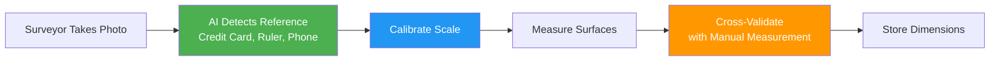
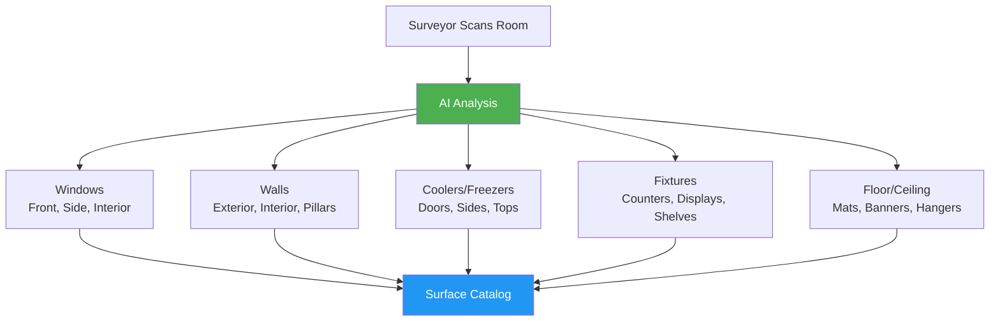
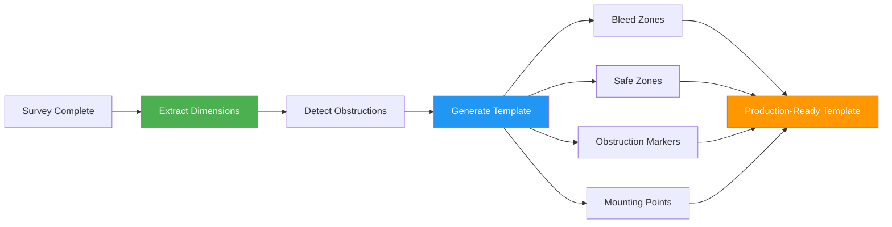
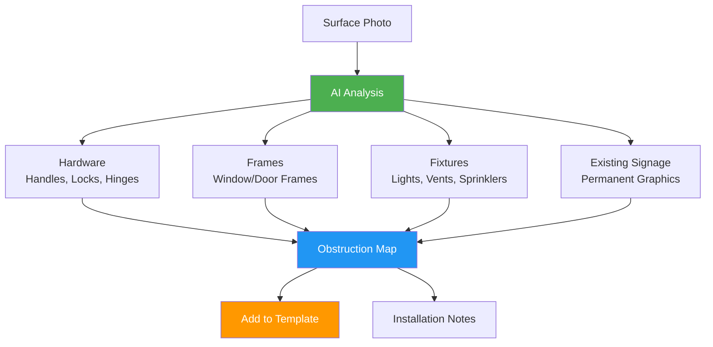
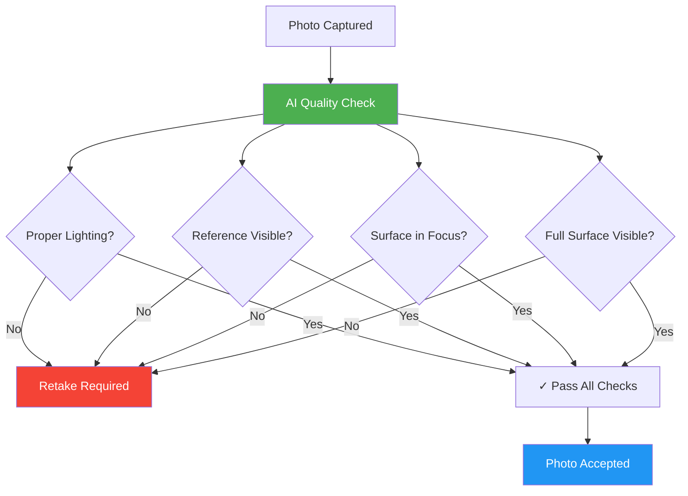
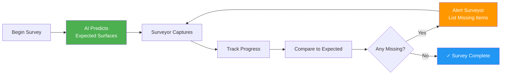

# AI for Survey as a Service

## Overview

AI transforms field surveys from manual measurement and data entry into an intelligent, automated process that captures richer data faster while ensuring quality before surveyors leave the site. Computer vision, machine learning, and real-time validation turn survey photos into precise measurements, templates, and actionable insights.

**Related Pillar:** [Survey_as_a_Service.md](../02_Capability_Pillars/Survey_as_a_Service.md)

---

## AI Features

### 1. Photo-to-Measurement

**What It Does:** AI extracts precise dimensions from survey photos using reference objects, reducing reliance on manual tape measurements.

**How It Works:**


**Reference Objects:**
| Object | Known Dimension | Accuracy | Best For |
|--------|----------------|----------|----------|
| **Credit card** | 3.375" x 2.125" | ±1/4" | Small surfaces (<36") |
| **Smartphone** | Device-specific | ±1/2" | Medium surfaces (36-72") |
| **Laser measure** | Bluetooth-enabled | ±1/16" | Large surfaces (>72") |
| **AR markers** | Printed reference | ±1/8" | Complex shapes |

**Measurement Interface:**
```
┌──────────────────────────────────────────┐
│ Photo Analysis                           │
├──────────────────────────────────────────┤
│                                          │
│  📷 [Window photo with credit card]     │
│                                          │
│  ✓ Reference detected: Credit card      │
│  ✓ Calibration: 1px = 0.052"           │
│                                          │
│  Detected Measurements:                  │
│  ┌──────────────────────────────────┐  │
│  │ Width:  48.3" ± 0.3"             │  │
│  │ Height: 36.1" ± 0.3"             │  │
│  │ Confidence: 94%                  │  │
│  └──────────────────────────────────┘  │
│                                          │
│  Manual Override: [Edit]                │
│  [✓ Accept] [↻ Retake Photo]            │
└──────────────────────────────────────────┘
```

**User Value:**
- **Speed:** 60% faster than manual measurement
- **Accuracy:** ±1/4" on 95% of measurements
- **Backup:** Automatic validation against manual measurements
- **Documentation:** Visual proof of dimensions

**Technical Approach:**
- Computer vision for reference object detection
- Perspective correction algorithms
- Edge detection for surface boundaries
- Multi-photo triangulation for accuracy
- Confidence scoring for each measurement

---

### 2. Surface Detection

**What It Does:** AI automatically identifies brandable surfaces in photos, reducing the chance surveyors miss opportunities.

**Detection Capabilities:**


**Surface Categories:**
| Category | What AI Detects | Typical Count per Location |
|----------|----------------|---------------------------|
| **Windows** | Glass surfaces, frames, visibility | 2-10 |
| **Walls** | Brandable wall space, obstructions | 5-15 |
| **Cooler Doors** | Refrigerator/freezer doors | 4-12 |
| **Counters** | Service counters, checkout areas | 1-3 |
| **Displays** | End caps, freestanding displays | 3-8 |
| **Floor Graphics** | High-traffic floor areas | 2-5 |

**Detection Process:**
```
Surveyor View:

📱 Capture Mode: Room Scan
┌────────────────────────────────┐
│ [Camera viewfinder]            │
│                                │
│  🟦 Window detected (left)     │
│  🟩 Wall space detected (rear) │
│  🟨 Cooler doors (x6)          │
│  🟧 Counter (checkout)         │
│                                │
│ Detected: 8 surfaces           │
│ Missing: 0                     │
└────────────────────────────────┘

[Capture All] [Review List]
```

**User Value:**
- **Completeness:** 30% more surfaces captured vs. manual
- **Consistency:** Every location surveyed to same standard
- **Speed:** Auto-identification saves 10-15 min per location
- **Quality:** Visual confirmation of detected surfaces

**Technical Approach:**
- Object detection (YOLO, Faster R-CNN)
- Semantic segmentation for surface types
- Depth estimation for 3D context
- Custom training on POP environments
- Continuous learning from surveyor corrections

---

### 3. Auto-Template Generation

**What It Does:** AI automatically creates production-ready artwork templates from survey measurements and photos.

**Template Creation Flow:**


**Template Elements:**
| Element | AI-Generated Data | Purpose |
|---------|------------------|---------|
| **Dimensions** | Exact size with bleed | Print production specs |
| **Safe Zones** | Protected areas for key content | Design guidance |
| **Obstruction Zones** | Handles, frames, fixtures | Avoid placement issues |
| **Mounting Points** | Attachment locations | Installation planning |
| **Material Specs** | Substrate recommendation | Production accuracy |

**Generated Template:**
```
Artwork Template: Store #1234 - Window #3
┌─────────────────────────────────────────┐
│ ╔═══════════════════════════════════╗  │ ← Bleed (0.125")
│ ║                                   ║  │
│ ║  ┌─────────────────────────────┐ ║  │ ← Safe zone
│ ║  │                             │ ║  │
│ ║  │   [Design content here]     │ ║  │
│ ║  │                             │ ║  │
│ ║  │          ╳╳╳               │ ║  │ ← Handle zone (avoid)
│ ║  └─────────────────────────────┘ ║  │
│ ╚═══════════════════════════════════╝  │
└─────────────────────────────────────────┘

Specs:
• Finished size: 48.3" x 36.1"
• Trim size: 48.55" x 36.35" (with bleed)
• Material: Clear vinyl (window-safe adhesive)
• Safe zone: 1.5" from edges
• Obstruction: Door handle at 24.5" from left, 18" from bottom
```

**User Value:**
- **Speed:** Templates ready <2 hours after survey
- **Accuracy:** Precise dimensions eliminate guesswork
- **Production:** Designer drops artwork into template
- **Consistency:** Standardized across all locations

**Technical Approach:**
- Vector generation from measurements
- Automated bleed/safe zone calculation
- Substrate recommendation engine
- Integration with design tools (AI, InDesign)
- Template versioning and updates

---

### 4. Obstruction Detection

**What It Does:** AI identifies handles, frames, fixtures, and other obstructions that affect design placement and installation.

**Detection Categories:**


**Obstruction Types:**
| Type | What AI Detects | Impact on Design | Impact on Install |
|------|----------------|------------------|------------------|
| **Door Handles** | Position, size, clearance | Avoid critical content | Work around hardware |
| **Window Frames** | Frame depth, inset | Design border considerations | Application method |
| **Vents/Sprinklers** | Within 24" of surface | Visual obstruction zones | Safety clearance |
| **Power Outlets** | Electrical fixtures | Cutout requirements | Electrical safety |
| **Existing Graphics** | Permanent branding | Coordination needed | Removal/compatibility |

**Obstruction Visualization:**
```
Surface Analysis: Cooler Door #4

┌─────────────────────────────────┐
│ Detected Obstructions:          │
├─────────────────────────────────┤
│                                 │
│  [Photo of cooler door]         │
│                                 │
│  🔴 Handle (vertical)           │
│     Location: Center-right      │
│     Size: 14" tall, 2" wide     │
│     Recommendation: Avoid ±3"   │
│                                 │
│  🟡 Frame (inset)               │
│     Depth: 0.75"                │
│     Recommendation: 1" border   │
│                                 │
│  🟢 No overhead obstructions    │
│                                 │
└─────────────────────────────────┘

Impact Level: Medium
Design adjustments recommended
```

**User Value:**
- **Design Quality:** Avoid placing key content behind obstructions
- **Installation Success:** Installers prepared for fixtures
- **Waste Reduction:** 25% fewer reprints due to obstruction conflicts
- **Professional Results:** Graphics look intentional, not accidental

**Technical Approach:**
- Object detection for hardware/fixtures
- Depth estimation for clearance calculation
- Semantic segmentation for frame detection
- 3D mapping for spatial relationships
- Rule-based recommendations per obstruction type

---

### 5. Quality Validation

**What It Does:** Real-time AI checks ensure survey photos and measurements meet requirements before surveyors leave the location.

**Validation Checks:**


**Quality Criteria:**
| Check | What AI Validates | Pass Criteria | Fail Action |
|-------|------------------|---------------|-------------|
| **Lighting** | Brightness, exposure, shadows | Even lighting, no hotspots | Suggest repositioning |
| **Focus** | Image sharpness | Crisp edges, readable text | Retake photo |
| **Reference Object** | Calibration item visible | Clear, undistorted | Add reference, retake |
| **Coverage** | Full surface captured | All edges visible | Step back, retake |
| **Angle** | Perspective distortion | <15° off perpendicular | Reposition camera |
| **Resolution** | Image quality | >8MP, sufficient detail | Use better camera mode |

**Real-Time Feedback:**
```
Survey Photo: Window #3
┌─────────────────────────────────┐
│ [Camera viewfinder]             │
│                                 │
│  ✓ Lighting: Good              │
│  ✓ Reference: Detected         │
│  ✓ Focus: Sharp                │
│  ⚠️ Angle: 18° off-center      │
│                                 │
│  Suggestion:                    │
│  Move 2 feet left for better   │
│  perpendicular view             │
│                                 │
│  [Retake] [Override & Accept]  │
└─────────────────────────────────┘
```

**User Value:**
- **First-Time Quality:** 95%+ photos accepted without retakes
- **No Rework:** Issues caught on-site, not back at office
- **Surveyor Confidence:** Immediate feedback prevents errors
- **Faster Processing:** Quality photos = faster template generation

**Technical Approach:**
- Image quality metrics (blur detection, exposure analysis)
- Object detection for reference validation
- Geometric analysis for perspective correction
- Real-time processing on device
- Configurable thresholds per survey tier

---

### 6. Survey Completeness Checking

**What It Does:** AI verifies all required surfaces have been captured before allowing survey submission.

**Completeness Process:**


**Expected Surface Prediction:**
| Location Type | AI-Predicted Surfaces | Confidence | Source |
|---------------|---------------------|------------|--------|
| **Convenience Store** | 12-18 surfaces | High | Historical data + photos |
| **Bank Branch** | 8-12 surfaces | Medium | Facility type patterns |
| **Hospital** | 15-25 surfaces | High | Survey tier + size |
| **Retail Store** | 20-40 surfaces | Medium | Square footage + type |

**Completeness Dashboard:**
```
Survey Progress: Store #1234 (Convenience Store)

Expected Surfaces: 14 (based on location type)

Captured:
━━━━━━━━━━━━━━━━━━░░  12 / 14  (86%)

✓ Front windows (3)
✓ Entry door (1)
✓ Cooler doors (6)
✓ Counter (1)
✓ Back wall (1)

⚠️ Missing:
  ☐ Side windows (2 expected)

Suggestions:
• Check east side of building
• Verify no windows on west side

[Mark Complete] [Continue Survey]
```

**Validation Modes:**
| Mode | Description | When Used |
|------|-------------|-----------|
| **Predictive** | AI estimates expected surfaces | Standard surveys |
| **Checklist** | Client-provided surface list | Branded location types |
| **Comparative** | Compare to similar locations | Chain locations |
| **Custom** | Manually defined requirements | Complex facilities |

**User Value:**
- **Thoroughness:** Capture 30% more surfaces vs. unassisted
- **Efficiency:** No return trips for missed surfaces
- **Consistency:** Every location surveyed to same standard
- **Client Satisfaction:** Complete data = full value

**Technical Approach:**
- Location type classification from photos
- Historical survey data analysis
- Similarity matching to surveyed locations
- Anomaly detection for unusual counts
- Surveyor feedback loop for learning

---

## Integration Points

### With DAM
- Survey photos auto-tagged and organized by location
- Templates stored as reusable assets
- Location-specific photo libraries for reference
- Before/after campaign comparison imagery

### With Online Designer
- Templates auto-load when designer selects location
- Obstruction zones visible during design
- Dimension constraints prevent oversizing
- Material recommendations pre-populated

### With Production
- Survey specs auto-populate production tickets
- Substrate selection based on environmental data
- Installation notes included with order
- Quality verification against survey data

---

## User Value Summary

| User Type | Key Benefits | Quantified Impact |
|-----------|-------------|-------------------|
| **Surveyors** | Faster surveys, real-time validation | 40% faster per location |
| **Survey Managers** | Quality assurance, completeness tracking | 95% first-time acceptance |
| **Designers** | Production-ready templates, obstruction awareness | 60% faster design setup |
| **Brands** | Comprehensive data, fewer missed opportunities | 30% more surfaces captured |
| **PSPs** | Accurate specs, reduced waste | 25% fewer reprints |
| **Installers** | Prepared for obstructions, accurate specs | 20% faster installation |

---

## Implementation

### Phase 1 (v3)
- Photo-to-measurement with manual validation
- Basic surface detection (windows, walls, doors)
- Simple template generation (dimensions + bleed)
- Quality validation (lighting, focus, coverage)

### Phase 2 (v4)
- Advanced obstruction detection
- Auto-template generation with safe zones
- Survey completeness checking
- Multi-photo measurement triangulation
- Environmental data capture

### Phase 3 (v4+)
- Full 3D surface mapping from photos
- Automated substrate recommendation
- AR-assisted surveying (real-time overlay)
- Predictive surface detection
- Competitive analysis from photos
- Change detection for resurveys

---

## Success Metrics

| Metric | Target | Measurement |
|--------|--------|-------------|
| Photo-to-measurement accuracy | 95%+ within ±1/4" | Comparison to manual measurements |
| Surface detection recall | 90%+ surfaces found | Surveyor verification |
| Template generation speed | <2 hours | Survey complete to template ready |
| Quality validation effectiveness | 95%+ photos accepted | First-submission acceptance rate |
| Survey completeness | 95%+ all surfaces captured | Post-survey audits |
| Surveyor satisfaction | 85%+ positive | Feature ratings |

---

*AI for Survey as a Service transforms manual field work into an intelligent, automated process that captures richer data faster with guaranteed quality.*
