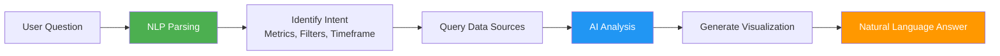
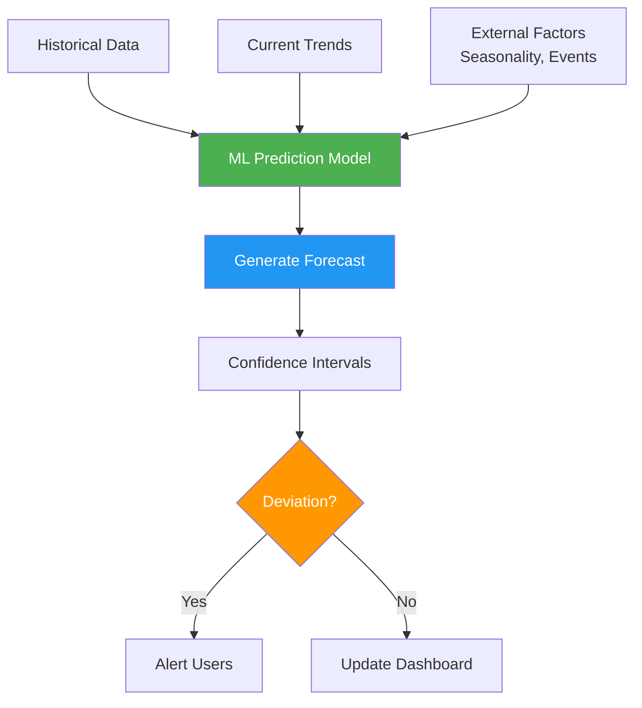
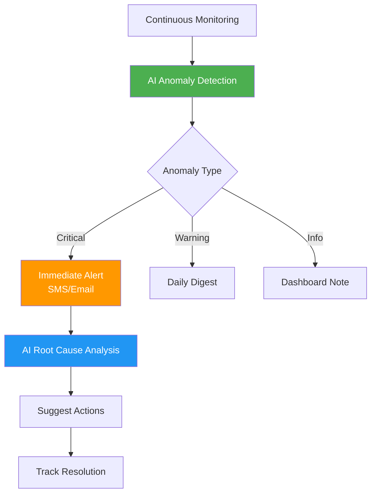
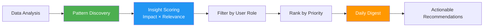
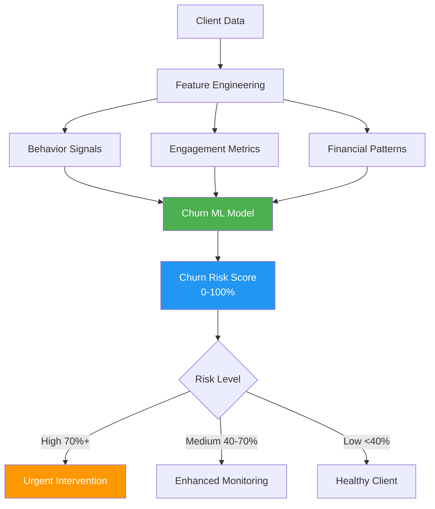
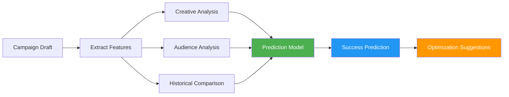

# AI for Analytics and Business Intelligence

## Overview

AI transforms raw data into actionable insights by automatically surfacing patterns, predicting outcomes, and answering business questions in plain English. Instead of waiting for monthly reports or struggling with complex dashboards, users get instant answers and proactive alerts about what matters most.

**Related Pillar:** Analytics & Reporting

---

## AI Features

### 1. Natural Language Queries

**What It Does:** Users ask questions in plain English and receive instant, accurate answers with visualizations.

**Query Examples:**
| User Question | AI Interpretation | Response |
|--------------|-------------------|----------|
| "What's our best-selling product in Texas?" | Product sales by region filter | Bar chart + product name |
| "Which clients are behind schedule this week?" | Project status filter + date range | List with % behind + reasons |
| "Show me campaign performance vs. last quarter" | Campaign metrics YoY comparison | Trend chart + % change |
| "Why did sales drop in the Northeast?" | Anomaly investigation | Root cause analysis + factors |
| "How many orders are in production right now?" | Real-time order status query | Count + breakdown by stage |

**Query Processing:**


**UI Mockup:**
```
┌──────────────────────────────────────────────┐
│ Ask a question about your business...       │
│ ┌──────────────────────────────────────────┐│
│ │ What's our average order value this month?││
│ └──────────────────────────────────────────┘│
│                                        [Ask] │
├──────────────────────────────────────────────┤
│ 💡 Answer                                    │
│                                              │
│ Your average order value is $2,847 this     │
│ month, up 12% from last month ($2,542).     │
│                                              │
│ ┌────────────────────────────────────────┐  │
│ │      Average Order Value Trend         │  │
│ │  $3k ┤                            ╭─   │  │
│ │      ┤                      ╭────╯     │  │
│ │  $2k ┤            ╭────────╯           │  │
│ │      ┤   ╭───────╯                     │  │
│ │  $1k ┤───┴                             │  │
│ │      └─────────────────────────────────│  │
│ │        Jan  Feb  Mar  Apr  May  Jun    │  │
│ └────────────────────────────────────────┘  │
│                                              │
│ 📊 Top Contributing Factors:                │
│  • 15% increase in large format orders      │
│  • 8% price increase on premium materials   │
│  • Shift toward higher-margin products      │
│                                              │
│ ❓ Related Questions:                        │
│  • Which products have highest margins?     │
│  • What's driving the increase?             │
│  • How does this compare to industry avg?   │
└──────────────────────────────────────────────┘
```

**User Value:**
- **Accessibility:** No SQL or BI tool training required
- **Speed:** Instant answers vs. waiting for reports
- **Depth:** Follow-up questions drill deeper

**Technical Approach:**
- GPT-4 for natural language understanding
- SQL generation from intent
- Context awareness (user role, client access)
- Visualization auto-selection based on data type
- Conversation memory for follow-up queries

---

### 2. Predictive Dashboards

**What It Does:** AI forecasts future KPIs, campaign outcomes, and business trends with confidence intervals.

**Prediction Types:**
| Metric | Forecast Horizon | Use Case |
|--------|-----------------|----------|
| **Revenue** | 30/60/90 days | Budget planning |
| **Order Volume** | Weekly/monthly | Capacity planning |
| **Campaign ROI** | Pre-launch prediction | Campaign optimization |
| **Client Spend** | Quarterly | Account management |
| **Resource Utilization** | 2-4 weeks | Staffing decisions |
| **Material Costs** | 30 days | Procurement planning |

**Predictive Dashboard:**


**Dashboard Example:**
```
┌──────────────────────────────────────────────────────────────┐
│ Revenue Forecast - Next 90 Days                              │
├──────────────────────────────────────────────────────────────┤
│                                                              │
│  $500k ┤                              ╱╌╌╌╌╌╌╌╌  Predicted  │
│        ┤                         ╱╌╌╌╌╯                      │
│  $400k ┤                    ╱╌╌╌╌╯   │                       │
│        ┤               ╱╌╌╌╌╯         │                      │
│  $300k ┤          ╱╌╌╌╌╯              │ 90% confidence       │
│        ┤     ╱╌╌╌╌╯                   │ interval             │
│  $200k ┤─────┘────────────────────────┼───────────────────   │
│        │     Actual         Today     │                      │
│        └──────────────────────────────┴──────────────────    │
│          Jun        Jul        Aug        Sep        Oct     │
│                                                              │
├──────────────────────────────────────────────────────────────┤
│ 🎯 Forecast: $445K (±$35K) by Oct 31                        │
│ 📈 Trend: +8% vs. last quarter                              │
│ ⚠️  Risk: Summer slowdown historically impacts July         │
│                                                              │
│ 💡 Recommendation:                                           │
│    Accelerate Q3 campaigns by 2 weeks to offset seasonal    │
│    dip and maintain growth trajectory.                      │
└──────────────────────────────────────────────────────────────┘
```

**User Value:**
- **Proactive Planning:** Anticipate needs before they arise
- **Risk Management:** Identify potential shortfalls early
- **Resource Optimization:** Staff and stock appropriately

**Technical Approach:**
- Time series forecasting (ARIMA, Prophet)
- ML models (XGBoost, LSTM) for complex patterns
- Seasonality and trend decomposition
- External data integration (holidays, events)
- Ensemble models for improved accuracy

---

### 3. Anomaly Detection

**What It Does:** AI continuously monitors metrics and automatically flags unusual patterns, spikes, drops, and outliers.

**Detection Categories:**
| Anomaly Type | Example | AI Action |
|-------------|---------|-----------|
| **Sudden Drop** | 40% decrease in orders overnight | Alert + investigate causes |
| **Unexpected Spike** | 3x normal campaign engagement | Flag + analyze what's working |
| **Gradual Drift** | Client spend declining 5%/month | Early warning + intervention |
| **Outlier Event** | Single order 10x average value | Verify + fraud check |
| **Pattern Break** | Regular client misses order cycle | Churn risk alert |
| **Quality Issue** | Proof approval time doubles | Process bottleneck alert |

**Anomaly Workflow:**


**Alert Example:**
```
┌──────────────────────────────────────────────┐
│ 🚨 Anomaly Detected                          │
├──────────────────────────────────────────────┤
│ Metric: Order Volume                         │
│ Current Value: 23 orders                     │
│ Expected Range: 45-65 orders                 │
│ Deviation: -48% below normal                 │
│                                              │
│ 📊 Pattern Analysis:                         │
│  ┌────────────────────────────────┐          │
│  │  70┤                            │          │
│  │    ┤   ╭─╮  ╭─╮  ╭─╮            │          │
│  │  50┤  ╭╯ ╰─╯  ╰─╯  ╰─╮          │          │
│  │    ┤──╯              ╰╮         │          │
│  │  30┤                  ╰─        │          │
│  │    ┤                  ↓ Today   │          │
│  │  10┤                  ⚠️         │          │
│  │    └──────────────────────────  │          │
│  │    Mon Tue Wed Thu Fri Sat Sun  │          │
│  └────────────────────────────────┘          │
│                                              │
│ 🔍 Likely Causes (AI Analysis):              │
│  1. ⚠️  Website downtime (2 hours today)     │
│  2. 📧 Email campaign delayed                │
│  3. 🏖️  Holiday weekend approaching          │
│                                              │
│ 💡 Recommended Actions:                      │
│  • Verify website is now operational         │
│  • Send makeup email campaign tomorrow       │
│  • Monitor through Monday for recovery       │
│                                              │
│ [Acknowledge] [Investigate] [Dismiss]        │
└──────────────────────────────────────────────┘
```

**User Value:**
- **Early Detection:** Catch issues before they escalate
- **Reduced Monitoring:** AI watches 24/7
- **Context:** AI explains what's unusual and why

**Technical Approach:**
- Statistical process control (3-sigma rules)
- Isolation Forest for outlier detection
- LSTM autoencoders for pattern anomalies
- Contextual anomaly detection (time, seasonality)
- Root cause analysis using causal inference

---

### 4. Automated Insights

**What It Does:** AI proactively surfaces important findings without being asked, delivering a daily digest of what matters most.

**Insight Types:**
| Insight Category | Example | Trigger |
|-----------------|---------|---------|
| **Opportunity** | "Client XYZ increased spend 40% - upsell opportunity" | Behavior change |
| **Risk** | "3 high-value clients haven't ordered in 60 days" | Activity gap |
| **Performance** | "Window clings have 2x ROI vs. posters this month" | Metric comparison |
| **Efficiency** | "Tuesday proofs get approved 30% faster" | Process analysis |
| **Trend** | "Sustainable materials requests up 45% YoY" | Market shift |
| **Best Practice** | "Campaigns with video preview get 3x engagement" | Success pattern |

**Insight Delivery:**


**Daily Insight Digest:**
```
┌──────────────────────────────────────────────┐
│ 📬 Your Daily Insights - June 15, 2025       │
├──────────────────────────────────────────────┤
│                                              │
│ 🌟 TOP INSIGHT                               │
│ Campaign "Summer Refresh" outperforming      │
│ forecast by 68%                              │
│                                              │
│ Expected ROI: 2.1x | Actual: 3.5x            │
│                                              │
│ 💡 What's working:                           │
│  • Video previews: +85% click-through        │
│  • Personalized store names: +42% approval   │
│  • Bright color palette: +28% engagement     │
│                                              │
│ ✅ Action: Apply these tactics to upcoming   │
│    "Fall Harvest" campaign                   │
│ [Create Task] [Learn More]                   │
│                                              │
├──────────────────────────────────────────────┤
│ ⚠️  ATTENTION NEEDED                         │
│                                              │
│ • 5 clients at churn risk (score >70%)       │
│   [View List] [Create Outreach Plan]         │
│                                              │
│ • Proof approval bottleneck detected         │
│   Avg time increased from 2 days to 4.5 days │
│   [Investigate]                              │
│                                              │
├──────────────────────────────────────────────┤
│ 📊 PERFORMANCE HIGHLIGHTS                    │
│                                              │
│ • Order volume +12% vs. last week            │
│ • Average order value: $2,847 (↑ 5%)        │
│ • Client satisfaction: 4.7/5.0 (↑ 0.2)      │
│                                              │
├──────────────────────────────────────────────┤
│ 💰 REVENUE OPPORTUNITIES                     │
│                                              │
│ • RetailCo increased spend 40% this month    │
│   Recommendation: Offer volume discount to   │
│   secure Q3 commitment                       │
│   Potential value: $45K                      │
│   [Contact Account Manager]                  │
│                                              │
└──────────────────────────────────────────────┘
```

**User Value:**
- **Proactive:** Learn what matters without searching
- **Focused:** AI filters noise, highlights signals
- **Actionable:** Insights come with next steps

**Technical Approach:**
- Automated exploratory data analysis
- Association rule mining for patterns
- Impact scoring algorithms
- Personalization by user role
- Natural language generation for summaries

---

### 5. Churn Prediction

**What It Does:** AI identifies clients at risk of leaving based on behavior patterns, enabling proactive retention efforts.

**Churn Indicators:**
| Signal | Weight | Example |
|--------|--------|---------|
| **Order Frequency Decline** | High | Was monthly, now 90 days since last |
| **Spend Reduction** | High | 50% decrease over 2 quarters |
| **Engagement Drop** | Medium | Stopped attending webinars/events |
| **Support Tickets** | Medium | Increased complaints or issues |
| **Decision Maker Change** | Medium | New contact, unfamiliar with system |
| **Competitive Activity** | High | Mentions evaluating alternatives |
| **Payment Delays** | Low | Late payments increasing |

**Churn Prediction Model:**


**Churn Risk Dashboard:**
```
┌──────────────────────────────────────────────────────────────┐
│ Client Churn Risk Analysis                                   │
├──────────────────────────────────────────────────────────────┤
│                                                              │
│ 🚨 HIGH RISK (5 clients)                                     │
│                                                              │
│ ┌────────────────────────────────────────────────────────┐  │
│ │ RetailCo Inc.              Churn Risk: 87%    🔴       │  │
│ ├────────────────────────────────────────────────────────┤  │
│ │ Last Order: 94 days ago (was 30-day cycle)             │  │
│ │ Spend Trend: ↓ 62% over 6 months                       │  │
│ │ Support Issues: 8 tickets (up from avg 1/month)        │  │
│ │                                                         │  │
│ │ 🔍 Risk Factors:                                        │  │
│ │  • Order frequency dropped dramatically                │  │
│ │  • Primary contact left company 3 months ago           │  │
│ │  • Mentioned "evaluating options" in last call         │  │
│ │  • Recent quality complaint unresolved                 │  │
│ │                                                         │  │
│ │ 💡 Recommended Actions:                                 │  │
│ │  1. Executive check-in call (this week)                │  │
│ │  2. Address quality issue immediately                  │  │
│ │  3. Offer onboarding for new contact                   │  │
│ │  4. Present case study of similar client success       │  │
│ │                                                         │  │
│ │ Estimated Revenue at Risk: $120K annually              │  │
│ │                                                         │  │
│ │ [Create Retention Plan] [Assign Owner] [View History]  │  │
│ └────────────────────────────────────────────────────────┘  │
│                                                              │
│ ⚠️  MEDIUM RISK (12 clients) - Total ARR at risk: $340K     │
│ ✅ HEALTHY (143 clients)                                     │
│                                                              │
└──────────────────────────────────────────────────────────────┘
```

**User Value:**
- **Retention:** Save clients before they leave
- **Revenue Protection:** Quantify and protect ARR
- **Prioritization:** Focus on highest-risk accounts

**Technical Approach:**
- Gradient boosting classifier (XGBoost)
- Feature engineering from CRM, order, support data
- Temporal features (trends, cycles, gaps)
- Ensemble with survival analysis
- Monthly model retraining

---

### 6. Campaign Performance Prediction

**What It Does:** AI predicts campaign success before launch, enabling optimization and preventing expensive failures.

**Prediction Inputs:**
| Input Category | Data Points | Impact on Prediction |
|---------------|-------------|---------------------|
| **Creative** | Design elements, colors, copy | 35% weight |
| **Targeting** | Audience size, locations, demographics | 25% weight |
| **Historical** | Similar past campaigns | 20% weight |
| **Timing** | Seasonality, day of week, market conditions | 10% weight |
| **Budget** | Spend level, distribution | 10% weight |

**Prediction Workflow:**


**Pre-Launch Prediction:**
```
┌──────────────────────────────────────────────────────────────┐
│ Campaign Performance Prediction: "Fall Harvest Promo"        │
├──────────────────────────────────────────────────────────────┤
│                                                              │
│ 📊 PREDICTED PERFORMANCE                                     │
│                                                              │
│  Engagement Rate:      ████████░░  78% (Good)               │
│  Approval Rate:        ██████░░░░  62% (Below Target)       │
│  ROI:                  ███████░░░  2.8x (Target: 3.0x)      │
│  Store Participation:  █████████░  88% (Excellent)          │
│                                                              │
│  Overall Grade: B  (Confidence: 82%)                         │
│                                                              │
├──────────────────────────────────────────────────────────────┤
│ 💡 OPTIMIZATION RECOMMENDATIONS                              │
│                                                              │
│ 🎨 Creative (High Impact)                                    │
│  ⚠️  Product image contrast is low                           │
│     Similar campaigns with high-contrast images              │
│     performed 23% better                                     │
│     [Preview High-Contrast Version]                          │
│                                                              │
│  ⚠️  Headline text density above optimal                     │
│     Reduce copy by 15-20% for better readability            │
│     Expected lift: +12% approval rate                        │
│     [Show Simplified Version]                                │
│                                                              │
│ 🎯 Targeting (Medium Impact)                                 │
│  💡 Expand to Midwest region                                 │
│     Historical data shows strong performance for             │
│     this product category in Midwest markets                 │
│     Expected additional reach: +2,400 locations              │
│     Expected revenue lift: +$18K                             │
│     [Add Midwest Locations]                                  │
│                                                              │
│ 📅 Timing (Low Impact)                                       │
│  ✅ Launch date is optimal for seasonality                   │
│                                                              │
├──────────────────────────────────────────────────────────────┤
│ 📈 SIMILAR CAMPAIGNS (Reference)                             │
│                                                              │
│  "Spring Refresh 2025"     ROI: 3.2x  (Similar creative)    │
│  "Summer Savings 2024"     ROI: 2.6x  (Similar audience)    │
│  "Harvest Time 2024"       ROI: 3.5x  (Same season)         │
│                                                              │
├──────────────────────────────────────────────────────────────┤
│ 🎯 PREDICTED OUTCOME WITH OPTIMIZATIONS                      │
│                                                              │
│  Current Predicted ROI:    2.8x                              │
│  Optimized Predicted ROI:  3.4x (+21%)                       │
│  Revenue Impact:           +$28K                             │
│                                                              │
│  [Apply All Recommendations] [Customize] [Launch As-Is]     │
│                                                              │
└──────────────────────────────────────────────────────────────┘
```

**User Value:**
- **Risk Reduction:** Fix issues before spending budget
- **Performance:** Launch campaigns optimized for success
- **Learning:** Understand what drives results

**Technical Approach:**
- Computer vision analysis of creative assets
- Regression models for outcome prediction
- A/B test data for calibration
- Similarity matching to historical campaigns
- Counterfactual analysis for recommendations

---

## Integration Points

### With CRM
- Churn predictions feed into account management workflows
- Natural language queries access client data
- Automated insights trigger CRM tasks

### With Campaign Management
- Performance predictions inform campaign planning
- Real-time analytics during campaign execution
- Post-campaign analysis feeds ML models

### With Workflow Automation
- Anomaly alerts trigger automated responses
- Insight-driven task creation
- Predictive alerts for resource planning

### With DAM
- Asset performance analytics
- Creative element success patterns
- Design recommendation feedback loop

---

## User Value Summary

| User Type | Key Benefits | Quantified Impact |
|-----------|-------------|-------------------|
| **Executives** | Real-time business intelligence, predictive insights | 90% faster decision-making |
| **Operations** | Anomaly detection, resource forecasting | 60% reduction in reactive firefighting |
| **Sales** | Churn prediction, opportunity identification | 25% improvement in client retention |
| **Marketing** | Campaign optimization, performance prediction | 30% higher campaign ROI |
| **Account Managers** | Client health monitoring, proactive outreach | 40% more productive client interactions |

---

## Implementation

### Phase 1 (v3)
- Natural language queries (basic)
- Anomaly detection (statistical methods)
- Simple predictive dashboards
- Automated daily insights digest

### Phase 2 (v4)
- Advanced NLP with conversation memory
- Churn prediction models
- Campaign performance prediction
- Interactive predictive scenarios
- Root cause analysis

### Phase 3 (v4+)
- Custom ML models per client
- Real-time streaming analytics
- Prescriptive recommendations (not just predictive)
- Multi-factor what-if analysis
- Industry benchmarking with external data

---

## Success Metrics

| Metric | Target | Measurement |
|--------|--------|-------------|
| Query accuracy | 90%+ | User satisfaction with answers |
| Prediction accuracy | 85%+ | Actual vs. predicted outcomes |
| Anomaly detection precision | 80%+ | True positives / total alerts |
| Churn prediction accuracy | 75%+ | Correctly identified at-risk clients |
| Insight actionability | 70%+ | Insights that drive action |
| User adoption | 80%+ | Active users querying weekly |
| Time to insight | 90% reduction | Minutes vs. hours/days |

---

*AI for Analytics transforms data from a retrospective report into a proactive business partner that predicts, alerts, and guides decisions in real-time.*
