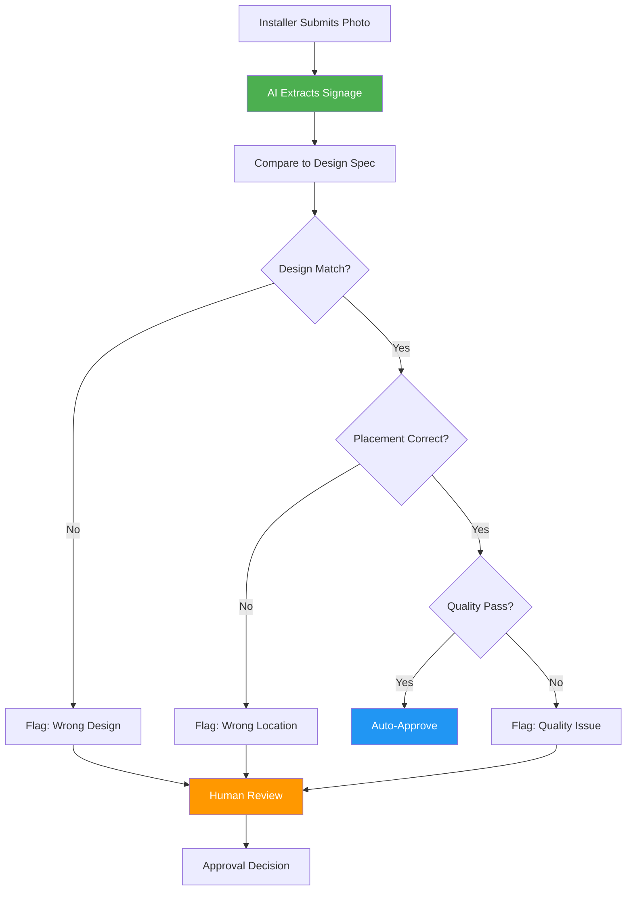
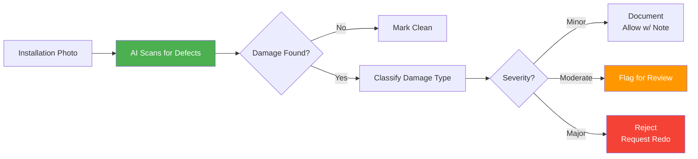
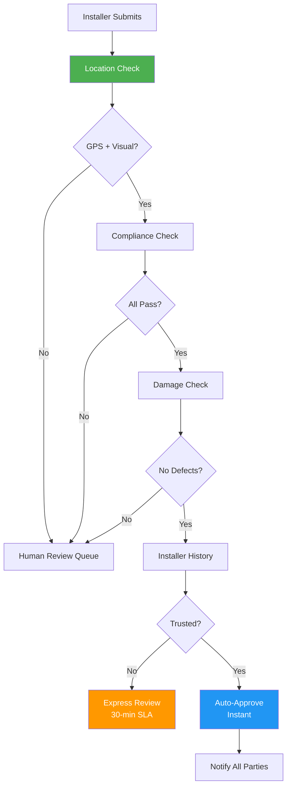
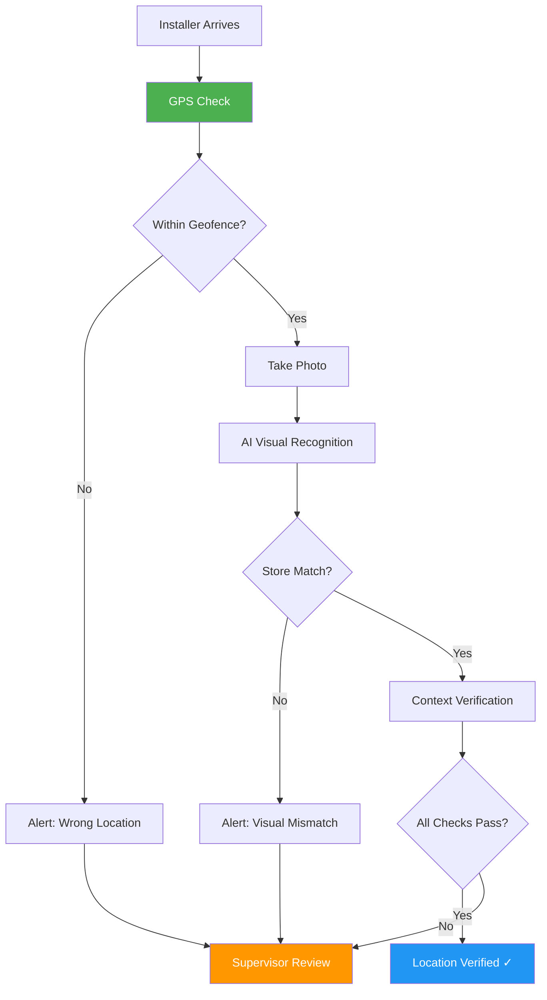
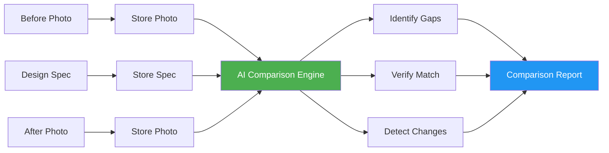
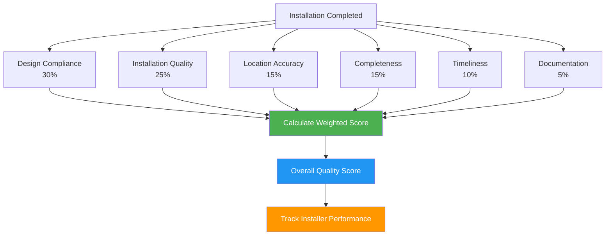
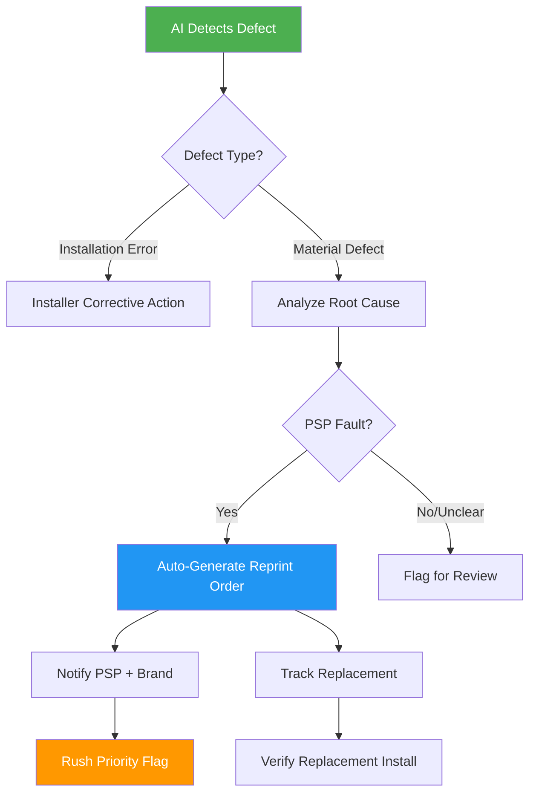
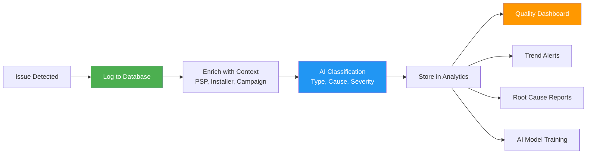

# AI for Installation Verification

## Overview

AI transforms installation verification from manual photo review into an intelligent, automated quality assurance system. The platform verifies installations match design specifications, detects damage, confirms location accuracy, and automatically approves compliant installations—reducing verification time from hours to seconds while improving quality standards.

**Related Pillar:** [P12_Mobile_Apps.md](../02_Capability_Pillars/P12_Mobile_Apps.md)

---

## AI Features

### 1. Photo Compliance Checking

**What It Does:** AI analyzes installation photos and verifies they match the approved design specifications automatically.

**Compliance Checks:**
| Check | What AI Verifies | Pass/Fail Criteria |
|-------|-----------------|-------------------|
| **Design Match** | Installed signage matches approved design | Visual similarity >90% |
| **Placement** | Position matches planogram/specs | Location within tolerance |
| **Size/Scale** | Dimensions appear correct | Size verification via reference |
| **Color Accuracy** | Colors match design intent | Color matching within range |
| **Orientation** | Portrait/landscape correct | Angle and rotation check |
| **Completeness** | All components present | Element detection complete |

**Compliance Workflow:**


**Compliance Report:**
```
┌─────────────────────────────────────────────────┐
│ Installation Verification                       │
├─────────────────────────────────────────────────┤
│ Store: Walmart #4521 - Sporting Goods Dept      │
│ Design: Nike Summer Campaign - Window Cling     │
│                                                 │
│ ✅ Design Match              PASS (96%)         │
│    • Correct design identified                  │
│    • All graphic elements present               │
│    • Layout matches specification               │
│                                                 │
│ ✅ Placement                 PASS (94%)         │
│    • Location: Front window, center-right       │
│    • Height: 5.5 ft (spec: 5-6 ft) ✓           │
│    • Position matches planogram                 │
│                                                 │
│ ✅ Color Accuracy            PASS (91%)         │
│    • Brand colors within tolerance              │
│    • No fading or discoloration                 │
│                                                 │
│ ✅ Orientation               PASS               │
│    • Portrait orientation correct               │
│                                                 │
│ ✅ Quality                   PASS               │
│    • No visible damage                          │
│    • Smooth application                         │
│    • No bubbles or wrinkles                     │
│                                                 │
│ Overall Score: 94% - AUTO-APPROVED              │
│ Verified: Nov 15, 2025 at 2:34 PM              │
└─────────────────────────────────────────────────┘
```

**User Value:**
- **Speed:** Instant verification vs. hours of manual review
- **Consistency:** Same standards applied everywhere
- **Accuracy:** 95%+ detection of non-compliant installations

**Technical Approach:**
- Image segmentation to isolate signage
- Feature extraction and comparison to reference
- Computer vision for placement verification
- Color space analysis for accuracy checking
- Confidence scoring for auto-approval decisions

---

### 2. Damage Detection

**What It Does:** AI automatically identifies damaged or improperly installed materials requiring correction.

**Damage Types Detected:**
| Damage Type | AI Detection | Severity Level |
|-------------|-------------|----------------|
| **Bubbles/Wrinkles** | Surface texture analysis | Minor to Major |
| **Tears/Rips** | Edge detection, discontinuities | Major |
| **Fading/Discoloration** | Color comparison | Minor to Moderate |
| **Peeling/Lifting** | Edge analysis, shadows | Moderate to Major |
| **Crooked/Misaligned** | Angle measurement | Minor to Moderate |
| **Missing Pieces** | Element detection | Major |
| **Scratches/Scuffs** | Surface defect detection | Minor |
| **Incomplete Installation** | Coverage analysis | Major |

**Damage Detection Flow:**


**Damage Report:**
```
┌─────────────────────────────────────────────────┐
│ Damage Detection Report                         │
├─────────────────────────────────────────────────┤
│ Store: Target #892 - End Cap Display            │
│                                                 │
│ ⚠️ ISSUES DETECTED: 2                           │
│                                                 │
│ Issue #1: Bubbles in Vinyl                      │
│ Location: Upper right quadrant                  │
│ Severity: MODERATE                              │
│ Confidence: 87%                                 │
│ [Photo highlight showing bubble locations]      │
│                                                 │
│ Issue #2: Slight Tilt                           │
│ Measurement: 3.2° clockwise                     │
│ Severity: MINOR                                 │
│ Confidence: 92%                                 │
│ Acceptable Range: ±2° (OUTSIDE TOLERANCE)       │
│                                                 │
│ Recommendation: Re-install                      │
│                                                 │
│ Installer Notified: Nov 15, 2:45 PM            │
│ Expected Resolution: Same day                   │
│                                                 │
│ [Accept Issues] [Request Correction] [Escalate] │
└─────────────────────────────────────────────────┘
```

**User Value:**
- **Quality Control:** Catch 80%+ of installation defects
- **Cost Avoidance:** Fix issues before they become costly
- **Brand Protection:** Ensure quality in market

**Technical Approach:**
- Surface anomaly detection algorithms
- Edge detection for tears and peeling
- Angle measurement for alignment
- Color histogram comparison for fading
- Severity classification model

---

### 3. Auto-Approval

**What It Does:** Installations meeting all quality criteria are automatically approved without human review.

**Auto-Approval Criteria:**
| Criterion | Requirement | Confidence Threshold |
|-----------|-------------|---------------------|
| **Design Match** | Matches approved design | 90%+ |
| **Compliance Score** | All checks pass | 85%+ overall |
| **No Damage** | Zero defects detected | 90%+ confidence |
| **Location Verified** | GPS + visual confirmation | Both pass |
| **Installation Quality** | Quality score meets minimum | 80%+ |
| **Installer Track Record** | Good historical performance | 90%+ approval rate |

**Auto-Approval Logic:**


**Auto-Approval Dashboard:**
```
┌─────────────────────────────────────────────────┐
│ Installation Verification Dashboard             │
├─────────────────────────────────────────────────┤
│                                                 │
│ Today's Installations: 247                      │
│                                                 │
│ ✅ Auto-Approved:           189 (76%)           │
│ ⚡ Express Review:           34 (14%)           │
│ 👤 Manual Review:            18 (7%)            │
│ ❌ Rejected:                  6 (3%)            │
│                                                 │
│ Average Approval Time:                          │
│ • Auto-Approved: <30 seconds                    │
│ • Express Review: 18 minutes                    │
│ • Manual Review: 2.5 hours                      │
│                                                 │
│ Top Auto-Approval Reasons:                      │
│ 1. Perfect compliance + trusted installer (45%) │
│ 2. Template design + no issues (28%)            │
│ 3. Simple signage type (12%)                    │
│                                                 │
│ Quality Score Distribution:                     │
│ 90-100%: ████████████████████░ 189 installs    │
│ 80-89%:  ████████░░░░░░░░░░░░  52 installs     │
│ 70-79%:  ██░░░░░░░░░░░░░░░░░░   6 installs     │
│ <70%:    ░░░░░░░░░░░░░░░░░░░░   0 installs     │
└─────────────────────────────────────────────────┘
```

**User Value:**
- **Speed:** 75%+ of installations approved instantly
- **Efficiency:** Reviewers focus on problem cases
- **Throughput:** Handle 10x more verifications

**Technical Approach:**
- Multi-stage validation pipeline
- Weighted scoring system
- Installer reputation tracking
- Configurable thresholds per brand/campaign
- Audit trail for compliance

---

### 4. Location Verification

**What It Does:** AI confirms the installer is at the correct location using GPS data and visual scene recognition.

**Verification Methods:**
| Method | What It Verifies | Accuracy |
|--------|-----------------|----------|
| **GPS Coordinates** | Physical location matches assignment | ±50 feet |
| **Store Recognition** | Visual identification of store/brand | 95%+ |
| **Signage Recognition** | Identifies surrounding context | 90%+ |
| **Address OCR** | Reads visible address/store numbers | 85%+ |
| **Geofencing** | Within designated install zone | 100% |
| **Time Verification** | Installation during allowed hours | 100% |

**Location Verification Flow:**


**Location Verification Screen (Mobile App):**
```
┌─────────────────────────────────────────────────┐
│ 📍 Location Verification                        │
├─────────────────────────────────────────────────┤
│                                                 │
│ Assignment: Walmart #4521                       │
│ Address: 1250 Main Street, Denver CO            │
│                                                 │
│ ✅ GPS Verified                                 │
│    Your location: 39.7392° N, 104.9903° W       │
│    Distance to store: 23 feet                   │
│                                                 │
│ ✅ Store Match                                  │
│    AI identified: Walmart store                 │
│    Confidence: 97%                              │
│                                                 │
│ ✅ Store Number Confirmed                       │
│    Detected sign: "Walmart #4521"               │
│    Match: Correct                               │
│                                                 │
│ ✅ Time Window                                  │
│    Install time: 2:15 PM                        │
│    Allowed: 8 AM - 8 PM ✓                       │
│                                                 │
│ Status: Location verified. Ready to proceed.    │
│                                                 │
│ [Begin Installation] [Report Issue]             │
└─────────────────────────────────────────────────┘
```

**User Value:**
- **Accountability:** Proof of correct location
- **Fraud Prevention:** Prevent false installation claims
- **Accuracy:** Eliminate location mistakes

**Technical Approach:**
- Mobile device GPS integration
- Visual landmark recognition (Google Vision API)
- OCR for signage/address reading
- Geofencing with tolerance zones
- Cross-verification of multiple signals

---

### 5. Before/After Comparison

**What It Does:** AI compares installation photos to expected outcomes and pre-installation conditions.

**Comparison Types:**
| Comparison | Purpose | AI Analysis |
|------------|---------|-------------|
| **Before vs. Design** | Show transformation needed | Gap analysis |
| **After vs. Design** | Verify correct implementation | Match verification |
| **Before vs. After** | Document installation impact | Change detection |
| **After vs. Reference** | Compare to ideal installation | Quality benchmarking |
| **Multi-angle Verification** | Ensure complete installation | Coverage analysis |

**Comparison Workflow:**


**Before/After Interface:**
```
┌─────────────────────────────────────────────────┐
│ Installation Comparison                          │
├──────────────────┬──────────────────────────────┤
│  BEFORE          │  AFTER                        │
│                  │                               │
│  [Photo of bare  │  [Photo of installed         │
│   wall/window]   │   signage in place]          │
│                  │                               │
├──────────────────┴──────────────────────────────┤
│ EXPECTED DESIGN                                  │
│  [Design specification/mockup]                   │
├─────────────────────────────────────────────────┤
│                                                 │
│ AI Analysis:                                    │
│                                                 │
│ ✅ Design Implemented Correctly                 │
│    Match score: 93%                             │
│    All elements present and positioned          │
│                                                 │
│ ✅ Surface Preparation                          │
│    Before: Clean, suitable surface              │
│    After: Proper adhesion visible               │
│                                                 │
│ ✅ Installation Quality                         │
│    No bubbles, wrinkles, or misalignment        │
│    Professional finish achieved                 │
│                                                 │
│ ⚡ Transformation Impact:                       │
│    Brand visibility: High                       │
│    Visual appeal: Excellent                     │
│    Spec compliance: 93%                         │
│                                                 │
│ [Approve Installation] [Request Changes]        │
└─────────────────────────────────────────────────┘
```

**User Value:**
- **Documentation:** Complete installation record
- **Quality Evidence:** Visual proof of work quality
- **Client Reporting:** Show installation impact

**Technical Approach:**
- Image alignment and registration
- Difference detection algorithms
- Feature matching between design and photo
- Change quantification metrics
- Timeline visualization

---

### 6. Quality Scoring

**What It Does:** AI assigns a comprehensive quality score to each installation for installer performance tracking.

**Scoring Components:**
| Component | Weight | Measurement |
|-----------|--------|-------------|
| **Design Compliance** | 30% | Match accuracy to specifications |
| **Installation Quality** | 25% | Technical execution (bubbles, alignment, etc.) |
| **Location Accuracy** | 15% | Correct placement per planogram |
| **Completeness** | 15% | All components installed |
| **Timeliness** | 10% | Installed within time window |
| **Documentation** | 5% | Photo quality, completeness |

**Quality Score Calculation:**


**Quality Scorecard:**
```
┌─────────────────────────────────────────────────┐
│ Installation Quality Scorecard                   │
├─────────────────────────────────────────────────┤
│ Installer: John Smith                           │
│ Installation: Nike Summer - Walmart #4521       │
│                                                 │
│ Overall Score: 92/100 - EXCELLENT               │
│                                                 │
│ Component Breakdown:                            │
│                                                 │
│ Design Compliance (30%)        28/30            │
│ ████████████████████████████░░ 93%             │
│ • Correct design identified                     │
│ • Minor color variance detected                 │
│                                                 │
│ Installation Quality (25%)     24/25            │
│ █████████████████████████████░ 96%             │
│ • Excellent adhesion                            │
│ • Perfect alignment                             │
│ • No visible defects                            │
│                                                 │
│ Location Accuracy (15%)        15/15            │
│ ██████████████████████████████ 100%            │
│ • Perfect placement per planogram               │
│                                                 │
│ Completeness (15%)             14/15            │
│ ████████████████████████████░░ 93%             │
│ • All primary elements present                  │
│ • One optional element missing                  │
│                                                 │
│ Timeliness (10%)               8/10             │
│ ████████████████████████░░░░░░ 80%             │
│ • Installed 30 min after window                 │
│                                                 │
│ Documentation (5%)             3/5              │
│ ████████████████░░░░░░░░░░░░░░ 60%             │
│ • Photo quality good                            │
│ • Missing one required angle                    │
│                                                 │
│ Performance Trend: ↗ +5 pts vs. 30-day avg     │
│                                                 │
│ [View Installer Profile] [Send Feedback]        │
└─────────────────────────────────────────────────┘
```

**Installer Performance Dashboard:**
```
┌─────────────────────────────────────────────────┐
│ Installer Performance - John Smith              │
├─────────────────────────────────────────────────┤
│                                                 │
│ 30-Day Performance:                             │
│                                                 │
│ Installations: 47                               │
│ Average Score: 89/100                           │
│ Auto-Approval Rate: 81%                         │
│                                                 │
│ Score Trend:                                    │
│  100 ┤                             ●            │
│   95 ┤                    ●    ●                │
│   90 ┤        ●    ●  ●                         │
│   85 ┤   ●                                      │
│   80 ┤●                                         │
│      └────────────────────────────────          │
│       Week1  Week2  Week3  Week4                │
│                                                 │
│ Strengths:                                      │
│ • Consistently high installation quality        │
│ • Excellent location accuracy                   │
│ • Strong design compliance                      │
│                                                 │
│ Areas for Improvement:                          │
│ • Documentation completeness (71%)              │
│ • Timeliness (83%)                              │
│                                                 │
│ Rank: #3 of 24 installers (Top 13%)            │
│                                                 │
│ [Training Resources] [Schedule Review]          │
└─────────────────────────────────────────────────┘
```

**User Value:**
- **Performance Management:** Data-driven installer evaluation
- **Training Identification:** Target improvement areas
- **Quality Trends:** Track improvement over time
- **Incentive Programs:** Reward top performers

**Technical Approach:**
- Weighted scoring algorithm
- Historical performance database
- Trend analysis and prediction
- Comparative benchmarking
- Real-time score calculation

---

### 7. Auto Reprint Order Generation

**What It Does:** When AI detects material defects (print errors, shipping damage, wrong materials), it automatically generates a reprint order to the PSP without manual intervention.

**Defect Classification:**
| Defect Type | Root Cause | Auto-Action |
|-------------|-----------|-------------|
| **Print Quality Issue** | Color shift, banding, artifacts | Reprint order to original PSP |
| **Wrong Material** | Incorrect substrate shipped | Reprint with correct specs |
| **Shipping Damage** | Tears, creases, water damage | Reprint + shipping claim |
| **Wrong Size** | Dimensions don't match order | Reprint with correct size |
| **Missing Components** | Partial shipment | Order missing items |
| **Wrong Design** | Incorrect artwork printed | Reprint correct version |

**Auto-Reprint Workflow:**


**Reprint Order Interface:**
```
┌─────────────────────────────────────────────────────┐
│ 🔄 Auto-Generated Reprint Order                     │
├─────────────────────────────────────────────────────┤
│                                                     │
│ Original Order: #45231                              │
│ Store: Target #892 - End Cap Display                │
│ Campaign: Nike Summer 2026                          │
│                                                     │
│ DEFECT DETECTED BY AI:                              │
│ ┌─────────────────────────────────────────────────┐ │
│ │ Type: Print Quality - Color Banding             │ │
│ │ Severity: Major (unusable)                      │ │
│ │ Confidence: 94%                                 │ │
│ │ Evidence: [Photo with highlighted defect]       │ │
│ └─────────────────────────────────────────────────┘ │
│                                                     │
│ ROOT CAUSE ANALYSIS:                                │
│ • Defect pattern consistent with print head issue   │
│ • Not installation error (defect visible in photo)  │
│ • Classification: PSP Production Defect             │
│                                                     │
│ AUTO-GENERATED REPRINT ORDER:                       │
│ ┌─────────────────────────────────────────────────┐ │
│ │ Reprint Order: #45231-R1                        │ │
│ │ Priority: RUSH (next business day)              │ │
│ │ Assigned To: PrintPro Solutions (original PSP)  │ │
│ │ Quantity: 1 unit                                │ │
│ │ Cost Allocation: PSP (defect warranty)          │ │
│ │ Ship To: Installer (direct)                     │ │
│ │ Expected Delivery: Nov 17, 2025                 │ │
│ └─────────────────────────────────────────────────┘ │
│                                                     │
│ NOTIFICATIONS SENT:                                 │
│ ✓ PSP notified of reprint requirement               │
│ ✓ Brand notified of delay + new ETA                 │
│ ✓ Installer notified of replacement schedule        │
│ ✓ Original installation marked "Pending Redo"       │
│                                                     │
│ [View Order Details] [Override] [Contact PSP]       │
└─────────────────────────────────────────────────────┘
```

**Cost Allocation Rules:**
| Defect Cause | Cost Responsibility | Platform Action |
|--------------|--------------------|-----------------|
| **PSP Print Error** | PSP bears cost | No charge to brand |
| **Shipping Damage** | Carrier claim | File claim, no charge to brand |
| **Design File Error** | Brand/Designer | Charge reprint to brand |
| **Installer Damage** | Installer | Deduct from installer payment |
| **Survey Measurement Error** | Platform | Platform absorbs (Fit or Free) |
| **Unclear/Disputed** | Hold for review | Manual resolution |

**User Value:**
- **Zero Downtime:** Replacement materials ordered instantly
- **Accountability:** Clear cost allocation based on evidence
- **Speed:** Rush priority ensures minimal campaign delay
- **Documentation:** Full audit trail for disputes

**Technical Approach:**
- Defect classification ML model
- Root cause analysis rules engine
- Integration with PSP order system
- Automated cost allocation logic
- Rush order flagging and routing

---

### 8. Error Logging & Root Cause Analytics

**What It Does:** Every verification issue is logged with full context, enabling root cause analysis and continuous quality improvement across the platform.

**Data Captured:**
| Data Point | Purpose | Analytics Use |
|------------|---------|---------------|
| **Issue Type** | Categorize problem | Trend analysis by type |
| **Photo Evidence** | Visual proof | AI model training |
| **Root Cause** | Why it happened | Process improvement |
| **Location** | Store/surface | Location-specific patterns |
| **PSP** | Production source | Vendor quality tracking |
| **Installer** | Who installed | Performance tracking |
| **Campaign** | Which campaign | Campaign-level analysis |
| **Resolution** | How it was fixed | Resolution effectiveness |
| **Time to Resolve** | Duration | SLA monitoring |

**Error Logging Flow:**


**Error Analytics Dashboard:**
```
┌─────────────────────────────────────────────────────────────┐
│ Installation Quality Analytics - November 2025              │
├─────────────────────────────────────────────────────────────┤
│                                                             │
│ ISSUE SUMMARY                                               │
│ Total Installations: 2,847                                  │
│ Issues Detected: 127 (4.5%)                                 │
│ Auto-Resolved: 89 (70%)                                     │
│ Required Reprint: 23 (18%)                                  │
│ Installer Error: 15 (12%)                                   │
│                                                             │
│ ISSUES BY TYPE                                              │
│ ┌─────────────────────────────────────────────────────────┐ │
│ │ Print Quality    ████████████░░░░░░░░  34 (27%)        │ │
│ │ Alignment        ████████░░░░░░░░░░░░  25 (20%)        │ │
│ │ Damage           ███████░░░░░░░░░░░░░  21 (17%)        │ │
│ │ Wrong Design     █████░░░░░░░░░░░░░░░  15 (12%)        │ │
│ │ Size Mismatch    ████░░░░░░░░░░░░░░░░  14 (11%)        │ │
│ │ Other            ████░░░░░░░░░░░░░░░░  18 (13%)        │ │
│ └─────────────────────────────────────────────────────────┘ │
│                                                             │
│ ROOT CAUSE BREAKDOWN                                        │
│ ┌─────────────────────────────────────────────────────────┐ │
│ │ PSP Production   ██████████████░░░░░░  52 (41%)        │ │
│ │ Shipping         ████████░░░░░░░░░░░░  28 (22%)        │ │
│ │ Installer        ██████░░░░░░░░░░░░░░  19 (15%)        │ │
│ │ Design File      █████░░░░░░░░░░░░░░░  16 (13%)        │ │
│ │ Survey Data      ███░░░░░░░░░░░░░░░░░  12 (9%)         │ │
│ └─────────────────────────────────────────────────────────┘ │
│                                                             │
│ ⚠️ TREND ALERTS                                             │
│                                                             │
│ 🔴 PrintPro Solutions: 28% defect rate (vs. 8% avg)        │
│    Issue: Color banding on large format vinyl               │
│    Recommendation: Equipment calibration needed             │
│    [Contact PSP] [View Details]                             │
│                                                             │
│ 🟡 Midwest Region: Installation errors up 15%               │
│    Issue: New installer training gap                        │
│    Recommendation: Schedule refresher training              │
│    [View Installers] [Schedule Training]                    │
│                                                             │
│ 🟢 Overall Quality: Improving 3% vs. last month            │
│                                                             │
│ TOP PROBLEM LOCATIONS                                       │
│ 1. Cooler doors (23% of issues) - adhesion challenges       │
│ 2. Exterior windows (18%) - weather/surface prep            │
│ 3. Floor graphics (12%) - durability concerns               │
│                                                             │
│ [Export Report] [Drill Down] [Configure Alerts]             │
└─────────────────────────────────────────────────────────────┘
```

**Root Cause Report (PSP View):**
```
┌─────────────────────────────────────────────────────────────┐
│ PSP Quality Report: PrintPro Solutions                      │
├─────────────────────────────────────────────────────────────┤
│ Period: November 2025                                       │
│                                                             │
│ PERFORMANCE SUMMARY                                         │
│ Jobs Completed: 342                                         │
│ Quality Score: 78/100 (⚠️ Below Target: 90)                 │
│ Defect Rate: 8.2% (Industry Avg: 3.5%)                      │
│                                                             │
│ DEFECT ANALYSIS                                             │
│ ┌─────────────────────────────────────────────────────────┐ │
│ │ Issue              Count   Cost Impact   Trend          │ │
│ │ Color Banding        12    $1,840        ↗ Increasing   │ │
│ │ Substrate Wrinkle     8    $920          → Stable       │ │
│ │ Wrong Cut Size        5    $680          ↘ Decreasing   │ │
│ │ Ink Adhesion          3    $450          → Stable       │ │
│ └─────────────────────────────────────────────────────────┘ │
│                                                             │
│ 🔍 AI ROOT CAUSE ANALYSIS                                   │
│                                                             │
│ Color Banding (Primary Issue):                              │
│ • Pattern: Horizontal bands every 2.5 inches                │
│ • Likely Cause: Print head misalignment or clog             │
│ • Equipment: HP Latex 570 (Serial: LX570-2847)              │
│ • Recommendation: Professional calibration service          │
│ • Evidence: [12 photos showing consistent pattern]          │
│                                                             │
│ COST SUMMARY                                                │
│ Reprints Absorbed: $3,890                                   │
│ Rush Shipping: $420                                         │
│ Total Quality Cost: $4,310 (1.8% of revenue)               │
│                                                             │
│ IMPROVEMENT PLAN                                            │
│ ☐ Schedule equipment maintenance by Nov 20                  │
│ ☐ Implement pre-flight color check                          │
│ ☐ Add QC checkpoint before shipping                         │
│                                                             │
│ [Acknowledge Report] [Submit Action Plan] [Dispute]         │
└─────────────────────────────────────────────────────────────┘
```

**User Value:**
- **Continuous Improvement:** Data-driven quality enhancement
- **Accountability:** Clear evidence for cost allocation
- **Trend Detection:** Catch systemic issues early
- **Vendor Management:** Objective PSP quality tracking

**Technical Approach:**
- Structured logging with rich metadata
- Time-series analysis for trend detection
- Anomaly detection for quality alerts
- ML classification for root cause
- Integration with PSP scorecards
- Exportable reports for vendor discussions

---

## Integration Points

### With Mobile App
- Real-time verification during installation
- Instant feedback to installers
- Photo capture with AI guidance
- Location services integration
- Defect photo capture with highlighting

### With Workflow Automation
- Auto-approval triggers payment workflows
- Failed verifications create corrective tasks
- Quality scores inform installer assignment
- Escalation routing based on issue severity
- Auto-reprint orders trigger production workflows
- Replacement tracking through re-installation

### With Production/MIS
- Auto-reprint orders flow directly to PSP queue
- Rush priority flagging for replacements
- Cost allocation integrated with invoicing
- PSP quality metrics affect marketplace scoring

### With Analytics & Reporting
- Installation quality metrics
- Installer performance dashboards
- Campaign completion tracking
- Quality trend analysis
- Cost of non-compliance reporting
- Root cause analytics by PSP, region, surface type
- Defect pattern analysis for AI model improvement

### With Survey Data
- Mockup comparison uses survey templates
- Placement verification against survey specs
- Surface-specific quality thresholds
- Fit or Free guarantee tracking

---

## User Value Summary

| User Type | Key Benefits | Quantified Impact |
|-----------|-------------|-------------------|
| **Field Managers** | Real-time verification, quality control | 90% faster approval process |
| **Installers** | Instant feedback, clear guidance | 50% fewer rework requests |
| **Brand Managers** | Quality assurance, compliance proof | 95%+ installation accuracy |
| **Operations** | Automated workflows, scalability | Handle 10x volume with same staff |

---

## Implementation

### Phase 1 (v3)
- Basic photo compliance checking
- Simple damage detection
- GPS location verification
- Manual review interface
- Basic error logging

### Phase 2 (v4)
- Auto-approval system
- Advanced damage detection
- Quality scoring system
- Before/after comparison
- Visual location verification
- Auto-reprint order generation
- Root cause analytics dashboard

### Phase 3 (v4+)
- Real-time installation guidance
- Predictive quality issues
- AR-assisted installation verification
- Custom models per brand/campaign
- Multi-location batch verification
- AI-powered defect pattern recognition
- Predictive PSP quality scoring

---

## Success Metrics

| Metric | Target | Measurement |
|--------|--------|-------------|
| Auto-approval rate | 75%+ | Installations auto-approved |
| Verification speed | <30 seconds | Average time for compliant install |
| Damage detection accuracy | 85%+ | Defects caught by AI |
| Location accuracy | 98%+ | Correct location verified |
| Quality score correlation | 90%+ | AI score vs. human review |
| Installer satisfaction | 80%+ | Feature ratings |
| Auto-reprint accuracy | 90%+ | Correct defect classification |
| Root cause accuracy | 85%+ | Correctly attributed fault |
| Reprint turnaround | <48 hours | Time from defect to replacement delivery |

---

*AI for Installation Verification transforms field operations from manual inspection to intelligent automation, ensuring quality at scale while empowering installers with instant feedback.*
