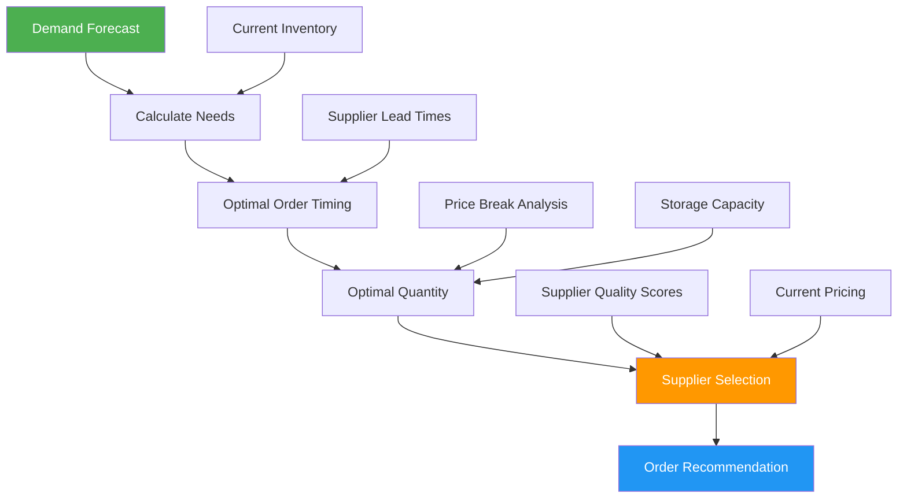

# AI for Procurement Marketplace

## Overview

AI transforms procurement from reactive ordering into predictive supply chain management. By analyzing production schedules, historical patterns, and network-wide demand, the system optimizes inventory, predicts material needs, scores suppliers, and ensures PSPs never run out of materials while minimizing cash tied up in stock.

**Related Pillar:** [P12_Procurement_Marketplace.md](../02_Capability_Pillars/P12_Procurement_Marketplace.md)

---

## AI Features

### 1. Demand Forecasting

**What It Does:** AI predicts material needs by analyzing production schedules, historical usage patterns, seasonal trends, and campaign calendars across the PSP network.

**Forecasting Inputs:**
| Input | Source | Prediction Impact |
|-------|--------|-------------------|
| **Production Schedule** | MIS/ERP job queue | Short-term (1-2 weeks) demand |
| **Historical Usage** | Past procurement data | Baseline consumption patterns |
| **Campaign Calendar** | Scheduled campaigns | Medium-term demand spikes |
| **Seasonal Patterns** | Holiday, back-to-school, etc. | Cyclical adjustments |
| **Network Trends** | Aggregate PSP demand | Market-wide signals |
| **Weather** | Regional forecasts | Outdoor signage materials |

**Demand Forecast Dashboard:**
```
┌─────────────────────────────────────────────────────────────────┐
│ Material Demand Forecast - Your Shop                            │
├─────────────────────────────────────────────────────────────────┤
│                                                                 │
│ 54" WHITE GLOSS VINYL                                           │
│                                                                 │
│ Demand    ▲                                                     │
│ (sq ft)   │         ╭──╮   Holiday                             │
│    800    │        ╱    ╲  Campaign                            │
│           │       ╱      ╲ Season                              │
│    600    │──────╱        ╲                                    │
│           │     ╱          ╲────                               │
│    400    │────╱                                               │
│           │                                                     │
│    200    │Current                                              │
│           │Stock: 320 sf                                        │
│           └──────────────────────────────────────▶ Days        │
│            Now   +7d   +14d   +21d   +28d                       │
│                                                                 │
│ FORECAST SUMMARY:                                               │
│ • Next 7 days: 280 sf needed (jobs scheduled)                  │
│ • Next 14 days: 580 sf needed (high confidence)                │
│ • Next 28 days: 920 sf needed (medium confidence)              │
│                                                                 │
│ ⚠️ ALERT: Stock will deplete in ~8 days                        │
│                                                                 │
│ Recommended Order: 600 sf (covers demand + safety stock)       │
│ Optimal Order Date: Today (2-day lead time)                    │
│                                                                 │
│ [Order Now] [Adjust Forecast] [View Details]                   │
└─────────────────────────────────────────────────────────────────┘
```

**Network-Wide Demand Signals:**
```
┌─────────────────────────────────────────────────────────────────┐
│ Network Demand Intelligence (Distributor View)                  │
├─────────────────────────────────────────────────────────────────┤
│                                                                 │
│ AGGREGATED DEMAND FORECAST - Next 30 Days                       │
│                                                                 │
│ Product Category          Current Forecast   vs. Last Month    │
│ ─────────────────────────────────────────────────────────────── │
│ Large Format Vinyl         48,500 sf         ↑ +23%            │
│ Banner Materials           12,200 sf         ↑ +15%            │
│ Rigid Board (PVC)          3,400 sheets      → +2%             │
│ Latex Ink Sets             245 sets          ↑ +18%            │
│ Laminates                  38,000 sf         ↑ +12%            │
│                                                                 │
│ 🔥 DEMAND SPIKE ALERT                                           │
│                                                                 │
│ Week of Dec 15-22: +45% volume expected                        │
│ Primary driver: Holiday retail campaigns                        │
│ Affected SKUs: White gloss vinyl, clear laminates              │
│                                                                 │
│ Recommendation: Pre-position inventory by Dec 10               │
│                                                                 │
│ [Download Forecast] [Set Alerts] [View by Region]              │
└─────────────────────────────────────────────────────────────────┘
```

**User Value:**
- **Zero Stockouts:** Order before you run out
- **Just-in-Time:** Minimize inventory carrying costs
- **Planning:** Know what's coming, not just what's here

**Technical Approach:**
- Time series forecasting (Prophet, LSTM)
- Feature engineering from production data
- Hierarchical forecasting (item, category, total)
- Confidence intervals for planning ranges
- Ensemble methods for improved accuracy

---

### 2. Intelligent Reorder Recommendations

**What It Does:** AI determines optimal order quantities, timing, and suppliers based on demand forecasts, pricing, lead times, and inventory constraints.

**Optimization Factors:**
| Factor | How AI Uses It | Impact |
|--------|----------------|--------|
| **Demand Forecast** | Predict usage over lead time + buffer | Right quantity |
| **Lead Time** | Order early enough to avoid stockout | Right timing |
| **Price Breaks** | Hit volume discounts when beneficial | Lower cost |
| **Shipping Consolidation** | Batch with other orders for free shipping | Lower cost |
| **Storage Constraints** | Don't order more than you can store | Practical limits |
| **Cash Flow** | Balance inventory value with payment terms | Financial health |

**Reorder Recommendation Engine:**


**Smart Reorder Interface:**
```
┌─────────────────────────────────────────────────────────────────┐
│ 🤖 AI Reorder Recommendations                                   │
├─────────────────────────────────────────────────────────────────┤
│                                                                 │
│ PRIORITY: HIGH ─────────────────────────────────────────────── │
│                                                                 │
│ 54" White Gloss Vinyl                                           │
│ ┌─────────────────────────────────────────────────────────────┐ │
│ │ Current Stock: 320 sf                                       │ │
│ │ Projected Stockout: Dec 28 (8 days)                         │ │
│ │                                                             │ │
│ │ RECOMMENDED ORDER:                                          │ │
│ │ • Quantity: 2 rolls (1,000 sf)                             │ │
│ │ • Supplier: Grimco (★★★★★ quality, 2-day lead)             │ │
│ │ • Price: $636 ($318/roll at Tier 4)                        │ │
│ │ • Order by: Today (to arrive Dec 24)                       │ │
│ │                                                             │ │
│ │ WHY THIS RECOMMENDATION:                                    │ │
│ │ ✓ Covers 28-day forecast (920 sf) + safety stock           │ │
│ │ ✓ Hits 2-roll price break (saves $24)                      │ │
│ │ ✓ Combines with ink order for free shipping                │ │
│ │ ✓ Grimco has 98.2% quality score for this SKU              │ │
│ │                                                             │ │
│ │ [Order Now] [Adjust Quantity] [Different Supplier]         │ │
│ └─────────────────────────────────────────────────────────────┘ │
│                                                                 │
│ PRIORITY: MEDIUM ───────────────────────────────────────────── │
│                                                                 │
│ HP Latex Cyan Ink (3L)                                          │
│ ┌─────────────────────────────────────────────────────────────┐ │
│ │ Current Stock: 1.5L                                         │ │
│ │ Projected Stockout: Jan 3 (14 days)                         │ │
│ │                                                             │ │
│ │ RECOMMENDED ORDER:                                          │ │
│ │ • Quantity: 1 unit (3L)                                    │ │
│ │ • Supplier: FDC (★★★★★ quality, 3-day lead)                │ │
│ │ • Price: $142                                               │ │
│ │ • Optimal order date: Dec 28 (can wait 6 days)             │ │
│ │                                                             │ │
│ │ 💡 TIP: Order today to combine with vinyl (free shipping)  │ │
│ │                                                             │ │
│ │ [Order Now] [Schedule Dec 28] [Skip]                       │ │
│ └─────────────────────────────────────────────────────────────┘ │
│                                                                 │
│ ORDER SUMMARY                                                   │
│ ─────────────────────────────────────────────────────────────── │
│ Items: 2 | Subtotal: $778 | Shipping: FREE (combined)          │
│ Payment: Net-30 (due Jan 22)                                   │
│                                                                 │
│ [Place Combined Order] [Review Cart]                           │
└─────────────────────────────────────────────────────────────────┘
```

**User Value:**
- **Optimized Costs:** AI finds the best price/timing combination
- **Never Stockout:** Proactive ordering before you run low
- **Time Savings:** No manual analysis needed

**Technical Approach:**
- Economic Order Quantity (EOQ) models
- Multi-objective optimization (cost, risk, storage)
- Supplier scoring integration
- Dynamic safety stock calculation
- Batch optimization algorithms

---

### 3. Supplier Quality Scoring

**What It Does:** AI scores suppliers based on quality outcomes, delivery performance, pricing competitiveness, and service reliability—then uses these scores to inform purchasing decisions.

**Scoring Dimensions:**
| Dimension | Weight | Data Sources |
|-----------|--------|--------------|
| **Product Quality** | 40% | Defect rates from production QC, field verification |
| **Delivery Reliability** | 25% | On-time delivery rate, lead time consistency |
| **Price Competitiveness** | 20% | Price vs. market average, discount consistency |
| **Service Quality** | 15% | Issue resolution time, responsiveness |

**Supplier Scorecard:**
```
┌─────────────────────────────────────────────────────────────────┐
│ Supplier Quality Dashboard                                       │
├─────────────────────────────────────────────────────────────────┤
│                                                                 │
│ SUPPLIER RANKINGS (Your Purchases)                              │
│                                                                 │
│ Rank  Supplier        Score   Quality  Delivery  Price  Service│
│ ───────────────────────────────────────────────────────────────│
│ 1.    FDC Graphics    94/100   96%      98%      92%     91%   │
│ 2.    Grimco          91/100   94%      95%      90%     88%   │
│ 3.    HP Direct       90/100   99%      88%      82%     95%   │
│ 4.    Spandex         86/100   88%      92%      88%     84%   │
│ 5.    RegionalCo      78/100   82%      85%      92%     72%   │
│                                                                 │
│ ─────────────────────────────────────────────────────────────── │
│                                                                 │
│ DETAILED VIEW: FDC Graphics                                     │
│ ┌─────────────────────────────────────────────────────────────┐ │
│ │                                                             │ │
│ │ Overall Score: 94/100 ████████████████████░░ ★★★★★         │ │
│ │                                                             │ │
│ │ QUALITY (96%)                                               │ │
│ │ • Defect rate: 1.2% (network avg: 2.8%)                    │ │
│ │ • Material consistency: Excellent                          │ │
│ │ • Lot-to-lot variation: Low                                │ │
│ │                                                             │ │
│ │ DELIVERY (98%)                                              │ │
│ │ • On-time rate: 98.2%                                      │ │
│ │ • Average lead time: 2.1 days (quoted: 2 days)            │ │
│ │ • Shipping damage: 0.3%                                    │ │
│ │                                                             │ │
│ │ PRICE (92%)                                                 │ │
│ │ • vs. market avg: -3% (competitive)                        │ │
│ │ • Price stability: High                                    │ │
│ │ • Volume discounts: Standard                               │ │
│ │                                                             │ │
│ │ SERVICE (91%)                                               │ │
│ │ • Issue resolution: 4.2 hours avg                          │ │
│ │ • Return processing: 2.1 days avg                          │ │
│ │ • Account support rating: 4.6/5                            │ │
│ │                                                             │ │
│ │ Your Purchase History: $24,500 YTD | 47 orders            │ │
│ │                                                             │ │
│ └─────────────────────────────────────────────────────────────┘ │
│                                                                 │
│ [Compare Suppliers] [View Quality Trends] [Export Report]      │
└─────────────────────────────────────────────────────────────────┘
```

**Quality-to-Material Correlation:**
```
┌─────────────────────────────────────────────────────────────────┐
│ Material Quality Analysis                                        │
├─────────────────────────────────────────────────────────────────┤
│                                                                 │
│ ⚠️ QUALITY ALERT: Elevated defect rate detected                │
│                                                                 │
│ Product: Avery MPI 1005 (54" White Gloss)                       │
│ Supplier: Grimco                                                │
│                                                                 │
│ DEFECT CORRELATION BY LOT:                                      │
│ ┌─────────────────────────────────────────────────────────────┐ │
│ │ Lot #         Jobs   Defect Rate   Issue Type              │ │
│ │ AVY-2026-1842   18      1.8%       Normal                  │ │
│ │ AVY-2026-1845   22      2.1%       Normal                  │ │
│ │ AVY-2026-1847   23      8.7%       ⚠️ Ink adhesion        │ │
│ │ AVY-2026-1851   15      1.5%       Normal                  │ │
│ └─────────────────────────────────────────────────────────────┘ │
│                                                                 │
│ AI ANALYSIS:                                                    │
│ Lot #AVY-2026-1847 shows statistically significant defect      │
│ elevation (4.1x baseline). Pattern suggests material batch     │
│ issue rather than production problem.                          │
│                                                                 │
│ Remaining inventory from this lot: 245 sf                       │
│                                                                 │
│ RECOMMENDED ACTIONS:                                            │
│ 1. Quarantine remaining stock from lot #1847                   │
│ 2. File supplier claim ($340 estimated)                        │
│ 3. Request replacement material                                │
│                                                                 │
│ [Quarantine Lot] [File Claim] [Contact Supplier]               │
└─────────────────────────────────────────────────────────────────┘
```

**User Value:**
- **Quality Assurance:** Buy from proven suppliers
- **Data-Driven Decisions:** Objective scoring vs. relationships
- **Issue Resolution:** Evidence for supplier claims

**Technical Approach:**
- Multi-factor weighted scoring model
- Statistical process control for quality
- Anomaly detection for lot-level issues
- Time-series analysis for trends
- Bayesian updating as new data arrives

---

### 4. Price Intelligence

**What It Does:** AI monitors pricing across suppliers, identifies opportunities, and alerts PSPs to pricing changes and deals.

**Price Monitoring:**
| Feature | What AI Does | Benefit |
|---------|--------------|---------|
| **Price Tracking** | Monitor prices across all suppliers | Know the market |
| **Deal Alerts** | Notify when prices drop or promotions run | Capture savings |
| **Price Prediction** | Forecast price trends (seasonal, supply chain) | Strategic buying |
| **Negotiation Support** | Provide market data for negotiations | Leverage |

**Price Intelligence Dashboard:**
```
┌─────────────────────────────────────────────────────────────────┐
│ Price Intelligence                                               │
├─────────────────────────────────────────────────────────────────┤
│                                                                 │
│ 📉 PRICE ALERTS                                                 │
│                                                                 │
│ 🔥 DEAL: HP Latex Ink Set - 15% off at FDC (ends Dec 26)       │
│    Your price: $485 (was $570) | Network avg: $542             │
│    [Stock Up Now]                                               │
│                                                                 │
│ ⚠️ PRICE INCREASE: 3M IJ40C Vinyl +5% effective Jan 1          │
│    Current: $342/roll | New: $359/roll                         │
│    Recommendation: Order 60-day supply before increase         │
│    [Calculate Savings] [Pre-Order]                             │
│                                                                 │
│ ─────────────────────────────────────────────────────────────── │
│                                                                 │
│ PRICE COMPARISON: 54" White Gloss Vinyl                         │
│                                                                 │
│ Price    ▲                                                      │
│ $/roll   │                                                      │
│   $380   │   ●HP Direct                                        │
│          │                                                      │
│   $340   │          ●3M/FDC                                    │
│          │                                                      │
│   $320   │              ●Avery/Grimco                          │
│          │                                                      │
│   $300   │                  ●Oracal/Spandex                    │
│          │                                                      │
│   $260   │                      ●Generic                       │
│          └─────────────────────────────────────────────────────│
│               Quality Score: 98   96   94   92   85            │
│                                                                 │
│ 💡 BEST VALUE: Avery MPI 1005 from Grimco                      │
│    Optimal price-quality ratio for your job mix                │
│                                                                 │
│ PRICE TREND: 54" White Gloss (12 months)                       │
│ ┌─────────────────────────────────────────────────────────────┐ │
│ │    $340 │         ╭──╮                                      │ │
│ │         │        ╱    ╲                                     │ │
│ │    $320 │──╮────╱      ╲────╭──                            │ │
│ │         │   ╲  ╱            ╲╱                              │ │
│ │    $300 │    ╲╱                                             │ │
│ │         └───────────────────────────────────────────────────│ │
│ │          Jan  Mar  May  Jul  Sep  Nov  Jan(pred)            │ │
│ │                                                             │ │
│ │ AI Prediction: +3% in Q1 2027 (supply chain pressure)      │ │
│ └─────────────────────────────────────────────────────────────┘ │
│                                                                 │
└─────────────────────────────────────────────────────────────────┘
```

**User Value:**
- **Cost Savings:** Never miss a deal
- **Strategic Buying:** Time purchases for best prices
- **Market Intelligence:** Know what you should be paying

**Technical Approach:**
- Real-time price monitoring
- Time series forecasting for trends
- Commodity price correlation
- Promotion pattern detection
- Price elasticity modeling

---

### 5. Order Optimization

**What It Does:** AI optimizes ordering across multiple criteria—consolidating shipments, hitting volume breaks, balancing cash flow, and minimizing total cost of ownership.

**Optimization Strategies:**
| Strategy | How It Works | Savings |
|----------|--------------|---------|
| **Shipment Consolidation** | Batch orders to hit free shipping thresholds | $15-50/order |
| **Volume Break Optimization** | Slightly increase quantity to hit price breaks | 5-15% on materials |
| **Cross-PSP Consolidation** | Combine with nearby PSPs for regional delivery | 10-20% shipping |
| **Timing Optimization** | Order when prices are lowest (day of week, promotions) | 2-5% on average |

**Order Optimization Engine:**
```
┌─────────────────────────────────────────────────────────────────┐
│ Order Optimization Results                                       │
├─────────────────────────────────────────────────────────────────┤
│                                                                 │
│ YOUR CART (Before Optimization)                                 │
│ ┌─────────────────────────────────────────────────────────────┐ │
│ │ Item                      Qty      Price      Shipping      │ │
│ │ Avery MPI 1005 (1 roll)    1       $318        $45          │ │
│ │ HP Latex Cyan (1 unit)     1       $142        $28          │ │
│ │ 3M Laminate (1 roll)       1       $185        $35          │ │
│ │ ───────────────────────────────────────────────────────────│ │
│ │ Subtotal: $645 + $108 shipping = $753                      │ │
│ └─────────────────────────────────────────────────────────────┘ │
│                                                                 │
│ 🤖 AI OPTIMIZATION APPLIED                                      │
│                                                                 │
│ YOUR CART (After Optimization)                                  │
│ ┌─────────────────────────────────────────────────────────────┐ │
│ │ Item                      Qty      Price      Shipping      │ │
│ │ Avery MPI 1005 (2 rolls)   2       $612       FREE          │ │
│ │   ↳ +1 roll hits volume break: saves $24                   │ │
│ │   ↳ Order from Grimco (same as laminate): free ship        │ │
│ │ HP Latex Cyan (1 unit)     1       $142       FREE          │ │
│ │   ↳ Add to Grimco order: free ship                         │ │
│ │ 3M Laminate (1 roll)       1       $185       FREE          │ │
│ │   ↳ Already at Grimco: free ship                           │ │
│ │ ───────────────────────────────────────────────────────────│ │
│ │ Subtotal: $939 + $0 shipping = $939                        │ │
│ └─────────────────────────────────────────────────────────────┘ │
│                                                                 │
│ OPTIMIZATION SUMMARY                                            │
│ ┌─────────────────────────────────────────────────────────────┐ │
│ │                                                             │ │
│ │ Added: 1 extra roll vinyl ($294)                           │ │
│ │ Saved: Volume discount (-$24) + Shipping (-$108) = -$132   │ │
│ │                                                             │ │
│ │ Net difference: +$186 (but you'll use it anyway)           │ │
│ │ Effective savings: $132 on materials you need              │ │
│ │                                                             │ │
│ │ Extra vinyl covers: ~15 days additional demand             │ │
│ │                                                             │ │
│ └─────────────────────────────────────────────────────────────┘ │
│                                                                 │
│ [Accept Optimization] [Revert to Original] [Customize]         │
│                                                                 │
└─────────────────────────────────────────────────────────────────┘
```

**User Value:**
- **Maximum Savings:** AI finds combinations humans miss
- **Simple Decisions:** Accept or reject optimized cart
- **Transparency:** See exactly why each change was made

**Technical Approach:**
- Mixed integer linear programming (MILP)
- Multi-objective optimization
- Constraint satisfaction
- Heuristic search for complex scenarios
- Real-time calculation as cart changes

---

### 6. Inventory Health Monitoring

**What It Does:** AI continuously monitors inventory health—tracking aging stock, predicting spoilage, identifying slow-movers, and optimizing working capital.

**Monitoring Dimensions:**
| Dimension | What AI Tracks | Action |
|-----------|----------------|--------|
| **Aging Stock** | Days since receipt, shelf life remaining | Prioritize usage, discount old stock |
| **Slow Movers** | Usage velocity below threshold | Liquidate or return |
| **Overstock** | Inventory exceeds 90-day demand | Reduce reorder points |
| **Dead Stock** | No usage in 6+ months | Write off or donate |
| **Cash Optimization** | Inventory value vs. turnover | Balance investment |

**Inventory Health Dashboard:**
```
┌─────────────────────────────────────────────────────────────────┐
│ Inventory Health Report                                          │
├─────────────────────────────────────────────────────────────────┤
│                                                                 │
│ OVERALL HEALTH SCORE: 87/100 ████████████████████░░░           │
│                                                                 │
│ INVENTORY SUMMARY                                               │
│ Total Value: $18,450 | Items: 47 SKUs | Avg Turnover: 6.2x/yr │
│                                                                 │
│ HEALTH BREAKDOWN                                                │
│ ┌─────────────────────────────────────────────────────────────┐ │
│ │ Healthy (0-60 days)      $14,200 (77%)  ████████████████   │ │
│ │ Aging (60-90 days)        $2,800 (15%)  ████               │ │
│ │ Slow Moving (90-180d)     $1,100 (6%)   ██                 │ │
│ │ Dead Stock (180d+)          $350 (2%)   ░                  │ │
│ └─────────────────────────────────────────────────────────────┘ │
│                                                                 │
│ ⚠️ ATTENTION REQUIRED                                           │
│                                                                 │
│ AGING STOCK (Use Soon):                                         │
│ • Specialty Metallic Vinyl (Lot #SM-847): 85 days old          │
│   Remaining: 120 sf | Value: $340                              │
│   Shelf life remaining: ~25 days                               │
│   Action: Prioritize for next compatible job                   │
│   [Find Compatible Jobs] [Discount Sale]                       │
│                                                                 │
│ SLOW MOVERS (Low Demand):                                       │
│ • Fabric Banner Material: 0 usage in 45 days                   │
│   On hand: 3 rolls | Value: $420                               │
│   AI analysis: Seasonal item, demand returns in spring         │
│   Action: Hold until March, then liquidate if unused           │
│   [Set Reminder] [List for Sale] [Return to Supplier]          │
│                                                                 │
│ DEAD STOCK (Consider Write-Off):                                │
│ • Discontinued Ink Cartridge: 210 days, no usage               │
│   On hand: 2 units | Original value: $180                      │
│   Action: Equipment no longer in use, write off                │
│   [Write Off] [Donate] [List on Secondary Market]              │
│                                                                 │
│ ─────────────────────────────────────────────────────────────── │
│                                                                 │
│ 💡 OPTIMIZATION OPPORTUNITIES                                   │
│                                                                 │
│ Reduce reorder points on 5 items to free up $2,100:            │
│ • PVC Board 5mm: Overstock by 40 sheets                        │
│ • Clear Laminate: 95-day supply vs. 45-day target              │
│ [Review Recommendations] [Auto-Adjust]                         │
│                                                                 │
│ Cash Flow Impact: Optimizing inventory could free $3,500       │
│                                                                 │
└─────────────────────────────────────────────────────────────────┘
```

**User Value:**
- **Cash Flow:** Less money tied up in inventory
- **Waste Reduction:** Catch expiring stock before spoilage
- **Efficiency:** Right-sized inventory for your business

**Technical Approach:**
- ABC/XYZ inventory classification
- Shelf life tracking and alerts
- Velocity calculations and trending
- Working capital optimization
- Automated reorder point adjustment

---

## Integration Points

### With MIS/ERP (P07)
- Production schedule feeds demand forecast
- Bill of materials auto-generates purchase requirements
- Inventory sync across systems
- Job costing with actual material costs

### With Production AI (05_AI_Production)
- Quality prediction correlates with material inputs
- Defect tracking links to material lots
- Equipment maintenance triggers parts orders
- Production scheduling informs demand forecast

### With Marketplace (P11)
- PSP quality scores include material-related defects
- Supplier quality affects network routing decisions
- Shared demand signals across network

### With Verification AI (10_AI_Verification)
- Field defects traced to material batches
- Quality claims supported by production + field data
- Root cause analysis spans supply chain

---

## User Value Summary

| User Type | Key Benefits | Quantified Impact |
|-----------|-------------|-------------------|
| **PSP Owners** | Lower costs, better cash flow | 15-25% material savings |
| **Procurement Staff** | Automated ordering, time savings | 5-10 hours/week saved |
| **Production Managers** | Never stockout, right materials | Zero production delays |
| **Finance** | Optimized inventory, better terms | 25-40% less cash in inventory |

---

## Implementation

### Phase 1 (v4)
- Basic demand forecasting from production schedule
- Simple reorder point alerts
- Manual supplier quality tracking
- Price comparison across distributors

### Phase 2 (v4+)
- AI-powered demand forecasting (ML models)
- Automated reorder recommendations
- Supplier quality scoring
- Order optimization engine
- Price intelligence and alerts

### Phase 3 (v4++)
- Network-wide demand aggregation
- Predictive supplier quality
- Cross-PSP order consolidation
- Advanced inventory optimization
- Price prediction models

---

## Success Metrics

| Metric | Target | Measurement |
|--------|--------|-------------|
| Forecast accuracy | 85%+ | Predicted vs. actual demand |
| Stockout rate | <1% | Orders delayed for materials |
| Inventory turnover | 8x+/year | Annual sales / avg inventory |
| Order optimization acceptance | 70%+ | Recommendations accepted |
| Supplier score accuracy | 90%+ | Score vs. actual quality outcomes |
| Time to reorder decision | <5 minutes | From alert to order placed |

---

*AI for Procurement transforms materials purchasing from reactive ordering to predictive supply chain management, ensuring PSPs have what they need while minimizing costs and cash tied up in inventory.*
