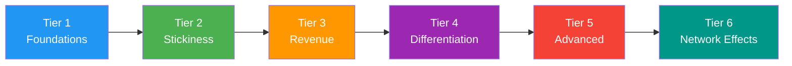
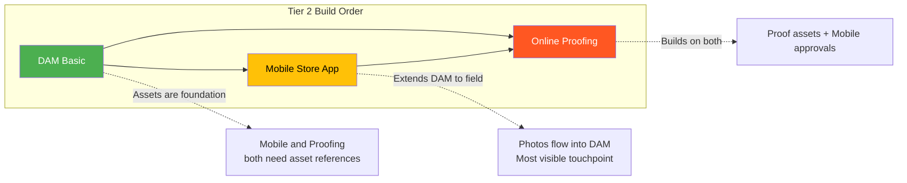
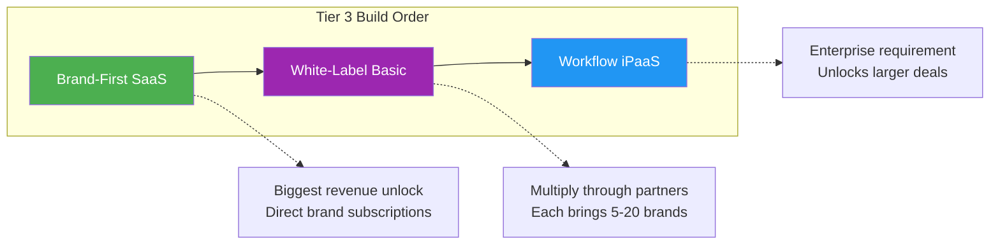
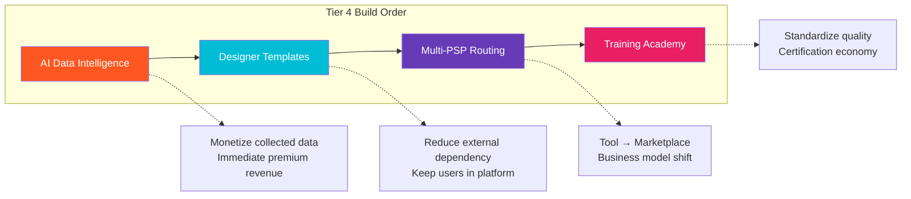
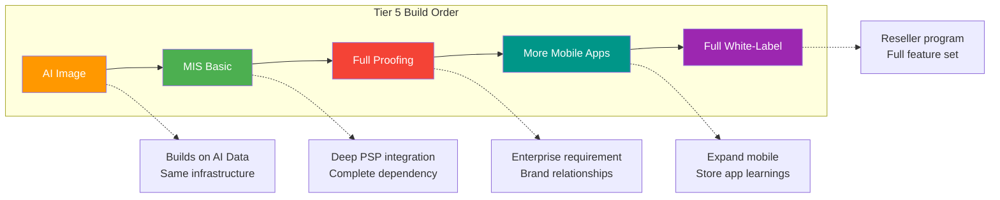
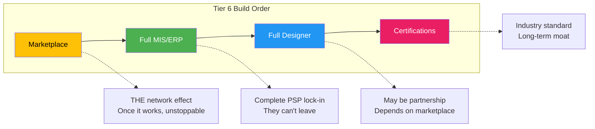
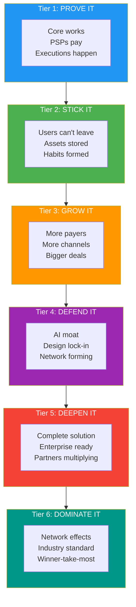

# Development Priority Sequence

**Purpose:** Strategic ordering of capabilities to maximize momentum. Each tier unlocks value that accelerates the next.

---

## The Snowball Principle

**Key Insight:** Later tiers are only valuable if earlier tiers succeed. Marketplace (Tier 6) is worthless without users from Tier 1-5. AI differentiation (Tier 4) doesn't matter if basic stickiness (Tier 2) fails.

---

## Tier 1: Core Platform (v1)

**Status:** In Progress | **Timeline:** Current Focus

| Priority | Capability | Why First |
|----------|------------|-----------|
| 1.1 | **PSP Campaign Orchestration** | This IS the product. Everything else is an extension. |
| 1.2 | **Store/Location Management** | Core data model everything depends on |
| 1.3 | **Kit/Execution Workflow** | Primary value proposition |
| 1.4 | **Photo Verification** | Proof of work, trust mechanism |
| 1.5 | **Basic Reporting** | PSPs need visibility to renew |

**Unlocks:** Revenue, proof of concept, first customers, testimonials

**Success Metrics Before Tier 2:**
- [ ] 5+ paying PSPs
- [ ] 10+ active brands
- [ ] 1,000+ completed executions
- [ ] <5% monthly churn
- [ ] NPS > 30

---

## Tier 2: Stickiness & Reach (v2 Early)

**Why Now:** These features make users dependent on the platform. Hard to leave once adopted.

| Priority | Capability | Snowball Effect |
|----------|------------|-----------------|
| 2.1 | **DAM - Basic** (P02) | Assets stored = switching cost. Every uploaded file is a reason to stay. |
| 2.2 | **Native Mobile - Store App** (P08) | Field workers use it daily. Habit formation. App store presence. |
| 2.3 | **Online Proofing - Basic** (P05) | Approval history creates audit trail. Can't leave without losing records. |

**Dependencies:** All require Tier 1 complete

**Build Order Rationale:**

**Success Metrics Before Tier 3:**
- [ ] 70% of brands using DAM
- [ ] 60% of store users on mobile app
- [ ] 50% of campaigns using proofing workflow
- [ ] Avg assets per brand > 50
- [ ] Mobile app rating > 4.2 stars

---

## Tier 3: Revenue Expansion (v2 Late)

**Why Now:** Tier 2 stickiness proves value. Now expand who pays and how much.

| Priority | Capability | Snowball Effect |
|----------|------------|-----------------|
| 3.1 | **Brand-First SaaS** (P01) | Brands pay directly = larger TAM. PSP revenue + Brand revenue. |
| 3.2 | **White-Label Basic** (P09) | PSPs resell = channel revenue. They do the selling for you. |
| 3.3 | **Workflow Automation - iPaaS** (P06) | Zapier/Make = enterprise readiness. Integration fees. |

**Dependencies:**
- Brand-First requires Tier 2 DAM (brands need asset management to justify direct subscription)
- White-Label requires proven product (PSPs won't resell unproven platform)
- Workflow requires stable API (can't integrate with unstable systems)

**Build Order Rationale:**

**Success Metrics Before Tier 4:**
- [ ] 20% revenue from direct brand subscriptions
- [ ] 3+ white-label partners active
- [ ] 100+ active Zapier/Make connections
- [ ] Average deal size increased 40%
- [ ] Enterprise pipeline > $500K

---

## Tier 4: Competitive Moat (v3)

**Why Now:** Revenue is flowing. Invest in differentiation before competitors catch up.

| Priority | Capability | Snowball Effect |
|----------|------------|-----------------|
| 4.1 | **AI - Data Intelligence** (P03a) | Predictive insights = premium tier. Data compounds over time. |
| 4.2 | **Online Designer - Templates** (P04) | Reduces friction = more campaigns. Design lock-in. |
| 4.3 | **Multi-PSP Routing** (P01+) | Brands choose PSPs = network power. Platform becomes indispensable. |
| 4.4 | **Training Academy - Courses** (P10) | Certified users = quality. Certification is a moat. |

**Dependencies:**
- AI requires data from Tier 1-3 (need execution history to predict)
- Designer requires DAM (designs reference assets)
- Multi-PSP requires Brand-First (brands must be customers to choose PSPs)
- Academy requires stable product (can't train on changing features)

**Build Order Rationale:**

**Success Metrics Before Tier 5:**
- [ ] 30% of customers on AI-enabled tier
- [ ] 40% of designs created in-platform
- [ ] 10% of brands using 2+ PSPs
- [ ] 500+ certified installers
- [ ] Gross margin > 75%

---

## Tier 5: Advanced Capabilities (v3-v4)

**Why Now:** Platform is sticky, revenue is growing, moat is forming. Add complexity.

| Priority | Capability | Snowball Effect |
|----------|------------|-----------------|
| 5.1 | **AI - Image Intelligence** (P03b) | Compliance verification = trust. Automated QA. |
| 5.2 | **MIS/ERP - Basic** (P07) | PSPs can't leave. Their business runs on it. |
| 5.3 | **Proofing - Full Workflow** (P05+) | Multi-tier approvals = enterprise requirement. |
| 5.4 | **Mobile - PSP/Brand Apps** (P08+) | Complete mobile ecosystem. |
| 5.5 | **White-Label - Full** (P09+) | Reseller program. Partner-driven growth. |

**Dependencies:**
- AI Image requires photo volume (need millions of images to train)
- MIS requires stable PSP base (risky to build for small user base)
- Full Proofing requires Brand-First (brands drive approval complexity)
- Additional apps require proven Store app (validate mobile approach first)

**Build Order Rationale:**

**Success Metrics Before Tier 6:**
- [ ] AI processing 100K+ images/month
- [ ] 20% of PSPs using MIS features
- [ ] Enterprise contracts > $50K ACV
- [ ] 3 mobile apps with 4+ star ratings
- [ ] 10+ active reseller partners

---

## Tier 6: Network Effects (v4+)

**Why Now:** Critical mass achieved. Network effects become possible.

| Priority | Capability | Snowball Effect |
|----------|------------|-----------------|
| 6.1 | **Marketplace - Installer Network** (P11) | Each installer added = more value for brands. Each brand = more work for installers. |
| 6.2 | **Full MIS/ERP** (P07+) | Complete PSP operating system. |
| 6.3 | **Designer - Full Suite** (P04+) | Creative platform within POP platform. |
| 6.4 | **Academy - Certifications** (P10+) | Industry-standard certifications. |

**Dependencies:**
- Marketplace requires volume (need enough jobs to attract installers, enough installers to attract brands)
- Full MIS requires proven basic MIS (validate approach before full investment)
- Full Designer may require partnership (Canva, Adobe) - build vs buy decision
- Certifications require Academy adoption (can't certify without training)

**Build Order Rationale:**

**Success Metrics (Ongoing):**
- [ ] Marketplace: 1,000+ active installers
- [ ] Marketplace: 30% of jobs through network
- [ ] MIS: 50% of PSPs on full MIS
- [ ] Platform GMV > $10M annually
- [ ] Industry recognition as standard

---

## Priority Matrix

| Capability | Tier | Revenue Impact | Stickiness | Moat | Dependency Risk |
|------------|------|----------------|------------|------|-----------------|
| Core Platform | 1 | ●●●●● | ●●● | ● | None |
| DAM Basic | 2 | ●●● | ●●●●● | ●● | Low |
| Mobile Store | 2 | ●● | ●●●●● | ●● | Low |
| Proofing Basic | 2 | ●● | ●●●● | ●● | Low |
| Brand-First | 3 | ●●●●● | ●●● | ●●● | Medium |
| White-Label Basic | 3 | ●●●● | ●●● | ●●● | Medium |
| Workflow iPaaS | 3 | ●●● | ●●●● | ●● | Medium |
| AI Data | 4 | ●●●● | ●●● | ●●●●● | Medium |
| Designer Templates | 4 | ●●● | ●●●●● | ●●●● | Medium |
| Multi-PSP | 4 | ●●●●● | ●●●● | ●●●●● | High |
| Academy Courses | 4 | ●● | ●●● | ●●●● | Low |
| AI Image | 5 | ●●● | ●●● | ●●●●● | High |
| MIS Basic | 5 | ●●●● | ●●●●● | ●●●● | High |
| Marketplace | 6 | ●●●●● | ●●●●● | ●●●●● | Very High |

---

## Decision Gates

### Gate 1: Tier 1 → Tier 2
**Question:** Is the core product proven?
- Revenue: Are PSPs paying and renewing?
- Usage: Are executions happening daily?
- Satisfaction: Is NPS positive?

**If No:** Fix core product. Do not proceed.

### Gate 2: Tier 2 → Tier 3
**Question:** Are users sticky?
- DAM: Are assets being stored long-term?
- Mobile: Is daily active usage high?
- Proofing: Are approval workflows completing?

**If No:** Improve stickiness. Revenue expansion on leaky bucket is waste.

### Gate 3: Tier 3 → Tier 4
**Question:** Is revenue diversified?
- Brands: Are brands paying directly?
- Partners: Are white-label partners active?
- Enterprise: Are larger deals closing?

**If No:** Focus on revenue. Differentiation without revenue is unsustainable.

### Gate 4: Tier 4 → Tier 5
**Question:** Is the moat forming?
- AI: Is data creating unique insights?
- Designer: Are users creating in-platform?
- Multi-PSP: Are brands using multiple PSPs?

**If No:** Deepen moat. Advanced features without moat = easy to copy.

### Gate 5: Tier 5 → Tier 6
**Question:** Is critical mass approaching?
- Volume: Enough transactions for marketplace?
- Quality: Enough certified installers?
- Brand: Industry recognition?

**If No:** Build volume. Network effects require critical mass.

---

## Anti-Patterns to Avoid

### 1. Building Marketplace Too Early
**Temptation:** "Marketplace is the big opportunity!"
**Reality:** Marketplace with 10 installers and 5 brands is worthless. Build volume first.

### 2. AI Before Data
**Temptation:** "AI is hot, let's add AI features!"
**Reality:** AI needs data. Collect 1M+ data points before investing in AI.

### 3. MIS Before Stickiness
**Temptation:** "PSPs want MIS, let's build it!"
**Reality:** MIS is expensive. Only build when PSPs are already locked in.

### 4. Designer Before DAM
**Temptation:** "Users want design tools!"
**Reality:** Designs need assets. DAM must exist first.

### 5. White-Label Before Product-Market Fit
**Temptation:** "Partners will help us grow!"
**Reality:** Partners amplify what you have. If product is weak, partners will fail.

---

## Resource Allocation by Tier

| Tier | Engineering | Product | Sales | Marketing |
|------|-------------|---------|-------|-----------|
| 1 | 80% | 70% | 60% | 40% |
| 2 | 70% | 60% | 50% | 50% |
| 3 | 50% | 50% | 70% | 60% |
| 4 | 60% | 50% | 50% | 50% |
| 5 | 50% | 40% | 60% | 50% |
| 6 | 40% | 30% | 70% | 70% |

**Pattern:** Engineering-heavy early, Sales/Marketing-heavy later.

---

## Summary: The Snowball

**Each tier builds on the last. Skip a tier and the snowball falls apart.**

---

*Document Version: 1.0 | Last Updated: December 2025*
