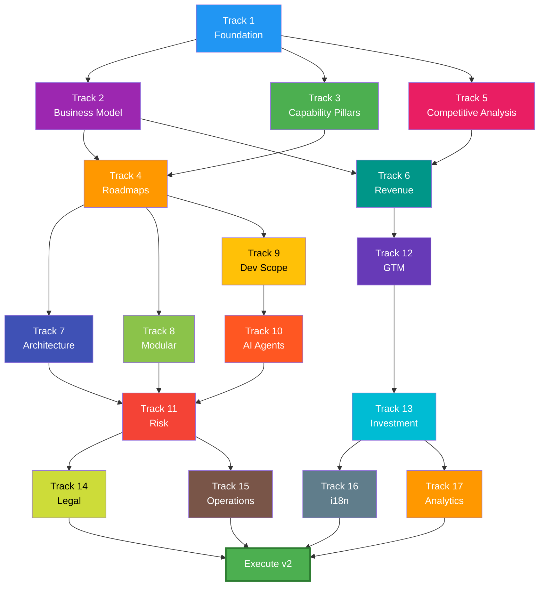

# Strategic Document Reading Order

**Purpose:** This document provides a logical sequence for reviewing the 100 strategic planning documents. Documents are ordered by dependency—each section builds on understanding from previous sections.

**Total Documents:** 100 (excluding archive)

---

## Reading Tracks

| Track | Focus | Documents | Audience |
|-------|-------|-----------|----------|
| 1 | Foundation | 2 | Everyone |
| 2 | Business Model | 3 | Executives, Partners |
| 3 | Capabilities | 11 | Product, Engineering |
| 4 | Roadmaps | 3 | Product, Engineering |
| 5 | Competition | 8 | Strategy, Sales |
| 6 | Revenue | 3 | Finance, Executives |
| 7 | Architecture | 6 | Engineering |
| 8 | Modularity | 6 | Product, Engineering |
| 9 | Development | 4 | Engineering, PMO |
| 10 | AI Agents | 14 | Engineering |
| 11 | Risk | 5 | Executives, PMO |
| 12 | Go-to-Market | 8 | Marketing, Sales |
| 13 | Investment | 5 | Executives, Investors |
| 14 | Legal | 7 | Legal, Compliance |
| 15 | Operations | 5 | Operations, Support |
| 16 | International | 5 | Strategy, Product |
| 17 | Analytics | 5 | Product, Data |

---

## Track 1: Foundation (Start Here)

*Read first. These provide context for everything else.*

| # | Document | Purpose |
|---|----------|---------|
| 1 | [README.md](README.md) | Document orientation and structure |
| 2 | [00_Future_Product_Vision.md](00_Future_Product_Vision.md) | Master strategic vision, 11 pillars overview |

**Key Decisions After Track 1:**
- Understand the v1 → v2 → v3 → v4 evolution
- Familiarize with 11 capability pillars

---

## Track 2: Business Model Decisions

*Critical strategic choices. These inform pricing, sales, and positioning.*

| # | Document | Purpose |
|---|----------|---------|
| 3 | [01_SaaS_Evolution/Brand_First_Model.md](01_SaaS_Evolution/Brand_First_Model.md) | Brands as primary customers |
| 4 | [01_SaaS_Evolution/Multi_PSP_Network.md](01_SaaS_Evolution/Multi_PSP_Network.md) | Multi-PSP routing architecture |
| 5 | [01_SaaS_Evolution/Stakeholder_Governance.md](01_SaaS_Evolution/Stakeholder_Governance.md) | Decision rights and governance |

**Key Decisions After Track 2:**
- Brand-First vs PSP-First vs Dual-Entry model
- Multi-PSP routing strategy
- Governance structure between brands and PSPs

---

## Track 3: Capability Definitions

*What we're building. Detailed specs for each of the 11 pillars.*

| # | Document | Purpose |
|---|----------|---------|
| 6 | [02_Capability_Pillars/P01_SaaS_Model.md](02_Capability_Pillars/P01_SaaS_Model.md) | SaaS platform evolution |
| 7 | [02_Capability_Pillars/P02_DAM.md](02_Capability_Pillars/P02_DAM.md) | Digital Asset Management |
| 8 | [02_Capability_Pillars/P03_AI_Intelligence.md](02_Capability_Pillars/P03_AI_Intelligence.md) | AI for data and images |
| 9 | [02_Capability_Pillars/P04_Online_Designer.md](02_Capability_Pillars/P04_Online_Designer.md) | In-platform design tools |
| 10 | [02_Capability_Pillars/P05_Online_Proofing.md](02_Capability_Pillars/P05_Online_Proofing.md) | Approval workflows |
| 11 | [02_Capability_Pillars/P06_Workflow_Automation.md](02_Capability_Pillars/P06_Workflow_Automation.md) | Integration and automation |
| 12 | [02_Capability_Pillars/P07_MIS_ERP.md](02_Capability_Pillars/P07_MIS_ERP.md) | Production management |
| 13 | [02_Capability_Pillars/P08_Native_Mobile.md](02_Capability_Pillars/P08_Native_Mobile.md) | iOS/Android apps |
| 14 | [02_Capability_Pillars/P09_White_Label.md](02_Capability_Pillars/P09_White_Label.md) | Reseller program |
| 15 | [02_Capability_Pillars/P10_Training_Academy.md](02_Capability_Pillars/P10_Training_Academy.md) | LMS and certifications |
| 16 | [02_Capability_Pillars/P11_Marketplace.md](02_Capability_Pillars/P11_Marketplace.md) | Designer/installer network |

**Key Decisions After Track 3:**
- Feature scope for each pillar
- Build vs buy decisions per capability
- Priority ranking of pillars

---

## Track 4: Phase Roadmaps

*When we're building. Sequencing capabilities across versions.*

| # | Document | Purpose |
|---|----------|---------|
| 17 | [03_Phase_Roadmaps/v2_Roadmap.md](03_Phase_Roadmaps/v2_Roadmap.md) | v2 scope and deliverables |
| 18 | [03_Phase_Roadmaps/v3_Roadmap.md](03_Phase_Roadmaps/v3_Roadmap.md) | v3 scope and deliverables |
| 19 | [03_Phase_Roadmaps/v4_Roadmap.md](03_Phase_Roadmaps/v4_Roadmap.md) | v4 scope and deliverables |

**Key Decisions After Track 4:**
- v2 MVP scope agreement
- Feature sequencing validation
- Phase success criteria

---

## Track 5: Competitive Analysis

*Know the market. Understand alternatives before positioning.*

| # | Document | Purpose |
|---|----------|---------|
| 20 | [05_Competitive_Analysis/00_Competitive_Overview.md](05_Competitive_Analysis/00_Competitive_Overview.md) | Market landscape summary |
| 21 | [05_Competitive_Analysis/DAM_Competitors.md](05_Competitive_Analysis/DAM_Competitors.md) | DAM market (Bynder, Brandfolder, FOSS) |
| 22 | [05_Competitive_Analysis/Designer_Competitors.md](05_Competitive_Analysis/Designer_Competitors.md) | Design tools (Canva, Adobe, FOSS) |
| 23 | [05_Competitive_Analysis/Proofing_Competitors.md](05_Competitive_Analysis/Proofing_Competitors.md) | Proofing tools (Ziflow, ProofHQ) |
| 24 | [05_Competitive_Analysis/Workflow_Competitors.md](05_Competitive_Analysis/Workflow_Competitors.md) | Workflow/iPaaS (Zapier, Make, n8n) |
| 25 | [05_Competitive_Analysis/MIS_Competitors.md](05_Competitive_Analysis/MIS_Competitors.md) | Print MIS (Printavo, shopVOX) |
| 26 | [05_Competitive_Analysis/LMS_Competitors.md](05_Competitive_Analysis/LMS_Competitors.md) | Training LMS (Docebo, TalentLMS) |
| 27 | [05_Competitive_Analysis/Marketplace_Competitors.md](05_Competitive_Analysis/Marketplace_Competitors.md) | Service marketplaces (Thumbtack, Fiverr) |

**Key Decisions After Track 5:**
- Competitive positioning per pillar
- Partnership vs build decisions
- Differentiation strategy

---

## Track 6: Revenue Models

*How we'll make money. Pricing and partner economics.*

| # | Document | Purpose |
|---|----------|---------|
| 28 | [04_Revenue_Models/Pricing_Strategies.md](04_Revenue_Models/Pricing_Strategies.md) | Pricing tiers and models |
| 29 | [04_Revenue_Models/Partner_Programs.md](04_Revenue_Models/Partner_Programs.md) | PSP and reseller economics |
| 30 | [04_Revenue_Models/Revenue_Cost_Analysis.md](04_Revenue_Models/Revenue_Cost_Analysis.md) | Unit economics and margins |

**Key Decisions After Track 6:**
- Pricing model selection
- Partner revenue share
- Margin targets

---

## Track 7: Technical Architecture

*How we'll build it. System design and infrastructure.*

| # | Document | Purpose |
|---|----------|---------|
| 31 | [13_Technical_Architecture/Architecture_Principles.md](13_Technical_Architecture/Architecture_Principles.md) | Guiding design principles |
| 32 | [13_Technical_Architecture/Tech_Stack_Evolution.md](13_Technical_Architecture/Tech_Stack_Evolution.md) | Technology choices by phase |
| 33 | [13_Technical_Architecture/API_Design_Standards.md](13_Technical_Architecture/API_Design_Standards.md) | API conventions and versioning |
| 34 | [13_Technical_Architecture/Security_Framework.md](13_Technical_Architecture/Security_Framework.md) | Security architecture |
| 35 | [13_Technical_Architecture/Scalability_Planning.md](13_Technical_Architecture/Scalability_Planning.md) | Scaling strategies |
| 36 | [13_Technical_Architecture/Infrastructure_Costs.md](13_Technical_Architecture/Infrastructure_Costs.md) | Infrastructure cost projections |

**Key Decisions After Track 7:**
- Tech stack confirmation
- Cloud provider selection
- Security requirements

---

## Track 8: Modular Architecture

*How features are packaged. À la carte subscription model.*

| # | Document | Purpose |
|---|----------|---------|
| 37 | [14_Modular_Architecture/Module_Catalog.md](14_Modular_Architecture/Module_Catalog.md) | Available modules and tiers |
| 38 | [14_Modular_Architecture/Entitlement_Service.md](14_Modular_Architecture/Entitlement_Service.md) | Feature access control |
| 39 | [14_Modular_Architecture/Pricing_Strategy.md](14_Modular_Architecture/Pricing_Strategy.md) | Module pricing logic |
| 40 | [14_Modular_Architecture/Self_Service_Portal.md](14_Modular_Architecture/Self_Service_Portal.md) | Customer module management |
| 41 | [14_Modular_Architecture/Migration_Playbooks.md](14_Modular_Architecture/Migration_Playbooks.md) | Upgrade/downgrade procedures |
| 42 | [14_Modular_Architecture/Module_Dependencies.md](14_Modular_Architecture/Module_Dependencies.md) | Inter-module relationships |

**Key Decisions After Track 8:**
- Module boundaries
- Bundling strategy
- Migration paths

---

## Track 9: Development Scope

*Resources and effort. What it takes to build.*

| # | Document | Purpose |
|---|----------|---------|
| 43 | [06_Development_Scope/Effort_Estimates.md](06_Development_Scope/Effort_Estimates.md) | Development effort by pillar |
| 44 | [06_Development_Scope/Build_vs_Buy_Matrix.md](06_Development_Scope/Build_vs_Buy_Matrix.md) | Make/buy/partner decisions |
| 45 | [06_Development_Scope/Team_Planning.md](06_Development_Scope/Team_Planning.md) | Team structure and hiring |
| 46 | [06_Development_Scope/Technical_Dependencies.md](06_Development_Scope/Technical_Dependencies.md) | Cross-pillar dependencies |

**Key Decisions After Track 9:**
- Resource allocation
- Build vs buy final decisions
- Hiring plan

---

## Track 10: AI Agent Development Teams

*AI-powered development. Specialized agents per pillar.*

| # | Document | Purpose |
|---|----------|---------|
| 47 | [07_Agent_Harnesses/00_Agent_Architecture.md](07_Agent_Harnesses/00_Agent_Architecture.md) | Agent framework overview |
| 48 | [07_Agent_Harnesses/01_Orchestrator_Agent.md](07_Agent_Harnesses/01_Orchestrator_Agent.md) | Master orchestration agent |
| 49 | [07_Agent_Harnesses/02_DAM_Agent.md](07_Agent_Harnesses/02_DAM_Agent.md) | DAM development agent |
| 50 | [07_Agent_Harnesses/03_AI_Agent.md](07_Agent_Harnesses/03_AI_Agent.md) | AI features agent |
| 51 | [07_Agent_Harnesses/04_Designer_Agent.md](07_Agent_Harnesses/04_Designer_Agent.md) | Designer tools agent |
| 52 | [07_Agent_Harnesses/05_Proofing_Agent.md](07_Agent_Harnesses/05_Proofing_Agent.md) | Proofing workflow agent |
| 53 | [07_Agent_Harnesses/06_Workflow_Agent.md](07_Agent_Harnesses/06_Workflow_Agent.md) | Automation agent |
| 54 | [07_Agent_Harnesses/07_MIS_Agent.md](07_Agent_Harnesses/07_MIS_Agent.md) | MIS/ERP agent |
| 55 | [07_Agent_Harnesses/08_Mobile_Agent.md](07_Agent_Harnesses/08_Mobile_Agent.md) | Mobile apps agent |
| 56 | [07_Agent_Harnesses/09_WhiteLabel_Agent.md](07_Agent_Harnesses/09_WhiteLabel_Agent.md) | White-label agent |
| 57 | [07_Agent_Harnesses/10_Academy_Agent.md](07_Agent_Harnesses/10_Academy_Agent.md) | Training LMS agent |
| 58 | [07_Agent_Harnesses/11_Marketplace_Agent.md](07_Agent_Harnesses/11_Marketplace_Agent.md) | Marketplace agent |
| 59 | [07_Agent_Harnesses/12_MCP_Servers_Required.md](07_Agent_Harnesses/12_MCP_Servers_Required.md) | MCP server specifications |
| 60 | [07_Agent_Harnesses/13_Context_Management.md](07_Agent_Harnesses/13_Context_Management.md) | Agent context strategies |

**Key Decisions After Track 10:**
- Agent deployment strategy
- MCP server priorities
- Context management approach

---

## Track 11: Risk Management

*What could go wrong. Mitigation strategies.*

| # | Document | Purpose |
|---|----------|---------|
| 61 | [08_Risk_Analysis/Risk_Register.md](08_Risk_Analysis/Risk_Register.md) | Comprehensive risk catalog |
| 62 | [08_Risk_Analysis/Technical_Risks.md](08_Risk_Analysis/Technical_Risks.md) | Technology and security risks |
| 63 | [08_Risk_Analysis/Market_Risks.md](08_Risk_Analysis/Market_Risks.md) | Competition and adoption risks |
| 64 | [08_Risk_Analysis/Financial_Risks.md](08_Risk_Analysis/Financial_Risks.md) | Cash flow and cost risks |
| 65 | [08_Risk_Analysis/Mitigation_Playbooks.md](08_Risk_Analysis/Mitigation_Playbooks.md) | Response procedures |

**Key Decisions After Track 11:**
- Risk acceptance thresholds
- Mitigation investments
- Contingency triggers

---

## Track 12: Go-to-Market

*How we'll sell it. Marketing and sales strategy.*

| # | Document | Purpose |
|---|----------|---------|
| 66 | [09_Go_to_Market/GTM_Strategy_Overview.md](09_Go_to_Market/GTM_Strategy_Overview.md) | Master GTM strategy |
| 67 | [09_Go_to_Market/v2_Launch_Plan.md](09_Go_to_Market/v2_Launch_Plan.md) | v2 launch execution |
| 68 | [09_Go_to_Market/v3_Launch_Plan.md](09_Go_to_Market/v3_Launch_Plan.md) | v3 launch execution |
| 69 | [09_Go_to_Market/v4_Launch_Plan.md](09_Go_to_Market/v4_Launch_Plan.md) | v4 launch execution |
| 70 | [09_Go_to_Market/Pricing_Models.md](09_Go_to_Market/Pricing_Models.md) | Pricing presentation |
| 71 | [09_Go_to_Market/Partnership_Strategy.md](09_Go_to_Market/Partnership_Strategy.md) | Channel partnerships |
| 72 | [09_Go_to_Market/Competitive_Positioning.md](09_Go_to_Market/Competitive_Positioning.md) | Market positioning |
| 73 | [09_Go_to_Market/Content_Strategy.md](09_Go_to_Market/Content_Strategy.md) | Marketing content plan |

**Key Decisions After Track 12:**
- Launch sequence
- Channel strategy
- Marketing budget

---

## Track 13: Investment & Funding

*Capital requirements. Investor materials.*

| # | Document | Purpose |
|---|----------|---------|
| 74 | [10_Investment/Funding_Strategy.md](10_Investment/Funding_Strategy.md) | Funding approach and timing |
| 75 | [10_Investment/Investor_Pitch_Deck.md](10_Investment/Investor_Pitch_Deck.md) | Pitch deck outline |
| 76 | [10_Investment/Financial_Model.md](10_Investment/Financial_Model.md) | 5-year projections |
| 77 | [10_Investment/Valuation_Analysis.md](10_Investment/Valuation_Analysis.md) | Valuation methodology |
| 78 | [10_Investment/Investor_FAQ.md](10_Investment/Investor_FAQ.md) | Common investor questions |

**Key Decisions After Track 13:**
- Funding round size
- Valuation expectations
- Use of funds allocation

---

## Track 14: Legal Framework

*Legal structure. Compliance requirements.*

| # | Document | Purpose |
|---|----------|---------|
| 79 | [11_Legal_Compliance/Terms_of_Service.md](11_Legal_Compliance/Terms_of_Service.md) | Platform terms |
| 80 | [11_Legal_Compliance/Privacy_Policy.md](11_Legal_Compliance/Privacy_Policy.md) | Privacy notice |
| 81 | [11_Legal_Compliance/Data_Processing_Agreement.md](11_Legal_Compliance/Data_Processing_Agreement.md) | DPA for vendors |
| 82 | [11_Legal_Compliance/Partner_Agreements.md](11_Legal_Compliance/Partner_Agreements.md) | PSP/reseller contracts |
| 83 | [11_Legal_Compliance/Marketplace_Terms.md](11_Legal_Compliance/Marketplace_Terms.md) | Installer/designer terms |
| 84 | [11_Legal_Compliance/IP_Strategy.md](11_Legal_Compliance/IP_Strategy.md) | Patents and trademarks |
| 85 | [11_Legal_Compliance/Compliance_Checklist.md](11_Legal_Compliance/Compliance_Checklist.md) | Regulatory compliance |

**Key Decisions After Track 14:**
- Legal review priorities
- IP filing strategy
- Compliance timeline

---

## Track 15: Operations

*How we'll support it. Customer success.*

| # | Document | Purpose |
|---|----------|---------|
| 86 | [12_Operations/Support_Tiers.md](12_Operations/Support_Tiers.md) | Support levels and SLAs |
| 87 | [12_Operations/Customer_Success_Playbook.md](12_Operations/Customer_Success_Playbook.md) | CS processes |
| 88 | [12_Operations/Onboarding_Process.md](12_Operations/Onboarding_Process.md) | Customer onboarding |
| 89 | [12_Operations/Documentation_Plan.md](12_Operations/Documentation_Plan.md) | Help content strategy |
| 90 | [12_Operations/Runbook_Templates.md](12_Operations/Runbook_Templates.md) | Operational procedures |

**Key Decisions After Track 15:**
- Support staffing
- SLA commitments
- Documentation priorities

---

## Track 16: Internationalization

*Global expansion. Multi-region strategy.*

| # | Document | Purpose |
|---|----------|---------|
| 91 | [15_Internationalization/Language_Strategy.md](15_Internationalization/Language_Strategy.md) | Language rollout plan |
| 92 | [15_Internationalization/Regional_Expansion.md](15_Internationalization/Regional_Expansion.md) | Market-by-market expansion |
| 93 | [15_Internationalization/Currency_Handling.md](15_Internationalization/Currency_Handling.md) | Multi-currency support |
| 94 | [15_Internationalization/Data_Residency.md](15_Internationalization/Data_Residency.md) | Regional data requirements |
| 95 | [15_Internationalization/Localization_Tech.md](15_Internationalization/Localization_Tech.md) | i18n implementation |

**Key Decisions After Track 16:**
- Target regions and timing
- Localization investment
- Data residency architecture

---

## Track 17: Analytics & Measurement

*How we'll measure success. Data strategy.*

| # | Document | Purpose |
|---|----------|---------|
| 96 | [16_Analytics/Metrics_Framework.md](16_Analytics/Metrics_Framework.md) | KPIs and metrics |
| 97 | [16_Analytics/Dashboard_Specs.md](16_Analytics/Dashboard_Specs.md) | Dashboard requirements |
| 98 | [16_Analytics/Data_Architecture.md](16_Analytics/Data_Architecture.md) | Data warehouse design |
| 99 | [16_Analytics/BI_Tool_Evaluation.md](16_Analytics/BI_Tool_Evaluation.md) | BI platform selection |
| 100 | [16_Analytics/AI_Insights_Roadmap.md](16_Analytics/AI_Insights_Roadmap.md) | AI-powered analytics |

**Key Decisions After Track 17:**
- Success metrics definition
- BI tool selection
- Data infrastructure investment

---

## Audience-Specific Reading Paths

### For Executives (20 docs)
```
Track 1 (2) → Track 2 (3) → Track 6 (3) → Track 11 (5) → Track 13 (5) → Track 12: GTM Overview only (1)
```

### For Investors (15 docs)
```
Track 1 (2) → Track 13 (5) → Track 6 (3) → Track 11: Risk Register only (1) → Track 5: Overview only (1) → Track 4 (3)
```

### For Engineering (40 docs)
```
Track 1 (2) → Track 3 (11) → Track 7 (6) → Track 8 (6) → Track 9 (4) → Track 10 (14)
```

### For Product (35 docs)
```
Track 1 (2) → Track 3 (11) → Track 4 (3) → Track 5 (8) → Track 8 (6) → Track 17 (5)
```

### For Sales/Marketing (20 docs)
```
Track 1 (2) → Track 5 (8) → Track 12 (8) → Track 6: Pricing only (1) → Track 13: Pitch Deck (1)
```

### For Legal/Compliance (10 docs)
```
Track 1 (2) → Track 14 (7) → Track 16: Data Residency (1)
```

---

## Decision Dependencies



---

## Review Checkpoints

| Checkpoint | After Track | Key Decisions Required |
|------------|-------------|------------------------|
| **Strategy Lock** | 6 | Business model, capabilities, pricing |
| **Architecture Lock** | 8 | Tech stack, modularity, dependencies |
| **Plan Lock** | 11 | Development scope, risks, mitigations |
| **Launch Lock** | 13 | GTM, funding, legal framework |
| **Operational Readiness** | 17 | Support, i18n, analytics ready |

---

*Document Version: 1.0 | Last Updated: December 2025*
