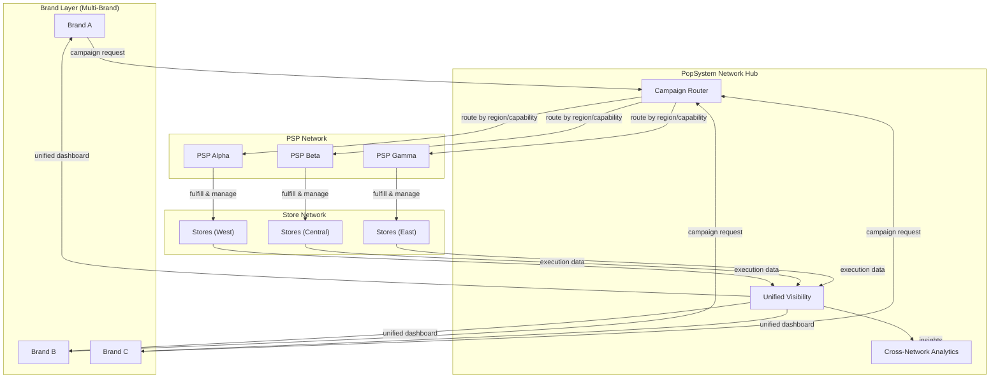

# Pseudo SaaS Flow (Brand-Scalable, Multi-PSP Network)

**Status: Post-v1 Future Vision**

This diagram represents the future SaaS architecture where brands can work with multiple PSPs through a unified network.

## Key Differences from v1

| Aspect | v1 (PSP-Led) | Post-v1 (SaaS Network) |
|--------|--------------|------------------------|
| **Ownership** | PSP owns brand relationship | Network facilitates connections |
| **Routing** | Single PSP per brand | Dynamic routing by region/capability |
| **Visibility** | PSP provides reports | Unified cross-PSP dashboard |
| **Onboarding** | PSP onboards stores | Network-level store registry |
| **Billing** | PSP invoices brand | Network handles settlement |

## Network Benefits

### For Brands
- Single dashboard across all PSP partners
- Unified analytics and reporting
- Simplified vendor management
- Competitive PSP routing

### For PSPs
- Access to larger brand network
- Reduced sales overhead
- Standardized integration
- Focus on fulfillment expertise

### For the Platform
- Network effects (more brands → more PSPs → more value)
- Transaction-based revenue model
- Data insights across industry
- Marketplace dynamics

## Migration Path

1. **v1**: Build robust PSP-led platform
2. **v1.x**: Add multi-brand support per PSP
3. **v2**: Introduce network routing layer
4. **v2.x**: Enable cross-PSP visibility
5. **v3**: Full SaaS marketplace

---

*This represents future architectural direction. Current v1 focuses on the single-PSP model.*
